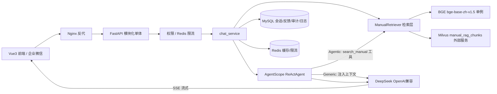

## 用户需求

开发一个【操作手册 RAG】智能体，基于已有 Milvus 向量库（`manual_rag_chunks`）对企业操作手册进行智能问答，覆盖用户给出的全部 5 步开发范围，并同时交付完整前后端。

## 产品概述

面向企业内部员工的操作手册智能问答系统。用户在网页端以对话形式提问（如"如何新增会议室预约申请"），系统从手册知识库检索相关切片，由大模型生成基于手册内容的回答，并在每条回答末尾展示来源（文档名 > 路径）；检索不到时明确回复"手册中未找到"。支持多轮会话、流式输出、回答反馈（赞/踩）与管理端能力（权限、文档增量更新）。

## 核心功能

- **智能问答（Generic RAG）**：每次提问固定先检索 top_k（3~5）个手册切片，拼入上下文由 LLM 生成带引用的回答；SSE 流式输出
- **Agentic RAG（第 5 步）**：将 `search_manual` 注册为 AgentScope ReAct 工具，Agent 在追问、上下文指代或闲聊时自行决定是否检索，可重写查询
- **多轮会话**：session_id 维度维护对话历史，历史消息存 MySQL，每轮重建 Agent 记忆
- **来源引用与质量控制**：回答必须基于检索内容；低相似度（低于阈值）时回复"手册中未找到"；每次回答展示来源路径
- **反馈与审计**：回答赞/踩反馈、问题日志、会话与审计记录存 MySQL；检索评测集（10 个手册问题召回验证）
- **管理与运维（第 5 步）**：接口权限控制、文档增量更新（复用 upsert 逻辑）、Redis 缓存与限流
- **Web 前端**：Vue 3 聊天界面，含会话列表、流式渲染、来源引用卡片、反馈按钮
- **部署**：Docker Compose 编排（后端 + 前端 Nginx + MySQL + Redis），Milvus 复用现有外部服务

## 技术栈选型

| 层级 | 选型 |
| --- | --- |
| Web API | FastAPI + Uvicorn（模块化单体） |
| Agent 编排 | AgentScope `>=2.0.5,<2.1`（ReActAgent + Toolkit，全异步） |
| LLM | DeepSeek（`OpenAIChatModel` + `client_kwargs={"base_url": ...}`，OpenAI 兼容可切换其他模型） |
| 向量检索 | pymilvus + 现有 Milvus（192.168.0.215:19530，FLAT/COSINE，dim=768） |
| Embedding | sentence-transformers + `BAAI/bge-base-zh-v1.5`（启动时单例加载） |
| 数据校验与配置 | Pydantic / pydantic-settings（.env 读取，密钥不写死） |
| 会话/反馈/审计 | MySQL（SQLAlchemy 2.0 async + aiomysql） |
| 缓存与限流（第 5 步） | Redis（查询缓存 + 滑动窗口限流） |
| 前端 | Vue 3 + TypeScript + Element Plus + Pinia（Composition API，Vite） |
| 日志与追踪 | Python 结构化日志（structlog）+ AgentScope Tracing 预留 |
| 测试 | pytest + httpx AsyncClient |
| 部署 | Docker Compose + Nginx 反向代理 |


## 实现方案

**总体策略**：严格按用户 5 步顺序实施，但架构上一步到位——检索层、Agent 层、服务层、持久层分离，Generic/Agentic 两种 RAG 模式通过配置开关 `RAG_MODE=generic|agentic` 切换，避免第二阶段返工。

**工作方式**：用户提问 → FastAPI `/chat` 校验权限与限流 → 检索层（BGE 编码查询向量 → Milvus COSINE 召回 top_k，支持 doc 元数据过滤）→ 低于相似度阈值直接回复"手册中未找到" → 否则将切片拼入上下文，AgentScope ReActAgent（Generic 模式固定注入，Agentic 模式作为 toolkit 工具）调用 DeepSeek 生成 → SSE 流式下发 token，结束后下发 sources 引用事件 → 会话、问题日志、审计异步落 MySQL。

**关键技术决策**：

1. **ADR-001/002 落地**：AgentScope 仅做 Agent 编排（工具、会话、追踪），不使用其内置 RAG 存储；自建 `ManualRetriever` 直接操作 `manual_rag_chunks`，保留 doc/path/content 元数据与来源引用，复用现有 ingest 脚本的 `clean_for_embedding` 与归一化向量检索方式，数据零迁移。
2. **无状态服务 + 记忆重建**：AgentScope `InMemoryMemory` 不常驻，每轮请求从 MySQL 读取该 session 历史消息重建 memory，保证多实例水平扩展能力。
3. **两阶段 RAG 共存**：Generic 模式在 chat_service 中固定先检索再注入 user message（防幻觉兜底）；Agentic 模式通过 `toolkit.register_tool_function(search_manual)` 由 Agent 自主调用。配置开关切换，均带集成测试。
4. **LLM 可切换**：DeepSeek 走 OpenAI 兼容接口，`base_url`/`model_name`/`api_key` 全部走 .env，换模型只改配置。

**性能与可靠性**：

- BGE 模型与 Milvus 连接在应用启动时初始化为全局单例（FastAPI lifespan），避免每请求加载模型（约秒级开销）；查询编码为单次 `encode`，O(1)，检索为 Milvus FLAT 精确检索，当前切片规模（KB 级 JSON）下延迟毫秒级
- LLM 流式为瓶颈（秒级），SSE 逐 token 下发掩盖延迟；MySQL 写入异步 fire-and-forget 不阻塞流式响应
- 第 5 步 Redis 对高频相同查询做答案缓存（TTL + 问题哈希 key），限流按用户/会话滑动窗口
- 相似度阈值（默认 0.5 左右，可配置）过滤低质召回，阈值入 .env 便于调优

## 实施注意事项

- **复用现有代码**：`vector_store/ingest_chunks.py` 中的 Milvus 连接参数、schema、`clean_for_embedding` 直接迁移到 `app/rag/retriever.py` 与配置层；`vector_store/test.py` 的检索调用方式作为 retriever 实现基准，原文件保留不删
- **AgentScope 异步性**：框架全异步，retriever 中同步的 pymilvus/sentence-transformers 调用用 `asyncio.to_thread` 包装，避免阻塞事件循环
- **工具函数规范**：`search_manual` 需完整类型注解 + docstring（AgentScope 据此生成 tool schema），返回 content、doc、path、score
- **SSE 协议**：前端用 fetch + ReadableStream 消费（EventSource 不支持 POST/自定义头）；区分 token/sources/done/error 事件类型，断连时后端取消 LLM 流
- **日志**：structlog 结构化日志，记录 session_id、检索耗时、命中数、LLM 用量；不记录 API Key 等敏感信息；错误日志含 stack trace 不含用户隐私
- **爆炸半径控制**：不改动 `vector_store/` 现有脚本；数据库表全新创建不影响现有 Milvus 数据；Agentic 模式默认关闭（先验证 Generic 稳定）；增量更新复用 upsert 幂等逻辑

## 架构设计



服务内部分层：api 层（路由/SSE）→ services 层（编排）→ agent 层（AgentScope/提示词）→ rag 层（检索）→ db 层（MySQL/Redis），core 层提供配置与日志，依赖单向向下。

## 目录结构

```
code/
├── app/
│   ├── main.py                # [NEW] FastAPI 入口：lifespan 初始化 BGE/Milvus/MySQL/Redis 单例，注册路由、CORS、限流中间件、全局异常处理
│   ├── core/
│   │   ├── config.py          # [NEW] pydantic-settings：Milvus/MySQL/Redis/LLM/阈值/RAG_MODE 等全部环境变量，.env 读取
│   │   └── logging.py         # [NEW] structlog 结构化日志配置，request_id 注入
│   ├── api/
│   │   ├── chat.py            # [NEW] POST /chat（SSE 流式）、GET /health、POST /sessions（新建会话）、GET /sessions/{id}/messages（历史）
│   │   ├── feedback.py        # [NEW] POST /feedback（赞/踩 + 可选评语），关联 message_id
│   │   └── admin.py           # [NEW] 管理接口：POST /admin/reingest（文档增量更新）、GET /admin/stats，需管理员权限
│   ├── agent/
│   │   └── manual_agent.py    # [NEW] AgentScope ReActAgent 工厂：OpenAIChatModel(DeepSeek) + OpenAIChatFormatter + Toolkit；按 RAG_MODE 决定固定注入或注册 search_manual 工具；每轮从 DB 历史重建 InMemoryMemory
│   ├── rag/
│   │   ├── retriever.py       # [NEW] ManualRetriever：BGE 单例编码 + Milvus COSINE 检索 + doc 过滤 + 阈值过滤；导出 search_manual(query, doc=None, top_k=3) 工具函数；复用 clean_for_embedding
│   │   └── models.py          # [NEW] SearchResult(content/doc/path/score)、ChatRequest、ChatMessage、SourceRef 等 Pydantic 模型
│   ├── services/
│   │   ├── chat_service.py    # [NEW] 编排核心：权限校验→检索→Agent 生成→SSE 事件流（token/sources/done/error）→异步落库
│   │   └── session_service.py # [NEW] 会话与消息的 MySQL 读写、历史重建为 AgentScope Msg 列表
│   ├── db/
│   │   ├── models.py          # [NEW] SQLAlchemy 表：sessions、messages、feedbacks、query_logs、audit_logs、users
│   │   └── session.py         # [NEW] async engine/session 工厂
│   ├── prompts/
│   │   └── manual.py          # [NEW] 系统提示词：强制基于检索内容回答、找不到说"手册中未找到"、末尾附来源格式
│   └── utils/
│       └── sse.py             # [NEW] SSE 事件封装与流式响应工具
├── tests/
│   ├── test_retriever.py      # [NEW] 10 个手册问题召回验证（断言 top_k 命中预期 doc/path），相似度分布输出
│   ├── test_chat.py           # [NEW] /chat 接口测试：SSE 事件序列、引用完整性、"未找到"兜底（mock LLM）
│   └── eval_questions.json    # [NEW] 检索评测集：问题 + 预期 doc/path
├── web/                       # [NEW] Vue 3 + TS + Element Plus + Pinia 前端（Vite）
│   ├── src/api/               # [NEW] fetch SSE 流式客户端、会话/反馈 API 封装
│   ├── src/stores/            # [NEW] Pinia：会话列表、当前消息流、加载态
│   ├── src/views/ChatView.vue # [NEW] 聊天主界面
│   ├── src/components/        # [NEW] 消息气泡（Markdown 渲染）、来源引用卡片、反馈按钮、会话侧边栏、输入框
│   └── nginx.conf             # [NEW] 前端静态托管 + /api 反代后端
├── vector_store/              # [KEEP] 现有入库/测试脚本不改动，被增量更新逻辑复用
├── .env.example               # [NEW] 全部配置项模板（DeepSeek Key 留空由用户填）
├── requirements.txt           # [NEW] 锁版本：agentscope>=2.0.5,<2.1、fastapi、pymilvus、sentence-transformers 等
└── docker-compose.yml         # [NEW] 编排 backend、web(Nginx)、mysql、redis；Milvus 走外部地址
```

## 关键代码结构

```python
# app/rag/models.py —— 检索结果与引用契约
class SearchResult(BaseModel):
    content: str
    doc: str
    path: str
    score: float

# app/rag/retriever.py —— Agent 工具与检索入口（类型注解+docstring 供 AgentScope 生成 schema）
def search_manual(query: str, doc: str | None = None, top_k: int = 3) -> list[SearchResult]:
    """从操作手册知识库检索与问题相关的切片。query 为用户问题，doc 可按手册名过滤，top_k 为返回条数。"""

# /chat SSE 事件协议（前端消费契约）
# event: token   data: {"text": "..."}                       逐 token 累积
# event: sources data: {"sources": [{"doc","path","score"}]} 回答结束后下发
# event: done    data: {"message_id": "..."}                 用于反馈关联
# event: error   data: {"code": "...", "message": "..."}
```

## 设计概述

桌面端 Web 智能问答应用，现代极简 + 轻玻璃拟态风格，专业、克制、可信赖。基于 Vue 3 + Element Plus 定制主题，弱化默认组件感，打造类 ChatGPT 的高级对话体验。

## 页面规划（单页应用，1 个主视图）

**ChatView 聊天主界面**，自上而下/自左而右分块：

- **顶部导航栏**：产品 Logo 与名称"操作手册智能助手"，右侧用户信息与文档筛选下拉（按手册名过滤检索范围）
- **左侧会话侧边栏**：会话列表（新建会话按钮、会话标题、悬停删除），当前会话高亮，可折叠
- **中部消息区**：用户消息右对齐深色气泡，AI 消息左对齐浅色气泡 + Markdown 渲染（表格/列表/代码块），流式打字光标动画；AI 气泡底部附"来源引用卡片"（文档名 > 路径， chips 样式，可展开查看切片摘要与相似度）
- **反馈操作条**：每条 AI 回答下方的赞/踩图标按钮，点击后微动画反馈，踩可弹出评语输入
- **底部输入区**：圆角多行输入框（Enter 发送/Shift+Enter 换行），发送按钮渐变主色，生成中变为停止按钮；输入区上方可显示"手册中未找到"类系统提示

## 交互与动效

消息进入淡入上滑；流式输出逐字渲染带呼吸光标；来源卡片悬停浮起阴影；按钮 hover 微缩放；侧边栏折叠平滑过渡；整体动效克制流畅（200~300ms ease）。

## Agent Extensions

### Skill

- **Code**
- Purpose: 后端核心链路（检索层、/chat SSE、AgentScope 集成）的编码工作流：规划→实现→验证→测试
- Expected outcome: retriever 与 chat 接口按计划实现并通过 10 问召回验证与接口测试
- **frontend-design**
- Purpose: 构建 Vue 3 + Element Plus 聊天前端界面，保证高设计质量（流式渲染、来源卡片、反馈交互）
- Expected outcome: 生成符合设计方案、可直接运行的前端工程代码
- **security-auditor**
- Purpose: 第 5 步权限与认证实现的安全审查（接口鉴权、注入防护、密钥管理、审计日志）
- Expected outcome: 权限方案通过安全检查，无硬编码密钥与常见 OWASP 风险