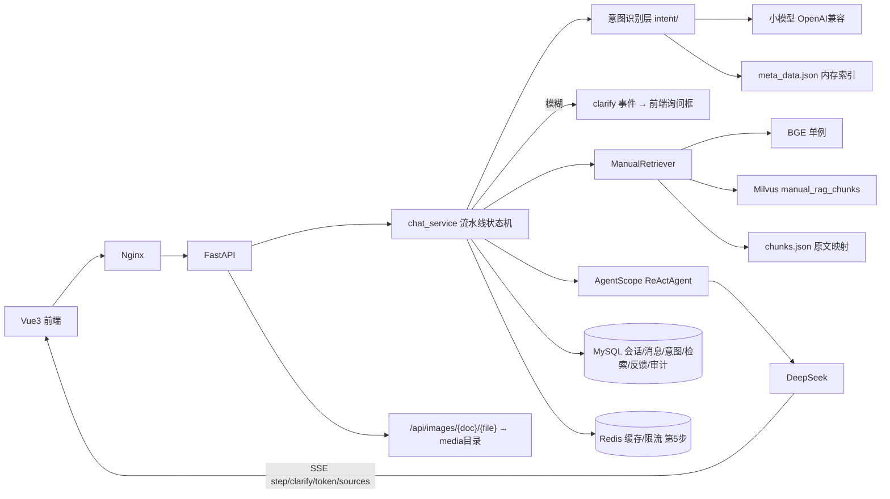

## 用户需求

开发【操作手册 RAG】智能体，基于已有 Milvus 向量库（`manual_rag_chunks`）与文档切片（`chunks.json`/`meta_data.json`）对企业操作手册进行智能问答。采用"意图识别 → 反问澄清 → 向量检索 → LLM 回答"的流水线架构，全程过程可视化，覆盖用户定义的 5 步开发范围，交付完整前后端，并将开发规划文档保存到 `code/docs/` 目录。

## 产品概述

面向企业内部员工的操作手册智能问答系统。用户在网页端以对话形式提问，系统先用独立小模型做意图识别（拆分多子问题、抽取"功能模块/用户角色/功能点"三要素、结合 `meta_data.json` 关键词索引匹配切片），意图分为不相关（拒答）、精确（直接检索回答）、模糊（弹出询问框向用户追问缺失要素，补充后重新识别，直到全部精确）；随后逐子问题稠密检索（top_k=2），合并结果与对话历史交给 DeepSeek 生成带引用的流式回答。前端实时展示意图识别、检索、工具调用、思考过程等步骤明细，来源卡片展示切片原文及其中图片。支持多轮会话、反馈赞/踩、权限管理、文档增量更新。

## 核心功能

- **意图识别（独立小模型）**：OpenAI 兼容接口单独配置（`INTENT_LLM_*`，用户稍后补充 Key）；输入优化（去问候/重复/无意义信息）、多子问题拆分、三要素抽取；基于 `meta_data.json` 匹配切片；输出 `input/simple_input/module/role/description/chunk_id_list/intent_type/intent_reason`；结果落 MySQL
- **反问澄清**：模糊意图时后端下发 clarify 事件，前端消息流内嵌询问对话框收集补充，合并后重新识别；最大澄清轮次限制（默认 3）防死循环；不相关问题固定话术拒答
- **向量检索**：全部子问题精确后依次检索，BGE 编码 + Milvus COSINE 稠密检索，每个子问题 top_k=2，结果合并并落库；低于相似度阈值回复"手册中未找到"
- **过程可视化**：SSE step 事件实时推送意图识别结果、检索命中、工具调用、思考过程，前端可折叠时间线面板展示
- **来源与图片展示**：回答末尾附"来源：文档名 > 路径"；来源卡片渲染切片原文 Markdown，`./media/x.png` 改写为后端图片路由 URL，展示操作截图
- **多轮会话与反馈**：session 维度历史存 MySQL，每轮重建 Agent 记忆；回答赞/踩反馈；会话/反馈/审计/意图/检索日志全量落库
- **管理与运维（第 5 步）**：接口权限控制、文档增量更新（复用 upsert）、Redis 缓存限流、Agentic RAG 工具化（`RAG_MODE` 开关）
- **规划文档交付**：完整开发规划写入 `code/docs/开发规划.md`

## 技术栈选型

| 层级 | 选型 |
| --- | --- |
| Web API | FastAPI + Uvicorn（模块化单体，全异步） |
| Agent 编排 | AgentScope `>=2.0.5,<2.1`（ReActAgent + Toolkit + InMemoryMemory） |
| 主 LLM | DeepSeek（`OpenAIChatModel` + `client_kwargs={"base_url": ...}` + `OpenAIChatFormatter`） |
| 意图识别小模型 | 独立 OpenAI 兼容配置 `INTENT_LLM_BASE_URL/API_KEY/MODEL`，同样用 `OpenAIChatModel`，低温度、短输出，未配置时降级为规则匹配保守策略 |
| 向量检索 | pymilvus + 现有 Milvus（192.168.0.215:19530，FLAT/COSINE，dim=768） |
| Embedding | sentence-transformers + `BAAI/bge-base-zh-v1.5`（lifespan 单例，`asyncio.to_thread` 包装同步调用） |
| 切片/索引数据 | 启动时只读加载 `chunks.json`（id→原文映射，供图片展示）与 `meta_data.json`（内存关键词索引，供意图匹配），路径入 .env |
| 数据校验与配置 | Pydantic / pydantic-settings |
| 持久化 | MySQL（SQLAlchemy 2.0 async + aiomysql） |
| 缓存限流（第 5 步） | Redis（答案缓存 + 滑动窗口限流） |
| 前端 | Vue 3 + TypeScript + Element Plus + Pinia + Vite 5 + Tailwind CSS 3.4.17 + lucide-vue-next |
| 日志 | structlog 结构化日志 + AgentScope Tracing 预留 |
| 测试 | pytest + httpx AsyncClient |
| 部署 | Docker Compose + Nginx |


## 实现方案

**总体策略**：对话流水线实现为显式状态机（非完全交给 Agent 自由发挥），保证意图识别→澄清→检索→回答的顺序可控、过程可观测；AgentScope 负责 LLM 调用、多轮记忆与工具编排，不绑定其内置 RAG 存储（ADR-001/002）。

**工作流**：用户提问 → 权限/限流 → **意图识别**（小模型：输入优化 + 子问题拆分 + 三要素抽取 + meta_data.json 匹配 → 逐子问题判定 不相关/精确/模糊，发 step 事件）→ 存在模糊意图则发 **clarify 事件**（问题 + 缺失字段），前端弹询问框，用户补充后与原输入合并重新识别（≤3 轮）→ 全部精确后**逐子问题向量检索**（top_k=2，发 step 事件）→ 合并切片 + 对话历史注入 AgentScope ReActAgent → DeepSeek SSE 流式生成（thinking/token 事件）→ 结束后发 sources（含切片原文 Markdown、图片 URL 已改写）与 done → 意图/检索/消息异步落 MySQL。

**关键技术决策**：

1. **双模型配置隔离**：意图识别小模型与主模型独立配置，识别 Prompt 强制 JSON 输出（response_format/json 指令 + 解析兜底），保证速度（低 max_tokens）与可替换性
2. **图片链路**：Milvus 中 content 已去除图片路径，展示用原文取自启动加载的 chunks.json 映射；`./media/x.png` 改写为 `/api/images/{doc}/{filename}`，后端路由映射 `{MEDIA_ROOT}/{doc}/media/`（MEDIA_ROOT 默认 `../处理后的md手册文档`，入 .env），带路径穿越校验
3. **记忆重建**：每轮从 MySQL 读历史重建 InMemoryMemory，服务无状态可水平扩展
4. **Generic/Agentic 双模式**：`RAG_MODE=generic|agentic` 配置开关；Agentic 模式将 `search_manual` 注册为 toolkit 工具由 Agent 自主调用，默认 generic 先验证稳定

**性能与可靠性**：BGE 模型与 Milvus 连接 lifespan 单例；意图识别小模型调用与检索并行化（多子问题 `asyncio.gather`）；MySQL 写入 fire-and-forget 不阻塞 SSE；澄清状态存会话表 JSON 字段，断线可恢复；第 5 步 Redis 对高频相同问题做答案缓存。

## 实施注意事项

- 不改动 `vector_store/` 现有脚本；chunks.json / meta_data.json / 图片目录只读使用
- 敏感/非法问题由"不相关"类固定话术拒答；图片路由校验 doc/filename 防路径穿越
- 意图小模型未配置时降级：跳过拆分，直接用关键词重叠度匹配 meta_data 并走保守澄清
- SSE 用 fetch + ReadableStream 消费（EventSource 不支持 POST）；断连时后端取消 LLM 流
- structlog 记录 session_id、各阶段耗时、命中数、LLM 用量；不记录 API Key
- 爆炸半径：数据库表全新创建；Agentic 默认关闭；增量更新复用 upsert 幂等

## 架构设计



## 目录结构

```
code/
├── docs/
│   └── 开发规划.md            # [NEW] 完整开发规划文档（首个交付物）
├── app/
│   ├── main.py                # [NEW] FastAPI 入口：lifespan 初始化 BGE/Milvus/MySQL/Redis/chunks/meta_data 单例，路由、CORS、异常处理
│   ├── core/
│   │   ├── config.py          # [NEW] pydantic-settings：Milvus/MySQL/Redis/LLM/INTENT_LLM/MEDIA_ROOT/CHUNKS_PATH/top_k/阈值/RAG_MODE
│   │   └── logging.py         # [NEW] structlog 配置，request_id 注入
│   ├── api/
│   │   ├── chat.py            # [NEW] POST /chat（SSE）、POST /chat/clarify（提交澄清补充）、GET /health、会话与历史消息接口
│   │   ├── images.py          # [NEW] GET /api/images/{doc}/{filename} 图片服务，路径穿越校验
│   │   ├── feedback.py        # [NEW] POST /feedback 赞/踩+评语
│   │   └── admin.py           # [NEW] POST /admin/reingest 增量更新、GET /admin/stats，管理员权限
│   ├── intent/
│   │   ├── recognizer.py      # [NEW] 意图识别：小模型调用、输入优化、子问题拆分、三要素抽取、meta_data 匹配、三分类判定；未配置小模型时规则降级
│   │   └── models.py          # [NEW] IntentResult(input/simple_input/module/role/description/chunk_id_list/intent_type/intent_reason)、ClarifyState
│   ├── agent/
│   │   └── manual_agent.py    # [NEW] ReActAgent 工厂：DeepSeek 模型/Formatter/Toolkit、按 RAG_MODE 注入上下文或注册 search_manual、历史重建 memory
│   ├── rag/
│   │   ├── retriever.py       # [NEW] ManualRetriever：BGE+Milvus 检索(top_k 默认2)、doc 过滤、阈值过滤、id→原文映射取带图 markdown、图片 URL 改写；导出 search_manual 工具函数
│   │   └── models.py          # [NEW] SearchResult(content/doc/path/score/raw_content/images)、SourceRef、ChatRequest 等
│   ├── services/
│   │   ├── chat_service.py    # [NEW] 流水线状态机：意图→澄清循环(≤3轮)→逐子问题检索→Agent 生成→SSE 事件流→异步落库
│   │   └── session_service.py # [NEW] 会话/消息/澄清状态读写，历史转 AgentScope Msg
│   ├── db/
│   │   ├── models.py          # [NEW] sessions、messages、feedbacks、intent_logs、retrieval_logs、audit_logs、users 表
│   │   └── session.py         # [NEW] async engine/session 工厂
│   ├── prompts/
│   │   ├── intent.py          # [NEW] 意图识别提示词：三要素说明、meta_data 注入、JSON 输出契约、三分类判定规则
│   │   └── manual.py          # [NEW] 回答提示词：基于检索内容、找不到说"手册中未找到"、末尾附来源
│   └── utils/
│       └── sse.py             # [NEW] SSE 事件封装（step/clarify/token/sources/done/error）
├── tests/
│   ├── test_retriever.py      # [NEW] 10 问召回验证
│   ├── test_chat.py           # [NEW] SSE 序列、引用完整、未找到兜底、clarify 流程（mock LLM）
│   └── eval_questions.json    # [NEW] 检索评测集
├── web/                       # [NEW] Vue3+TS+Element Plus+Pinia（Vite5+Tailwind）
│   ├── src/api/               # [NEW] SSE fetch 流式客户端、会话/反馈/澄清 API
│   ├── src/stores/            # [NEW] Pinia：会话、消息流、过程步骤、澄清状态
│   ├── src/views/ChatView.vue # [NEW] 聊天主界面
│   ├── src/components/        # [NEW] 消息气泡(Markdown+图片)、过程步骤面板、来源卡片(el-image 预览)、澄清对话框、侧边栏、输入区
│   └── nginx.conf             # [NEW] 静态托管 + /api 反代
├── vector_store/              # [KEEP] 现有脚本不改动
├── .env.example               # [NEW] 全部配置模板（Key 留空）
├── requirements.txt           # [NEW] 锁版本依赖
└── docker-compose.yml         # [NEW] backend、web(Nginx)、mysql、redis；Milvus 外部地址
```

## 关键代码结构

```python
# app/intent/models.py —— 意图识别输出契约
class IntentResult(BaseModel):
    input: str
    simple_input: str
    module: str = ""
    role: str = ""
    description: str = ""
    chunk_id_list: list[str] = []
    intent_type: Literal["irrelevant", "precise", "vague"]
    intent_reason: str = ""

# app/rag/retriever.py —— Agent 工具（类型注解+docstring 供 AgentScope 生成 schema）
async def search_manual(query: str, doc: str | None = None, top_k: int = 2) -> list[SearchResult]:
    """从操作手册知识库检索与问题相关的切片。query 为用户问题，doc 可按手册名过滤，top_k 为返回条数。"""

# SSE 事件协议（前端消费契约）
# event: step    data: {"type":"intent|retrieve|thinking|tool_call","title":"...","detail":{...}}
# event: clarify data: {"question":"...","missing_fields":["module"],"intents":[IntentResult]}
# event: token   data: {"text":"..."}
# event: sources data: {"sources":[{"doc","path","score","content","images":["/api/images/..."]}]}
# event: done    data: {"message_id":"..."}
# event: error   data: {"code":"...","message":"..."}
```

## 设计说明

桌面端 Web 智能问答应用，现代极简 + 轻玻璃拟态风格，专业、克制、可信赖。基于 Vue 3 + Element Plus（定制主题）+ Tailwind CSS 实现，弱化默认组件感，打造类 ChatGPT 的高级对话体验。

## 页面规划（单页应用，1 个主视图）

**ChatView 聊天主界面**：

- **顶部导航栏**：左侧产品 Logo 与名称"操作手册智能助手"，右侧文档筛选下拉（按手册名过滤检索范围）与用户信息，毛玻璃背景
- **左侧会话侧边栏**：新建会话按钮（渐变主色）、会话列表（标题+时间、悬停删除）、当前会话高亮，可折叠平滑过渡
- **中部消息区**：用户消息右对齐深色气泡；AI 消息左对齐白底气泡 + Markdown 渲染（表格/列表/代码块），流式打字光标动画
- **过程步骤面板**：AI 气泡顶部可折叠时间线，依次展示意图识别（三要素标签+意图类型彩色徽标：精确绿/模糊橙/不相关红）、向量检索（命中切片+相似度条）、工具调用、思考过程，步骤图标带加载动效
- **来源引用卡片**：AI 气泡底部 chips 列表（文档名 > 路径 + 相似度），点击展开切片原文 Markdown，其中操作截图用 el-image 网格展示、支持点击放大预览
- **澄清对话框**：模糊意图时消息流内嵌询问卡片（非模态），展示待补充字段（如"请问您咨询的是哪个功能模块？"）+ 快捷选项 chips（候选模块名）+ 输入框，提交后原对话续接
- **反馈操作条**：每条 AI 回答下方赞/踩图标按钮，点击微动画，踩弹出评语输入
- **底部输入区**：圆角多行输入框（Enter 发送/Shift+Enter 换行），渐变发送按钮，生成中变为停止按钮

## 交互与动效

消息进入淡入上滑；流式输出逐字渲染带呼吸光标；步骤面板逐级展开；来源卡片悬停浮起阴影；按钮 hover 微缩放；动效克制流畅（200~300ms ease）。

## Agent Extensions

### Skill

- **Code**
- Purpose: 后端核心链路编码工作流（FastAPI 骨架、检索层、意图识别层、SSE 流水线、AgentScope 集成、MySQL 落库）：规划→实现→验证→测试
- Expected outcome: 后端各模块按计划实现，通过 10 问召回验证与接口测试
- **frontend-design**
- Purpose: 构建 Vue 3 + Element Plus 聊天前端，保证高设计质量（过程步骤面板、来源图片卡片、澄清对话框、流式渲染）
- Expected outcome: 生成符合设计方案、可直接运行的前端工程代码
- **security-auditor**
- Purpose: 第 5 步权限认证与图片路由的安全审查（接口鉴权、路径穿越防护、注入防护、密钥管理）
- Expected outcome: 权限与图片服务通过安全检查，无硬编码密钥与常见 OWASP 风险