## 使用准备

### 操作系统要求

系统版本：Win7及以上；macOS10.0.4及以上

### 浏览器要求

**建议使用浏览器：Chrome**

兼容的浏览器：Microsoft Edge、Safari、360极速浏览器（等国内浏览器的极速模式）

版本要求：建议使用浏览器的最新版

### 系统访问信息

http://192.168.0.173:89/cjvision4/#/

## 业务流程图

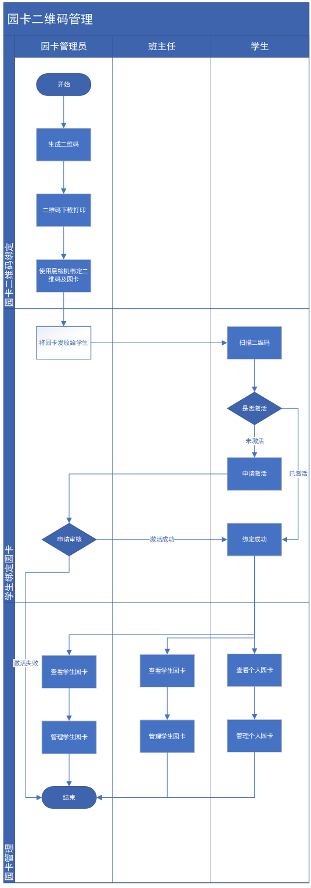

## 角色权限

|  |  |  |
| --- | --- | --- |
| **角色** | **菜单或应用** | **操作权限说明** |
| **学生/家长** | **我的园卡** | **操作自己数据** |
| **园卡管理员** | **园卡管理（pc\yd）**  **园卡激活（yd）** | **操作所有数据** |
| **班主任** | **园卡管理（yd）** | **操作权限下数据** |

## **Pc端**

### 二维码园卡管理

#### 5.1.1 查询

1：二维码编号，模糊搜索

2：生成时间，默认为空，可按日期范围搜索生成时间

3：园卡绑定，默认为空，可选未绑定已绑定

4：园卡编号，可模糊搜索

5：状态，默认为空，可选已激活、未激活

#### 5.1.2重置

1：点击重置所有输入框、筛选框、下拉框内容清空

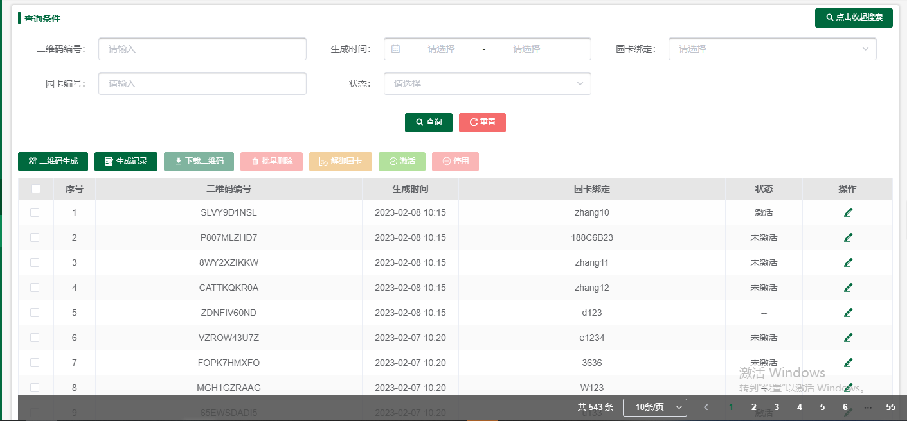

#### 5.1.3 生成二维码

1:点击输入生成数量 ，并查询页面显示生成的二维码

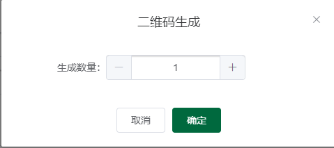

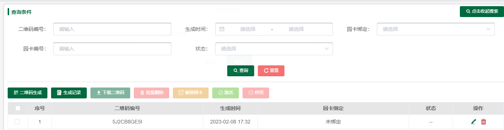

#### 5.1.4 生成记录

1：点击生成记录查看二维码导出进度条

2：生成记录中的刷新可实时查看导出进度条

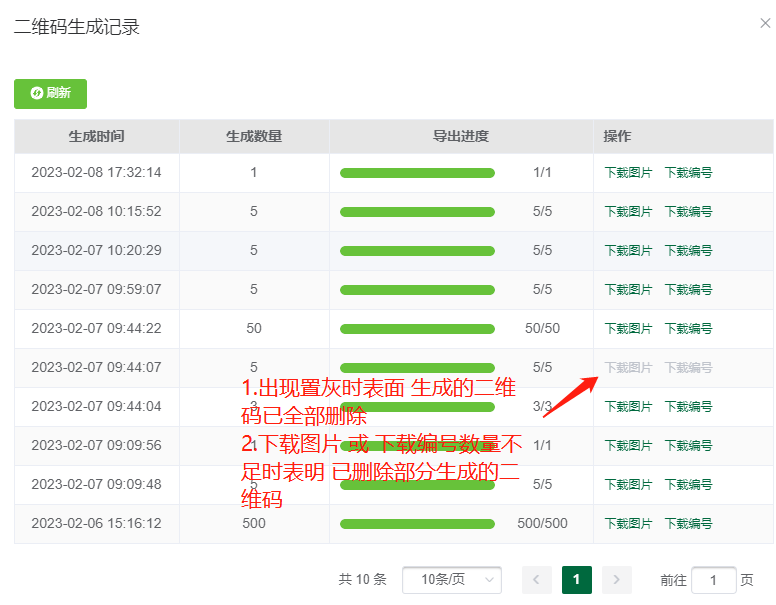

#### 5.1.5 下载二维码

1：复选框勾选二维码，点击则生成zip，包含二维码

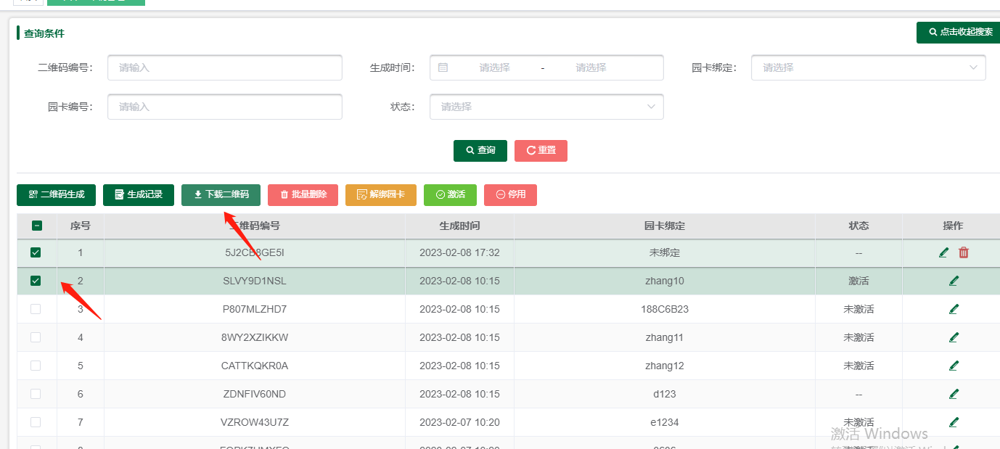

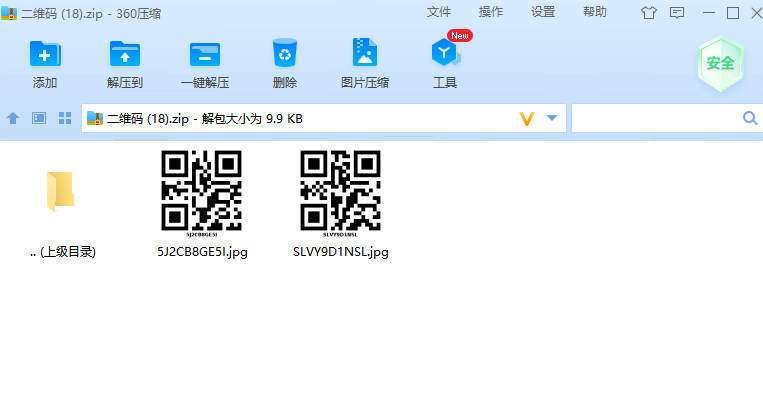

#### 5.1.6 删除

1：批量删除：复选框勾选已生成二维码时，可批量删除

注：仅未绑定园卡的或已丢失的可删除

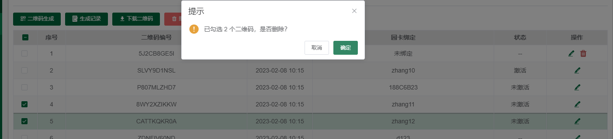

2：单个删除：单个二维码删除显示二维码编号

注：仅未绑定园卡的或已丢失的显示删除按钮

#### 5.1.7 解绑园卡

1：复选框勾选二维码点击解绑之后，二维码不会变化，园卡绑定和状态变为空

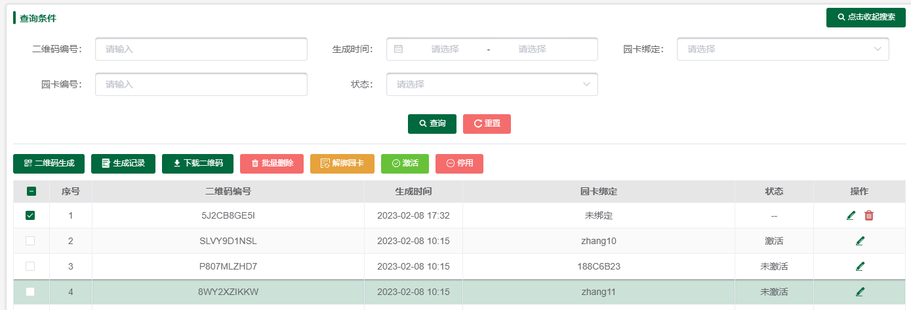

#### 5.1.8 激活、停用

1：复选框勾选二维码将勾选的园卡的状态设置为激活/未激活

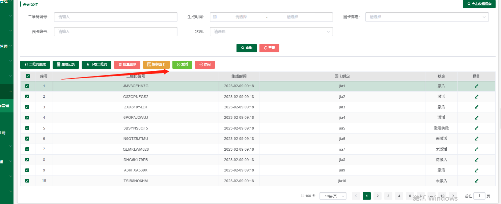

#### 5.1.9 编辑

1：选择任意一张未绑定园卡的二维码 点击编辑图标

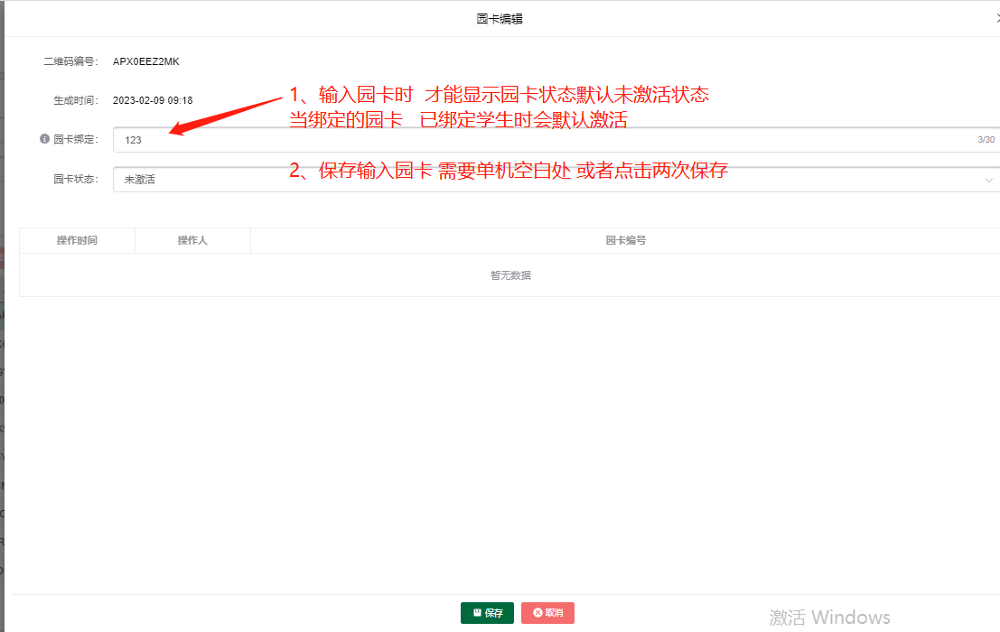

2：待激活、激活失败 就不可修改，如果需要调整，可以激活申请审核后再调整

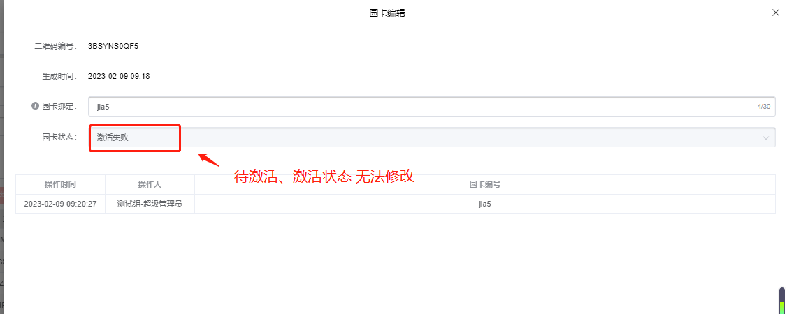

3：成功编辑后会显示操作记录

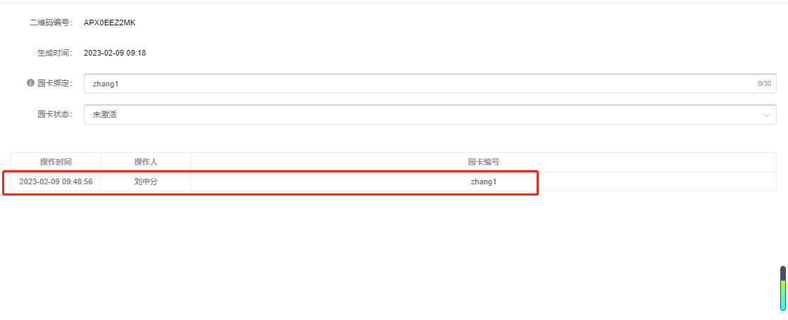

### **绑卡管理**

#### 5.2.1 查询

学生：

1：根据学年学期、校区、年级班级、学生、绑定条件查询对应学生绑卡信息

2： 选择年级班级是需要先选择校区

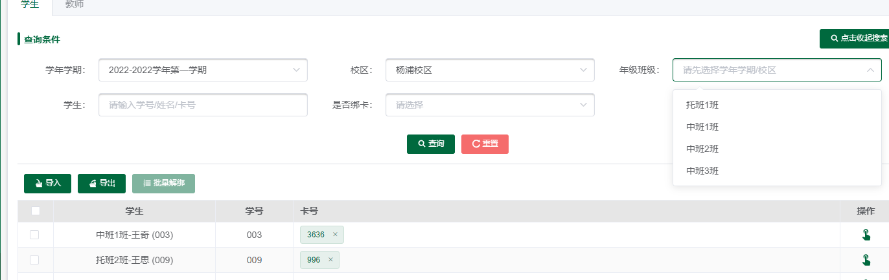

教师：

1：跟校区、部门、教职工、绑定条件进行筛选

2：选择部门进行查询，会查询一级或者子级下的教师

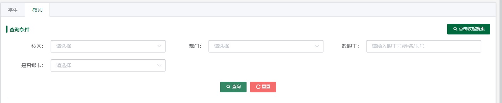

#### 5.2.2 导入

教师、学生

1：导入Excel，导入所有学生园卡都默认属于激活状态

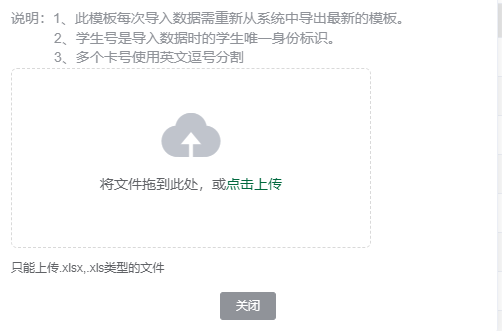

#### 5.2.3 导出

学生：

1：点击导出，导出Excel并显示园卡状态

2：未显示状态园卡默认激活状态

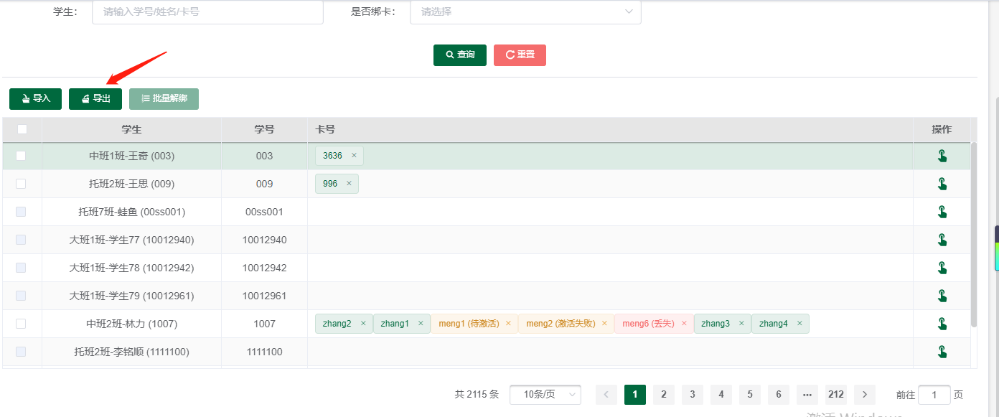

教师：

1：点击导出生成Excel 只显示园卡不显示状态

注：教师园卡都是激活状态

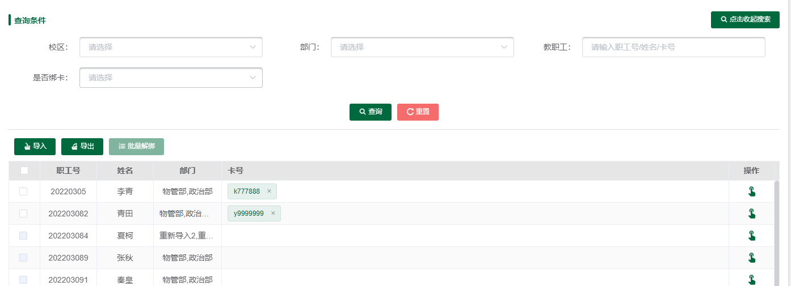

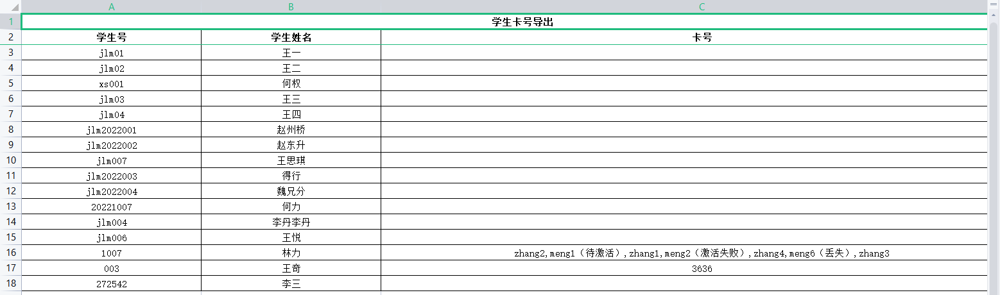

#### 5.2.4 批量解绑

1：复选框勾学生、教师点击选择 是/否 决定是否接触绑定二维码关系

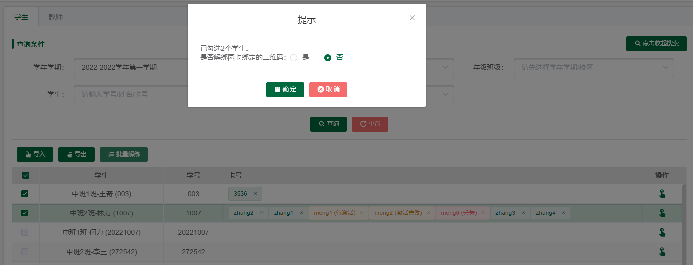

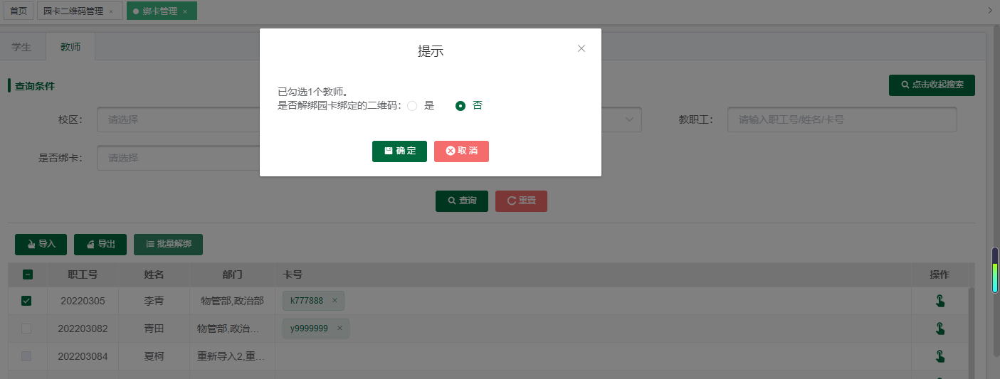

2：点击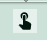可手动添加园卡并选择是否 丢失状态

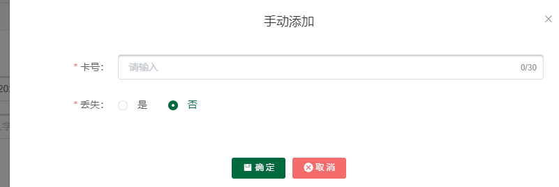

### **园卡激活申请**

1：学年学期，默认当前学年学期，与时间筛选无关，仅用于选择年级班级

3：年级班级，按所选的学年学期选择年级班级，默认为空显示全部

4：学生，可按姓名/学号搜索

5：申请时间，默认为空，可按日期范围搜索生成时间

7：状态，默认为空，可选待激活、通过、未通过

8：按申请时间倒序排序

9：学生显示年级班级姓名以及班内序号

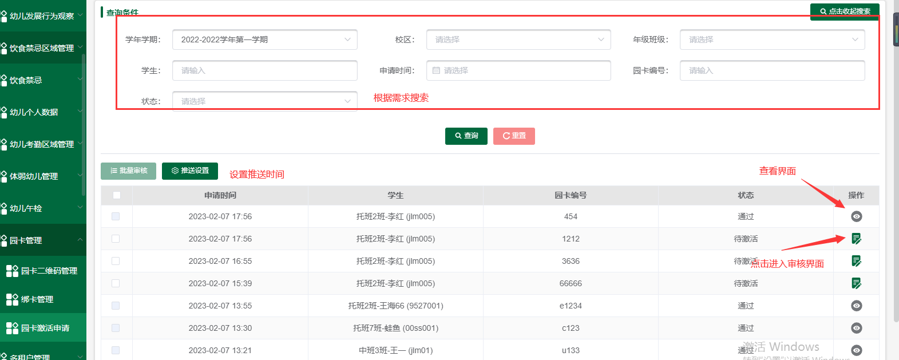

#### 5.2.1推送设置

1、学生提交申请后就推送一条信息给园卡管理员

2、每天定时推送一条消息给园卡管理员，告知待激活的申请数量，无对应待激活申请数量为0

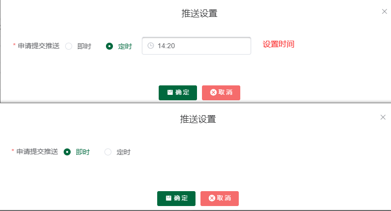

#### **5.2.2审核/批量审核**

1. 默认选择通过
2. 批量选择时只选择待激活数据
3. 选择不通过 需要填写不通过原因（最多30字）

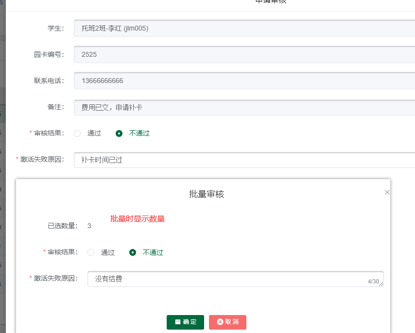

## 移动端

### 6.1我的园卡

1、点击不同状态的园卡进入相应的功能选择界面

2、可模糊搜索园卡名称及园卡编号

3、状态，默认为空，可选已绑定、丢失、未激活、激活失败

1. 绑定日期，按日期范围搜索

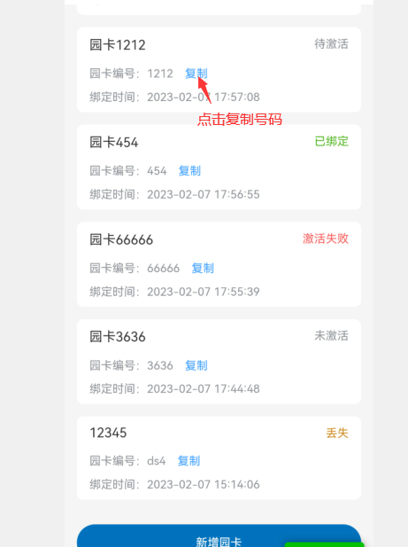

#### 6.1.1新增园卡

1. 进入二维码扫描界面
2. 未激活园卡：该园卡未激活，是否提交激活申请！
3. 园卡已绑定其他学生：该园卡已被绑定，请联系班主任！
4. 园卡已绑定自己：该园卡已绑定，无需再次绑定
5. 二维码未绑定园卡：该园卡未完成设置，请联系班主任！
6. 正常情况：请设置园卡名称后完成绑定！（园卡名称15字以内，学生个人园卡中名称不可重复（解绑后不限制），默认自动命名，园卡+园卡编号，若园卡编号过长超出字数限制，则取后8位。）

#### **6.1.2待激活园卡**

1：修改名称，点击弹出设置园卡名称弹窗，自定义名称15字以内，学生个人园卡中名称不可重复（解绑后不限制）

2：撤回激活申请，点击删除该园卡的激活申请，园卡管理员的申请列表中移除该申请，学生的园卡列表中移除该园卡

#### **6.1.3已绑定园卡**

1、可修改名称

2、点击丢失：卡片状态变为不是状态

3、点击解绑：学生和卡片信息解除绑定 列表删除解绑卡片

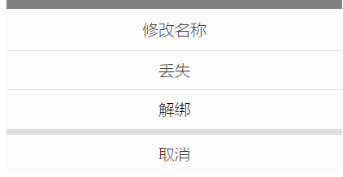

#### **6.1.4未激活园卡**

1. 可修改名称
2. 点击激活申请：进入申请填报界面

**填报**

1、当前账号对应学生

2、扫描中点击进入的显示扫描的二维码对应园卡的编号，激活失败提示页面中点击进入的显示记录对应的园卡编号

1. 电话:非必填，联系电话第一次填写后，下次提交可自动填充

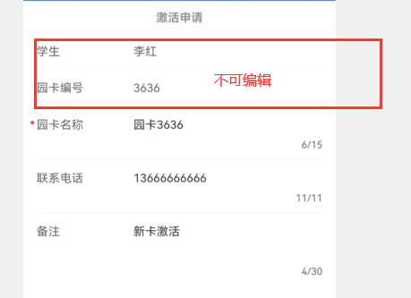

#### **6.1.5丢失园卡**

1. 可修改你名称
2. 点击找回：卡片状态变为已绑定状态
3. 点击解绑：数据解绑

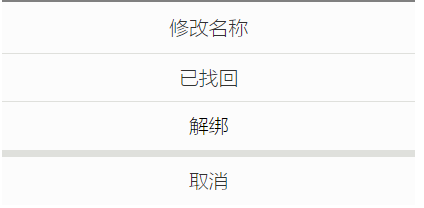

#### **6.1.6激活失败园卡**

1. 点击再次提交进入提交界面
2. 点击删除提示后数据直接删除

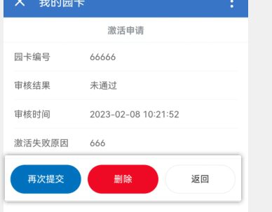

### 6.2园卡管理

1. 可搜索学生姓名/班内序号
2. 筛选：班级，默认权限中的第一个班级，园卡管理员可按校区年级班级选所有班级，班主任仅可选择自己负责的班级

3、按班内序号排序

4、每个学生显示头像、姓名，性别符号，班内序号

5、点击查看该学生的园卡列表

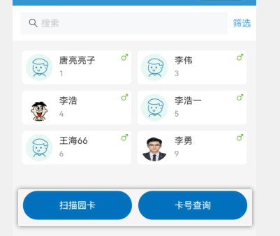

#### 6.2.1扫描园卡

1、未配置的，提示：“该园卡未完成配置”

2、扫码非权限内的学生的园卡提示：“该园卡绑定学生非权限内学生”

3、已绑定的，跳转至已绑定页面

4、丢失的，跳转至丢失页面

5、未绑定的，跳转至未绑定页面

##### 6.2.1.1已绑定

1. 显示已绑定的学生，状态，学生自定义的园卡名称，园卡编号
2. 操作记录编辑不可编辑

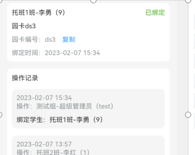

##### **6.2.1.2未绑定**

1、显示已绑定的学生，状态，学生自定义的园卡名称，园卡编号

2操作记录编辑不可编辑

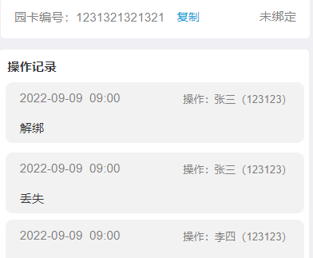

##### **6.2.1.3丢失**

1、显示已绑定的学生，状态，学生自定义的园卡名称，园卡编号

2、操作记录编辑不可编辑

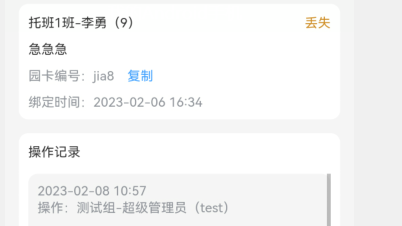

#### **6.2.2卡号查询**

1. 跳转和扫码跳转一致
2. 点击卡号查询，弹出卡号输入弹窗，可手动输入卡号进行查询

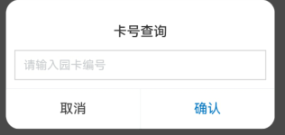

#### 6.2.3新增园卡

1、和我的园卡新增一致

#### **6.2.4学生详情**

1. 搜索和筛选
2. 点击卡片进入卡片详情界面

3、默认为空，可选已绑定、丢失、（未激活或激活失败的老师查看不显示）

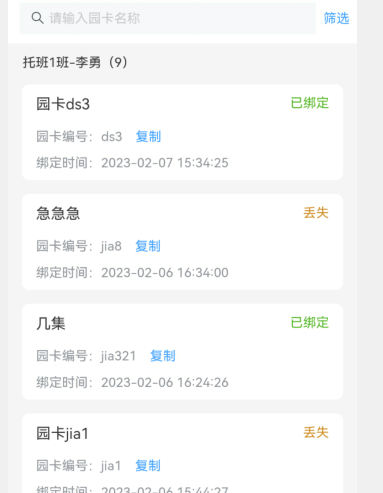

### 6.3**园卡激活申请**

1、按申请时间倒序排序

2、显示审核状态

1. 显示学生以及园卡编号
2. 待激活的点击进行审核
3. 已审核的（通过、未通过）点击可查看
4. 点击可查看详情

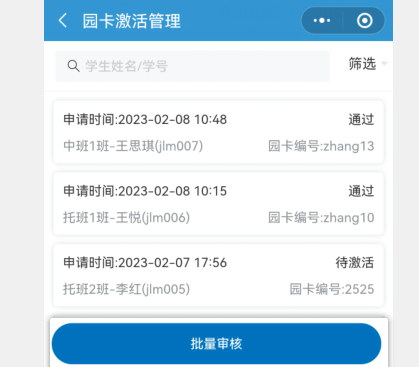

#### 6.3.1批量审核

1. 点击批量时只显示待激活数据
2. 默认选择通过
3. 选择不同需要填写不通过原因

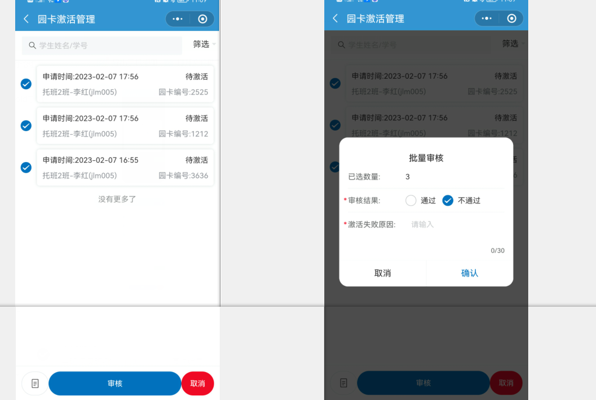

## PDA园卡二维码管理

1：进入晨检机需要同时拥有 园卡管理员、园卡PDA权限

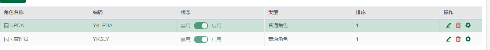

2：二维码编号扫码 需进入园卡二维码管理 按键（SCAN）对准二维码聚焦 才能识别。

3：可编辑输入、清空 二维码编号、园卡

4：点击绑定记录 且切换查看 二维码、园卡中的绑定时间、操作人、园卡、二维码

5：使用NFC放置PDA 感应位置 可在园卡编号中回填 学生卡号

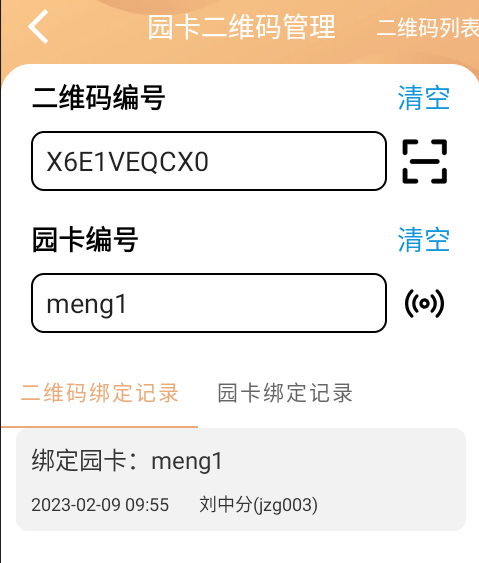

6：输入（扫描）正确二维码后 填写园卡编号 才能进行绑定。

7：查看已配置的园卡可进行解绑操作

8：点击可清空 二维码 或 园卡 输入框中的编号

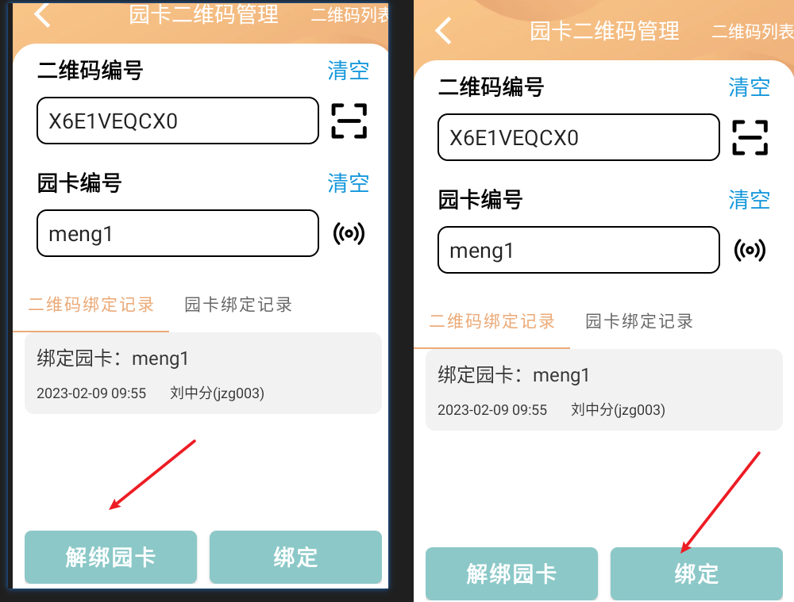

9：进入学生卡二维码管理界面点击未配置可对未绑定二维码进行操作

10：点击操作后跳转至页面 二维码编号输入框自动回填

11：输入框输入二维码编号 可进行模糊匹配搜索

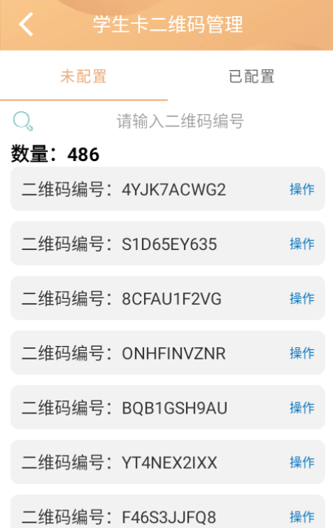

12：点击已配置可安条件（园卡编号、绑定日期、操作人）筛选

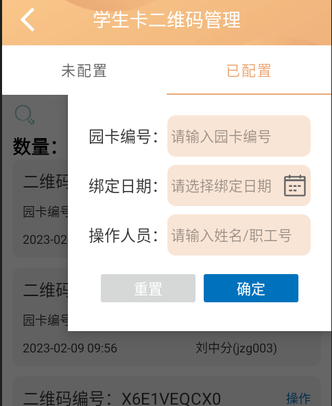

13：在已配置中点击操作会弹出提示框 确认是否回填二维码及园卡

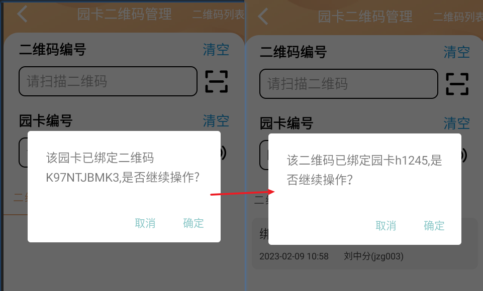