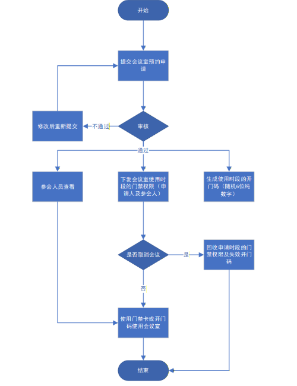
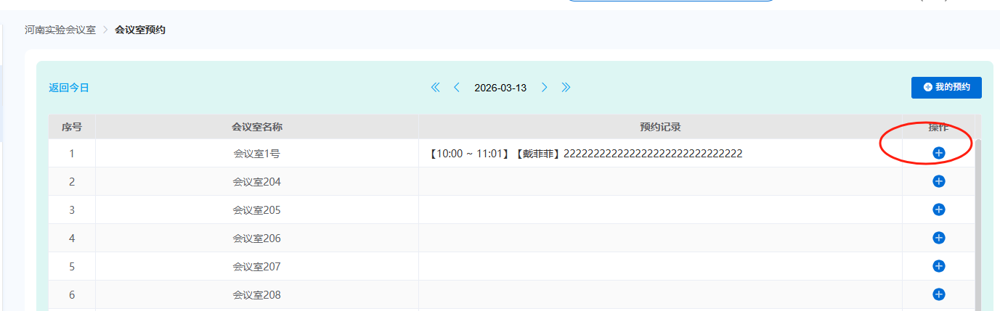
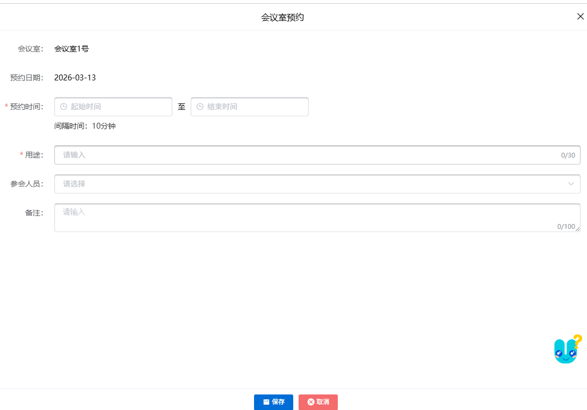
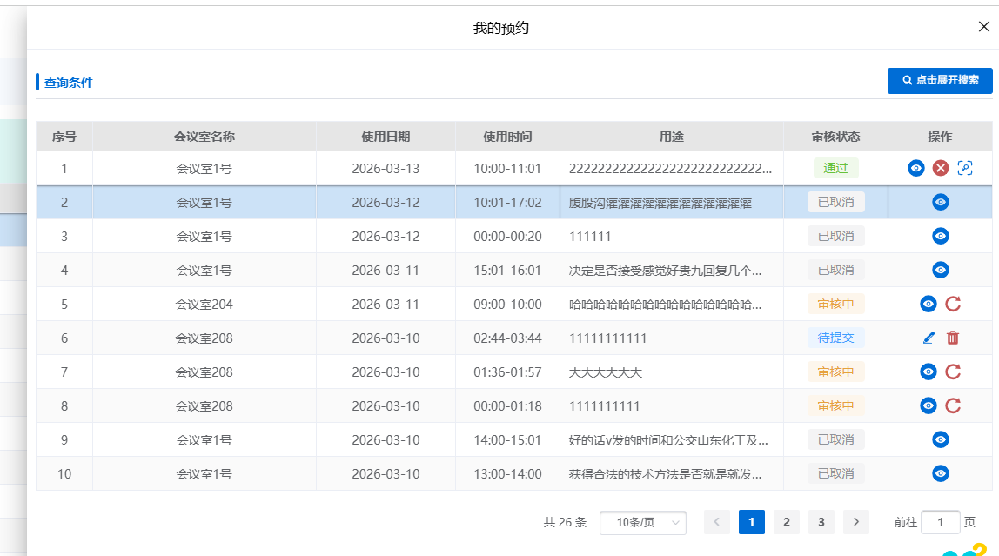
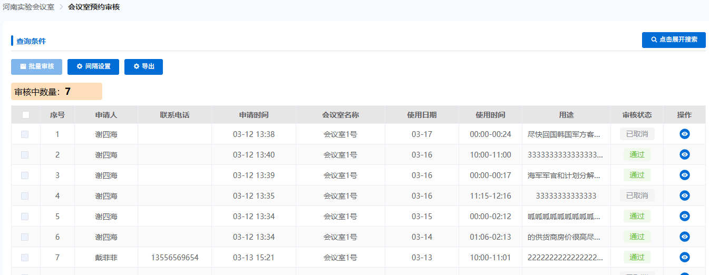
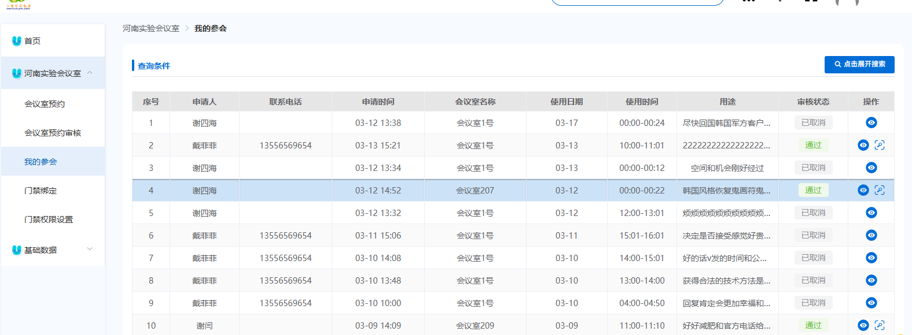
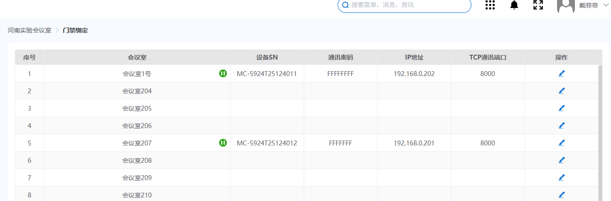
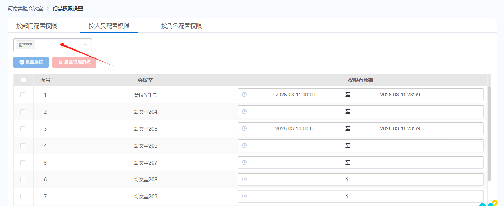

# 使用准备

## 操作系统要求

系统版本：Win7及以上；macOS10.0.4及以上

## 浏览器要求

**建议使用浏览器：Chrome**

兼容的浏览器：Microsoft Edge、Safari、360极速浏览器（等国内浏览器的极速模式）

版本要求：建议使用浏览器的最新版

## 系统访问信息

http://192.168.0.173:89/cjvision4/#/login

## 业务流程图

## 角色权限

|  |  |  |
| --- | --- | --- |
| **角色** | **菜单或应用** | **操作权限说明** |
| **会议室管理员** | **全部权限** | **所有权限** |
| **教职工** | **我的参会、会议室预约、会议室门禁（移动端）** | **参会数据权限** |

# **河南实验会议室**

## 会议室预约

### 新增预约申请

1. 点击新增按钮
2. 选择预约时间、用途、参会人员，点击保存

### **我的预约**

1. 点击，查看历史预约记录
2. 可撤回审核中的预约
3. 点击按钮，可查看开门码

1. 点击按钮，可将已通过的预约会议取消
2. 点击删除按钮，可删除撤回后待提交的预约

## **会议室预约审核**

### 审核

1. 审核：点击审核中的，点击通过或不通过
2. 点击保存即可审核成功

### **间隔设置**

1. 点击间隔设置按钮，设置0-60分钟时间，点击保存即可

## **我的参会**

显示登录人作为参会人员的预约记录（已通过、已取消的预约记录）

## **门禁绑定**

1. 配置会议室对应班牌的设备SN、通讯密码、IP地址、TCP通讯端口
2. 点击按钮，可远程开门

## **门禁权限设置**

1. 按部门配置权限，可批量授权，也可批量取消授权

1. 按人员配置权限：点击左上角选择教职工，为选中的教职工授权

1. 按角色配置权限：选中需要配置权限的角色，选择会议室权限有效期即可

## **会议室门禁（移动端）**

1. 显示门禁权限设置中，有权限的会议室
2. 点击开门按钮，可远程开门

