# 业务流程图

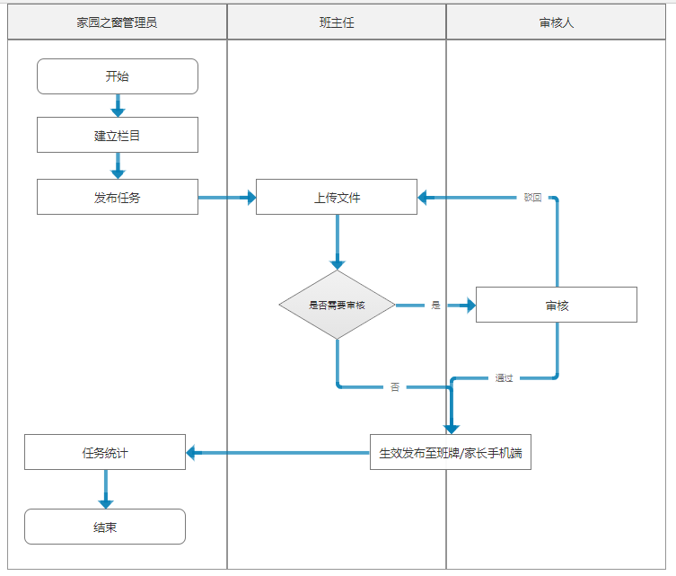

# 角色权限

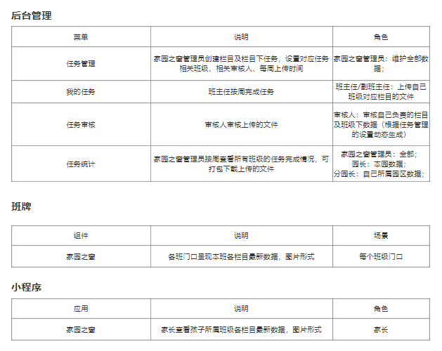

# 推送消息

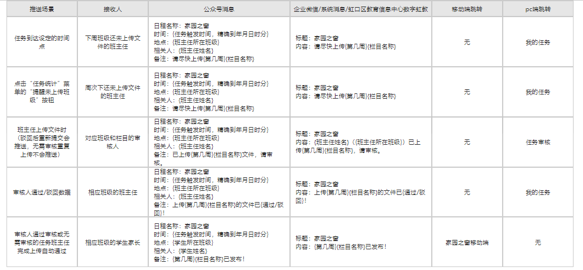

# PC端功能介绍

## 任务管理

### 新增/编辑栏目

1. 点击按钮可新增栏目。
2. 选择已有的栏目，点击按钮可编辑修改栏目。

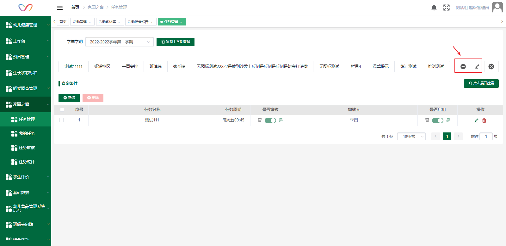

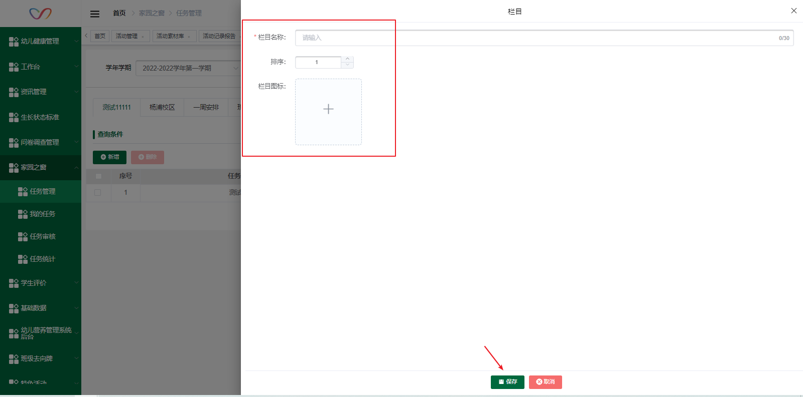

### 删除栏目

1. 选择已有的栏目，点击按钮可删除栏目。
2. 有任务的栏目不可删除。

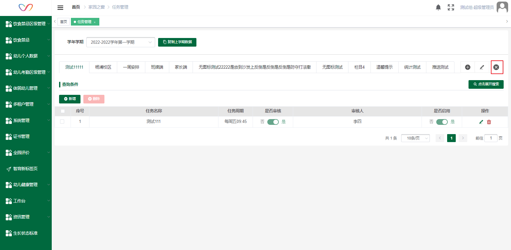

### 新增/编辑任务

1. 点击按钮可新增任务，点击可编辑任务。
2. 任务周期：任务在创建后会生成到每一周，班主任可以在任何时间对任何一周进行上传，该时间只会在到时间检测下一周班主任该栏目是否上传文件，如果没有上传文件会推送消息提醒班主任上传。
3. 完成时间：班主任是否设置时间内完成上传任务，在统计功能中可查看班主任是否按时完成上传。

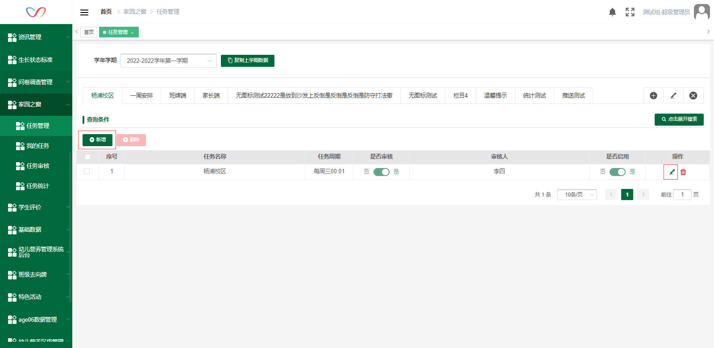

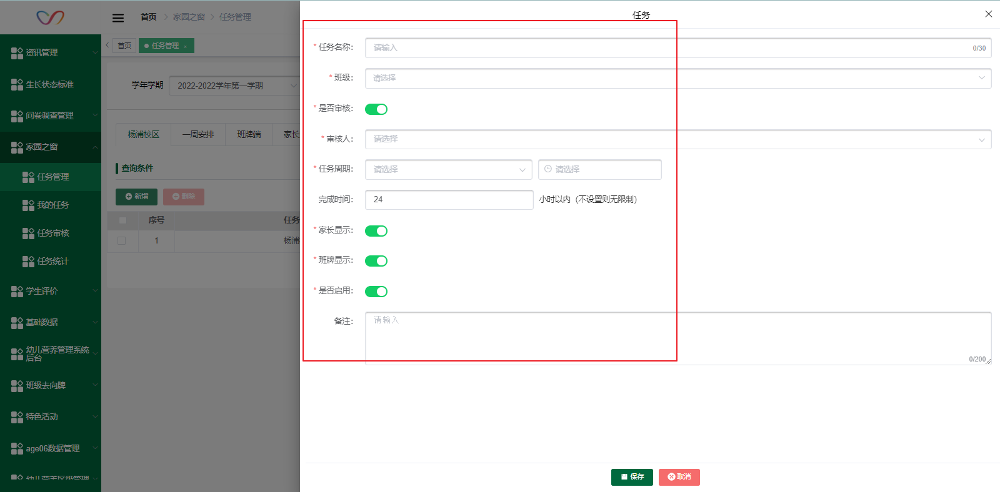

### 删除栏目

1. 点击删除按钮可删除任务。

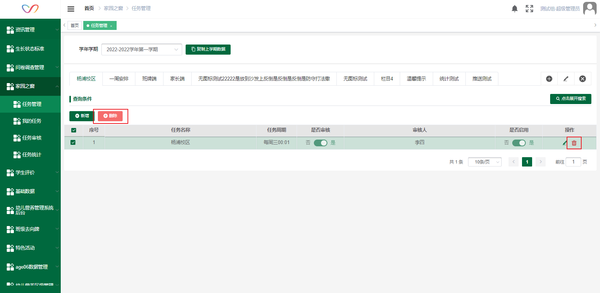

### 复制上学期数据

1、点击复制上学期数据按钮，将上学期的栏目和任务复制到当前学期。

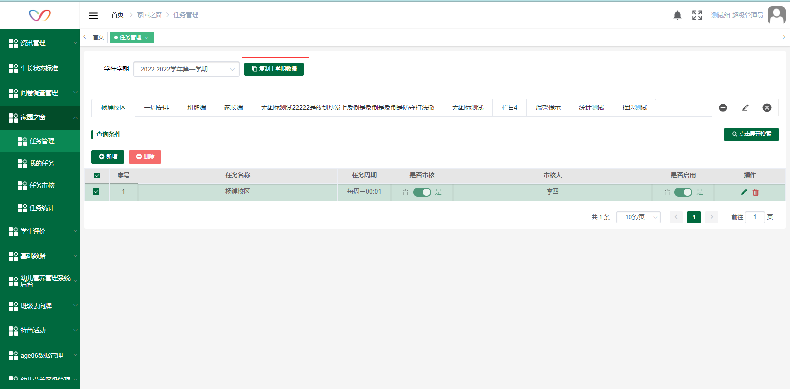

## 我的任务

1. 点击按钮上传word文档，上传后，word文档转化为图片显示，审核人收到待审核消息提醒。
2. 班主任可上传下一周及之后周次的任务。

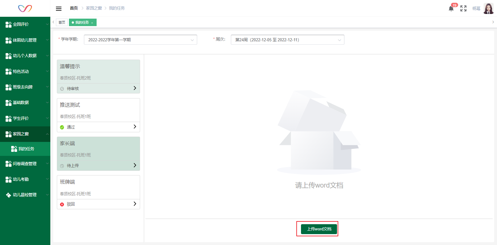

1. 驳回、不用审核的任务可点击重复上传word文档。

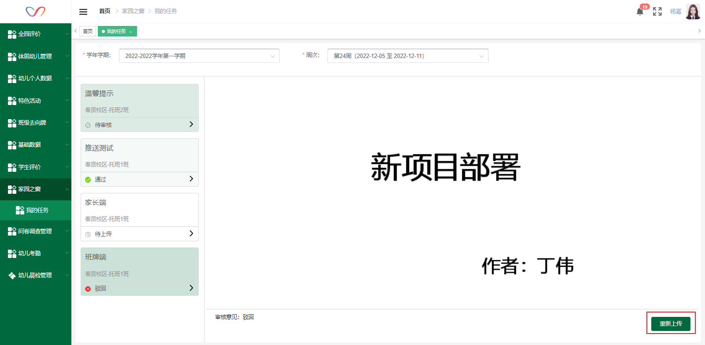

## 任务审核

1、审核人勾选任务，点击按钮，输入通过/驳回意见后点击确定，审核后班主任收到消息提醒。驳回后班主任可重新上传文档。

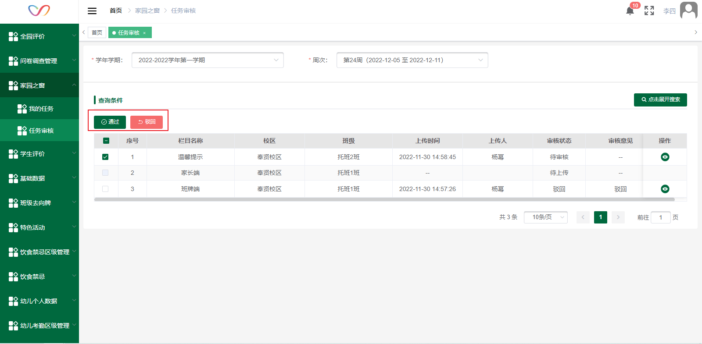

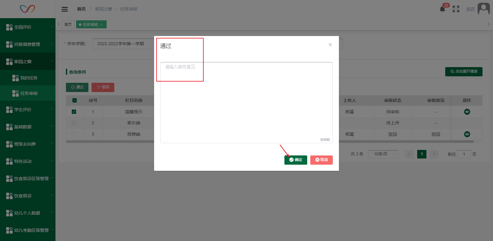

2、点击详情按钮，以图片模式查看文件详情。

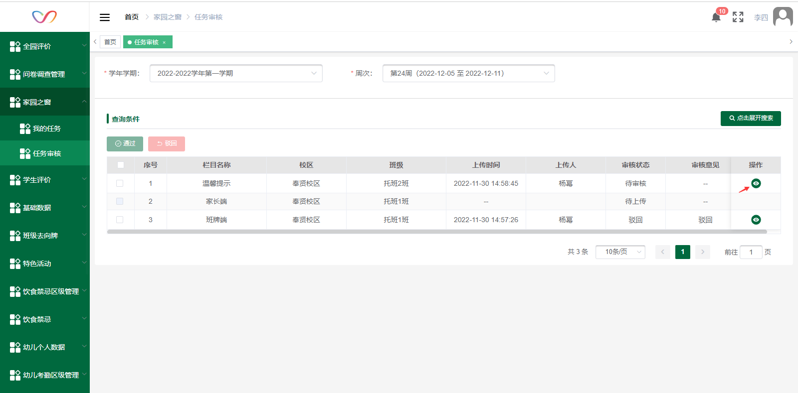

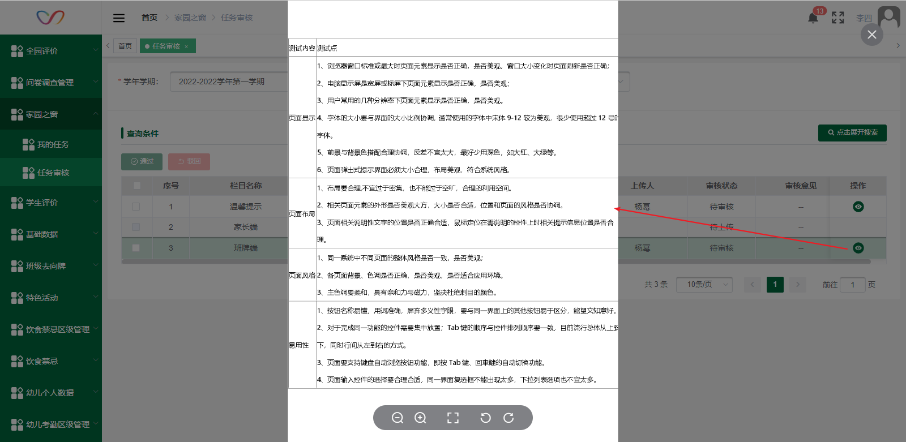

## 任务统计

1、点击未上传班主任会收到推送消息提醒。

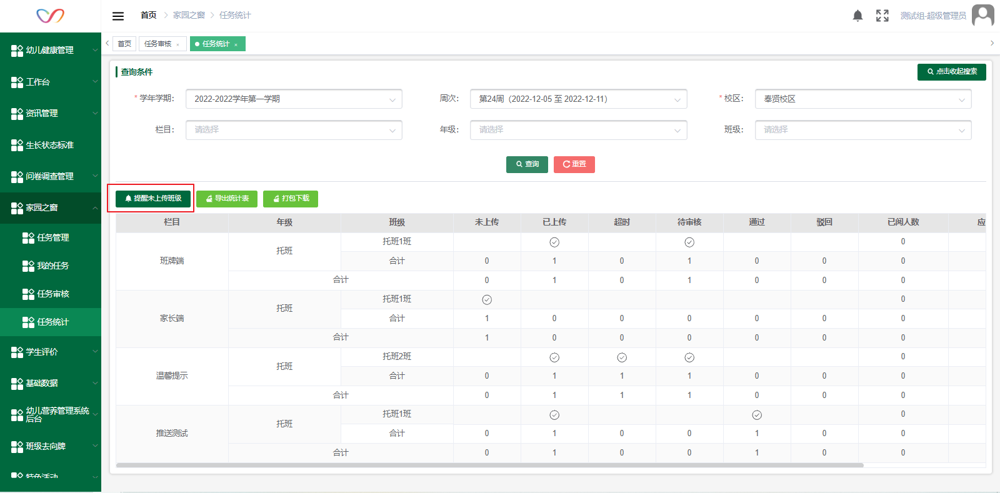

2、点击可导出表格数据，点击可下载班主任上传的word文档原件。

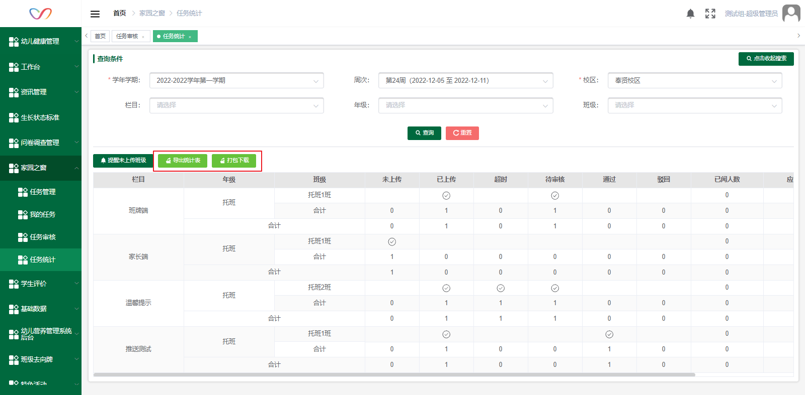

# 移动端功能介绍

## 家长端

1. 登录学生账号，进入家园之窗应用，选择栏目查看所属班级的内容详情。
2. 栏目显示最新已上传的周次，详情页可切换周次查看。

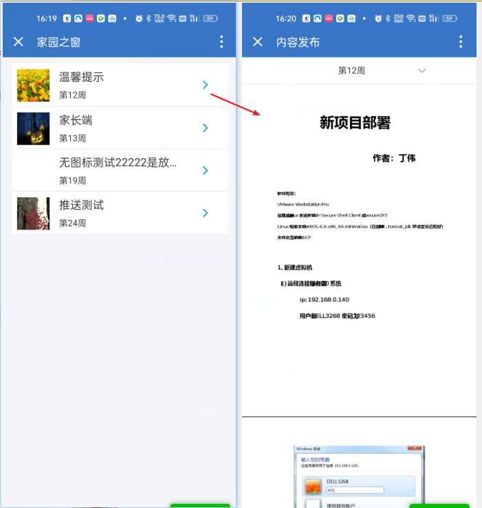

## 班牌端

1. 选择栏目查看本班级的内容详情。
2. 栏目显示最新已上传的周次，详情页可切换周次查看。

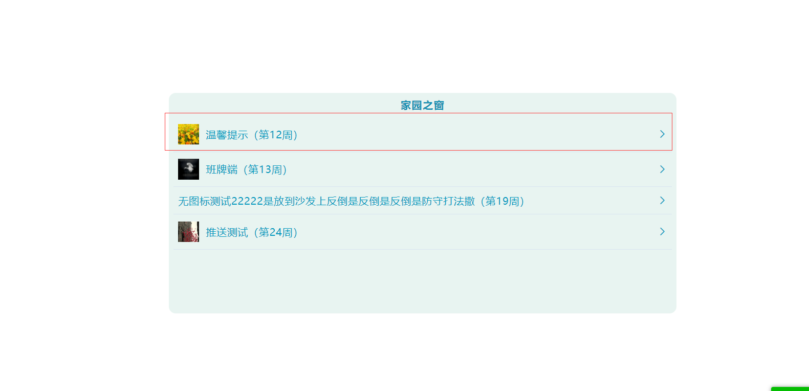

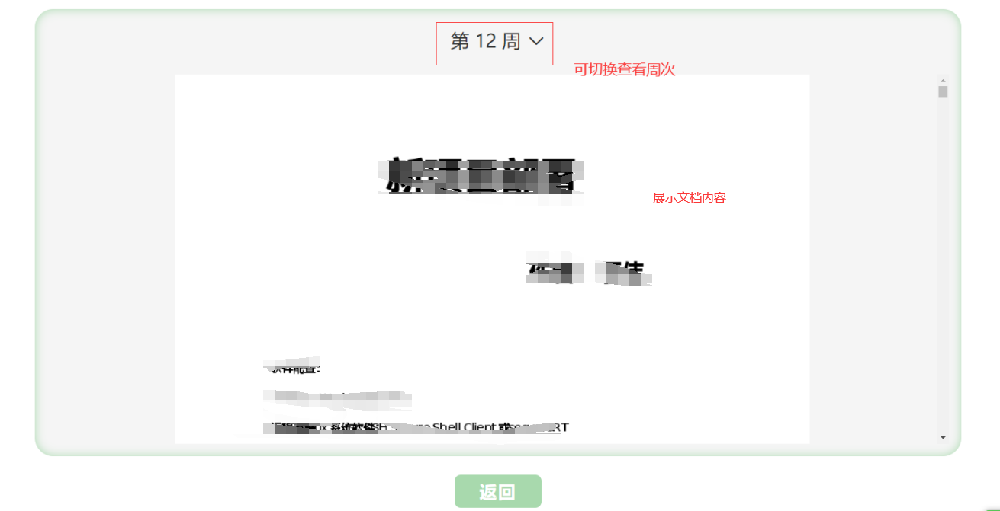