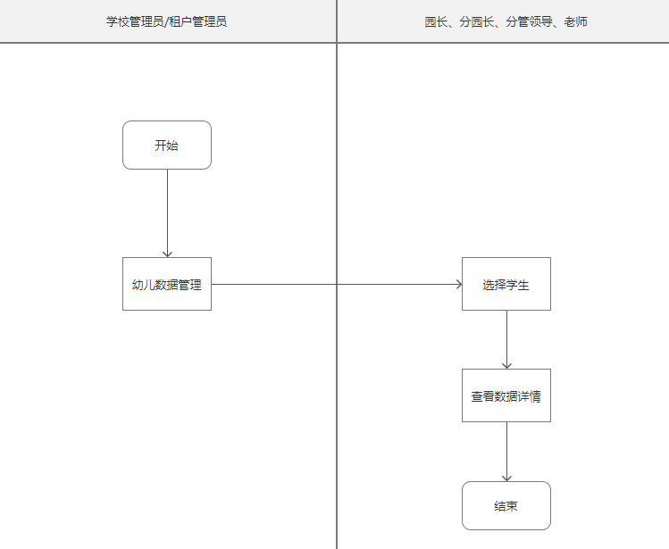
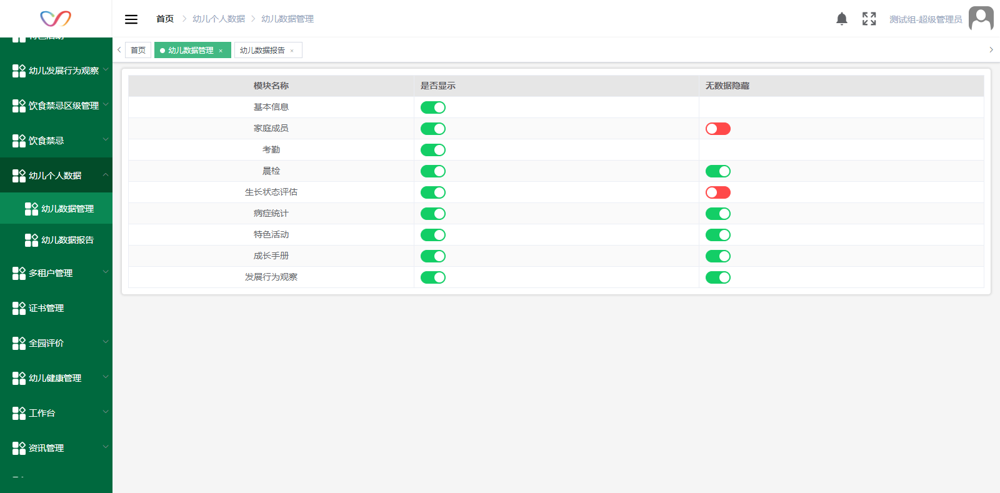
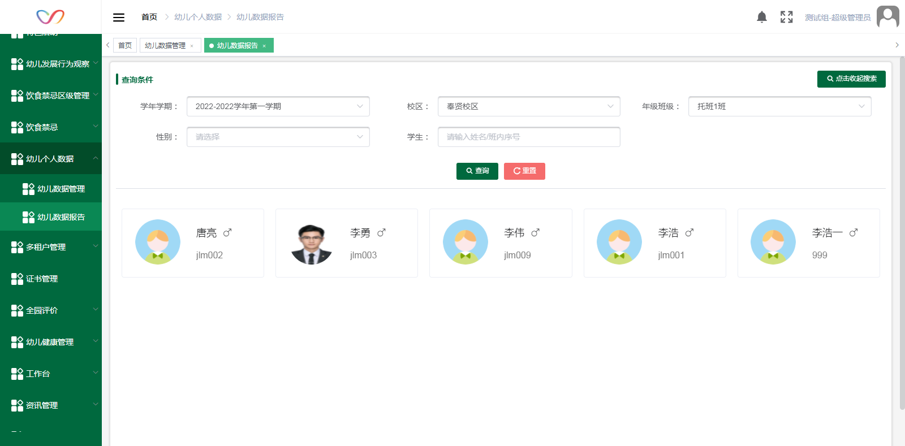
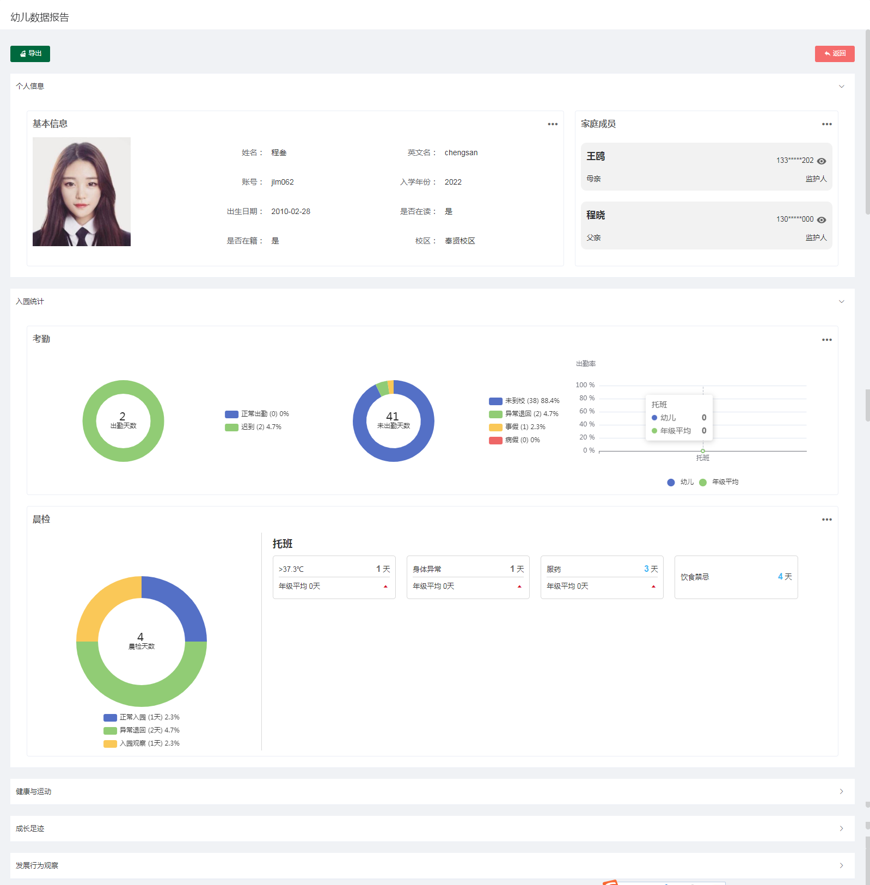

# 使用准备

## 操作系统要求

系统版本：Win7及以上；macOS10.0.4及以上

## 浏览器要求

**建议使用浏览器：Chrome**

兼容的浏览器：Microsoft Edge、Safari、360极速浏览器（等国内浏览器的极速模式）

版本要求：建议使用浏览器的最新版

## 系统访问信息

【附上测试环境的访问地址，也便于后续其它测试人员查阅访问】

https://cd.oakedu.net.cn/cjvision4/#/dashboard

## 业务流程图

## 角色权限

|  |  |  |
| --- | --- | --- |
| **角色** | **菜单或应用** | **操作权限说明** |
| **幼儿数据报告管理员** | **幼儿数据管理** | **设置** |
| **总园长** | **学生选择** | **可查看所有学期所有校区所有年级班级学生** |
| **分园长** | **学生选择** | **可查看所有学期负责校区所有年级班级学生** |
| **班主任** | **学生选择** | **可查看当前学期自己负责班级的学生** |
| **园长/分园长/班主任** | **个人报告查看** | **查看所选学生报告内容** |

# 幼儿数据管理

**模块名称**：仅显示角色权限分配中，勾选了的资源包对应的配置项，未授权的资源包对应的模块在该页面以及报告中均不显示；若已设为显示的模块取消了授权，则在报告中也不显示

**是否显示**：默认为是，选择是，则导航栏顺序以及概览页面中对应模块中显示该模块，选择否，则不显示，默认为是

**无数据隐藏**：默认为是，选择是，则对应模块中，若该学生没有此模块数据则不显示该模块，选择否，则无论是否有数据均显示（基本信息和考勤因为是必定会有的 所以没有是否隐藏开关）

# 幼儿数据报告

## 学生选择

**1.筛选条件**

**学年学期：**园长、分园长可选所有学年学期；班主任仅可选择当前学期。默认当前学期，学期倒序排序

**校区：**园长可选所有校区；分园长可选自己负责的校区；班主任可选自己负责班级所在的校区。默认选中权限内第一个。

**年级班级：**学年学期对应的年级班级，园长、分园长可选所有年级班级；老师仅可选择自己负责的班级。默认选中权限内第一个。

**性别：**默认为空，显示全部，可选男性/女性

**学生：**可通过姓名/班内序号搜索

**2.学生列表**学生卡片：显示学生头像，姓名，性别符号，班内序号，若无头像，则显示统一的默认头像

排序：按班内序号正序排序

点击学生卡片：进入详情页面查看该学生的个人数据

## 个人报告查看

**返回按钮**：点击返回幼儿选择页面

**一级模块**：个人信息/入园统计/健康与运动/成长足迹/发展行为观察

,若一级模块下无子模块，则该模块不显示

**收起/展开**：默认展开个人信息/入园统计，其余模块折叠，展开时再加载（保证页面加载速度），可点击收起折叠，折叠后仅显示标题及展开按钮

**查看更多按钮：**点击跳转至信息详情页面