# 使用准备

## 操作系统要求

系统版本：Win7及以上；macOS10.0.4及以上

## 浏览器要求

**建议使用浏览器：Chrome**

兼容的浏览器：Microsoft Edge、Safari、360极速浏览器（等国内浏览器的极速模式）

版本要求：建议使用浏览器的最新版

## 系统访问信息

http://192.168.0.173:89/cjvision4/#/

## 角色权限

|  |  |  |
| --- | --- | --- |
| **角色** | **菜单或应用** | **操作权限说明** |
| **区域管理员** | **午检情况** | **查看、导出所有学校数据** |
| **园长、晨检总管理员** | **午检情况** | **查看、导出全校、校区、年级、班级** |
| **分园长、保健老师、晨检分园管理员** | **午检情况** | **查看、导出自己所属校区下的校区、年级、班级** |
| **班主任** | **午检情况** | **查看自己担任班主任的班级** |
| **午检PDA** | **晨检机 午检** | **必须有“晨检PDA”权限才能使用，内部数据权限根据业务角色而定** |

# 幼儿午检

## 午检情况（pc端）

1. 选择学年学期、具体日期即可统计出到对应查询条件下的午检情况
2. 点击全校/校区/年级/具体班级即可查看对应范围内的学生午检情况
3. 点击导出按钮可导出权限内的数据（班主任权限无导出按钮）

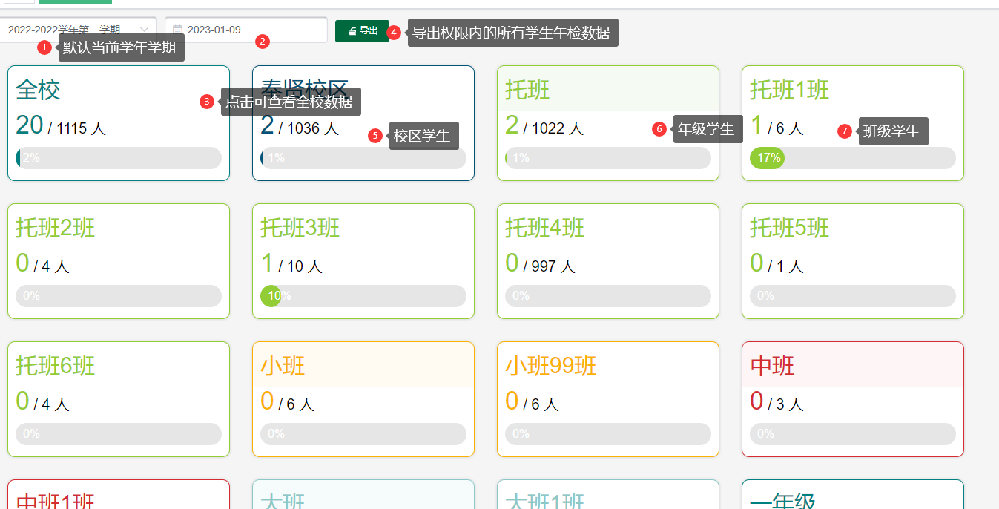

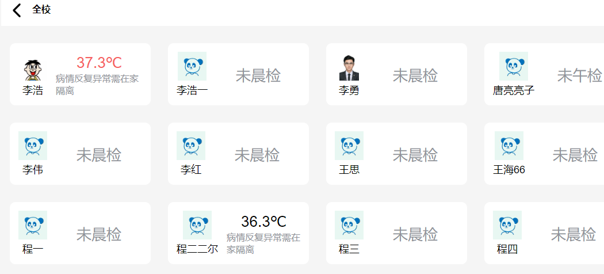

注：未晨检、未午检的学生，显示未晨检状态；已晨检未午检的学生，显示未午检状态

区域管理员权限：默认查询第一个学校下全部数据，可切换学校

1. 选择学校、学年学期、具体日期即可统计出到对应查询条件下的午检情况
2. 点击全校/校区/年级/具体班级即可查看对应范围内的学生午检情况

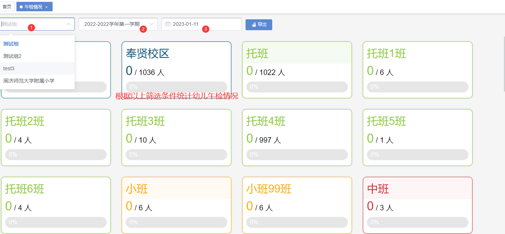

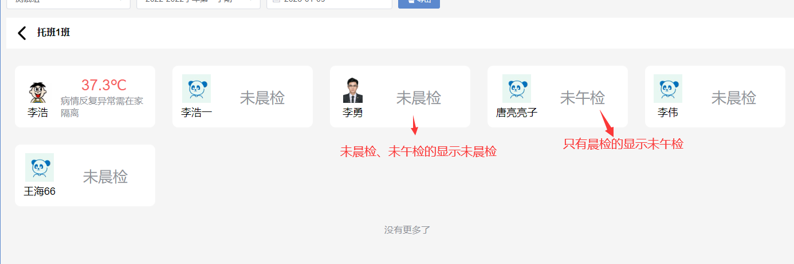

## 午检情况（移动端）

1. 点击选择需要查看的范围（全校/校区/年级/具体班级）
2. 点击选择日期即可查看统计出范围内的午检情况

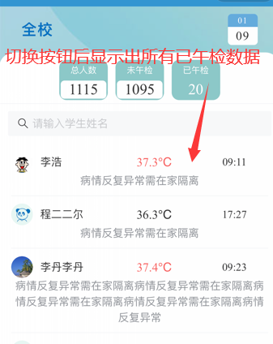

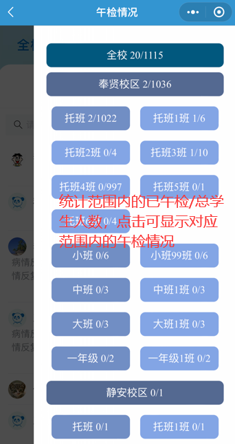

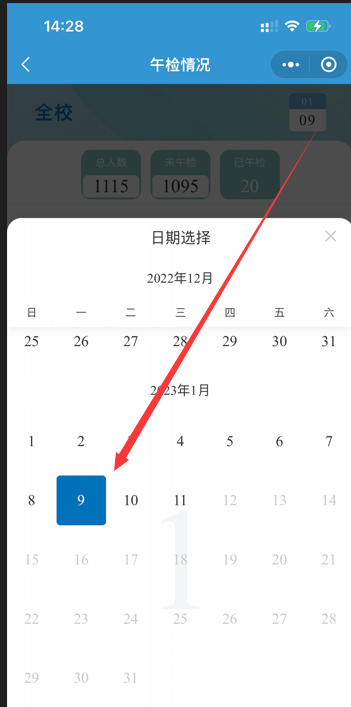

区域管理员权限：默认查询第一个学校下全部数据，可切换学校

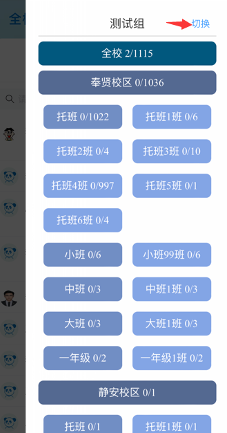

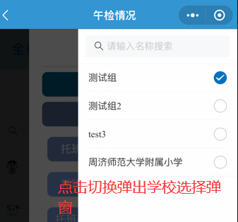

## 午检情况（PDA）

1. 查询每日午检角色权限：：

园长、晨检总管理员：查看全校、校区、年级、班级。

分园长、保健老师、晨检分园管理员：查看自己所属校区下的校区、年级、班级。

班主任：查看自己担任班主任的班级。

1. 进入午检必须拥有 午检PDA 权限。
2. 点击输入体温，输入完后自动保存。
3. 备注框输入完后需要点击、按钮。

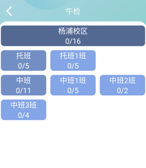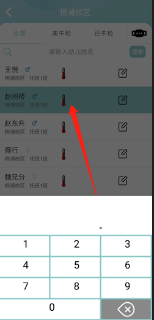

1. 当输入体温及备注后需要下拉(、、)刷新数据才能将已午检的数据刷新出来。
2. 点击获取手环体温（最新的手环体温）。

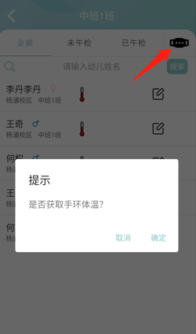

4、刷学生卡时有两种情况：

一：幼儿未在本校区刷卡时会提醒“您没有该幼儿的午检权限。”

二：幼儿在本校区中会提示幼儿信息无论已午检，还是未午检都可以修改体温及备注。

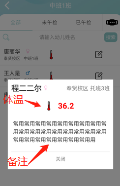

## 午检情况（班牌）

1. 班牌新增两组件【全校午检情况】、【班级午检情况】。
2. 全校午检情况则直接显示全部学校的已午检人数/总人数

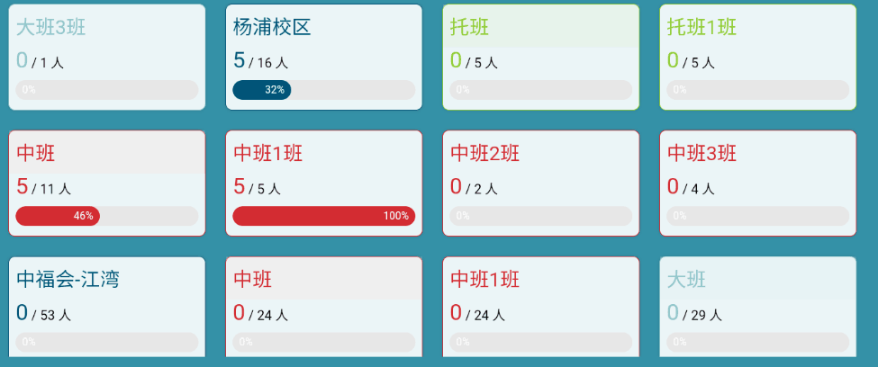

1. 点击班级可查看本班幼儿午检详情，当备注过多时则... 显示。

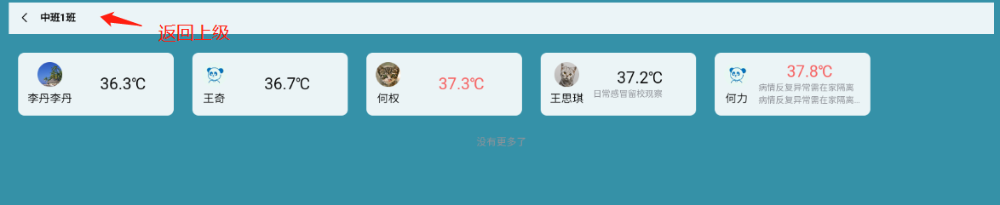

4、使用班级午检情况组件时，班牌选择对应的学校位置，则直接显示该班午检情况。

