# 业务流程图

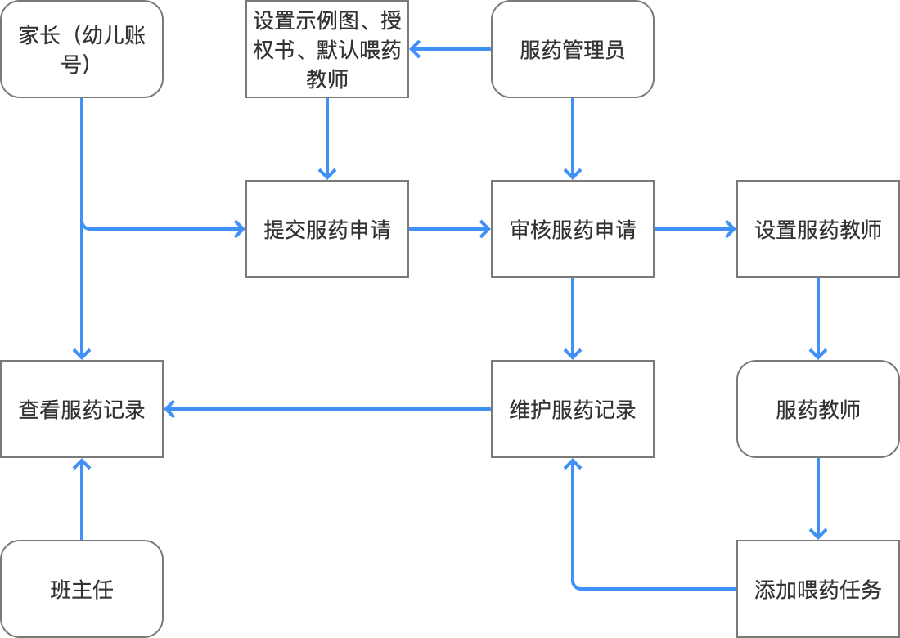

# **页面流程**

PC端

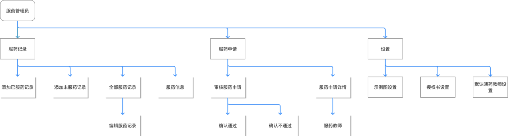

移动端

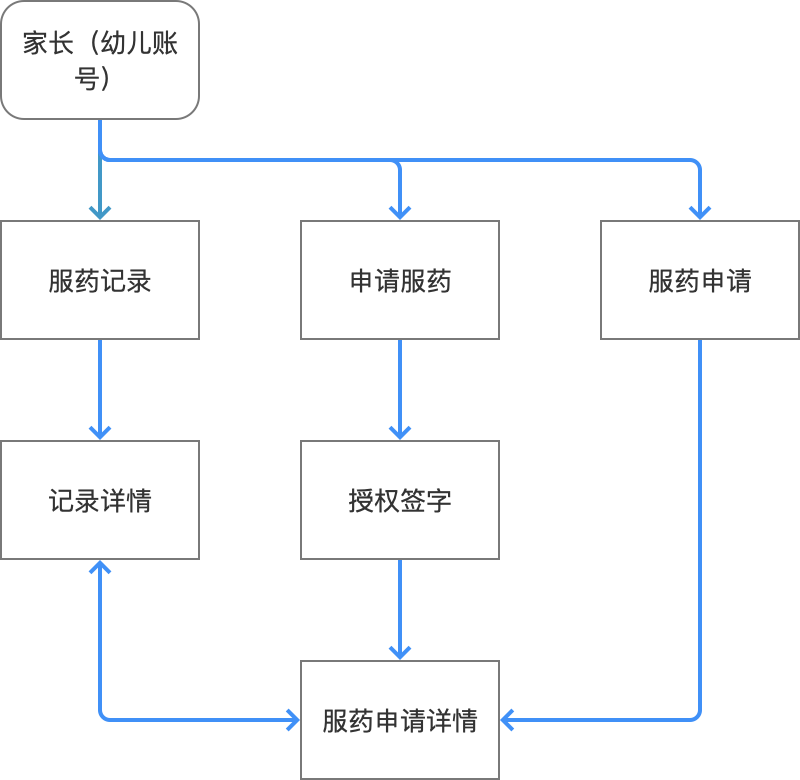

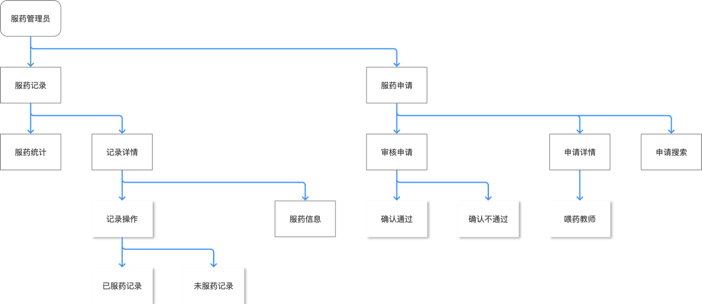

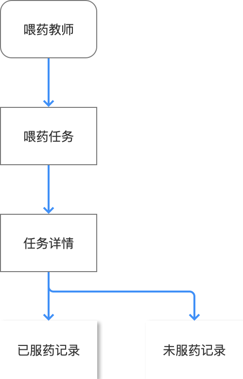

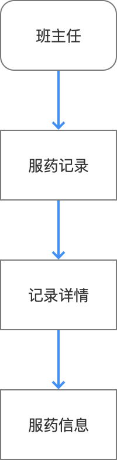

# **数据流程**

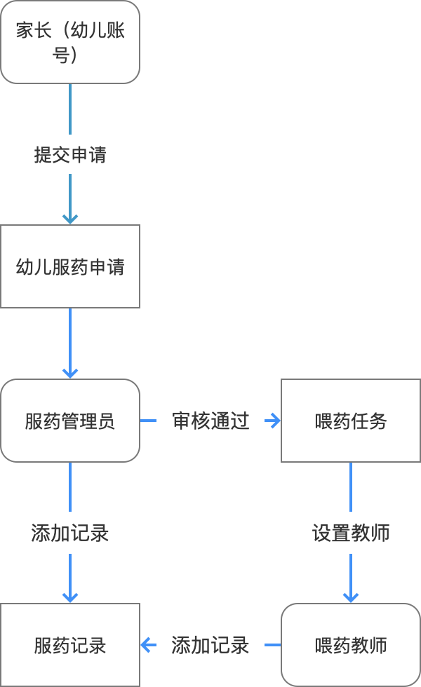

# 功能名称

## 角色权限

|  |  |
| --- | --- |
| **角色** | **权限** |
| 总服药管理员 | 1. 维护全部幼儿的服药记录、服药信息； 2. 审核全部幼儿的服药申请； 3. 设置全部幼儿的服药申请的喂药教师； 4. 维护全部校区的默认喂药教师； 5. 维护申服药申请请示例图、授权书。 6. 导航页访问 |
| 分校区服药管理员 | 1. 维护负责校区下幼儿的服药记录、服药信息； 2. 审核负责校区下幼儿的服药申请； 3. 设置负责校区下幼儿的服药申请的喂药教师； 4. 维护负责校区的默认喂药教师。 5. 导航页访问 |
| 家长（幼儿账号） | 1. 查看本人全部服药记录； 2. 提交本人的服药申请； 3. 查看、撤回本人服药申请记录。 |
| 喂药教师 | 1. 查看当前学期本人为喂药教师的喂药任务； 2. 添加本人为喂药教师的喂药任务的服药记录。 |
| 班主任 | 1. 查看所带班级幼儿当前学期的服药记录。 |

## **名词解释**

|  |  |
| --- | --- |
| **名词** | **解释** |
| 示例图 | 1. 服药申请的一部分，用于提示家长上传图片的要求。 |
| 授权书 | 1. 服药申请的一部分，用于家长授权学校给幼儿喂药； 2. 可与服药记录一同导出。 |
| 喂药教师 | 1. 由服药管理员指派的负责记录服药记录的教职工。 |
| 默认喂药教师 | 1. 为方便服药管理员指派喂药教师，预先设置特定教职工为默认的喂药教师； 2. 每个校区预计有5个左右喂药教师。 |
| 服药申请 | 1. 家长提交的幼儿服药申请； 2. 喂药任务的必要数据来源。 |
| 喂药任务 | 1. 根据审核通过的服药申请，自动生成多条任务； 2. 由喂药教师、服药管理员在任务中添加服药记录。 |
| 服药记录 | 1. 由喂药教师、服药管理员在喂药任务下添加的按时服药/未按时服药/未服药记录。 |
| 应出勤日 | 1. 幼儿应到校的日期，取校历中无【休息】的【教学】日期； 2. 服药日期包含多日期的，仅就其中包含幼儿应到校的日期生成喂药任务。 |

## 服药（企业微信）

### 服药记录-分段页

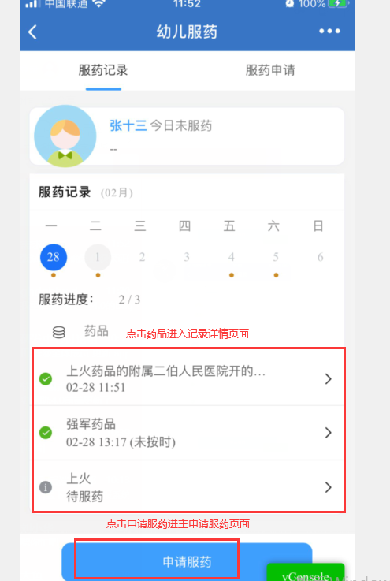

**显示说明：**

1. 显示【服药记录】分段、【服药申请】分段、【今日服药】卡片、【服药记录】卡片、【申请服药】按钮；
2. 【今日服药】卡片显示幼儿【照片】、【幼儿姓名】、已服药【药品名称】；
3. 【服药记录】卡片显示【服药记录】日历、【服药进度】、【药品】列表；
4. 【服药进度】显示选中日期下已服药（包含未按时）喂药任务下药品数量/喂药任务包含药品数量；
5. 【药品】列表显示【喂药任务状态】图标、【药品名称】，已服药【药品】显示【服药时间】，已服药（未按时）【药品】显示“未按时”；
6. 【药品】列表根据关联服药申请时间升序排序；
7. 【药品】列表不分页显示。

**操作说明：**

1. 点击【药品】列表，进入【记录详情】页；

点击【申请服药】按钮，进入【申请服药】页

### 记录详情页面

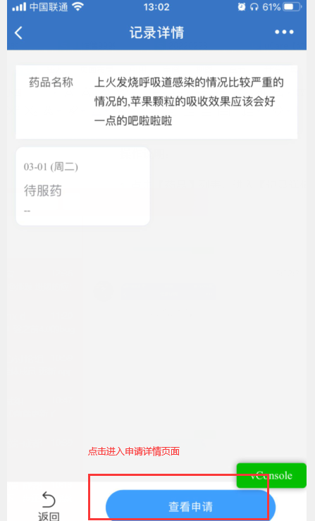

【服药记录】分段页点击【药品】列表跳转到记录详情页面。

**显示说明：**

1. 显示【药品名称】卡片、【服药记录】卡片、【返回】按钮、【查看申请】按钮；
2. 【药品名称】卡片显示【药品】关联喂药任务中全部【药品名称】；
3. 【服药记录】卡片显示【喂药任务日期】、【喂药任务状态】，已服药【服药记录】卡片显示【服药时间】，未服药【服药记录】卡片显示【未服药原因】；
4. 【喂药任务状态】区分颜色显示；
5. 【服药记录】卡片根据【喂药任务日期】升序排序；
6. 【服药记录】卡片不分页显示。

**操作说明：**

1. 点击【查看申请】按钮，进入【申请详情】页。

### **申请服药**

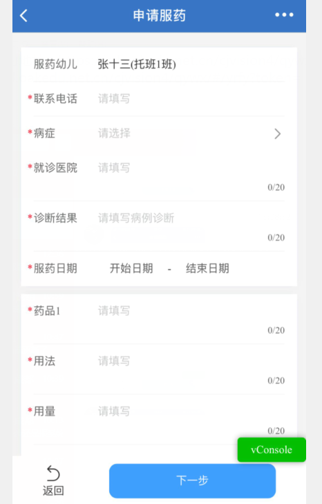

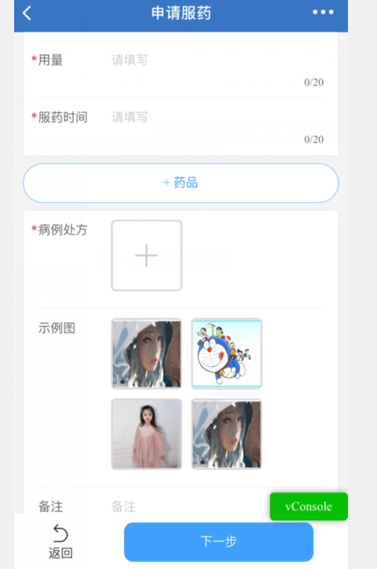

**操作说明：**

1. 点击添加【药品】按钮，在按钮上方插入新的【药品信息】卡片；
2. 点击【删除】按钮，删除该【药品信息】卡片，至少保留1个【药品信息】卡片；
3. 点击【病历处方】图片上传按钮，批量上传图片；
4. 点击【下一步】按钮，进入【授权签字】页。

**数据说明：**

1. 【联系电话】输入框为必填，11位手机号；
2. 【病症】输入框为必选，多选，选项取晨检功能数据；
3. 【就诊医院】输入框为必填，文本输入，最多20字；
4. 【诊断结果】输入框为必填，文本输入，最多20字；
5. 【服药日期】选择器为必选，日期范围，日期范围内至少包含1个应出勤日；
6. 【药品】名称输入框为必填，文本输入，最多20字；
7. 【用法】名称输入框为必填，文本输入，最多20字；
8. 【用量】名称输入框为必填，文本输入，最多20字；
9. 【服用时间】名称输入框为必填，文本输入，最多20字；
10. 【病历处方】图片为必传，图片数量不少于示例图数量；

【备注】输入框为选填，文本输入，最多20字。

### **授权签字**

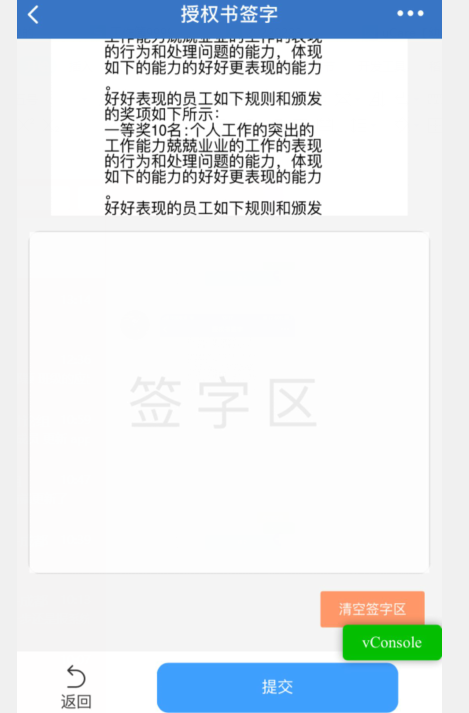

【申请服药】页点击【下一步】按钮显示授权书签字页面。

**显示说明：**

1. 显示【授权书】、【签字区】、【清空签字区】按钮、【提交】按钮；
2. 【签字区】显示提示“签字区”。
3. 点击清空签字区，签写错误的签名可清空重新签写。

**数据说明：**

【授权书】取当前开启状态的授权书。

### **服务申请-分段页**

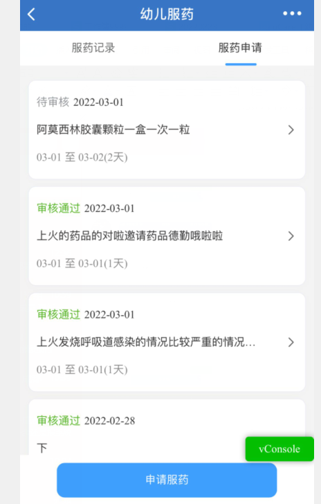

**显示说明：**

1. 显示【服药记录】分段、【服药申请】分段、【服药申请】卡片、【申请服药】按钮；
2. 【服药申请】卡片显示【审核状态】、【申请日期】、【药品名称】、【服药日期】；
3. 【审核状态】区分颜色显示；
4. 【药品名称】显示不全的，显示“--”；
5. 【服药申请】卡片根据申请时间降序排序。

**操作说明：**

1. 点击【服药申请】卡片，进入【记录详情】页；
2. 点击【申请服药】按钮，进入【申请服药】页。

### **申请详情页面**

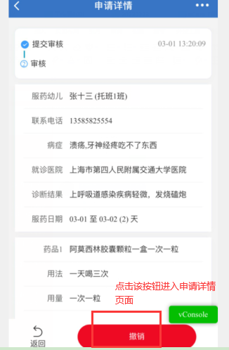

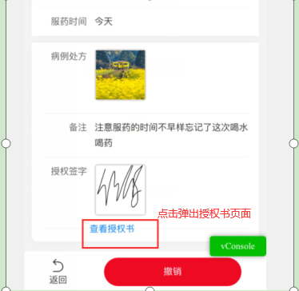

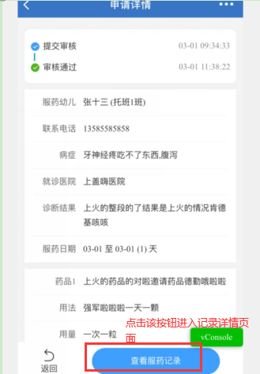

**操作说明：**

1. 点击【查看授权书】按钮，弹窗显示授权书；
2. 点击【撤回】按钮，提示确认后进入【申请服药】页；
3. 点击【重新申请】按钮，进入【申请服药】页；

点击【查看服药记录】按钮，进入关联【记录详情】页。

## 服药记录-服药管理员（企业微信）

### 服药记录页面

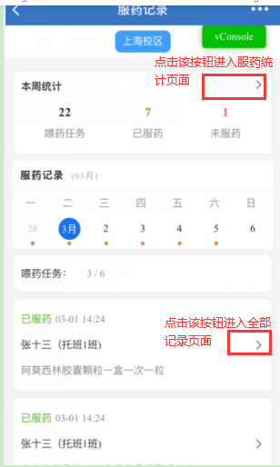

**操作说明：**

1. 点击【本周统计】卡片，进入【服药统计】页；
2. 点击【喂药任务】卡片，进入【全部记录】分段页。

**数据说明：**

总服药管理员可维护当前学期全部校区的幼儿服药记录，分校区服药管理员可维护当前学期负责校区的幼儿服药记录。

### **【全部记录】分段页**

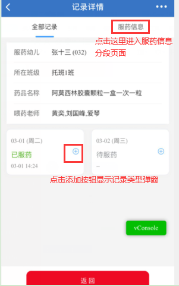

【记录详情】页点击【全部记录】分段；

【服药记录】页点击【喂药任务】卡片。

**操作说明：**

1. 点击【服药信息】分段进入【服药信息】分段页；
2. 点击【添加记录】按钮，显示【记录类型】弹窗。

### **【记录类型】弹窗**

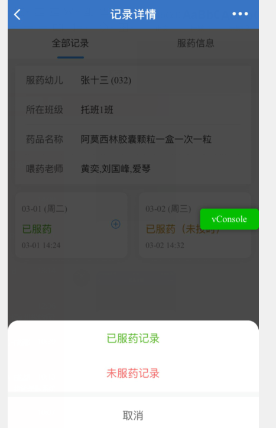

【全部记录】分段页点击【添加记录】按钮

**操作说明：**

1. 点击【已服药记录】选项，显示【已服药记录】弹窗；
2. 点击【未服药记录】选项，显示【未服药记录】弹窗。

### **【已服药记录】弹窗**

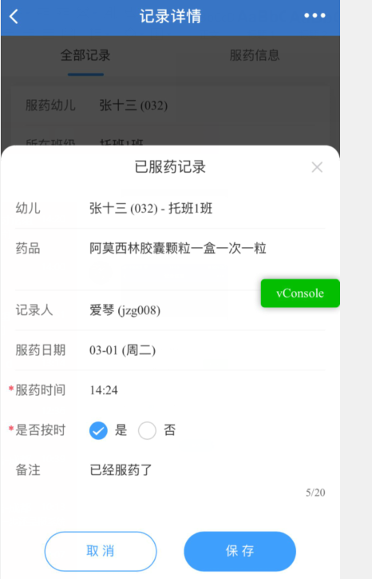

【记录类型】弹窗点击【已服药记录】选项。

**操作说明：**

1. 点击【保存】按钮，保存已服药记录，关联喂药任务该天已存在服药记录的，更新为最新服药记录。

### **【未服药记录】弹窗**

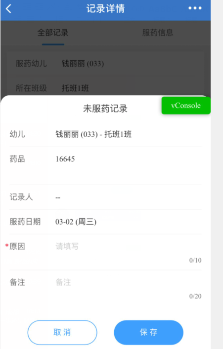

【记录类型】弹窗点击【未服药记录】选项。

**操作说明：**

1. 点击【保存】按钮，保存未服药记录，关联喂药任务该天已存在服药记录的，更新为最新服药记录。

### **【服药信息】分段页**

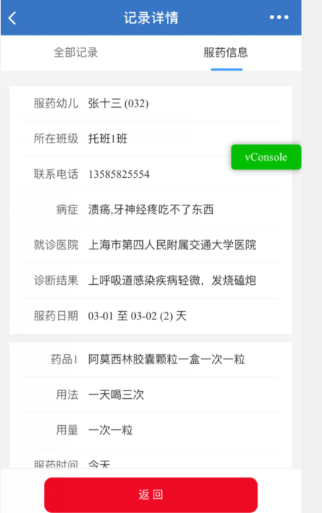

【记录详情】页点击【服药信息】分段。

**显示说明：**

1. 显示【全部记录】分段、【服药信息】分段、【服药幼儿】姓名、【服药幼儿】学号、【所在班级】名称、【联系电话】、【病症】、【就诊医院】、【诊断结果】、【服药日期】、【药品信息】卡片、【病历处方】图片、【备注】；
2. 【药品信息】卡片显示【药品】序号、【药品】名称、【用法】、【用量】、【服用时间】。

**操作说明：**

点击【全部记录】分段进入【全部记录】分段页。

## **服药申请（企业微信）**

### 服药申请

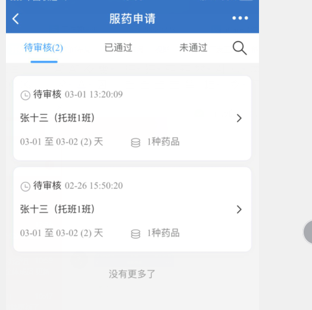

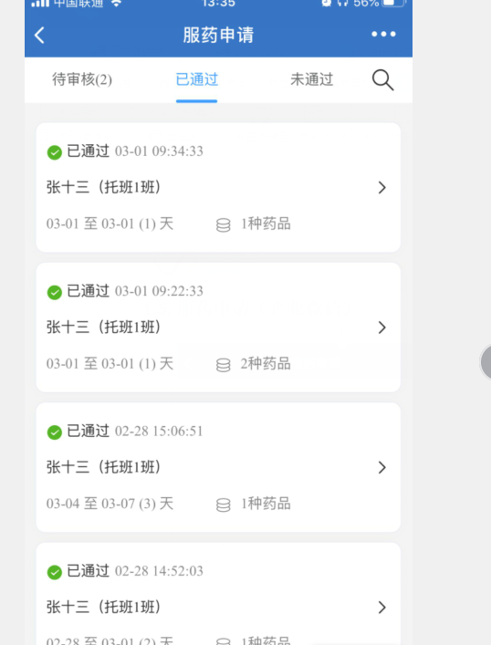

**操作说明：**

1. 点击【待审核】分段，进入【待审核】分段页，筛选显示当前学期待审核【服药申请】卡片；
2. 点击【已通过】分段，进入【已通过】分段页，筛选显示当前学期已通过【服药申请】卡片；
3. 点击【未通过】分段，进入【未通过】分段页，筛选显示当前学期未通过【服药申请】卡片；
4. 点击【申请搜索】按钮，进入【申请搜索】页；
5. 点击待审核【服药申请】卡片，进入【审核申请】页；
6. 点击已通过、未通过【服药申请】卡片，进入【申请详情】页。

**数据说明：**

总服药管理员可维护当前学期全部校区的幼儿服药申请，分校区服药管理员可维护当前学期负责校区的幼儿服药申请。

### 审核申请页面

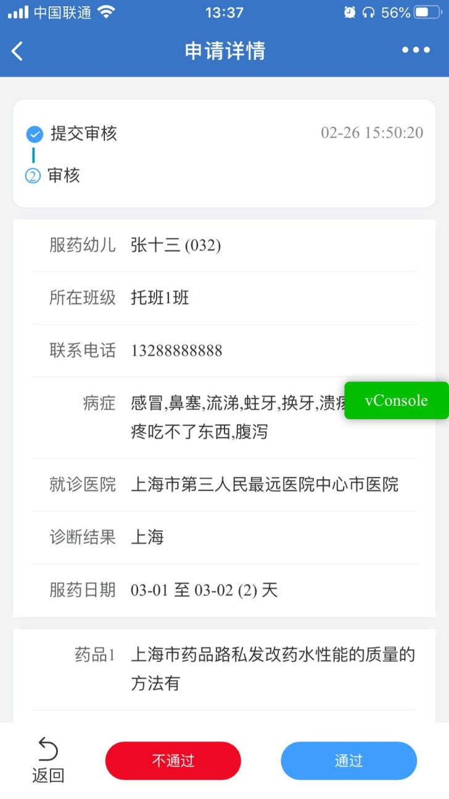

**操作说明：**

1. 点击【查看授权书】按钮，弹窗显示授权书；
2. 点击【不通过】按钮，显示【确认不通过】弹窗；
3. 点击【审核通过】按钮，显示【确认通过】弹窗。

### 确认不通过弹框

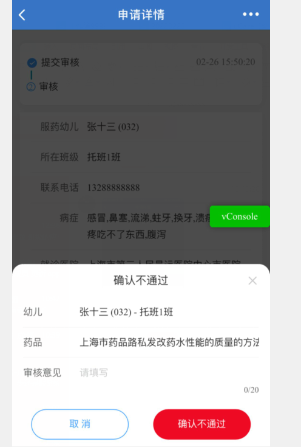

**显示说明：**

1. 显示【服药幼儿】姓名、【服药幼儿】学号、服药幼儿【所在班级】名称、【药品名称】、【审核意见】输入框、【取消】按钮、【确认不通过】按钮。

**操作说明：**

点击【确认不通过】按钮，服药申请状态变更为未通过。

### 确认通过弹框

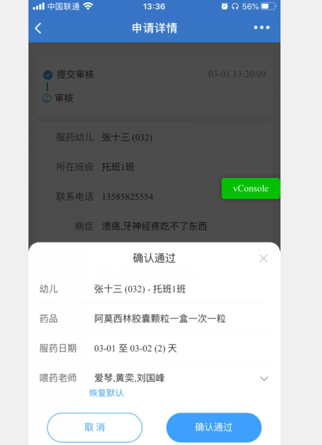

**显示说明：**

1. 显示【服药幼儿】姓名、【服药幼儿】学号、服药幼儿【所在班级】名称、【药品名称】、【服药日期】、【喂药教师】选择器、【取消】按钮、【确认通过】按钮。

**操作说明：**

1. 点击【确认通过】按钮，服药申请状态变更为已通过。

### 申请详情页

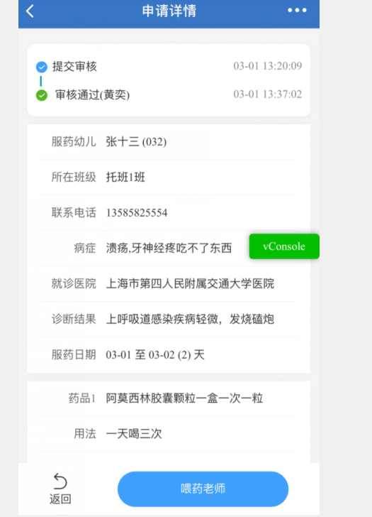

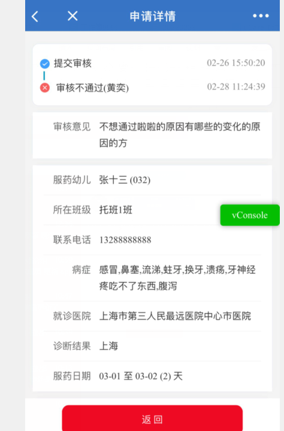

服药申请】页点击已通过、未通过【服药申请】卡片。

**操作说明：**

1. 点击【查看授权书】按钮，弹窗显示授权书；
2. 点击设置【喂药教师】按钮，显示设置【喂药教师】弹窗。

### 设置【喂药教师】弹窗

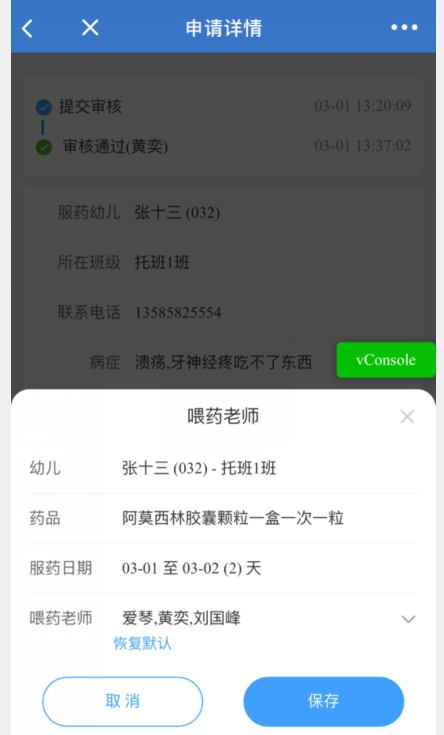

【申请详情】页点击设置【喂药教师】按钮。

**显示说明：**

1. 显示【服药幼儿】姓名、【服药幼儿】学号、服药幼儿【所在班级】名称、【药品名称】、【服药日期】、【喂药教师】选择器、【取消】按钮、【保存】按钮。

**操作说明：**

1. 点击【保存】按钮，保存服药教师设置。
2. 点击喂药老师，进入选择喂药教师页面，可手动选择喂药教师，点击确定后保存选中的老师。

### 1.5.7【申请搜索】页

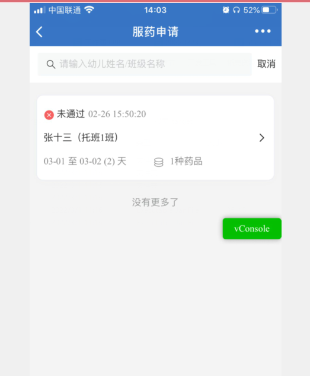

【服药申请】页点击【申请搜索】按钮

**操作说明：**

1. 点击待审核【搜索结果】卡片，进入【审核申请】页；

点击已通过、未通过【搜索结果】卡片，进入【申请详情】页。

## 喂药任务（企业微信）

### 喂药任务页

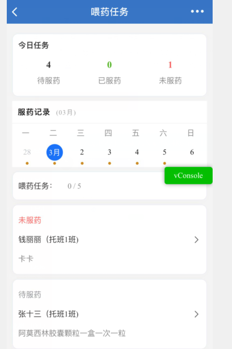

**显示说明：**

1. 显示【今日任务】卡片、【服药记录】卡片、【喂药任务】卡片；
2. 【今日任务】卡片显示今日【待服药】喂药任务数量、今日【已服药】喂药任务数量、今日【未服药】喂药任务数量，区分颜色显示；
3. 【服药记录】卡片显示【服药记录】日历、【喂药任务】进度；
4. 【喂药任务】进度显示该天已服药喂药任务数量/喂药任务数量；
5. 【喂药任务】卡片显示【喂药任务状态】、【服药幼儿】姓名、【所在班级】名称、【药品名称】，已服药喂药任务显示【服药时间】；
6. 【喂药任务】卡片根据关联服药申请时间升序排序；
7. 【喂药任务】卡片不分页显示。

**操作说明：**

1. 点击待服药【喂药任务】卡片，进入待服药【任务详情】页；

点击已服药、未服药【喂药任务】卡片，进入【任务详情】页；

### 待服药【任务详情】页

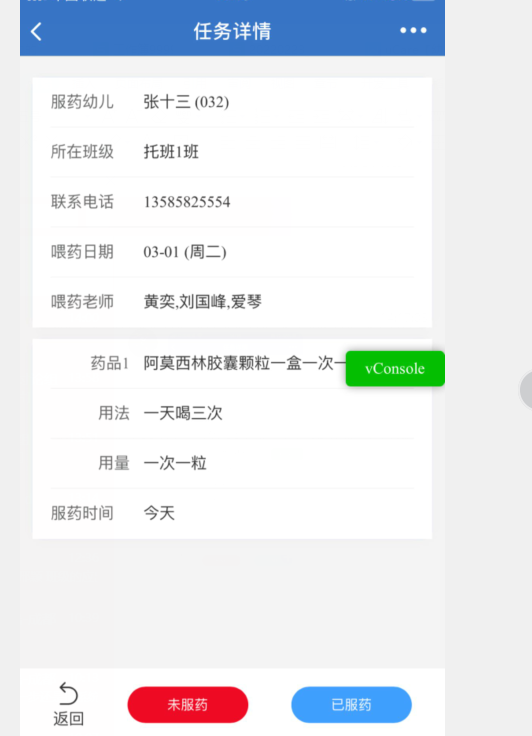

【喂药任务】页点击待服药【喂药任务】卡片。

**显示说明：**

1. 显示【服药幼儿】姓名、【服药幼儿】学号、服药幼儿【所在班级】名称、【联系电话】、【喂药任务日期】、【药品信息】卡片、添加【未服药】记录按钮、添加【已服药】记录按钮；
2. 【药品信息】卡片显示【药品】序号、【药品】名称、【用法】、【用量】、【服用时间】。

**操作说明：**

1. 点击添加【未服药】记录按钮，显示添加【未服药记录】弹窗；
2. 点击添加【已服药】记录按钮，显示添加【已服药记录】弹窗。

### 任务详情页

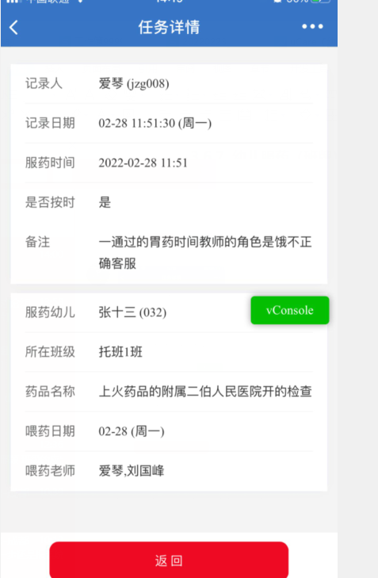

**显示说明：**

1. 显示【记录人】姓名、【记录人】职工号、【记录日期】、【备注】、【服药幼儿】姓名、【服药幼儿】学号、【所在班级】名称、【药物名称】、【喂药教师】姓名，已服药任务显示【服药时间】、【是否按时】，未服药任务显示【未服药原因】 ；
2. 【药品信息】卡片显示【药品】序号、【药品】名称、【用法】、【用量】、【服用时间】。

### 添加【已服药记录】弹窗

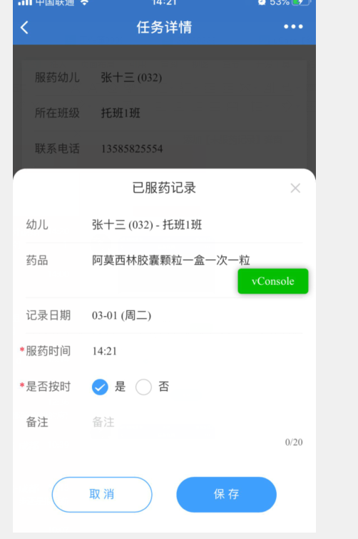

**显示说明：**

1. 显示【服药幼儿】姓名、【服药幼儿】学号、【所在班级】名称、【药品名称】、【记录日期】、【服药时间】选择器、【是否按时】选择器、【备注】输入框、【取消】按钮、【保存】按钮。

**操作说明：**

1. 点击【保存】按钮，保存已服药记录。

### 添加【未服药记录】弹窗

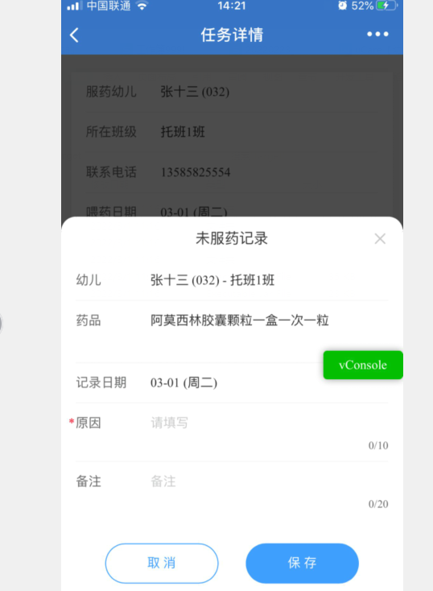

**显示说明：**

1. 显示【服药幼儿】姓名、【所在班级】名称、【服药幼儿】学号、【药品名称】、【记录日期】、未服药【原因】输入框、【备注】输入框、【取消】按钮、【保存】按钮。

**操作说明：**

点击【保存】按钮，保存未服药记录。

## 服药记录-班主任（企业微信）

### 服药记录页

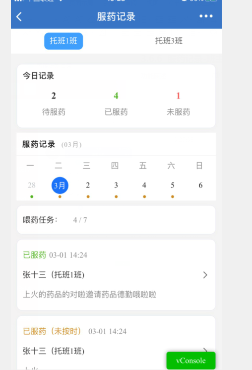

**显示说明：**

1. 显示【班级】单选框、【今日记录】卡片、【服药记录】卡片、【喂药任务】卡片；
2. 【今日记录】卡片显示今日【待服药】喂药任务数量、今日【已服药】喂药任务数量、今日【未服药】喂药任务数量，区分颜色显示；
3. 【服药记录】卡片显示【服药记录】日历、【喂药任务】进度；
4. 【喂药任务】进度显示该天已服药喂药任务数量/喂药任务数量；
5. 【喂药任务】卡片显示【喂药任务状态】、【服药幼儿】姓名、【所在班级】名称、【药品名称】，已服药喂药任务显示【服药时间】；
6. 【喂药任务】卡片根据关联服药申请时间升序排序；
7. 【喂药任务】卡片不分页显示。

**操作说明：**

1. 点击【喂药任务】卡片，进入【全部记录】分段页。

**数据说明：**

【班级】单选框选择范围为用户所带班级。

### **【全部记录】分段页**

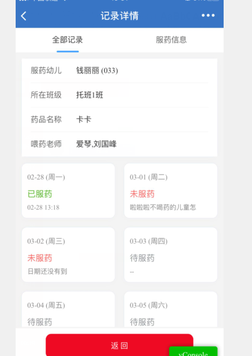

**显示说明：**

1. 显示【全部记录】分段、【服药信息】分段、【服药幼儿】姓名、【服药幼儿】学号、【所在班级】名称、【药品名称】、【喂药教师】姓名、【服药记录】卡片；
2. 【服药记录】卡片显示【喂药任务日期】、【喂药任务状态】，已服药【服药记录】卡片显示【服药时间】，未服药【服药记录】卡片显示【未服药原因】；
3. 【喂药任务状态】区分颜色显示；
4. 【服药记录】卡片根据【喂药任务日期】升序排序；
5. 【服药记录】卡片不分页显示。

**操作说明：**

1. 点击【服药信息】分段进入【服药信息】分段页。

### **【服药信息】分段页**

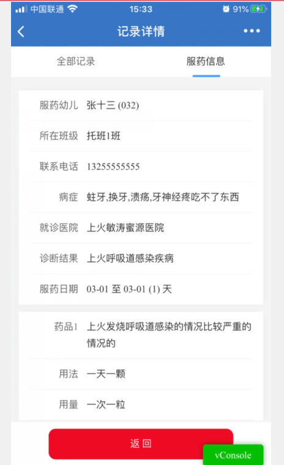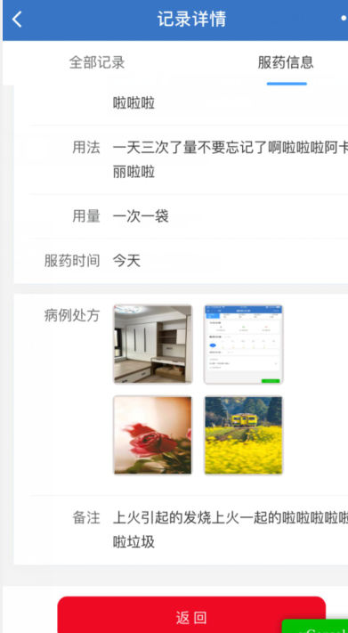

【记录详情】页点击【服药信息】分段

**显示说明：**

1. 显示【全部记录】分段、【服药信息】分段、【服药幼儿】姓名、【服药幼儿】学号、【所在班级】名称、【联系电话】、【病症】、【就诊医院】、【诊断结果】、【服药日期】、【药品信息】卡片、【病历处方】图片、【备注】；
2. 【药品信息】卡片显示【药品】序号、【药品】名称、【用法】、【用量】、【服用时间】。

**操作说明：**

1. 点击【全部记录】分段进入【全部记录】分段页。
2. 点击返回，返回到服药记录页面。

## 服药管理PC

### 服药记录标签页

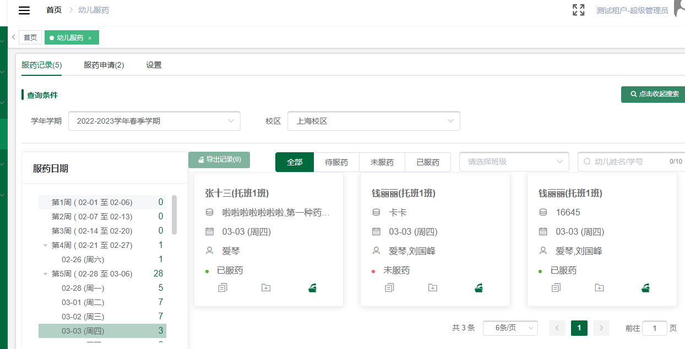

**操作说明：**

1. 点击【服药申请】标签，进入【服药申请】标签页；
2. 点击【设置】标签，进入【设置】标签页；
3. 点击【教学周】、【应出勤日】选项，选中服药日期范围，自动筛选数据；
4. 点击【导出记录】按钮，导出选中服药日期范围内喂药任务下服药记录文件；
5. 点击【喂药任务状态】单选框，选中审核状态，自动筛选数据；
6. 点击【班级】选择器，选中班级，自动筛选数据；
7. 点击【添加已服药记录】按钮，显示添加【已服药记录】对话框；
8. 点击【添加未服药记录】按钮，显示添加【未服药记录】对话框；
9. 点击【全部服药记录】按钮，显示【全部服药记录】对话框；
10. 点击【服药信息】按钮，显示【服药信息】对话框；
11. 点击【导出】按钮，导出该喂药任务下服药记录文件。

**数据说明：**

1. 总服药管理员可维护全部校区的幼儿服药记录，分校区服药管理员可维护负责校区的幼儿服药记录；

【班级】选择器可选全部班级、选中服药日期范围内喂药任务中【服药幼儿】所在【班级】。

### 添加【已服药记录】对话框

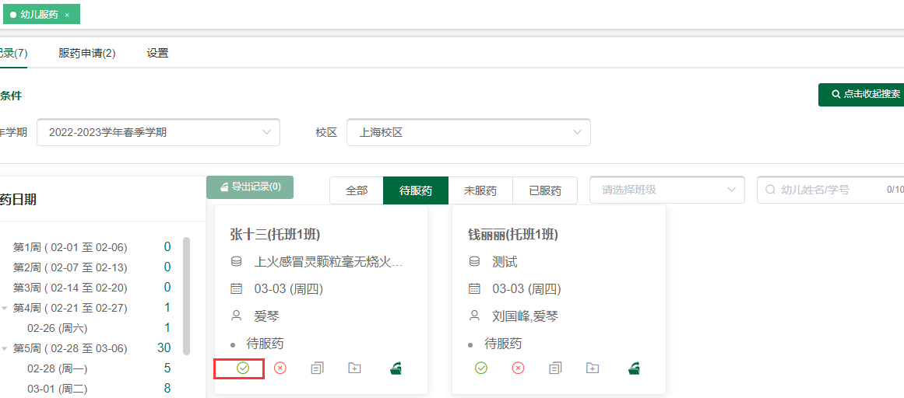

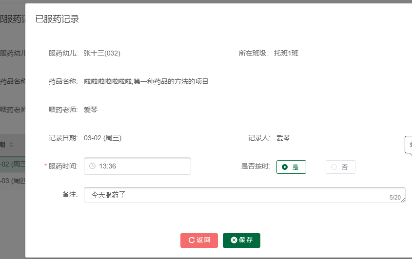

【服药记录】标签页点击【添加已服药记录】按钮“”进入已服药记录页面；

**操作说明：**

1. 点击【保存】按钮，保存已服药记录，关联喂药任务该天已存在服药记录的，更新为最新服药记录。

### 添加【未服药记录】对话框

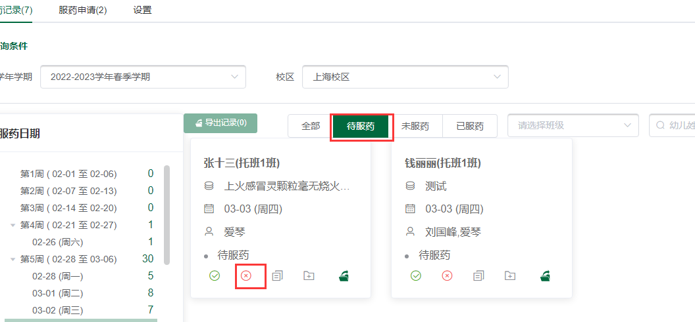

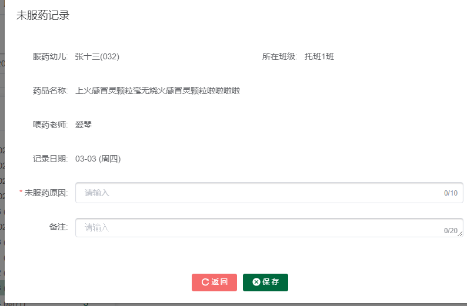

【服药记录】标签页点击【添加未服药记录】按钮“”进入未服药记录页面。

**操作说明：**

1. 点击【保存】按钮，保存未服药记录，关联喂药任务该天已存在服药记录的，更新为最新服药记录。

### 全部服药记录对话框

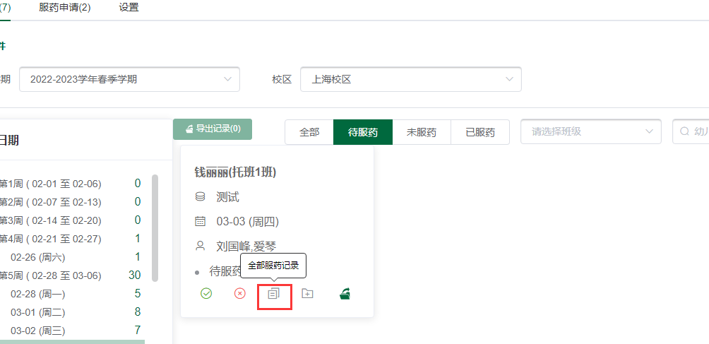

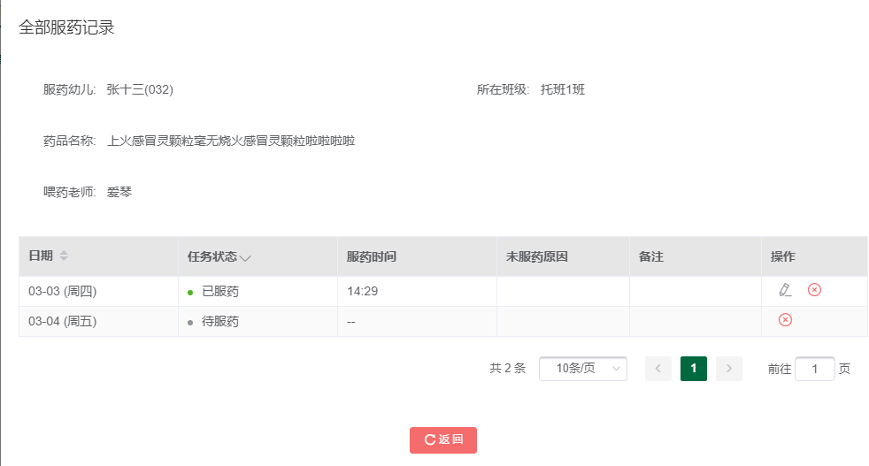

【服药记录】标签页点击【全部服药记录】按钮进入：全部服药记录页面。

**操作说明：**

1. 点击【编辑已服药记录】按钮，显示编辑【已服药记录】对话框；
2. 点击【添加已服药记录】按钮，显示添加【已服药记录】对话框；
3. 点击【编辑未服药记录】按钮，显示编辑【未服药记录】对话框；
4. 点击【添加未服药记录】按钮，显示添加【未服药记录】对话框；
5. 点击喂药任务【日期排序】按钮，切换喂药任务【日期】升序/降序排序显示服药记录；
6. 点击【喂药任务状态】按钮，筛选【喂药任务状态】显示服药记录。

### 编辑已服药记录对话框

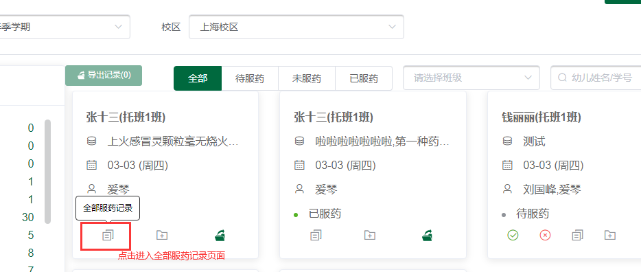

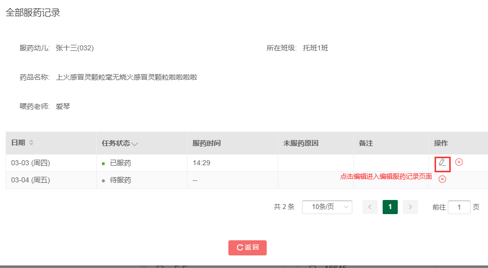

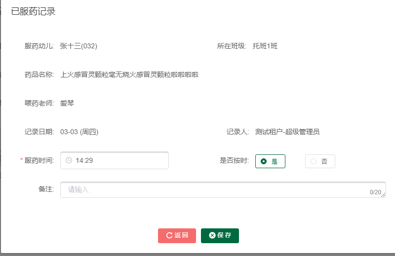

【全部服药记录】对话框点击【编辑已服药记录】按钮，进入编辑已服药记录页面。

**操作说明：**

点击【保存】按钮，保存已服药记录，关联喂药任务该天已存在服药记录的，更新为最新服药记录。

### 编辑未服药记录对话框

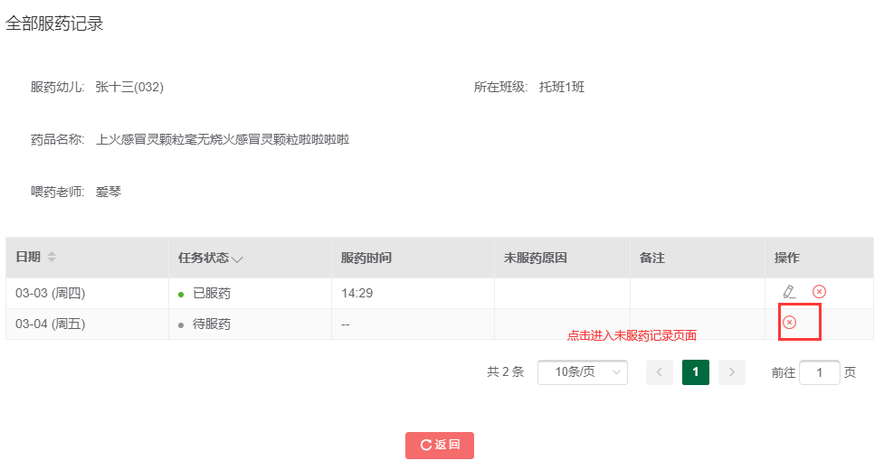

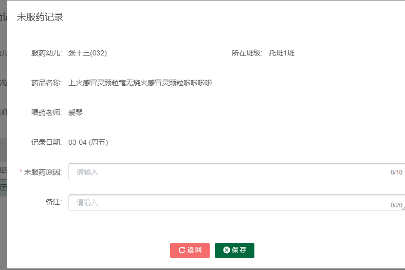

【全部服药记录】对话框点击【编辑未服药记录】按钮，进入编辑未服药记录页面。

**操作说明：**

点击【保存】按钮，保存未服药记录，关联喂药任务该天已存在服药记录的，更新为最新服药记录。

### 【服药信息】对话框

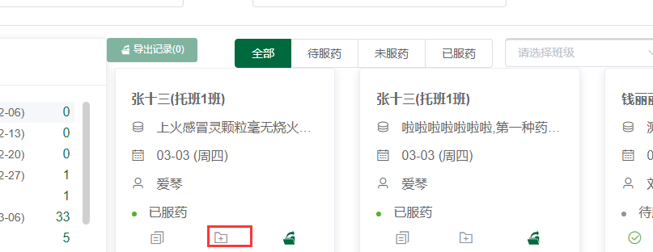

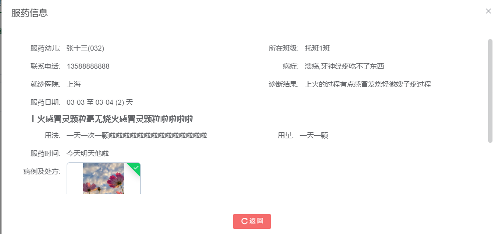

【服药记录】标签页点击【服药信息】按钮，进入服药信息页面。

**显示说明：**

1. 显示【服药幼儿】姓名、【服药幼儿】学号、服药幼儿【所在班级】名称、【联系电话】、【病症】、【就诊医院】、【诊断结果】、【服药日期】、【药品信息】卡片、【病历及处方】图片、【备注】、【返回】按钮。

### 【服药申请】标签页

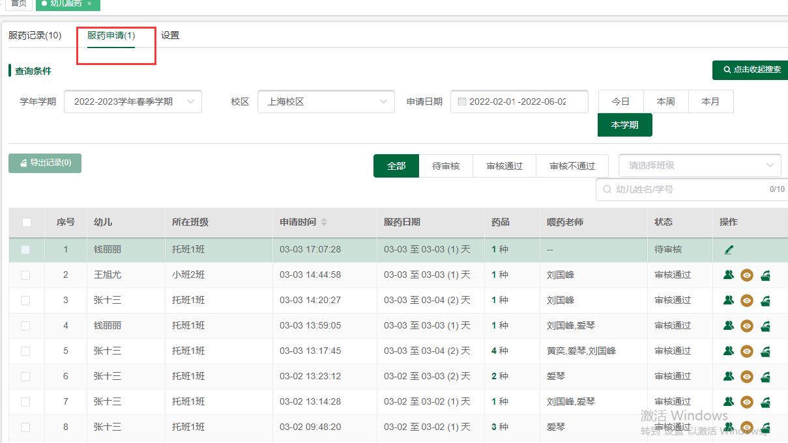

【服药管理】页点击【服药申请】标签。

**操作说明：**

1. 点击【服药申请】标签，进入【服药申请】标签页；
2. 点击【设置】标签，进入【设置】标签页；
3. 点击【导出记录】按钮，导出选中【服药申请】关联服药记录文件；
4. 点击【审核状态】单选框，选中审核状态，自动筛选数据；
5. 点击【班级】选择器，选中班级，自动筛选数据；
6. 点击已通过【服药申请】复选框，选中【服药申请】，待审核、未通过【服药申请】不能选中；
7. 点击【申请时间排序】按钮，切换【申请时间】升序/降序排序显示服药申请；
8. 点击【审核申请】按钮，显示审核【服药申请】对话框；
9. 点击【喂药教师】按钮，显示设置【喂药教师】对话框；
10. 点击【查看详情】按钮，显示【服药申请】详情对话框；
11. 点击【导出】按钮，导出该【服药申请】关联服药记录文件。

**数据说明：**

总服药管理员可维护全部校区的幼儿服药申请，分校区服药管理员可维护负责校区的幼儿服药申请；

【班级】选择器可选全部班级、选中申请日期范围内有【服药申请】的【服药幼儿】所在【班级】。

### 审核【服药申请】对话框

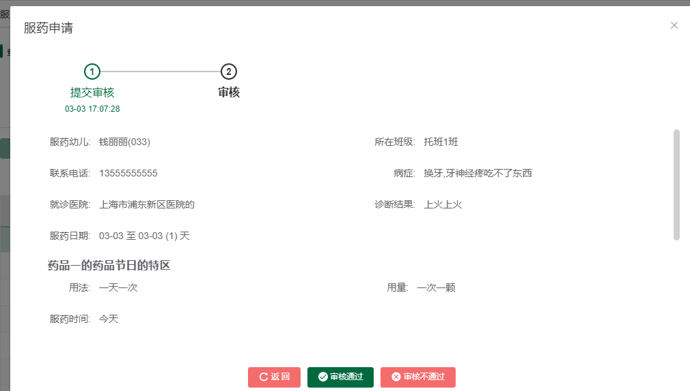

【服药申请】标签页点击【审核申请】按钮进入服药申请页面。

**操作说明：**

1. 点击【不通过】按钮，显示【确认不通过】对话框；
2. 点击【审核通过】按钮，显示【确认通过】对话框。

### 【确认不通过】对话框

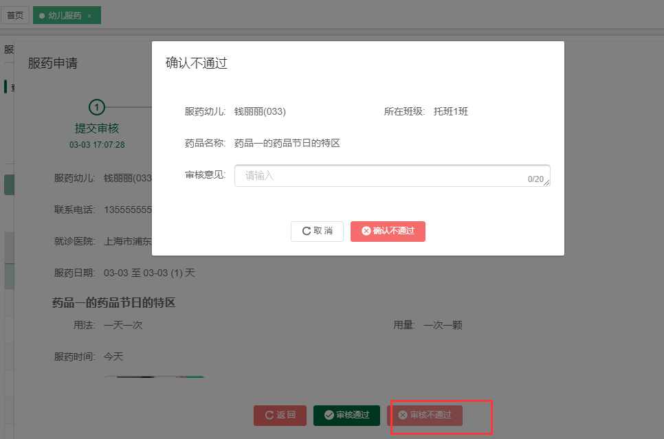

审核【服药申请】对话框点击【不通过】按钮，显示确认不通过页面。

**操作说明：**

1. 点击【确认不通过】按钮，服药申请状态变更为未通过。

### 【确认通过】对话框

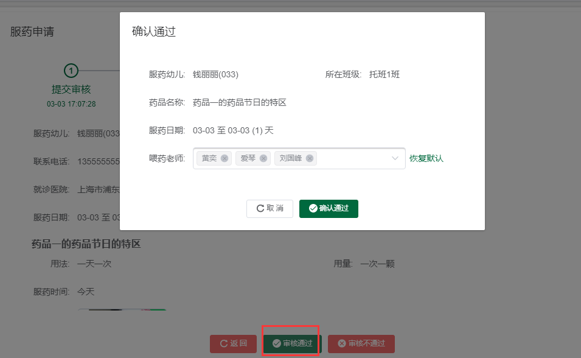

审核【服药申请】对话框点击【审核通过】按钮，显示确认通过页面。

**操作说明：**

1. 点击【恢复默认】按钮，【喂药教师】选择器默认选中【服药幼儿】所在校区的（开启）默认喂药教师；
2. 点击【确认通过】按钮，服药申请状态变更为已通过。

### 【服药申请】详情对话框

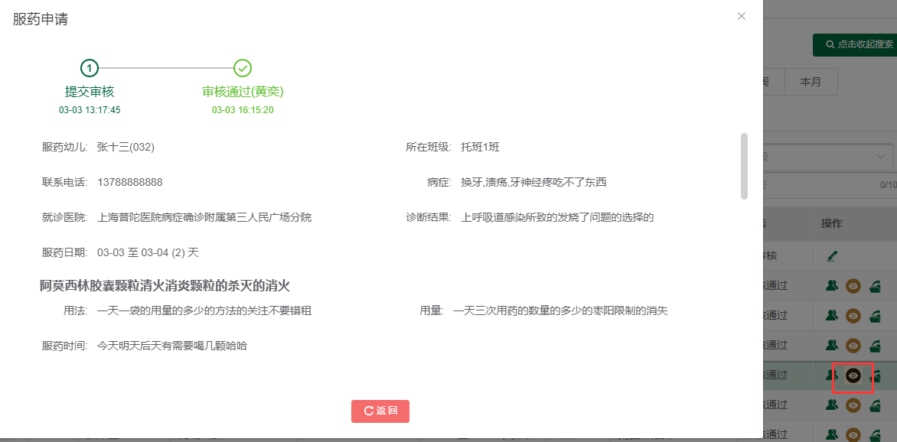

**显示说明：**

1. 显示【审核进度】步骤条、【服药幼儿】姓名、【服药幼儿】学号、服药幼儿【所在班级】名称、【联系电话】、【病症】、【就诊医院】、【诊断结果】、【服药日期】、【药品信息】卡片、【病历及处方】图片、【备注】、【返回】按钮，未通过服药申请显示【审核意见】；
2. 【药品信息】卡片显示【药品名称】、【用法】、【用量】、【服用时间】。

### 设置【喂药教师】对话框

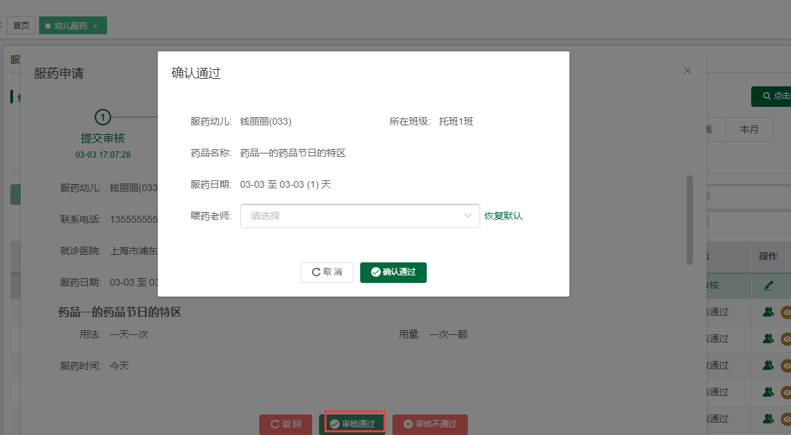

【服药申请】标签页点击【喂药教师】按钮。

**操作说明：**

1. 点击【恢复默认】按钮，【喂药教师】选择器默认选中【服药幼儿】所在校区的（开启）默认喂药教师；

点击【保存】按钮，更新【喂药教师】。

### 设置-示例图设置

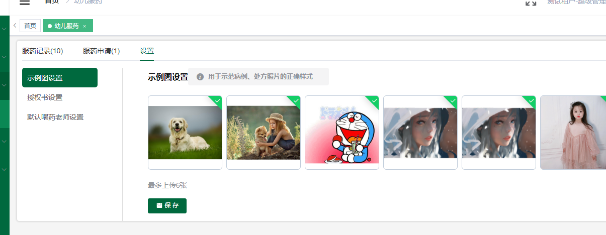

**操作说明：**

1.点击选中【示例图设置】选项卡、【授权书设置】选项卡、【默认喂药教师设置】选项卡；

2.点击【示例图】上传按钮，批量上传图片；最多6张。

3.点击【保存】按钮，保存示例图设置；

### 设置-授权书设置

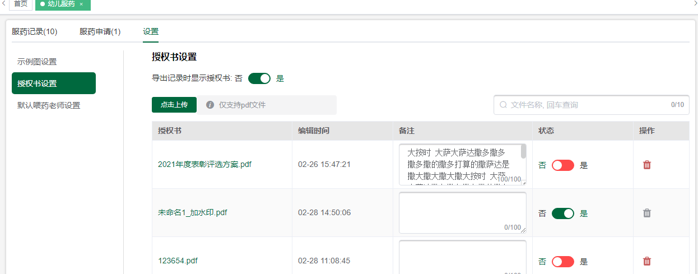

**操作说明：**

1.点击文件【上传】按钮，上传单个文件；

2.点击输入【授权书】搜索框，回车模糊搜索【授权书】文件名；

3.表内点击【备注】输入框，编辑授权书【备注】；

4.点击授权书开启【状态】开关，切换授权书开启状态；

5.点击授权书【删除】按钮，提示确认后删除授权书；

**数据说明：**授权书同时只能开启一个；授权书文件上传格式支持pdf格式。

### 设置-喂药老师设置

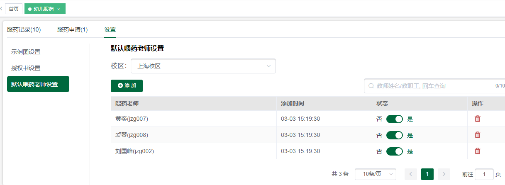

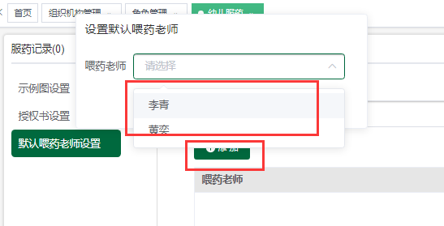

**操作说明：**

1.点击【添加】按钮，添加选中【校区】下保健老师；

2.点击输入【喂药教师】搜索框，回车模糊搜索教师姓名、职工号；

3.点击喂药教师开启【状态】开关，切换喂药教师开启状态；

4.点击喂药教师【删除】按钮，提示确认后删除喂药教师。

**数据说明：**添加喂药教师时：选择的校区中要有保健老师角色的教职工，喂药老师下拉框才会显示该喂药老师。

## 导航页

1. 服药总管理员可查看全部校区的数据，默认选中第一个校区（服药分园管理员可查看负责校区）

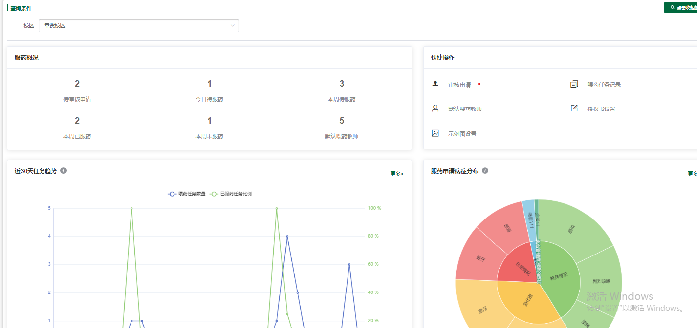

### 服药概况

1. 点击卡片跳转到对应的操作界面
2. 显示每个状态的任务数量
3. 数据根据校区的选择切换

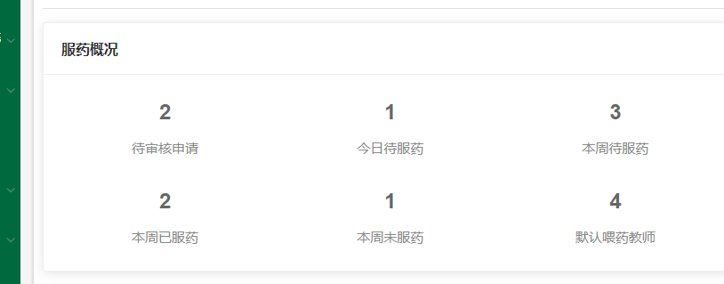

### 快捷操作

1. 有待审核数据【审核申请】有红点标识
2. 点击相关按钮跳转对应界面
3. 【示例图设置】【授权书设置】服药总管理员进入的显示操作按钮

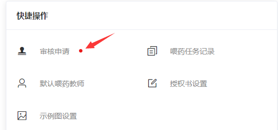

### 近30天任务趋势

1、点击更多进入服药管理-服药记录，并选中校区

2、提示“统计本学期应出勤的日期”

3、当前学期近30天（筛选应出勤日期，不包含当天）的喂药任务数量、已服药任务占比

4已服药任务占比=该天已服药任务数量/全部喂药任务数量\*100%

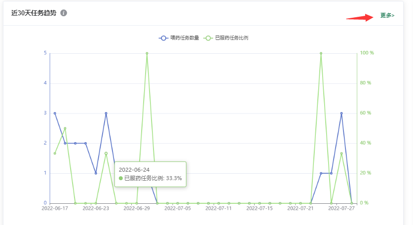

### 服药申请症状分布

1. 点击更多进入服药管理-服药申请，并选中校区
2. 当前学期截止今天的已通过申请中一级症状-二级症状分布
3. 提示“统计本学期已通过的服药申请”

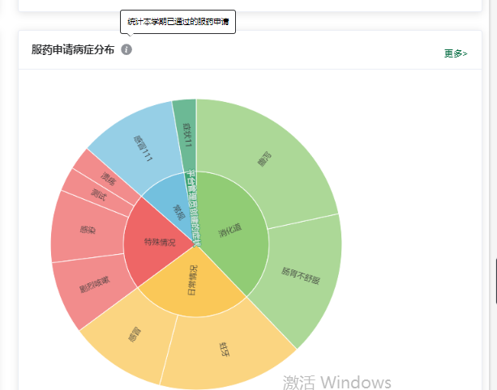

## 区级管理

### 全区监控

1. 登录的租户选择校区后则展示当天所有喂药任务总数、服药、按时服药 率，点击更多进入服药数据页面
2. 今日服药病症分部显示病症名称及服药数量，点击更多进入服药数据页 面
3. 三十天喂药任务，统计待服药、按时服药、未按时服药、未服药、按时 服药率，点击更多进入服药数据页面
4. 三十天病症统计，只统计病症目前只有一个病症（其他病症），及显示 TOP5病症统计数量，点击更多进入服药数据页面

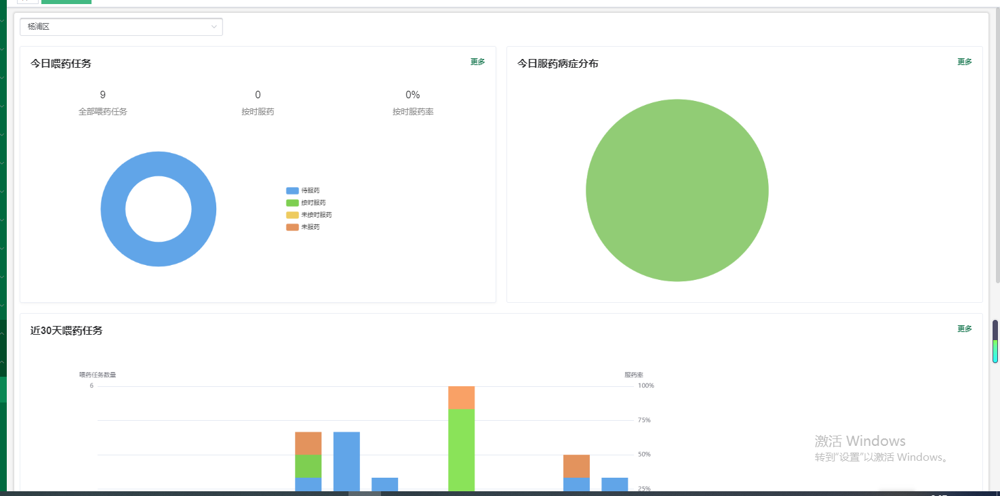

### 服药数据

1. 进入当前页面默认选中列表中第一个校区，且显示今日数据
2. 进行学期、校区、日期切换
3. 查看详情展示这个校区班级中的所有服药情况

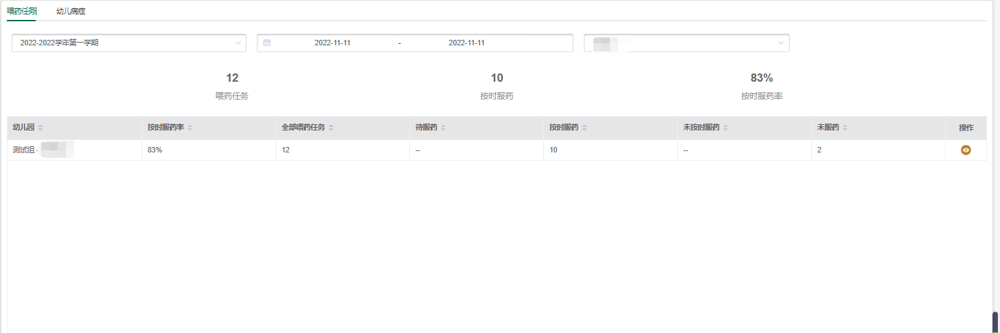

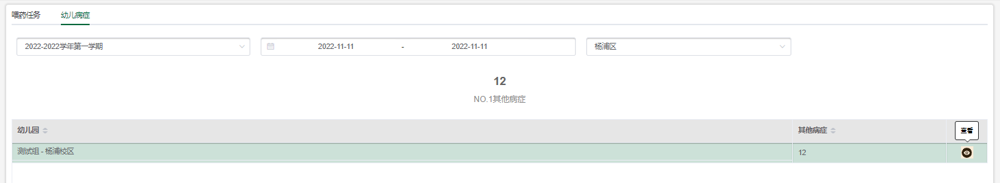

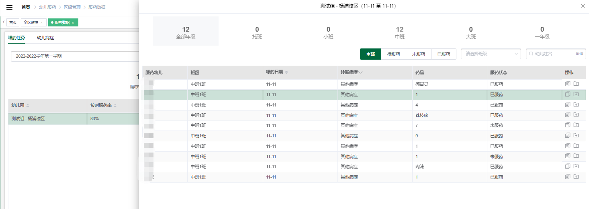