# 业务流程图

## **流程图**

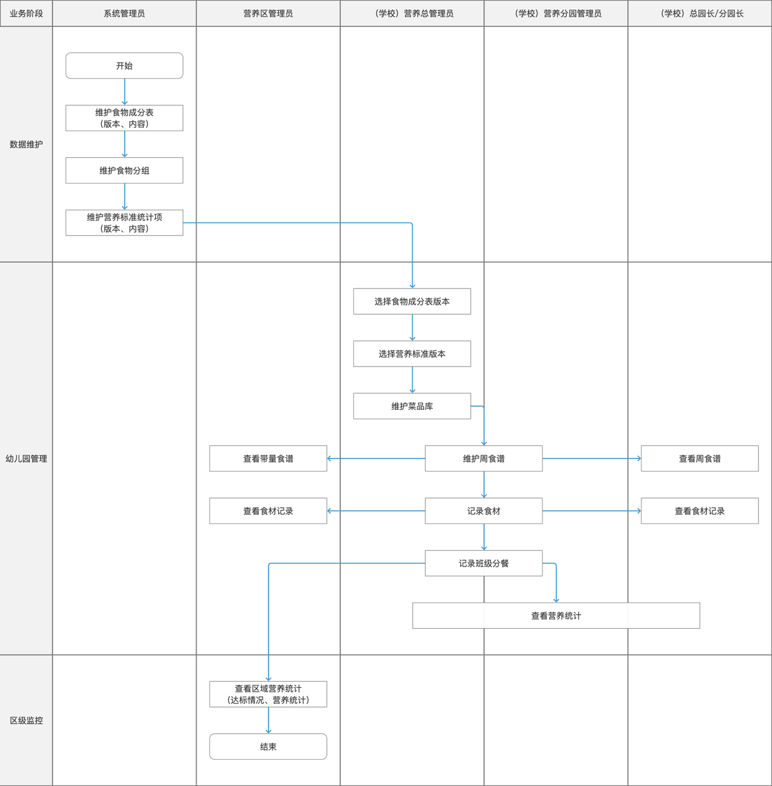

# 功能名称

## 角色权限

|  |  |  |
| --- | --- | --- |
| **角色** | **菜单或应用** | **数据权限说明** |
| 系统管理员 | 幼儿营养管理系统后台【食物成分表维护】 | 维护、查看 |
| 系统管理员 | 幼儿营养管理系统后台【食物分组】 | 维护、查看 |
| 系统管理员 | 幼儿营养管理系统后台【营养标准维护】 | 维护、查看 |
| 营养区管理员 | 幼儿营养区级管理  【全区监控】 | 查看 |
| 营养区管理员 | 幼儿营养区级管理  【食物成分表】 | 查看 |
| 营养区管理员 | 幼儿营养区级管理  【食物分组】 | 查看 |
| 营养区管理员 | 幼儿营养区级管理  【幼儿营养标准】 | 查看、维护 |
| 营养区管理员 | 幼儿营养区级管理  【带量食谱】 | 查看 |
| 营养区管理员 | 幼儿营养区级管理  【食材记录】 | 查看 |
| 营养区管理员 | 幼儿营养区级管理  【营养统计】 | 查看、导出 |
| 营养区管理员 | 幼儿营养区级管理  【幼儿食谱】 | 查看 |
| 营养总管理员 | 幼儿营养管理  【引导页】 | 查看 |
| 营养总管理员 | 幼儿营养管理  【食物成分表】 | 查看、维护 |
| 营养总管理员 | 幼儿营养管理  【食物分组】 | 查看 |
| 营养总管理员 | 幼儿营养管理  【幼儿营养标准】 | 查看、维护 |
| 营养总管理员 | 幼儿营养管理  【菜品管理】 | 查看、维护 |
| 营养总管理员 | 幼儿营养管理  【每周食谱】 | 查看、维护 |
| 营养总管理员 | 幼儿营养管理  【食材记录】 | 查看、维护 |
| 营养总管理员 | 幼儿营养管理  【班级分餐】 | 查看、维护 |
| 营养总管理员 | 幼儿营养管理  【营养统计】 | 查看、维护 |
| 营养总管理员 | 幼儿营养管理  【幼儿食谱】 | 查看、评价 |
| 营养分园管理员 | 幼儿营养管理  【引导页】 | 查看关联校区 |
| 营养分园管理员 | 幼儿营养管理  【食物成分表】 | 查看 |
| 营养分园管理员 | 幼儿营养管理  【食物分组】 | 查看 |
| 营养分园管理员 | 幼儿营养管理  【幼儿营养标准】 | 查看 |
| 营养分园管理员 | 幼儿营养管理  【菜品管理】 | 查看 |
| 营养分园管理员 | 幼儿营养管理  【每周食谱】 | 查看、维护关联校区 |
| 营养分园管理员 | 幼儿营养管理  【食材记录】 | 查看、维护关联校区 |
| 营养分园管理员 | 幼儿营养管理  【班级分餐】 | 查看分餐比例 |
| 营养分园管理员 | 幼儿营养管理  【营养统计】 | 查看、导出关联校区营养统计 |
| 营养分园管理员 | 幼儿营养管理  【幼儿食谱】 | 评价食谱菜品 |
| 总园长（分园长） | 幼儿营养管理  【每周食谱】 | 查看全部校区、关联校区） |
| 总园长（分园长） | 幼儿营养管理  【食材记录】 | 查看全部校区（关联校区） |
| 总园长（分园长） | 幼儿营养管理  【营养统计】 | 查看全部校区（关联校区） |
| 总园长（分园长） | 幼儿营养管理  【幼儿食谱】 | 查看全部校区（关联校区） |
| 食堂(班牌) | 【班级分餐】 | 添加所在校区的分餐记录 |
| 班主任 | 【幼儿食谱】 | 查看、评价 |
| 家长 | 【幼儿食谱】 | 查看、评价 |

## 具体操作说明

### 后台系统

#### **食物分组**

1. 【食物分组】页默认选中【全部食物】选项。
2. 【食物分组】页默认选中【全部食物】选项。
3. 选中食物分组选项，显示该分组下食物的【食物分组】表格
4. 食物分组】表格显示食物名称、分类-亚类、食物分组，食物名称固定显示；
5. 【食物分组】表格固定显示食物名称
6. 【食物分组】表格根据食物编号升序排序，分页显示

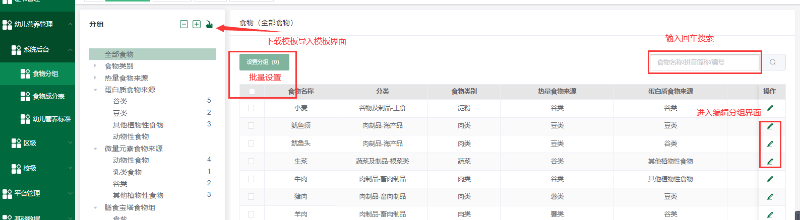

##### 导入

1. 点击【导入】按钮，下载/导入【食物分组导入模版】
2. 下载【食物分组导入模版】时，带出当前食物分组数据
3. 导入模版中有数据的，覆盖原数据

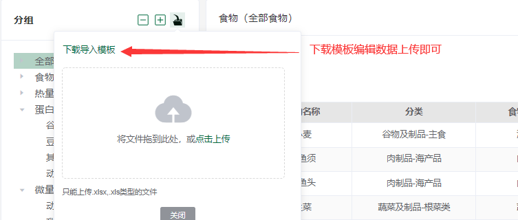

##### **批量设置分组**

##### **设置分组**

1. 【膳食宝塔食物组】选择器显示【移出分组】按钮
2. 点击【移出分组】按钮，从【膳食宝塔食物组】移出食物
3. 【食物类别】、【热量食物来源】、【蛋白质食物来源】、【微量元素食物来源】选择器为必选，单选；
4. 【膳食宝塔食物组】选择器为非必选，单选

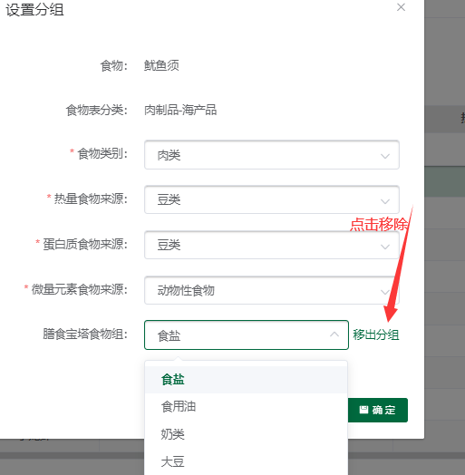

#### **食物成分表**

1. 【食物成分表】页默认选中第一个版本标签
2. 点击版本标签，切换显示【食物成分表】表格；
3. 状态为关闭的版本，版本标签显示“（关闭）”
4. 可根据食物名称/食物拼音首字母/食物编号搜索【食物成分表】表格；
5. 【食物成分表】表格显示食物编号、食物名称、食物分类、食物亚类、食物成分，食物编号、食物名称固定显示
6. 【食物成分表】表格根据食物编号升序排序，分页显示

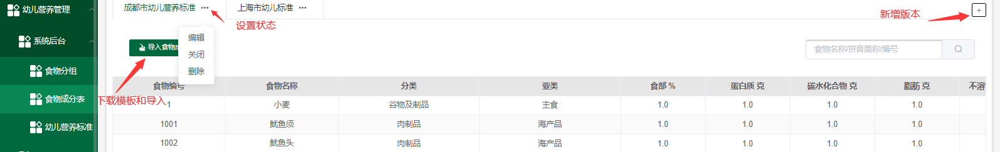

##### 新增

1. 新建版本状态默认为关闭，版本下食物成分数据默认为0；
2. 点击【添加】按钮，显示【创建版本】对话框，输入【版本名称】创建版本

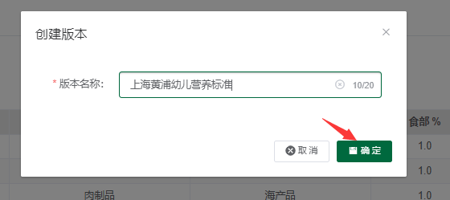

##### **导入**

1. 点击【导入食物成分】按钮，下载/导入【食物成分表导入模版】；
2. 下载【食物成分表导入模版】时，带出版本当前食物成分数据；
3. 导入模版中有数据的，覆盖原数据

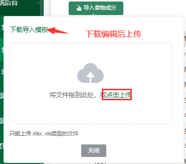

#### **幼儿营养标准**

1. 【幼儿营养标准】页默认选中第一个版本标签
2. 点击版本标签，切换显示【幼儿营养标准】表格
3. 点击【添加】按钮，显示【创建版本】对话框，输入【版本名称】创建版本
4. 状态为关闭的版本，版本标签显示“（关闭）”
5. 【幼儿营养标准】表格显示统计项、托班标准、小班标准、中班标准、大班标准、最后编辑时间，统计项固定显示
6. 【幼儿营养标准】表格默认根据统计项排序，可根据最后编辑时间排序，分页显示
7. 新建版本状态默认为关闭，版本下统计项数据默认为0；

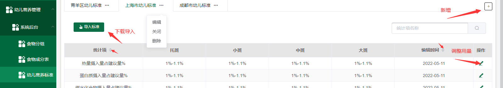

##### 编辑

1. 编辑后保存即可
2. 数量大于0.1
3. 参与统计的班级在基础数据的年级管理设置

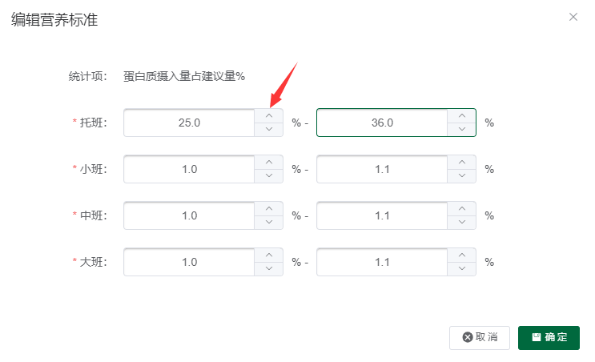

#### **电子秤设置密码**

1、密码设置为6位、同步修改电子秤apk登录密码

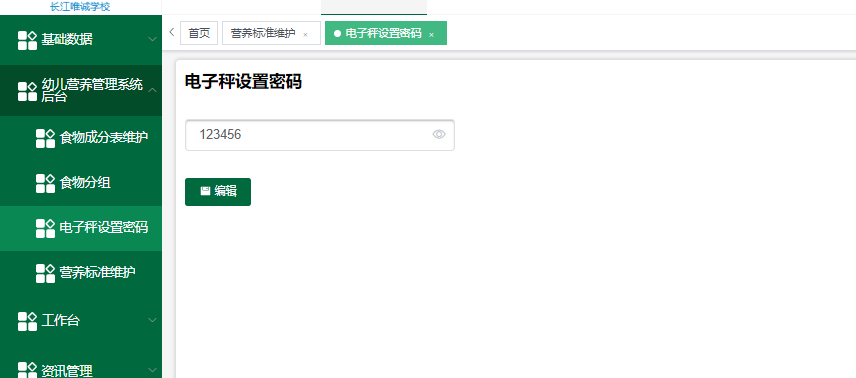

### 校级

#### 引导页

1. 营养分园管理员进入的，不显示【基础设置】卡片
2. 卡片显示当天选中校区食谱包含菜品（去重）数量、当天食谱包含食材（去重）数量、当天用餐人数
3. 卡片显示当前教学周及上月热量摄入量占建议量比值；
4. 卡片显示当前教学周及上月蛋白质摄入量占建议量比值
5. 卡片显示当前教学周及上月动物性食物+豆类食物包含蛋白质占总蛋白质比值
6. 卡片显示当前教学周及上月动物性食物+豆类食物产生热量占总热量比值
7. 卡片显示当前教学周及上月蛋白质：脂肪：碳水化合物摄入量比值
8. 卡片显示当前教学周及上月蛋白质产生热量占总热量比值；
9. 卡片显示当前教学周及上月脂肪产生热量占总热量比值
10. 卡片显示当前教学周及上月碳水化合物产生热量占总热量比值
11. 点击【导出】按钮，导出本周/本月营养分析报告

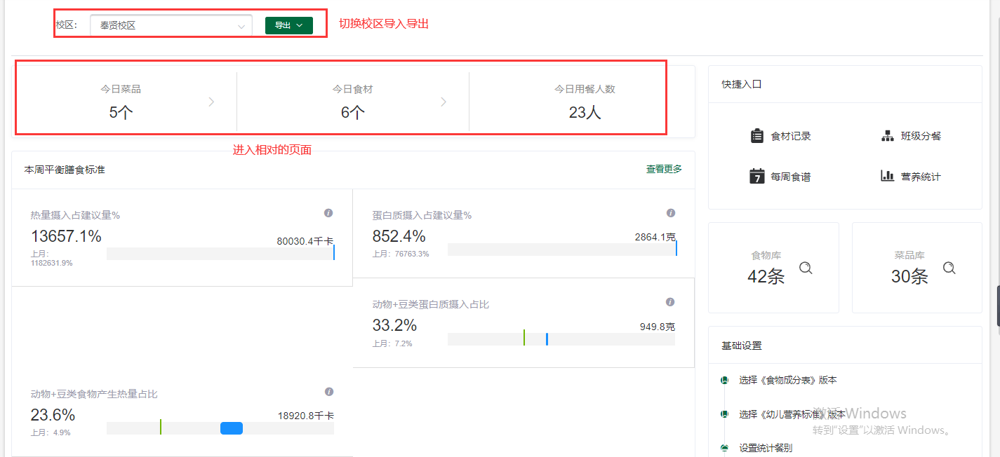

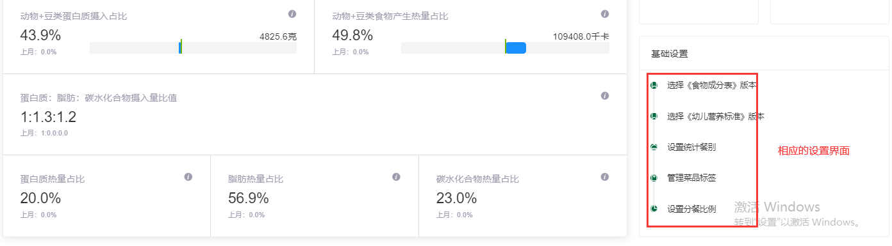

##### 查看更多

1、点击跳转到营养统计页

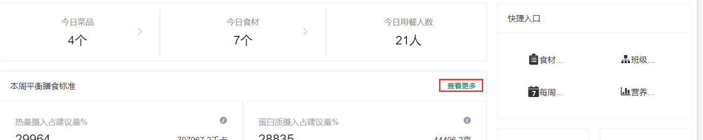

##### **快捷入口**

1、点击相应的卡片进入相对的界面

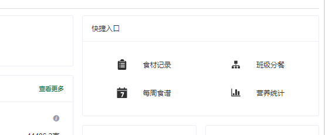

#### **食材库存**

1. 不可添加同一食材

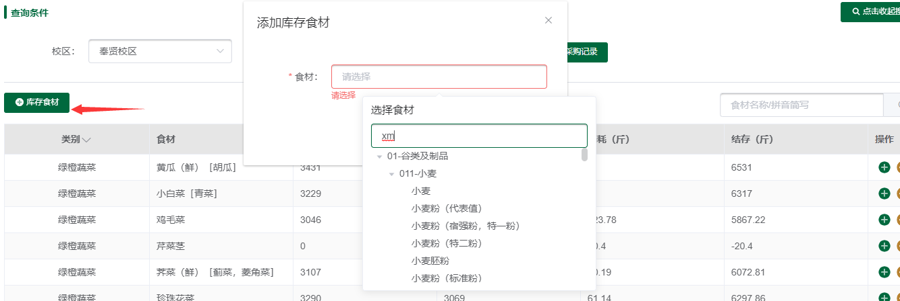

##### 添加采购记录

1、一条采购生成一条记录

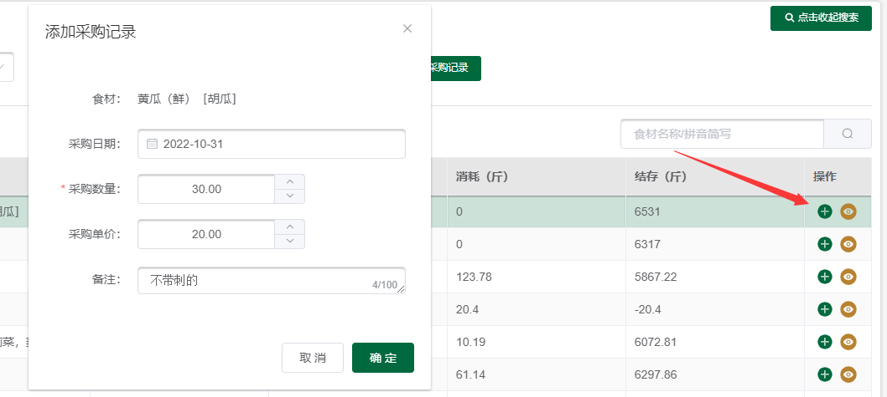

##### **查看采购记录**

1、可以编辑和新增

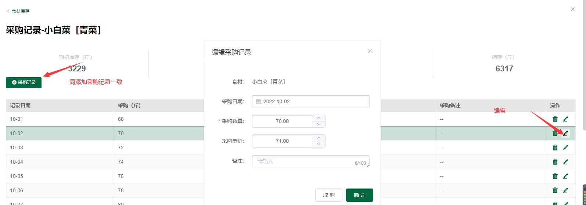

#### 食物成分表

1. 营养分园管理员进入的，不显示【切换版本】按钮、食物状态
2. 营养分园管理员进入的，仅显示开启状态的食物
3. 点击【切换版本】按钮，提示确认后，幼儿园使用选中版本
4. 切换版本后，当天及未来的营养元素摄入量取切换后版本
5. 关闭食物【状态】时，提示确认“包含关闭食物的菜品将被关闭”，确认后关闭食物，并关闭包含该食物的菜品
6. 关闭食物后，不能在【菜品管理】、【每周食谱】、【食材记录】中添加该食物

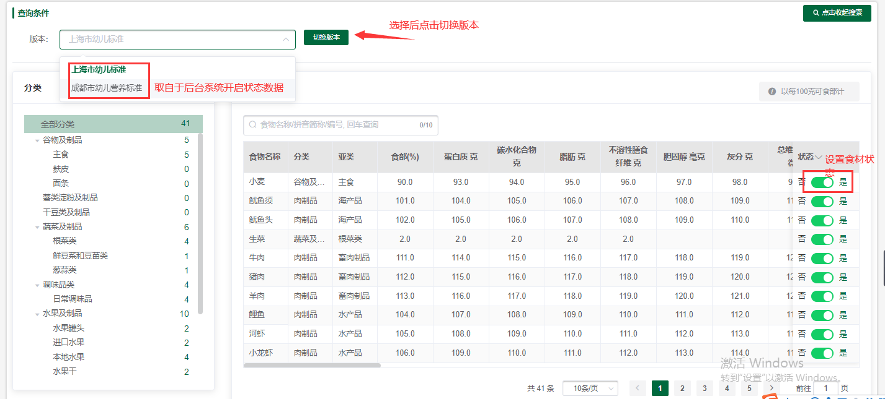

#### 幼儿营养标准

1. 营养分园管理员进入的，不显示【统计餐别】标签、【切换版本】按钮
2. 【统计餐别】标签页点击【营养标准】标签
3. 点击【切换版本】按钮，提示确认后，幼儿园使用选中版本
4. 切换版本后，营养统计标准取切换后版本

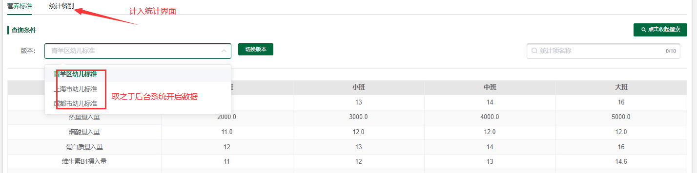

##### 统计餐别

1. 总管理员显示
2. 统计餐别固定选中【早点+午餐+午点】，早餐、晚餐不可选

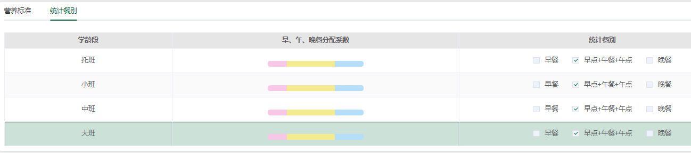

#### 食物分组

1. 默认选中【全部食物】。
2. （二级）食物分组显示分组下包含（开启）食物数量
3. 选中【全部食物】选项，显示全部食物的【食物分组】表格
4. 可根据食物名称/食物拼音首字母/食物编号搜索【食物分组】表格；

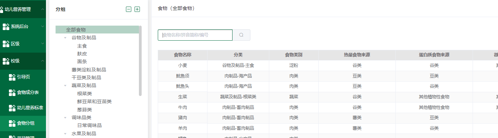

#### 菜品管理

1. 营养分园管理员进入的，不显示【导入菜品】、【标签管理】按钮、分类【添加】按钮、批量【设置分类】按钮、【更多操作】按钮、菜品【状态】、分类【更多】按钮、【菜品评价】开关
2. 营养分园管理员进入的，点击【菜品】表格菜品名称，仅对话框查看菜品详情，不能编辑
3. 新增菜品时，菜品【状态】默认为开
4. 选中【全部菜品】/【未分类】/菜品分类选项，显示分类下【菜品】表格
5. 【全部分类】/【未分类】/食物分类显示分类下开启菜品数量
6. 可根据菜品名称/包含食材搜索【菜品】表格
7. 悬停食材数量，气泡显示菜品包含食材
8. 【菜品】表格可根据使用次数、获赞次数、被踩次数升序/降序排序

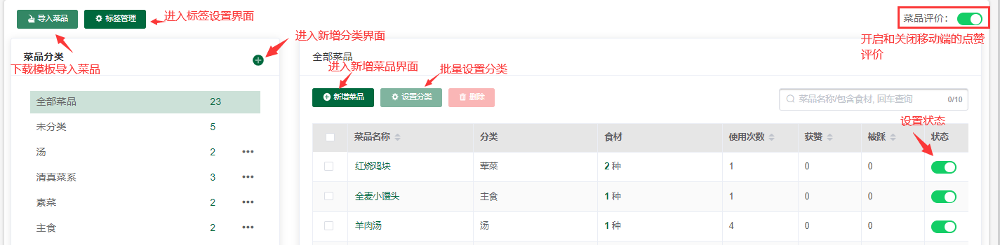

##### 新增菜品

1. 点击【添加菜品】按钮，对话框新增菜品
2. 点击对话框【保存并继续】按钮，保存菜品并继续新增
3. 【菜品名称】输入框为必填，文本输入，最多20字，不能与现有菜品重名
4. 【菜品标签】选择器为非必选，多选
5. 【菜品照片】为非必传
6. 【备注】输入框为选填，文本输入，最多100字

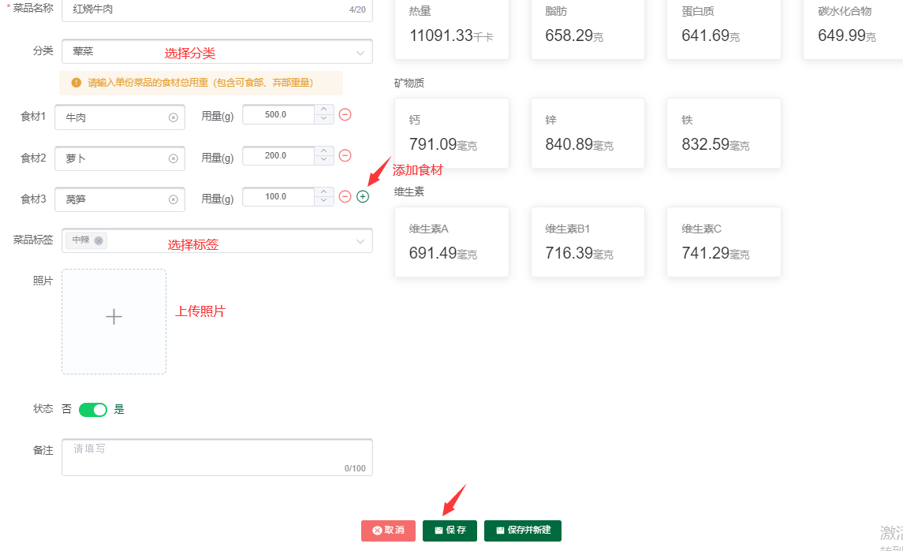

##### **导入菜品**

1. 点击【导入菜品】按钮，下载/上传菜品导入模版

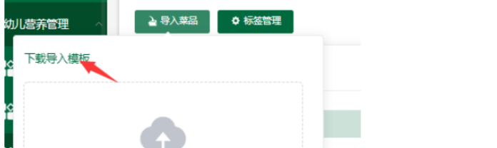

##### **标签管理**

1. 点击【标签管理】按钮，进入【标签管理】页
2. 最多输入10字
3. 可开关状态
4. 【标签】表格显示标签名称、包含菜品数量、标签状态、排序按钮
5. 点击【添加】按钮，在【标签】表格最上添加一行标签
6. 表内编辑标签名称
7. 点击【删除】按钮，提示确认后，可批量删除选中的标签

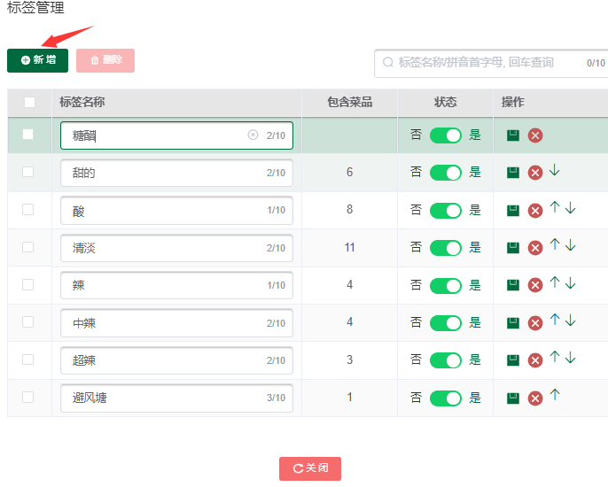

##### **新增分类**

1. 点击分类【添加】按钮，在列表最上（未分类下）新增菜品分类
2. 点击分类【更多】按钮，可编辑分类名称、上移、下移、删除分类
3. 删除分类的，分类下菜品分类变更为【未分类】

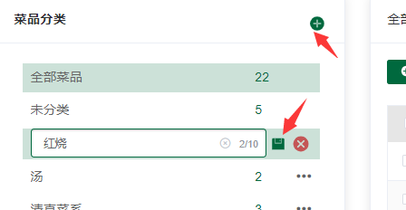

##### **设置分类**

1. 选择类型点击保存

#### 每周食谱

1. 总园长/分园长进入的，不显示【导出】按钮、【复制食谱】按钮、【添加】按钮、【编辑】按钮、【删除】按钮
2. 默认选中用餐周第一个日期标签
3. 添加菜品、水果时，【用餐学龄段】复选框默认全选
4. 卡片显示选中用餐周食谱包含菜品（去重）数量、食材（去重）数量、热量摄入量占建议量比值、蛋白质摄入量占建议量比值、碳水化合物摄入量占建议量比值
5. 选中日期标签，显示日期下【带量食谱】表格、【特殊膳食】表格
6. 用餐学龄段非全部学龄段的，菜品显示用餐学龄段
7. 特殊膳食的食材重量也会计算到统计去
8. 用餐周日期下没有食谱记录的，日期标签显示标记

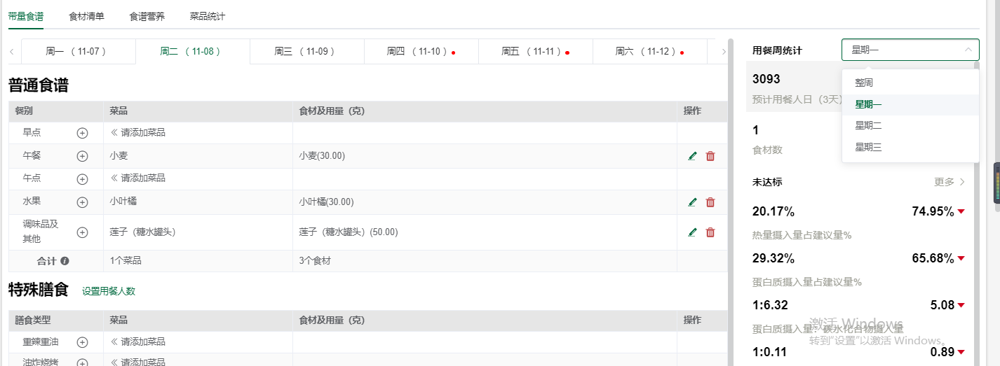

##### **导出**

##### **添加食谱**

1. 点击早点/午餐/午点【添加】按钮，对话框批量添加菜品，该天该餐别已添加的菜品不能重复添加
2. 点击添加菜品【确定】按钮，对话框选择用餐学龄段
3. 点击水果【添加】按钮，对话框添加【水果及制品】分类下开启的食物、用量、用餐学龄段
4. 【用餐学龄段】复选框至少选中一个
5. 只能维护当天及未来的食谱数据
6. 用餐周取选中学年学期教学周数据

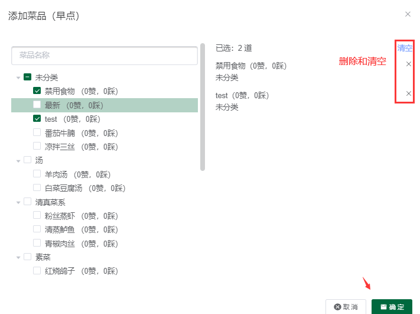

###### 添加水果

1. 【水果】选择器为必选，单选，选项为【水果及制品】分类下的食物
2. 【用量】输入框为非必填，（0-1000]，精确到0.1
3. 【用餐学龄段】复选框至少选中一个（默认全选）
4. 可以查看分餐比例

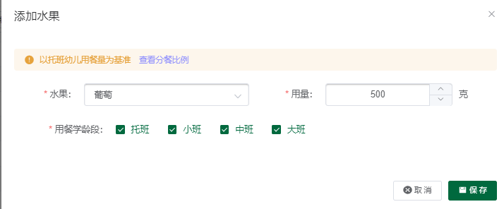

###### **添加调味品**

1. 【调味品】选择器为必选，单选，选项为【调味品类】分类下的食物
2. 【用量】输入框为非必填，（0-1000]，精确到0.1
3. 可以查看分餐比例
4. 可以多次添加多种调味剂
5. 调味剂添加时不可重复添加

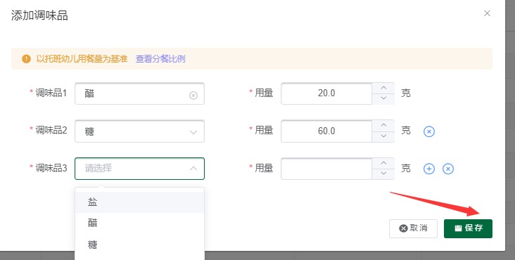

###### **添加特殊膳食**

1. 特殊膳食【菜品名称】输入框为必填，文本输入，最多20字
2. 特殊膳食【膳食类型】为必选，单选，选项为（分租户）字典表维护
3. 【备注】为选填，文本输入，最多20字

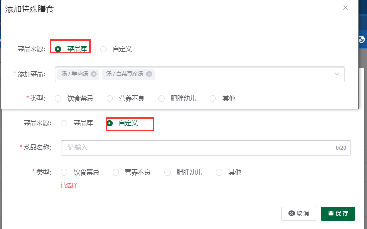

##### 食材清单

1. 卡片显示预计用餐人日
2. 点击编辑按钮，气泡编辑预计用餐人日
3. 显示平均单日（预计）用餐人数
4. 卡片显示食物类别下包含食物（去重）数量、食物名称、（预计）食物总用量
5. 调整预计用餐人日影响食材清单、食材记录表、食谱营养分析
6. 用餐天数为有菜品记录的天数

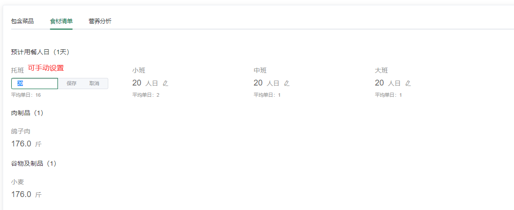

##### **营养分析**

1. 【学龄段】选择器默认选中全部
2. 其他数据显示和营养统计一致

##### **包含菜品**

1. 环形图显示菜品分类占比、分类下菜品数量
2. 雷达图显示菜品标签分布
3. 卡片显示餐别下菜品（去重）数量、分类、名称

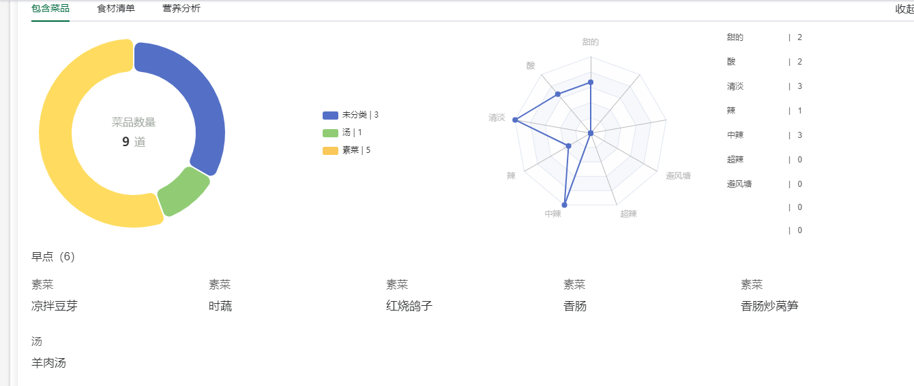

##### 特殊膳食（设置用餐人数）

1. 特殊膳食的食材用量是根据里面设置的人数计算的（区别于普通食谱）
2. 计算需要将特殊膳食的重量计算到统计中
3. 食材清单重量分开显示、计算时同一食材相加然后和普通食谱计算一致

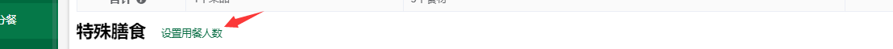

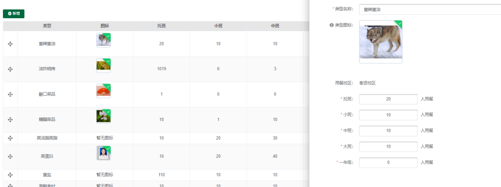

#### 食材记录

1. 总园长/分园长进入的，不显示【导入食材记录】按钮、【添加食材】按钮、【自动填写】按钮、【删除】按钮、【前往设置】按钮
2. 总园长/分园长进入的，【食材记录】输入框不能编辑
3. 营养分园管理员进入的，不显示【前往设置】按钮
4. 显示选中用餐周【食材记录】表格
5. 食材记录】表格显示食材、食材合计用量、用餐日期用量
6. 可根据食材合计用量、用餐日期用量排序
7. 食材记录】表格默认根据合计用量升序排序，不分页显示
8. 表内编辑当天及未来的食材、调味品用量
9. 用餐人日设置迁移到此处
10. 右侧新增统计界面

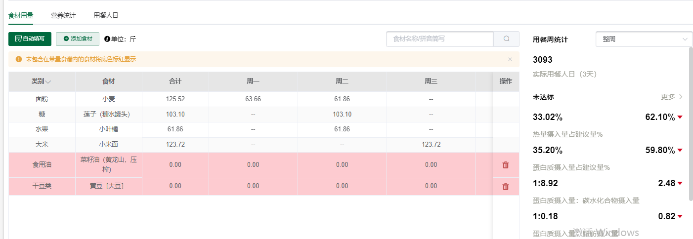

##### 添加食材

1. 点击【添加食材】按钮，对话框批量添加食材，已添加的食材不能重复添加
2. 点击【删除】按钮，删除不包含在食谱菜品中的食材
3. 不包含在食谱菜品中，且已有（当天之前）食材记录的，点击【删除】按钮，清空当天及未来的记录
4. 包含在食谱菜品中的食材不能删除
5. 不属于每周食谱的食材有标红显示

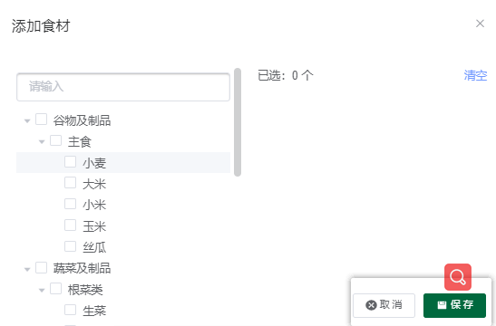

##### **自动填写**

1. 点击提示确认：“将根据当前食谱、预计用餐人数自动填写”
2. 只填写当天及未来的食物、调味品记录
3. 各年龄段各天食谱包含菜品食材\*分餐比例\*（该周预计用餐人数/有食谱记录的天数）加总
4. 根据周食谱包含食材、预计日均用餐人数、菜品所在日期、用餐学龄段、分餐比例填写食材量
5. 精确到0.1

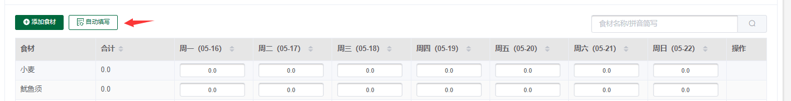

##### **展开**

1. 默认显示用餐人日
2. 卡片显示截至目前，选中用餐周的用餐人日

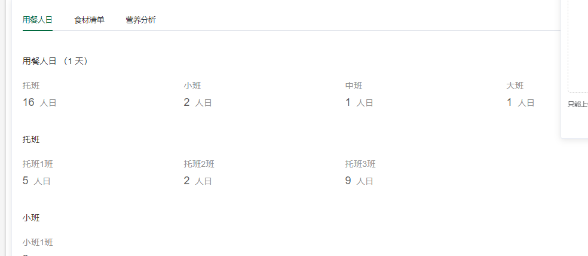

###### 食材清单

1. 卡片显示记录食材数量
2. 显示去重数据重量

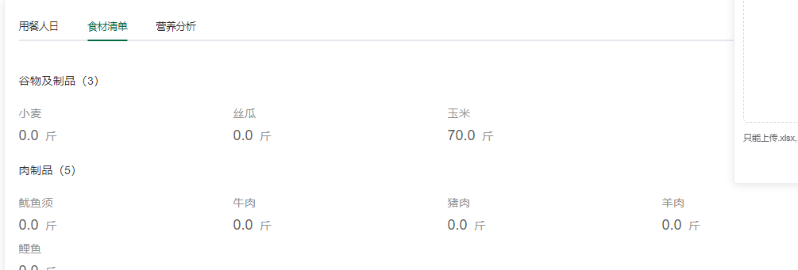

##### 导入食材记录

1. 点击【导入食材记录】按钮，下载/导入食材记录模版
2. 导入数据不影响历史数据，覆盖当天及未来食材记录数据

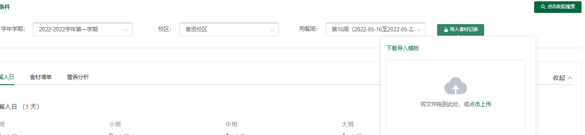

#### 班级分餐

1. 【记录日期】选择器默认选中当天
2. 营养分园管理员进入的，不显示【分餐比例】按钮
3. 选中食谱菜品，显示菜品总重、用餐班级
4. 【菜品总重】输入框记录菜品总重
5. 【记录日期】选择器选中历史日期的，【菜品总重】输入框不能编辑
6. 点击【计算分餐】按钮，根据该天班级用餐人数、菜品用餐学龄段、菜品总重、分餐比例计算班级分餐
7. 卡片显示班级名称、用餐人数、分配重量

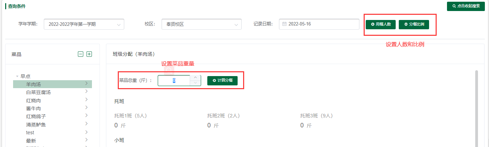

##### 用餐人数

1. 点击【用餐人数】按钮，进入【用餐人数】页
2. 【记录日期】选择器选中历史日期的，不显示【用餐人数】按钮
3. 用餐人数】输入框默认取当天出勤人数
4. 表内编辑用餐人数，有手动编辑记录的，以手动编辑为准
5. 无出勤人数数据来源的，默认取班级在校人数
6. 应出勤人数取班级在校人数

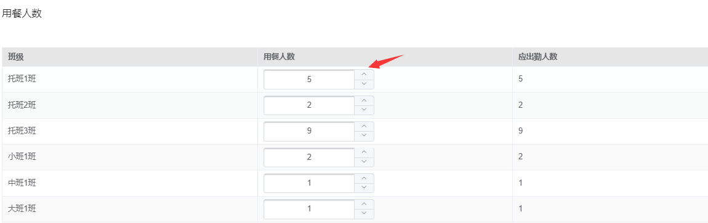

##### 用餐比例

1. 点击【分餐比例】按钮，对话框设置小班、中班、大班分餐系数
2. 【分餐系数】输入框为必填，[1,10]，精确到0.1

#### **营养统计**

1. 统计【学龄段】单选框默认选中全部
2. 可以切换学年学期、校区、学龄段、日期（默认当前学年、默认第一个校区、默认全部学龄段、默认当前时间范围）
3. 显示当前使用的【食物成分表版本】、【幼儿营养标准版本】
4. 点击【导出】按钮，可导出营养分析表、营养分析报告
5. 卡片显示【平衡膳食宝塔】统计项达标情况
6. 柱状图显示各【食物类别】下食物摄入量
7. 柱状图显示热量、蛋白质、碳水化合物摄入量占建议量比值
8. 表格显示热量、蛋白质、碳水化合物摄入量、建议量、（摄入量-建议量）差值、摄入量占建议量比值
9. 饼图显示蛋白质、脂肪、碳水化合物摄入量及占比、蛋白质、脂肪、碳水化合物产生热量及占比
10. 表格显示蛋白质、脂肪、碳水化合物摄入量、比值、产生热量、占总热量比值
11. 饼图显示热量食物来源食物摄入量及占比、热量食物来源食物产生热量及占比
12. 表格显示热量食物摄入量、占总摄入量比值、产生热量、占总热量比值
13. 饼图显示蛋白质食物来源食物摄入量及占比、蛋白质食物来源食物包含蛋白质及占比
14. 表格显示蛋白质食物摄入量、占总摄入量比值、包含蛋白质、占总蛋白质比值
15. 堆叠图显示动物性食物+豆类食物包含蛋白质占总蛋白质比值、动物性食物+豆类食物产生热量占总热量比值
16. 表格显示豆类食物、动物性食物包含蛋白质、占总蛋白质占比、产生热量、占总热量占比
17. 堆叠图显示微量元素食物摄入量占建议量比值
18. 表格显示微量元素食物摄入量、建议量、（摄入量-建议量）差值、摄入量占建议量比值
19. 饼图显示微量元素食物来源食物包含微量元素及占比
20. 表格显示微量元素食物来源包含微量元素、占总摄入量比值

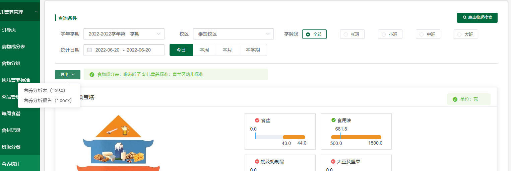

### 区级

#### 全区监控

1. 卡片显示当天整体达标、食物成分异常、食材异常的幼儿园数量
2. 气泡图显示全区幼儿园当天食物成分统计项、食材统计项、用餐人数情况
3. 纵轴为幼儿园食物成分统计项达标数量，横轴为幼儿园食材统计项达标数量，气泡大小为幼儿园用餐人数
4. 悬停气泡显示幼儿营养统计项达标数量、食材统计项达标数量、用餐人数
5. 可根据幼儿园名称搜索气泡图
6. 查看前4个统计项的当天全区达标率
7. 仪表盘显示当天整体达标率、与本月平均整体达标率比较
8. 热力图显示最近60天整体达标率
9. 点击【隐藏/显示】按钮，隐藏/显示整体达标率为0的日期
10. 悬停显示该天日期、整体达标率
11. 点击【整体达标】卡片、【食物成分异常】卡片、【食材异常】卡片【设置】按钮、【设置达标标准】按钮，对话框设置整体达标、食物成分异常、食材异常标准、重要统计项

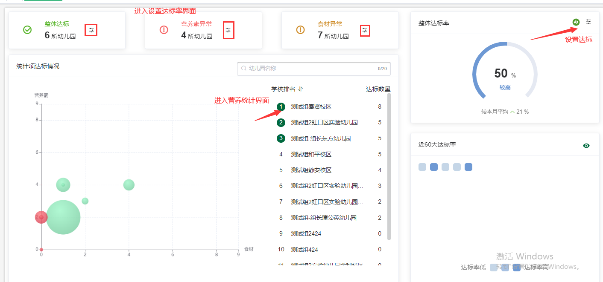

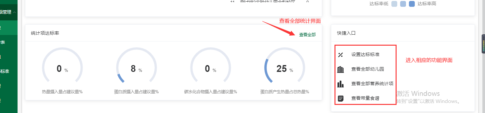

##### 达标标准设置

1、【整体达标标准】输入框为必填，整数，不大于统计项总数；

2、【食物成分异常标准】输入框为必填，整数，不大于食物成分统计项总数；

3、【食材异常标准】输入框为必填，整数，不大于食材统计项总数；

4、【重要统计项】选择器为非必选，多选。

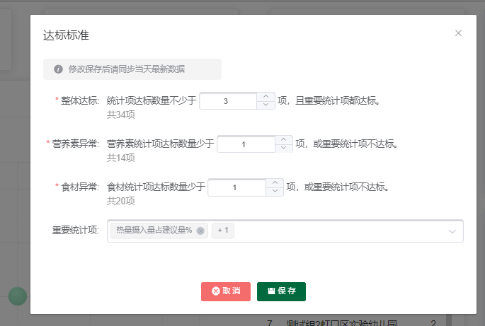

##### **统计项达标率**

1. 【全区监控】页点击【查看全部统计项】按钮、统计项达标率【查看全部】按钮
2. 默认查看前4个统计项的当天全区达标率
3. 【统计项】单选框默认选中全部
4. 日期】选择器默认选中当天
5. 可查看当天及历史数据
6. 仪表盘显示全部营养统计项在选中日期的达标率
7. 可筛选显示全部统计项/食物成分统计项/食材统计项。
8. 统计项达标率=统计项达标幼儿园数量/全区幼儿园数量\*100%。

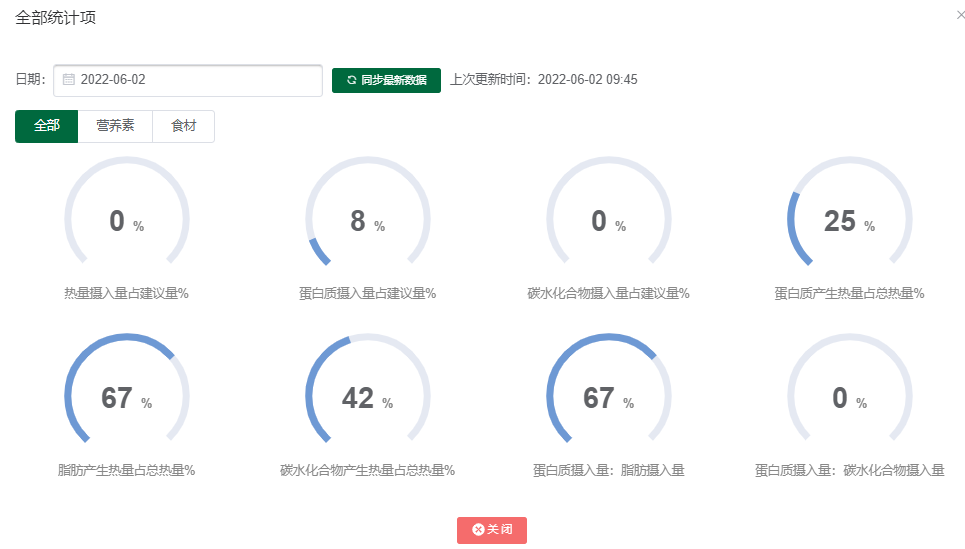

##### **快捷入口**

1、点击【查看全部幼儿园】按钮，进入【全部幼儿园】页；

2、点击【查看全部统计项】按钮，进入【全部统计项】页；

3、点击【查看带量食谱】按钮，进入【带量食谱】页；

4、点击【设置达标标准】按钮，进入【设置达标标准】页；

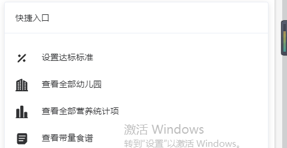

##### **全部幼儿园**

1. 【全区监控】页点击【整体达标】卡片、【食物成分异常】卡片、【食材异常】卡片、【查看全部幼儿园】按钮
2. 点击【整体达标】卡片进入的，默认选中【整体达标】标签
3. 点击【食物成分异常】卡片进入的，默认选中【食物成分异常】标签
4. 点击【食材异常】卡片的，默认选中【食材异常】标签
5. 点击【查看全部幼儿园】按钮进入的，默认选中【全部幼儿园】标签
6. 【日期】选择器默认选中当天
7. 可查看当天及历史数据
8. 点击标签筛选显示达标/异常【幼儿园】表格
9. 可筛选显示当前表格内全部统计项、有幼儿园未达标的统计项目

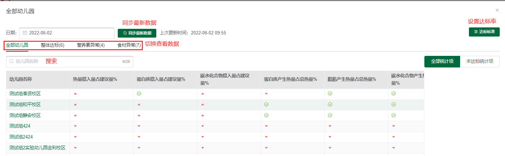

#### 食物成分表

1. 选择器默认选中第一个版本
2. 默认选中【全部分类】
3. 【全部分类】/食物分类显示分类下食物数量
4. 可根据食物名称/食物拼音首字母/食物编号搜索【食物成分表】表格
5. 【食物成分表】表格显示食物名称、食物分类、食物亚类、食物成分，食物名称固定显示
6. 【版本】选择器选项为当前开启状态的食物成分表版本
7. 【食物成分表】数据通过系统后台维护

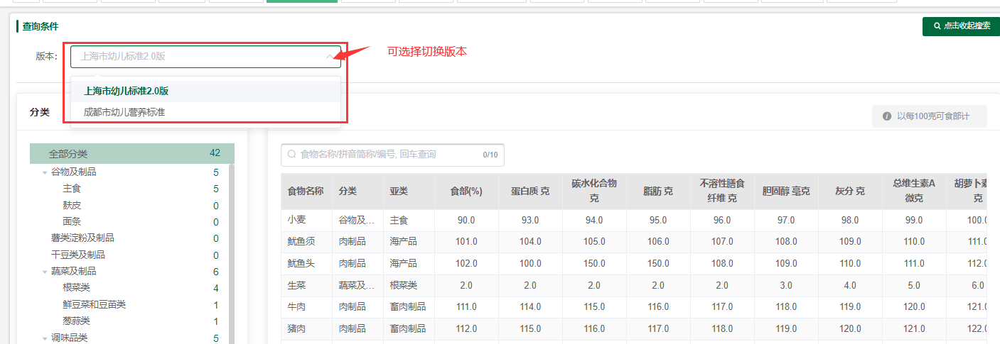

#### 食物分组

1. 默认选中【全部食物】
2. （二级）食物分组显示分组下包含食物数量
3. 选中【全部食物】选项，显示全部食物的【食物分组】表格
4. 可根据食物名称/食物拼音首字母/食物编号搜索【食物分组】表格
5. 【食物分组】表格显示食物名称、分类-亚类、食物分组，食物名称固定显示
6. 【食物分组】表格固定显示食物名称
7. 【食物分组】数据通过系统后台维护

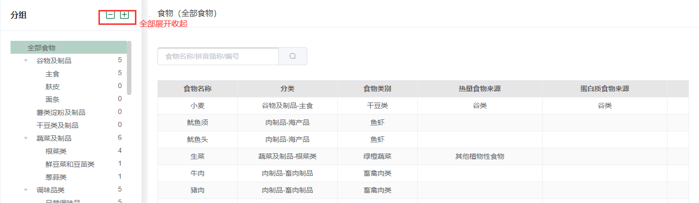

#### 幼儿营养标准

1. 【版本】选择器默认选中第一个版本
2. 可根据统计项名称搜索【幼儿营养标准】表格
3. 【幼儿营养标准】表格显示统计项、托班标准、小班标准、中班标准、大班标准，统计项固定显示（可在基础数据-年级管理设置班级）
4. 【版本】选择器选项为当前开启状态的幼儿营养标准版本
5. 【幼儿营养标准】数据通过系统后台维护

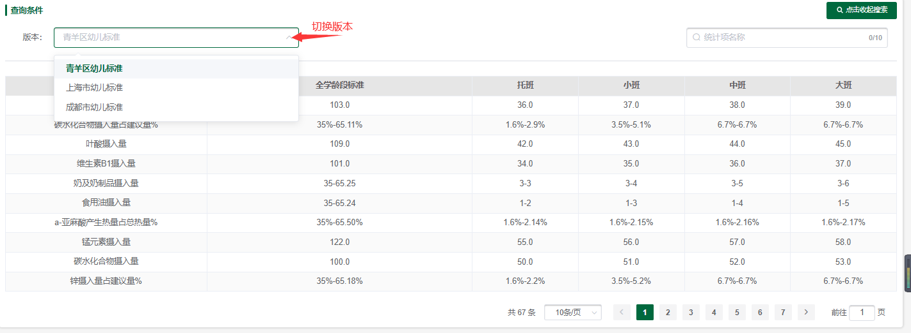

#### 带量食谱

1. 【日期】选择器默认选中当天
2. 默认选中第一个幼儿园-校区
3. 选中幼儿园-校区，显示该校区在选中日期的【带量食谱】表格
4. 可根据幼儿园名称搜索【幼儿园】列表
5. 【带量食谱】表格显示餐别、菜品、食材及用量、合计（去重）菜品数量、合计（去重）食材数量
6. 【餐别】固定为早点、午餐、午点、水果、调味品

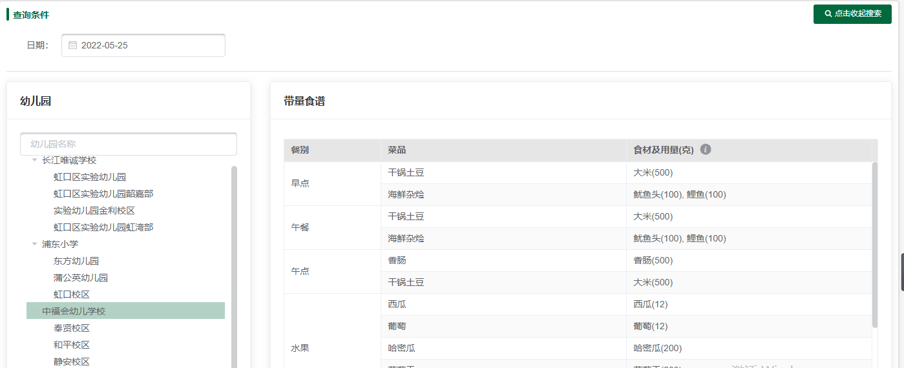

#### 食材记录

1. 【日期】选择器默认选中当天
2. 默认选中第一个幼儿园-校区
3. 可根据幼儿园名称搜索【幼儿园】列表
4. 选中幼儿园-校区，显示该校区在选中日期的【食材记录】卡片
5. 仅显示有食材记录的食物、食物分类
6. 卡片根据食物分类、食物编号升序排序，不分页显示

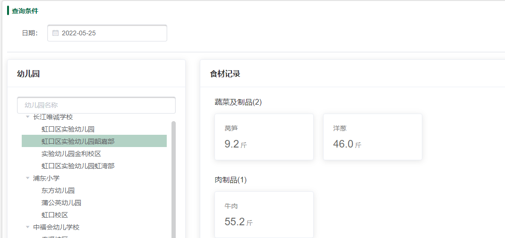

#### 营养统计

1. 可导出选中校区的数据
2. 可切换所有幼儿园信息
3. 其他和权限和校级的一致

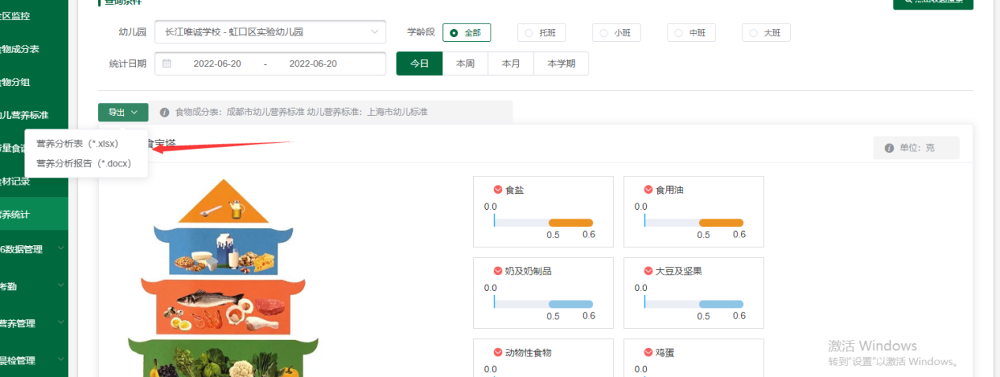

### 企业微信

#### 幼儿食谱

1. 家长进入的，不显示【校区】选择器、【学龄段】选择器
2. 【日历】默认选中当天
3. 【菜品评价】为关闭的（在PC端菜品管理右上角设置），不显示【点赞】按钮、【踩】按钮、赞踩记录、【撤销】按钮；
4. 【菜品评价】为开启的（在PC端菜品管理右上角设置），显示【点赞】按钮、【踩】按钮、赞踩记录、【撤销】按钮
5. 有菜品记录的日期显示标记
6. 显示选中日期的早点、午餐、午点、特殊膳食包含菜品数量
7. 菜品有图片的，显示菜品图片
8. 不显示无菜品的餐别卡片
9. 历史学年学期日期不可选
10. 家长可查看幼儿所在校区、学龄段的食谱

### 班牌

#### 今日食谱

1. 表格显示当天的早点、午餐、午点、水果、特殊膳食菜品；
2. 食谱包含菜品有图片的，显示图片轮播，菜品均无图片的，显示单张固定图片
3. 卡片显示本周的早点、午餐、午点、水果、特殊膳食菜品
4. 历史日期的菜品卡片区别底色显示
5. 日期下食谱包含菜品有图片的，显示图片轮播，菜品均无图片的，显示单张固定图片

#### 班级分餐

1. 选中食谱菜品，显示菜品总重、用餐班级
2. 【菜品总重】卡片记录菜品总重
3. 点击【计算分餐】按钮，根据该天班级用餐人数、菜品用餐学龄段、菜品总重、分餐比例计算班级分餐
4. 卡片显示班级名称、用餐人数、分配重量
5. 【菜品总重】输入框为选填，整数，（0，9999]
6. 用餐人数取【班级分餐-用餐人数】

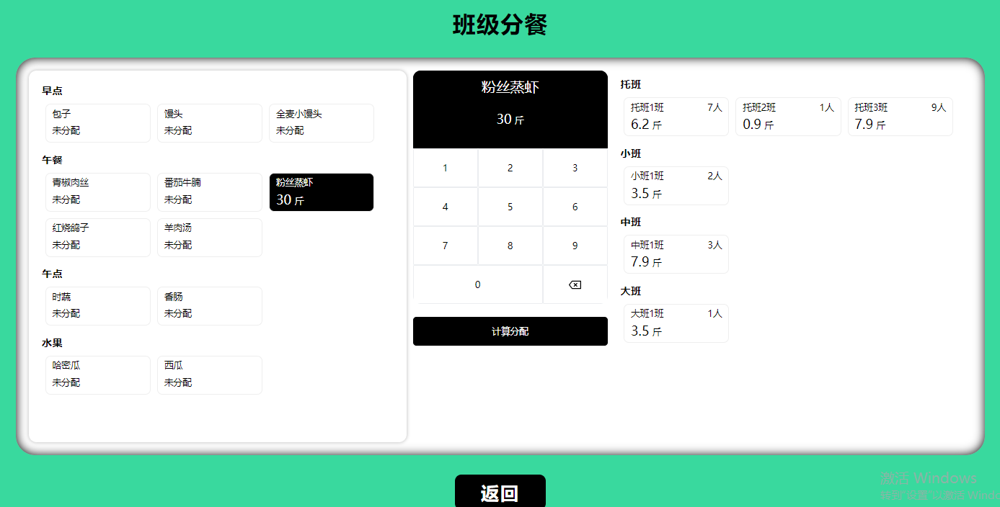

### 电子秤

1. 餐别默认选择早点
2. 没有菜品的餐别，不显示
3. 选择菜品或者水果，右侧显示分餐情况（人数、分餐比例有关）
4. 称重后，点击计算分配，菜品整量根据分餐比例和人数进行分配

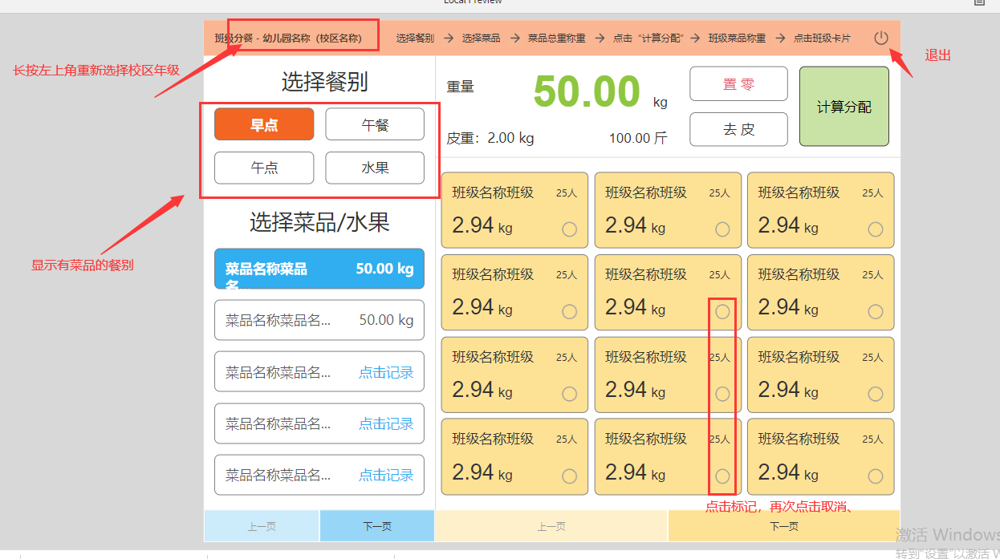