# 微信小程序管理

## 角色权限

|  |  |  |
| --- | --- | --- |
| **角色** | **菜单或应用** | **数据权限说明** |
| **平台管理员、租户均可** | **微信小程序管理** | **平台管理员或租户进行增删改等操作** |

## 新增微信小程序信息

注意：uCare支持租户定制小程序，但是需要联系前端人员进行发布才可以！

点击【新增】按钮，图1--弹出新增微信小程序信息对话框---填写必填项（应用名称、应用编码（应用编码与开发提供的一致）可以按自己需求填写。小程序appid和appsecre取微信公众号平台网站https://mp.weixin.qq.com/下“开发管理-开发设置”处的appid和appsecret）如下图2----填写好以后保存即可，如图3。

图1

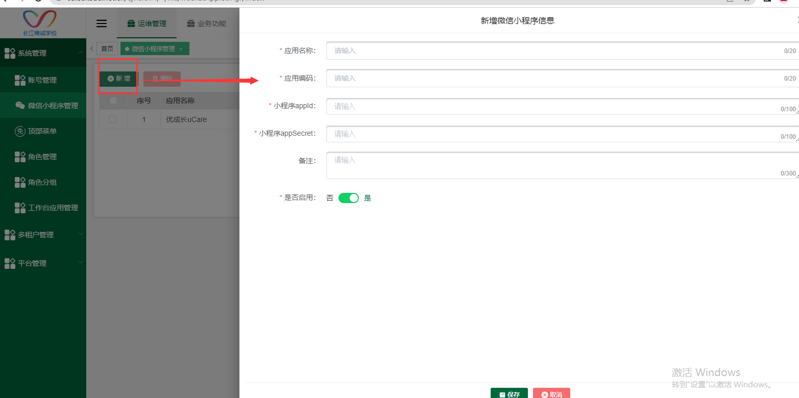

图2

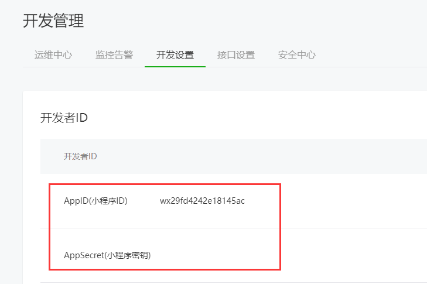

图3

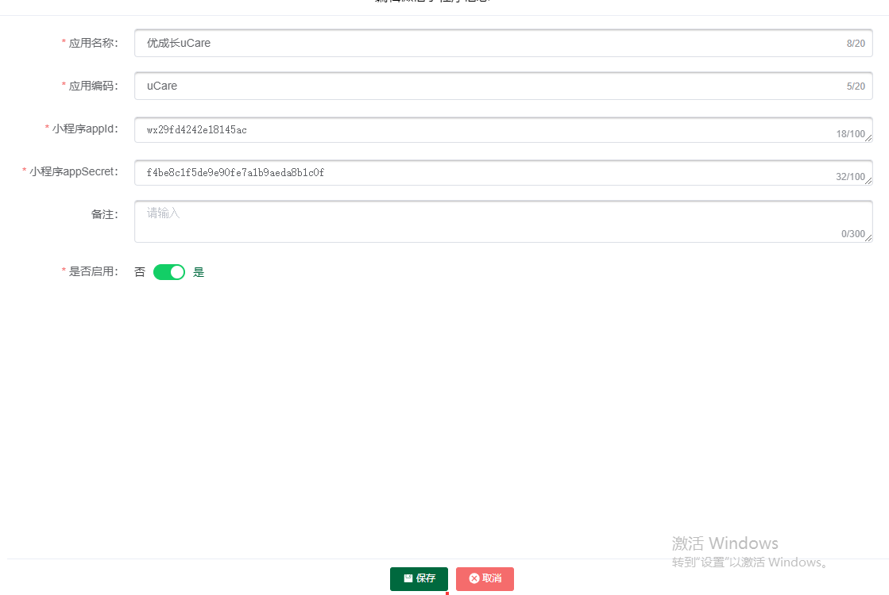

## 删除微信小程序信息

点击删除按钮--点击确定删除即可删除成功

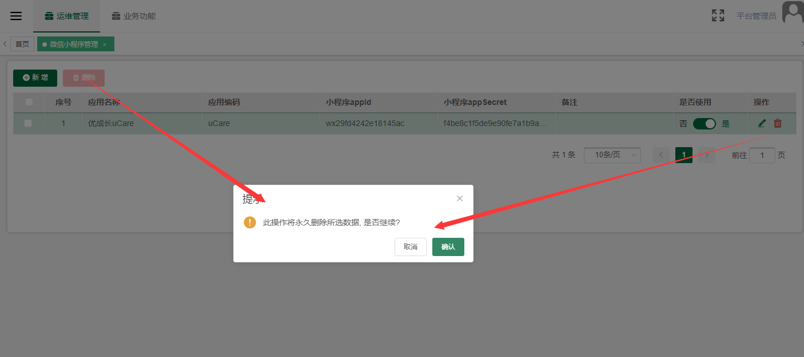

## 编辑微信小程序信息

点击下图编辑按钮，可编辑微信小程序信息

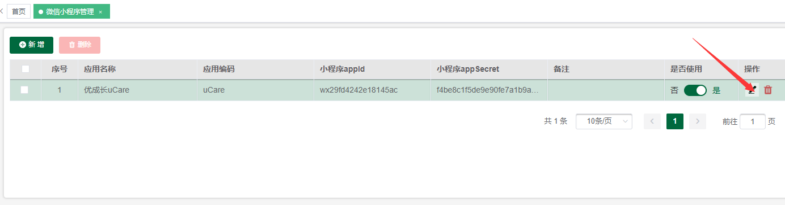

## 关闭/开启【是否使用】

点击关闭【是否使用】按钮，此微信小程序信息对应的小程序就无法使用。

点击开启【是否使用】按钮，此微信小程序信息对应的小程序正常使用。新增默认开启。

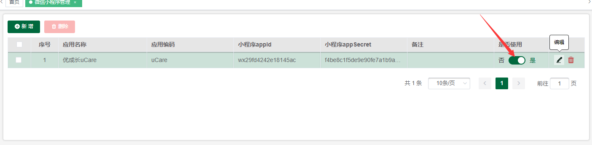

# 微信公众号管理

## 角色权限

|  |  |  |
| --- | --- | --- |
| **角色** | **菜单或应用** | **数据权限说明** |
| **平台管理员、租户均可** | **微信公众号管理** | **平台管理员或租户进行增删改等操作** |

## 新增微信公众号信息

点击【新增】按钮--填写公众号名称、编码（由开发提供，要与开发提供的编码一致）、微信公众号原始ID、开发者ID、开发者密码这三个从微信公众号平台获取（https://mp.weixin.qq.com/）如下图1，服务地址(取pc前端里的地址)，启用微信登录、自动回复（这两个功能暂时没有用）。

图1

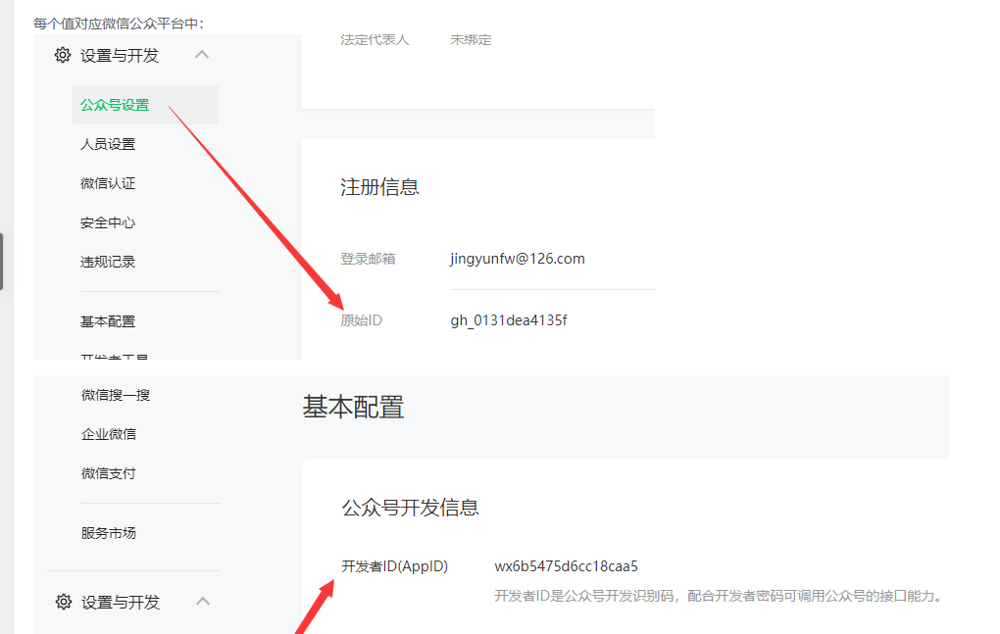

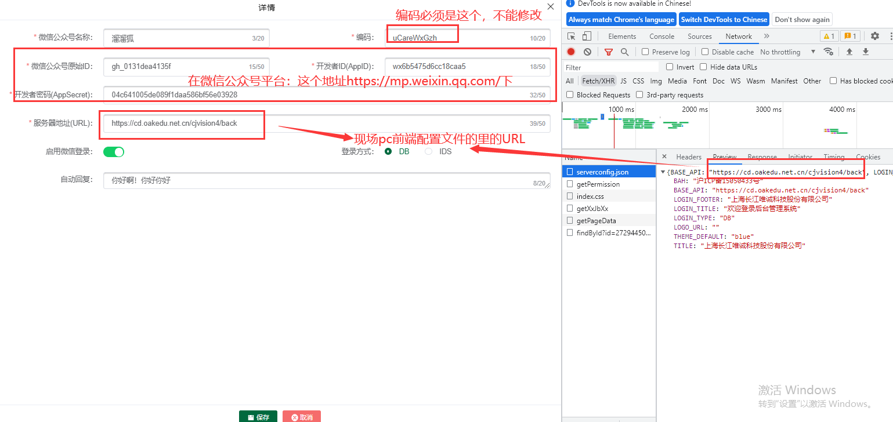

## 编辑微信公众号信息

点击编辑按钮可修改微信公众号信息，微信公众号原始ID、开发者ID、开发者密码与消息推送有关，所以轻易不要修改，以免改错了。

## **菜单管理**

### 新增一级菜单

点击【菜单管理】按钮--点击新增一级菜单-右侧输入菜单标题--点击保存

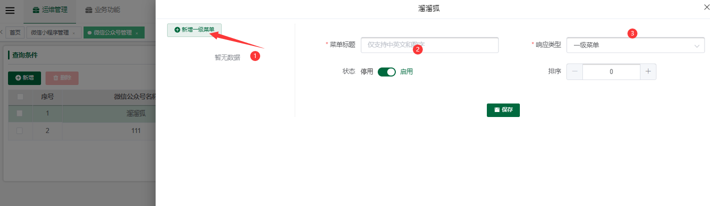

### **新增二级菜单**

#### 新增网页类型

点击添加按钮--右侧填写菜单标题、选择响应类型、填写要跳转的菜单URL（即点击后要跳转的地址）--点击保存即可新增成功

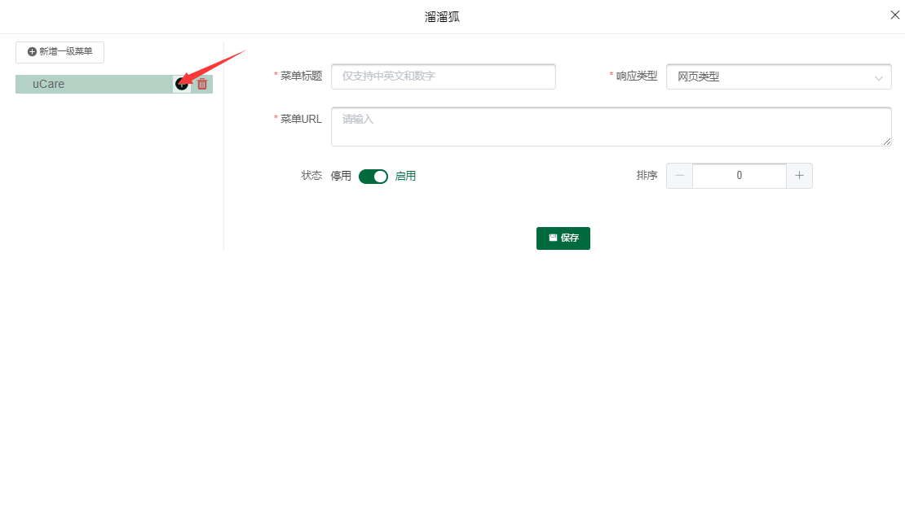

#### **新增小程序类型**

小程序APPID为微信小程序的appid，可参考对应微信小程序管理处填写的。

小程序URL为小程序跳转页面路径，比如/pages/home

菜单URL为了兼容无法打开小程序的老版本微信，目前基本没有老版本的用户，所以此处填一个链接即可（可以填写web端系统的链接）

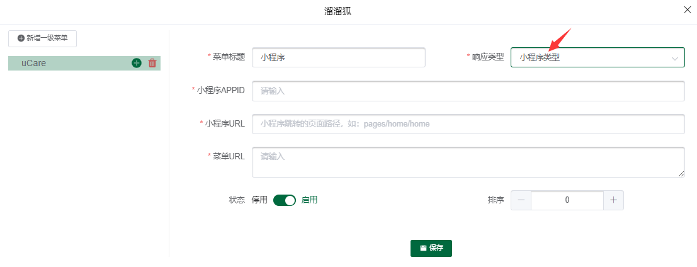

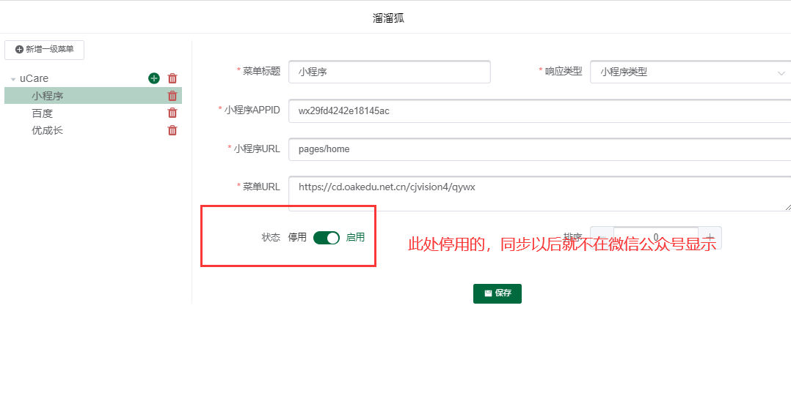

#### **新增点击类型**

点击类型处的菜单key是需要开发提供的，目前暂无具体需求，所以这个响应类型暂时没有用。

### **同步本地菜单到微信**

点击【同步本地菜单到微信】同步新增的本地菜单到微信公众号，同步后微信公众号即可查看对应菜单。

### 同步微信菜单到本地

删除的菜单可点击同步微信菜单到本地来恢复。也可在新增或者是同步本地菜单到微信前，先将原本旧的微信公众号菜单同步下来。

注意：所有新增的菜单都要先点击保存后，再去点同步。

如果响应类型是一级菜单，那么该菜单下必须要有二级菜单，否则无法同步

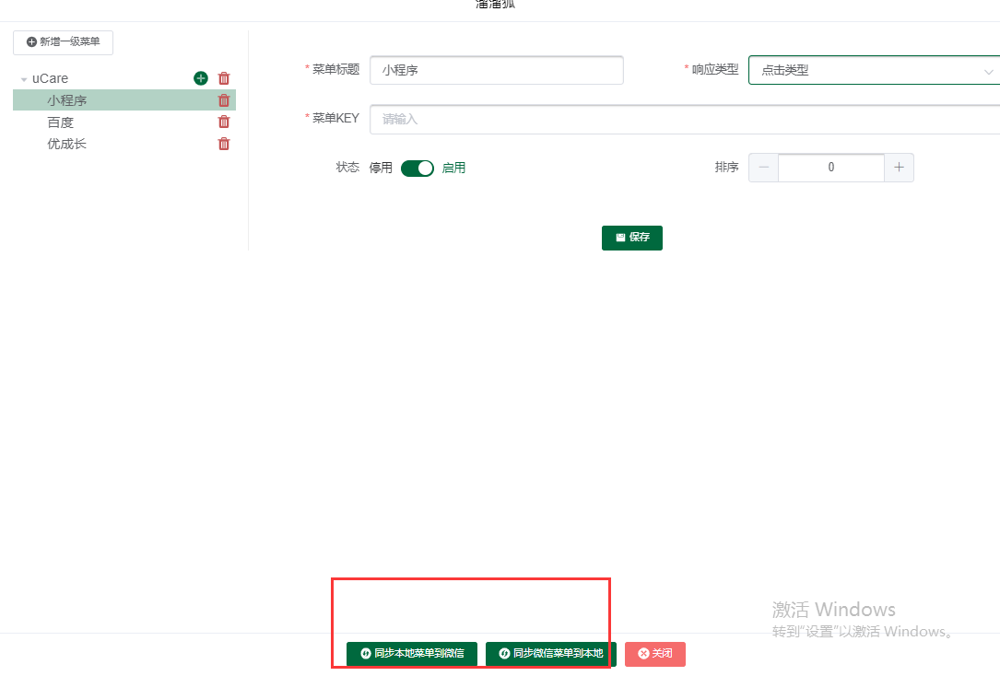