## 使用准备

### 操作系统要求

系统版本：Win7及以上；macOS10.0.4及以上

### 浏览器要求

**建议使用浏览器：Chrome**

兼容的浏览器：Microsoft Edge、Safari、360极速浏览器（等国内浏览器的极速模式）

版本要求：建议使用浏览器的最新版

### 系统访问信息

IP：<http://192.168.0.173:89/cjvision4/#/>

域名：https://cd.oakedu.net.cn/cjvision4/#/

## 业务流程图

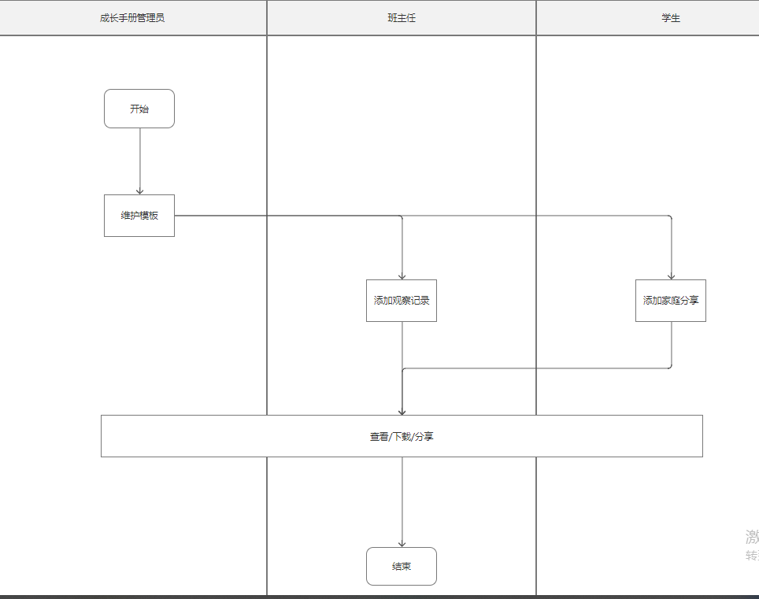

## 角色权限

|  |  |  |
| --- | --- | --- |
| **角色** | **菜单或应用** | **操作权限说明** |
| 平台管理员 | 模板管理 | 新增、编辑、删除、查看 |
| 成长手册管理员/成长手册分园管理员、班主任 | 成长手册管理\完成情况 | 查看、导出（权限下数据） |
| 成长手册管理员/成长手册分园管理员/班主任 | 成长手册-教师（移动端） | 教师评价新增/编辑/查看 |
| 成长手册管理员/成长手册分园管理员 | 模板管理 | 新增、编辑、删除租户自定义模板，查看通用及自定义模板 |
| 家长 | 成长手册-家长（移动端） | 家庭分享新增/编辑/查看 |

## pc端

### 模板管理

1、可模糊搜索模板名称

2、平台管理员的模板显示为通用（租户可使用不可编辑）

3、排序根据排序字段正序排序

4、平台管理员只显示自己新增模板

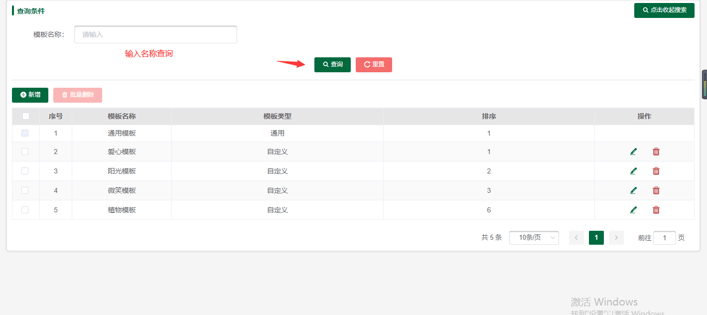

#### 5.1.1新增

1、名称：必填，20字以内，在租户自己维护的模板中不可重复

2、封面、页眉、页脚图片上传手册相关图片

（svn地址：<https://47.108.66.35/svn/CjVision/uCare优晨检/UI/uCare-成长手册/模板图片）>

1. 按照图片简拼上传对应图片
2. 同租户模板名称不能相同

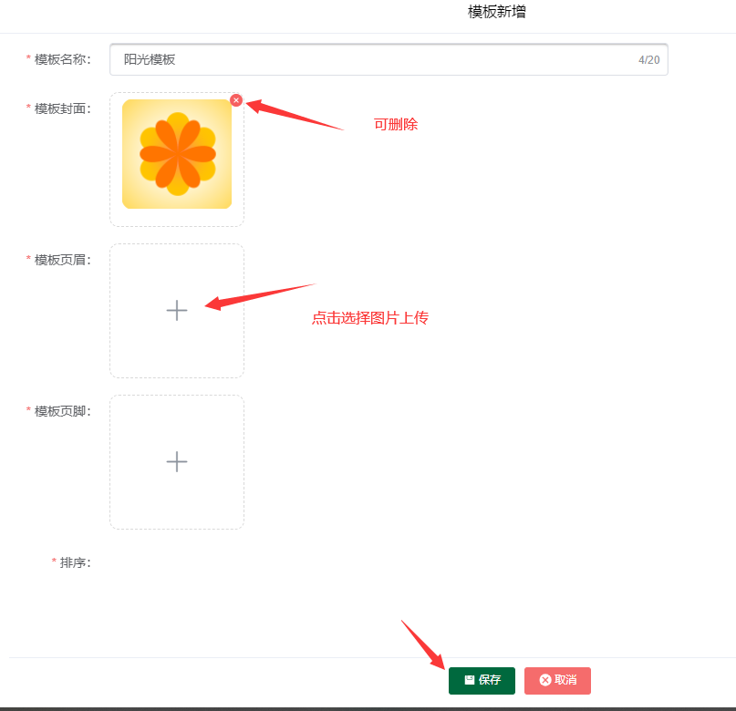

#### **5.1.2.删除/批量**

1、通用模板租户无法选择删除

2、删除被使用过的模板，相关成长手册模板默认显示其中一个

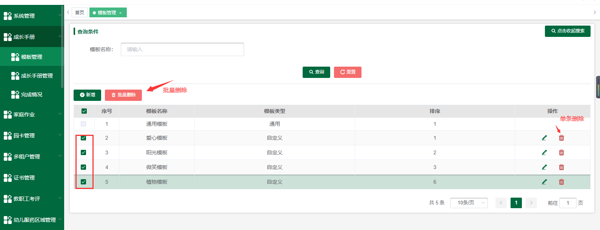

#### **5.1.3编辑**

1. 编辑有数据模板，进入默认显示数据

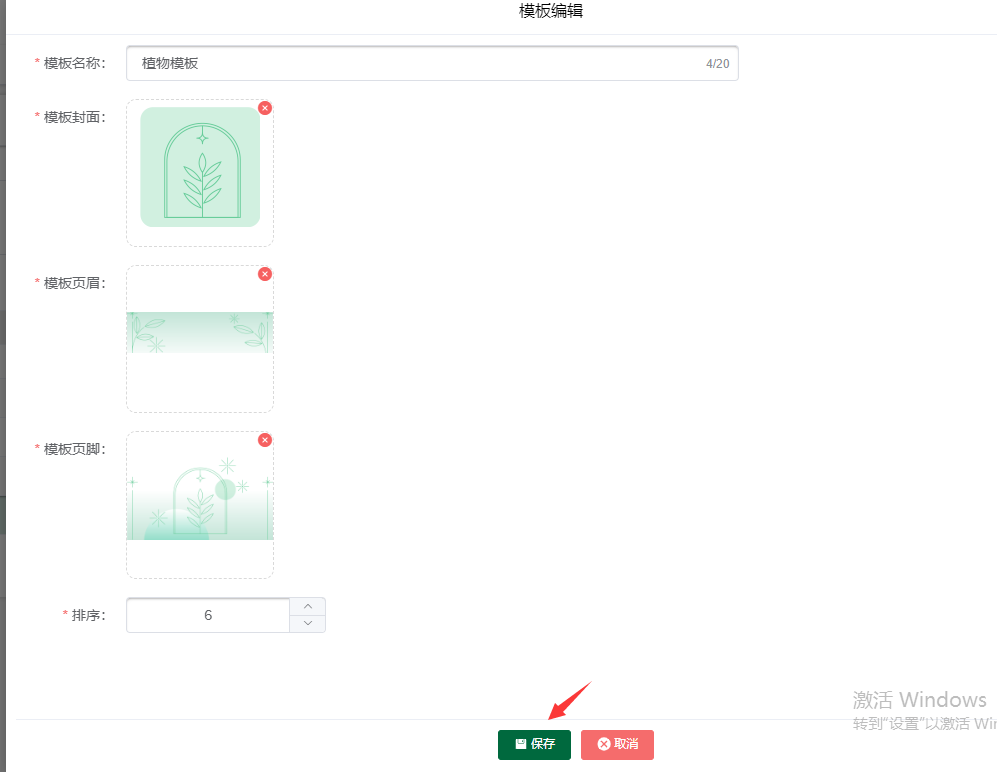

### **成长手册管理**

1、成长手册总管理员可选择全部校区、成长手册分园管理员可选择负责校区、班主任可选择负责则班级所在校区

1. 成长手册总管理员、成长手册分园管理员可选择全部学期、班主任仅可选择当前学期
2. 可模糊搜索班主任和副班主任
3. 月份显示学期范围内

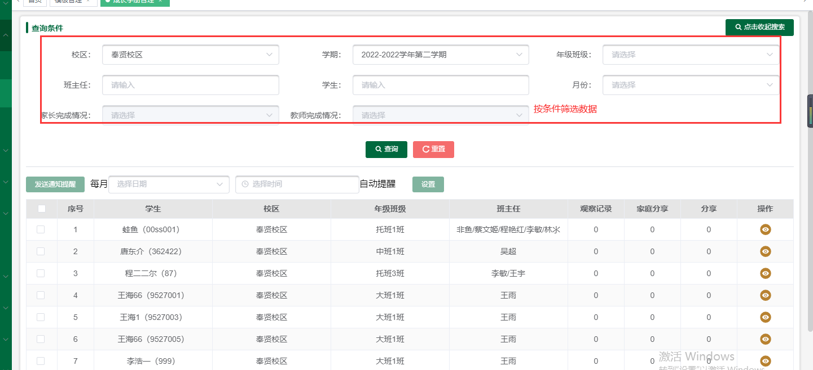

#### 5.2.1发送通知提醒/设置自动提醒

1、只针对本月没有完成的学生进行推送

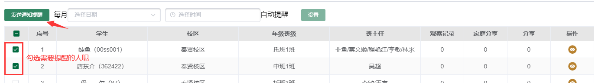

设置

1. 月份时间为1-28天

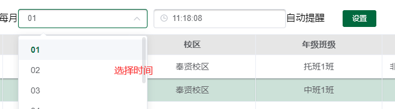

#### **5.2.2查看**

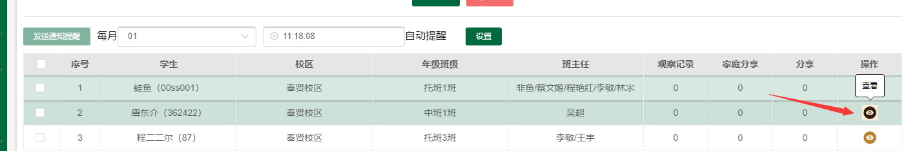

##### **5.2.2.1新增观察记录**

1. 都为必填项
2. 评语必填，1000字以内
3. 模板默认选择第一个（可以选择自己和平台管理员模板）
4. 字号默认中
5. 图片最多限制4张
6. 视频最多上传一个限制200 m
7. 拖动图片可以调整图片排序
8. 非当前学年学期不可编辑操作

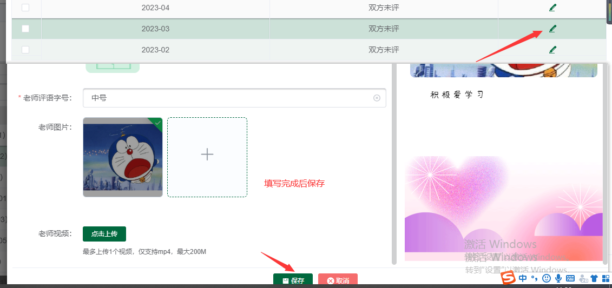

##### **5.2.2.2清空教师评价/清空家长评价**

1、清空时需要选择数据同时输入（我确认清空教师评价、我确认清空家长评价）

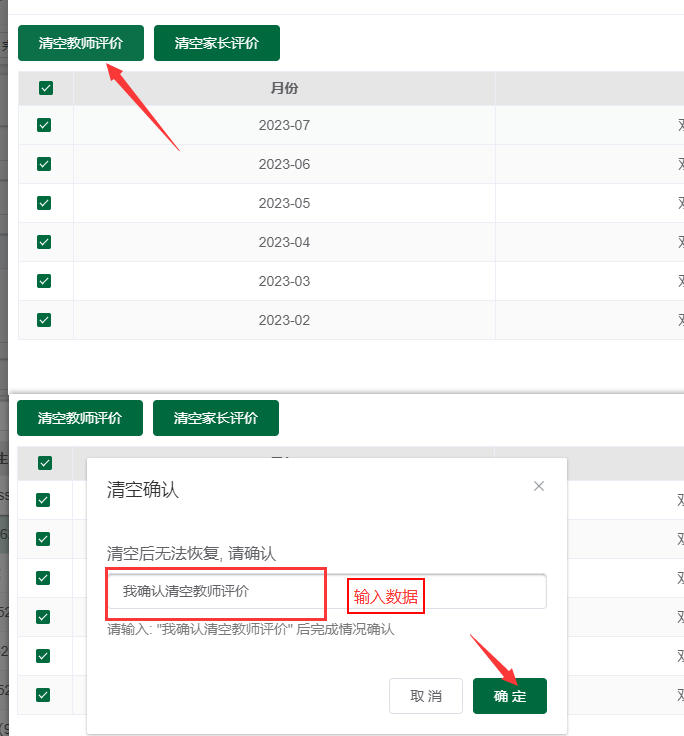

#### 5.2.3打包/全员打包

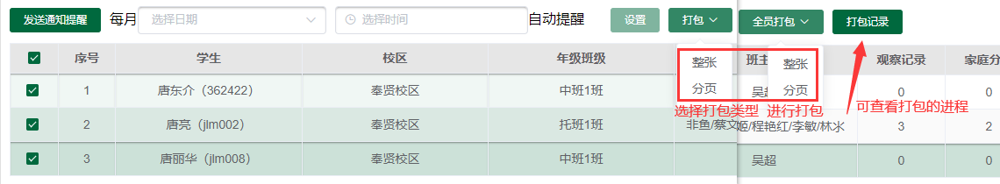

#### **5.2.4打包记录**

多学生：

1、多学生针对全员打包和勾选了多个学生的打包。按用户查看，仅保留最近5条记录。

2、仅保留最近的5条打包记录，其余记录及文件不保存

3、可查看打包记录进程

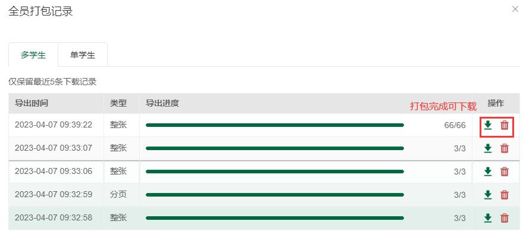

单学生：

1、每个学生每个类型仅存在一条

2、按导出时间倒序排序

3、可根据条件筛选数据

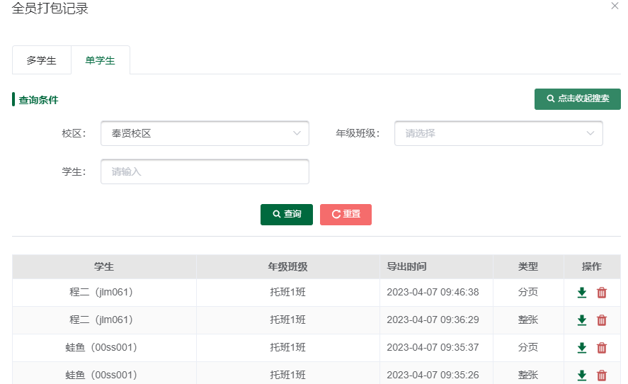

### **完成情况**

1. 点击导出导出数据
2. 班级所有学生在该月份均为双方一平状态的，显示完成图标
3. 按年级班级正序排序，显示该学期所有月份

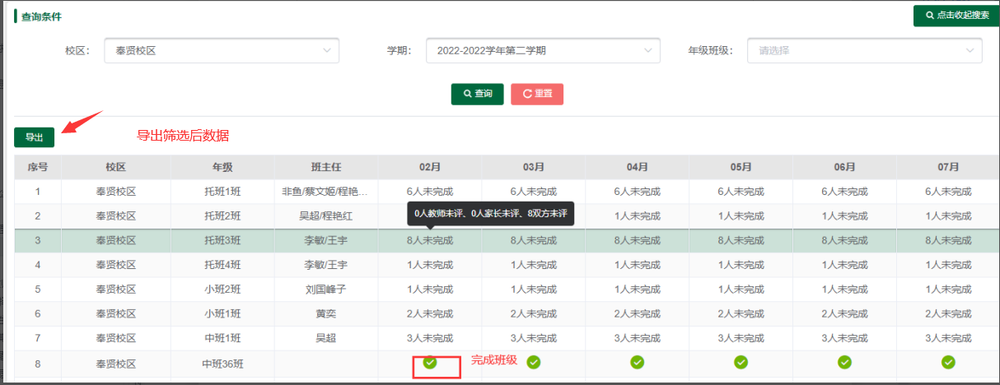

## 移动端

### 6.1.成长手册-教师

##### 6.1.1.班级选择

1、可按班级名称模糊搜索

2、筛选可根据校区、学期、年级、月份筛选

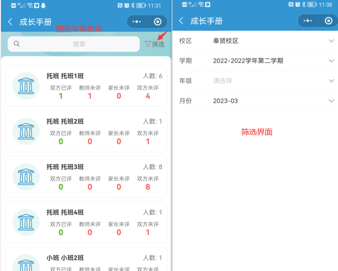

##### **6.1.2.选择学生**

1、撒选根据状态筛选

2、显示班级下所有人的数据

3、显示当前月份的状态

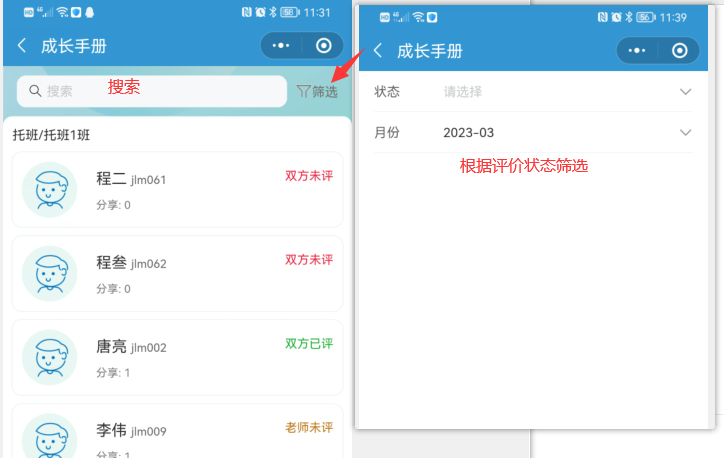

##### **6.1.3选择学期**

1、当前学年学期才能选择观察记录

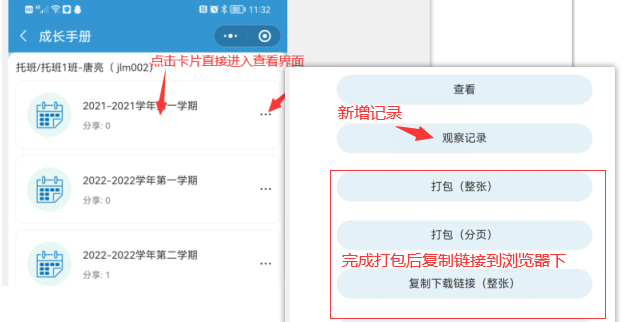

##### **6.1.4.内容查看**

1、成长档案取值于基本信息

2、健康日记界面：租户有菜单权限显示，没有不显示（租户下所有人员）

3、考勤记录：租户有菜单权限显示，没有不显示（租户下所有人员）

##### **6.1.5.观察记录**

1、都为必填项

2、评语必填，1000字以内

3、模板默认选择第一个（可以选择自己和平台管理员模板）

4、字号默认中

5、图片最多限制4张

6、视频最多上传一个限制200 m

7、拖动图片可以调整图片排序

### 6.2.成长手册-家长

#### 6.2.1.学期选择

1、显示这个学生的属于学期数据

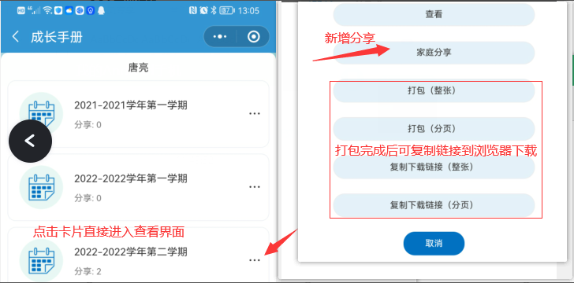

#### 6.2.2.内容查看

1、成长档案取值于基本信息

2、健康日记界面：租户有菜单权限显示，没有不显示（租户下所有人员）

3、考勤记录：租户有菜单权限显示，没有不显示（租户下所有人员）

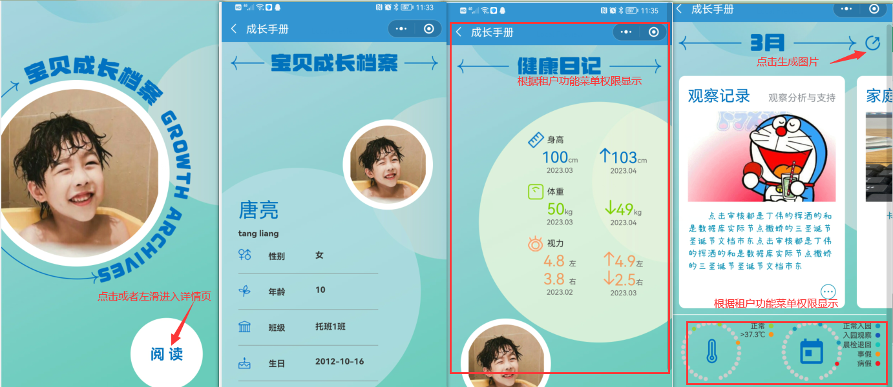

#### 6.2.3.家庭分享

1、都为必填项

2、评语必填，1000字以内

3、模板默认选择第一个（可以选择自己和平台管理员模板）

4、字号默认中

5、图片最多限制4张

6、视频最多上传一个限制200 m

7、拖动图片可以调整图片排序

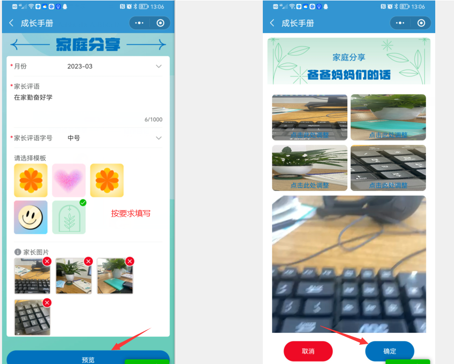