# 使用准备

## 操作系统要求

系统版本：Win7及以上；macOS10.0.4及以上

## 浏览器要求

**建议使用浏览器：Chrome**

兼容的浏览器：Microsoft Edge、Safari、360极速浏览器（等国内浏览器的极速模式）

版本要求：建议使用浏览器的最新版

## 系统访问信息

http://192.168.0.173:89/cjvision4/#/login

## 业务流程图

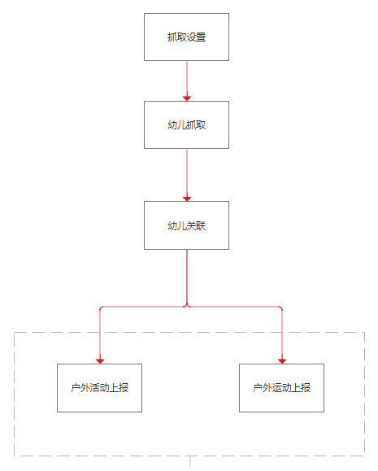

## 角色权限

|  |  |  |
| --- | --- | --- |
| **角色** | **菜单或应用** | **操作权限说明** |
| **户外数据上报管理员** | **抓取设置、幼儿抓取、幼儿关联、户外活动数据上报、户外运动数据上报、时段数据上报** | **全部权限** |
| **平台管理员** | **上报汇总** | **全部权限** |

# 户外数据上报

## 抓取设置（测试环境）

注意事项：打开“幼儿在园户外活动监测”应用场景数据对接授权回执.docx文档，可查看测试环境、正式环境授权信息，现场根据实际情况自行决定使用测试环境还是正式环境的授权信息。

1. 设置认证接口

* 填写请求路径：http://g156579l15.iok.la:23990/authentication
* 填写客户端账号：81892955
* 填写客户端密码：674115824ded430191673d54061d11aa
* 填写密钥：7b5aa7c95b9c47d4914b3e819336dc92

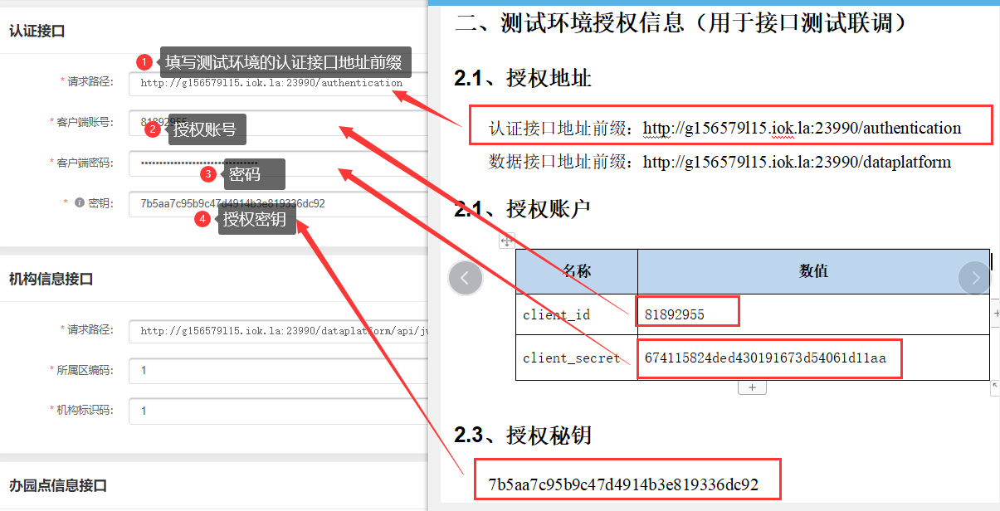

1. 设置机构信息接口

* 填写请求路径：

<http://g156579l15.iok.la:23990/dataplatform>/api/jw\_xqxxb\_tysjkfxt/GetJGXXSQGXJH.do

* 填写所属区编码、机构标识码（现场根据实际情况填写）

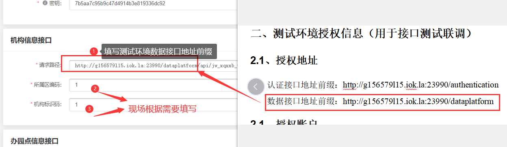

1. 设置办园点信息接口

* 填写请求路径：

<http://g156579l15.iok.la:23990/dataplatform>[/api/jw\_xqxxb\_tysjkfxt/GetBYDXXSQGXJH.do](https://age06.edu.sh.cn/authentication/api/jw_xqxxb_tysjkfxt/GetBYDXXSQGXJH.do)

* 获取办园点，选择办园点：

点击按钮，获取对应机构的办园点，点击下拉选择办园点

注意事项：获取办园点需要上方的认证接口、机构信息接口都填写正确才能获取到对应办园点的数据。

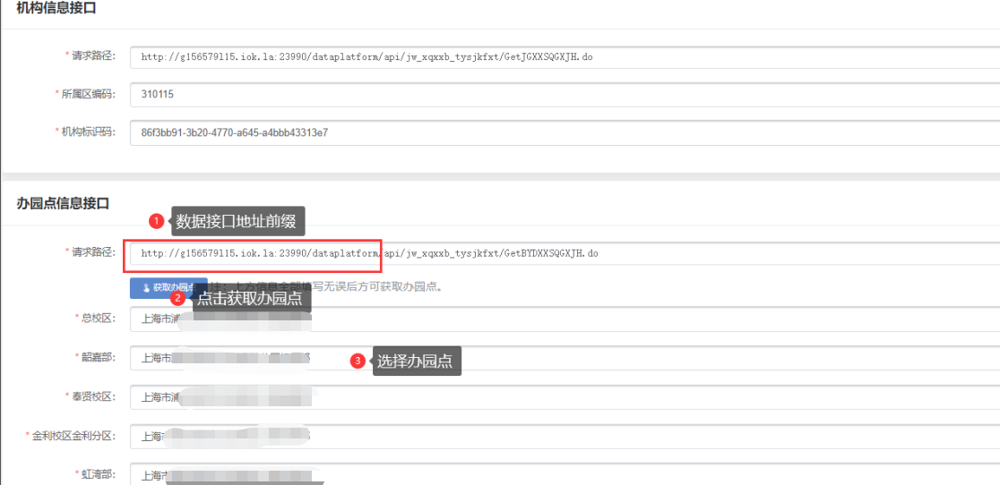

4、设置班级信息、幼儿信息、户外活动达标情况数据、户外运动数据接口

* 设置班级信息接口请求路径：

<http://g156579l15.iok.la:23990/dataplatform>[/api/jw\_xqxxb\_tysjkfxt/GetBJXXSQGXJH.do](http://g156579l15.iok.la:23990/dataplatform/api/jw_xqxxb_tysjkfxt/GetBJXXSQGXJH.do)

* 设置幼儿信息接口请求路径：

<http://g156579l15.iok.la:23990/dataplatform>[/api/jw\_xqxxb\_tysjkfxt/GetYEXXSQGXJH.do](http://g156579l15.iok.la:23990/dataplatform/api/jw_xqxxb_tysjkfxt/GetYEXXSQGXJH.do)

* 设置户外活动达标情况数据接口

请求路径：

<http://g156579l15.iok.la:23990/dataplatform>[/api/jw\_xqxxb\_tysjkfxt/saveActivity.do](http://g156579l15.iok.la:23990/dataplatform/api/jw_xqxxb_tysjkfxt/saveActivity.do)

请求路径（时段）：

http://g156579l15.iok.la:23990/dataplatform/api/jw\_xqxxb\_tysjkfxt/saveActivityTimeSpan.do

* 设置户外运动数据接口

<http://g156579l15.iok.la:23990/dataplatform>[/api/jw\_xqxxb\_tysjkfxt/saveSport.do](http://g156579l15.iok.la:23990/dataplatform/api/jw_xqxxb_tysjkfxt/saveSport.do)

请求路径（时段）：

http://g156579l15.iok.la:23990/dataplatform/api/jw\_xqxxb\_tysjkfxt/saveSportTimeSpan.do

* 室内外人数数据接口：

http://g156579l15.iok.la:23990/dataplatform/api/jw\_xqxxb\_tysjkfxt/saveOutInNum.do

设置完成后点击保存即可。

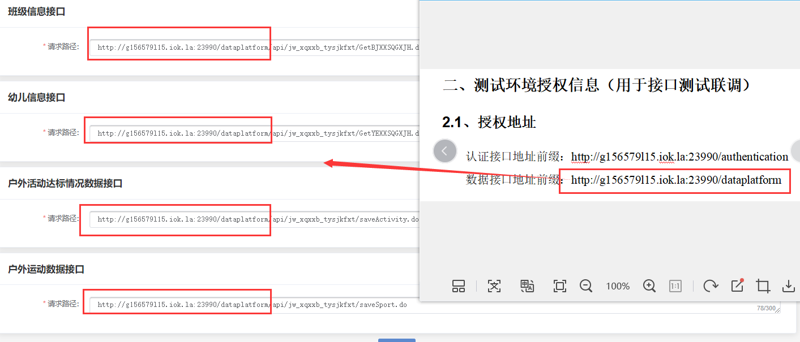

## 抓取设置（正式环境）

1. 设置认证接口

* 填写请求路径：https://age06.edu.sh.cn/authentication
* 填写客户端账号：77473639
* 填写客户端密码：fe0db73955a847cdb7bdfe976b34b302
* 填写密钥：a1d9cfc4b2814b7b979b6e322516907a

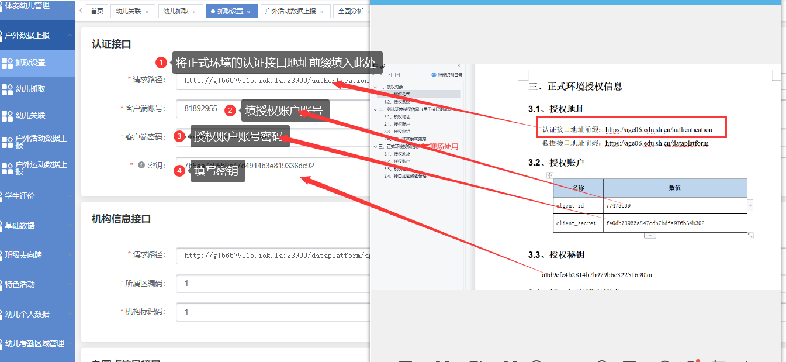

1. 设置机构信息接口

* 填写请求路径：

https://age06.edu.sh.cn/dataplatform/api/jw\_xqxxb\_tysjkfxt/GetJGXXSQGXJH.do

* 填写所属区编码、机构标识码（现场根据实际情况填写）

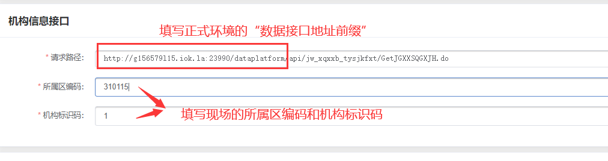

1. 设置办园点信息接口

* 填写请求路径：

[https://age06.edu.sh.cn/dataplatform/api/jw\_xqxxb\_tysjkfxt/GetBYDXXSQGXJH.do](https://age06.edu.sh.cn/authentication/api/jw_xqxxb_tysjkfxt/GetBYDXXSQGXJH.do)

* 获取办园点，选择办园点：

点击按钮，获取对应机构的办园点，点击下拉选择办园点

注意事项：获取办园点需要上方的认证接口、机构信息接口都填写正确才能获取到对应办园点的数据。

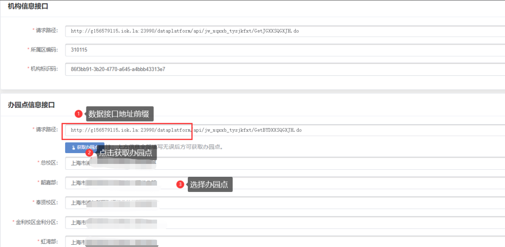

4、设置班级信息、幼儿信息、户外活动达标情况数据、户外运动数据接口

* 设置班级信息接口请求路径：

[https://age06.edu.sh.cn/dataplatform/api/jw\_xqxxb\_tysjkfxt/GetBJXXSQGXJH.do](http://g156579l15.iok.la:23990/dataplatform/api/jw_xqxxb_tysjkfxt/GetBJXXSQGXJH.do)

* 设置幼儿信息接口请求路径：

[https://age06.edu.sh.cn/dataplatform/api/jw\_xqxxb\_tysjkfxt/GetYEXXSQGXJH.do](http://g156579l15.iok.la:23990/dataplatform/api/jw_xqxxb_tysjkfxt/GetYEXXSQGXJH.do)

* 设置户外活动达标情况数据接口：

请求路径：

[https://age06.edu.sh.cn/dataplatform/api/jw\_xqxxb\_tysjkfxt/saveActivity.do](http://g156579l15.iok.la:23990/dataplatform/api/jw_xqxxb_tysjkfxt/saveActivity.do)

请求路径（时段）：

https://age06.edu.sh.cn/dataplatform/api/jw\_xqxxb\_tysjkfxt/saveActivityTimeSpan.do

* 设置户外运动数据接口：

请求路径：

[https://age06.edu.sh.cn/dataplatform/api/jw\_xqxxb\_tysjkfxt/saveSport.do](http://g156579l15.iok.la:23990/dataplatform/api/jw_xqxxb_tysjkfxt/saveSport.do)

请求路径（时段）：

https://age06.edu.sh.cn/dataplatform/api/jw\_xqxxb\_tysjkfxt/saveSportTimeSpan.do

* 室内外人数数据接口：

https://age06.edu.sh.cn/dataplatform/api/jw\_xqxxb\_tysjkfxt/saveOutInNum.do

设置完成后点击保存即可。

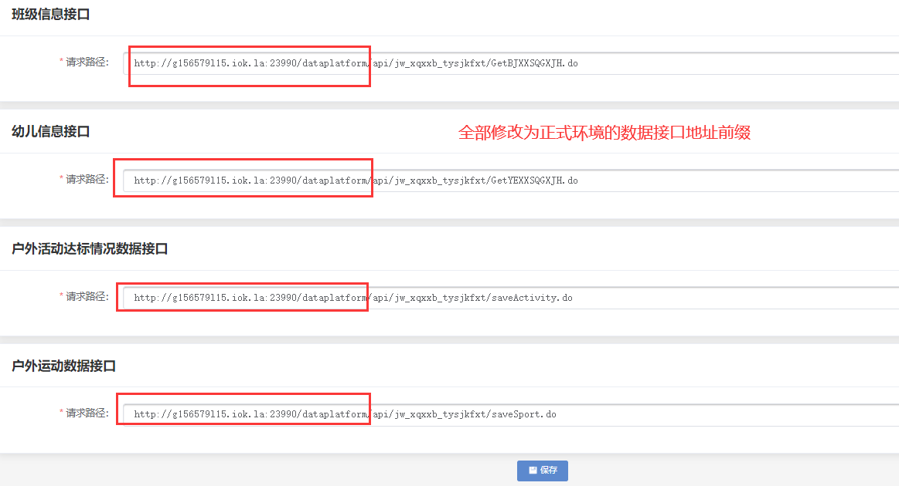

## **幼儿抓取**

### 抓取

点击按钮，点击确定即可抓取到抓取设置处设置的学校校区下的幼儿信息。

注意事项：若显示抓取失败，请检查抓取设置处的设置的是否正确。

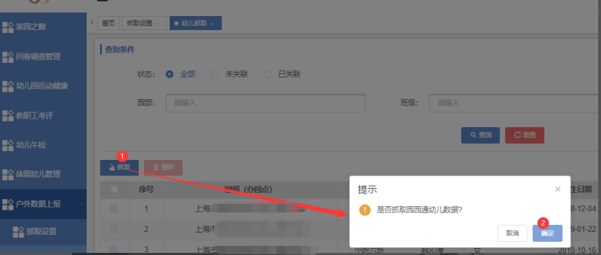

### **查看幼儿详情**

点击查看详情按钮，可查看幼儿的详细信息。

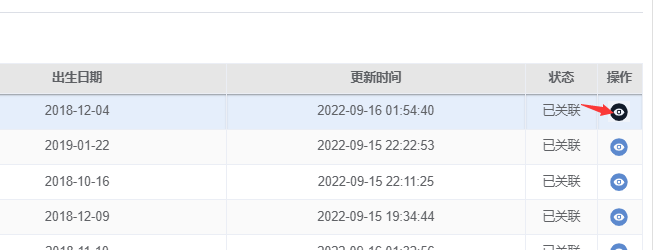

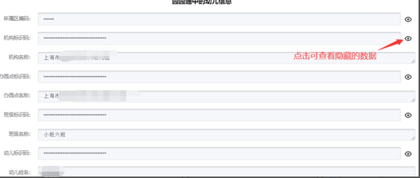

### **查询**

点击关联、未关联可筛选对应状态的幼儿数据。

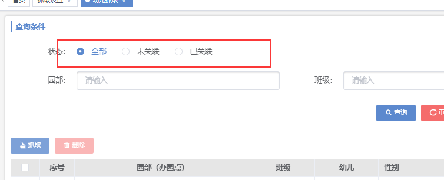

## 幼儿关联

### 一键关联

点击按钮，选择关联依据，点击确定即可

注意事项：选择”全部“时，已有关联关系的数据会被覆盖。

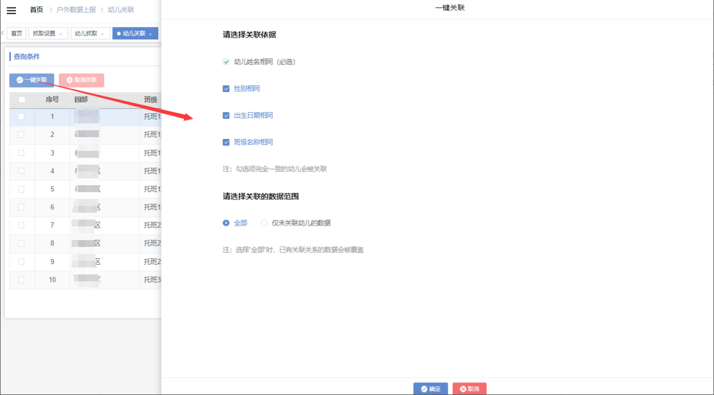

### 调整

点击按钮，进入调整页面（默认查询当前幼儿姓名），点击按钮，可对幼儿进行关联，点击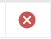按钮，可取消幼儿关联。

注意事项：手动调整幼儿，如果幼儿已有关联数据的，无法继续关联其他幼儿。

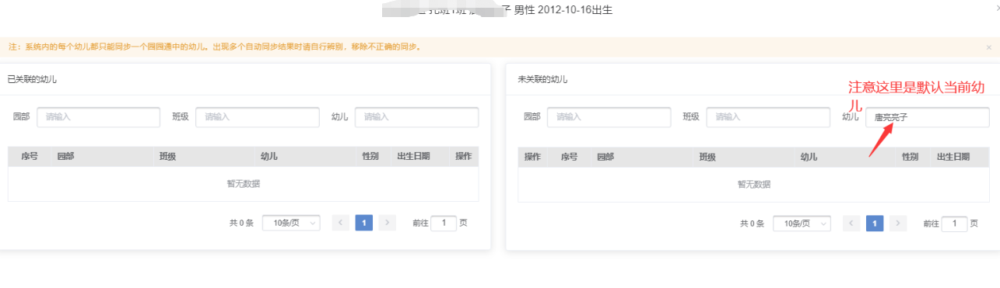

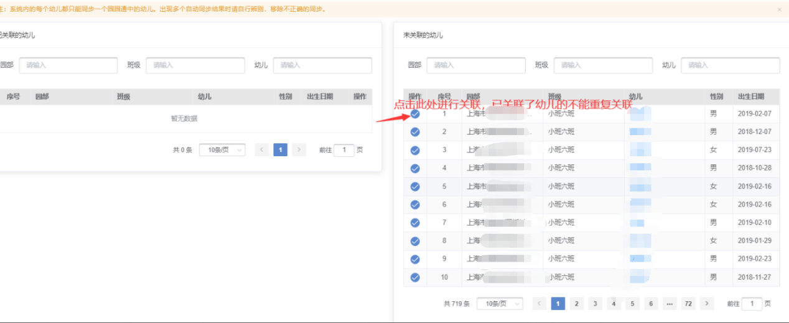

点击幼儿姓名，可查看幼儿详情

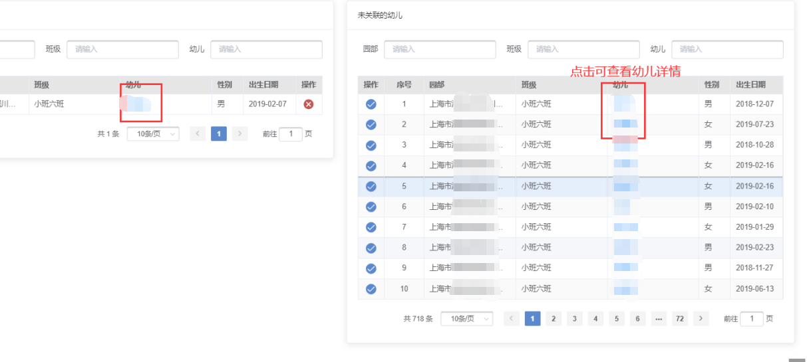

### 数据上报开启/关闭

只有关闭时，才能进行一键关联、取消关联、调整操作。关闭后，之后的所有业务数据上报都会停止，此时才可以调整学生的关联关系。打开后，才能进行业务数据上报。

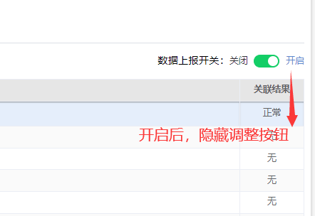

### 取消关联

选择需要取消关联的数据，点击取消关联按钮，点击确定即可取消。

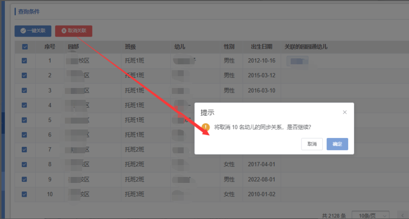

## 户外活动/运动数据上报

### 上报数据

选择需要上报的幼儿，点击上报数据，点击确定，即可进行上报。

注意事项：不选择幼儿时，点击上报数据按钮，是直接上报全部幼儿数据。

若数据补录处学生的参与状态为--，则户外活动/运动数据上报处无需上报该学生的数据。

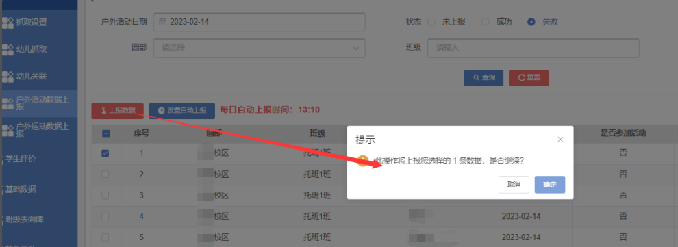

### 设置自动上报

设置自动上报：点击设置自动上报按钮，设置时间，点击确定即可设置成功。

取消自动上报：点击设置自动上报按钮，点击“否”，点击确定即可。

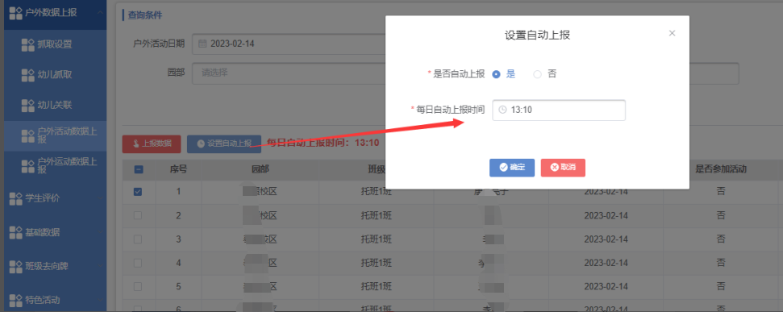

### 查看上报数据详情

点击查看按钮，可查看园园通中的幼儿信息、上报数据以及上报情况。

注意事项：在上报情况处可查看该幼儿上报失败的原因。

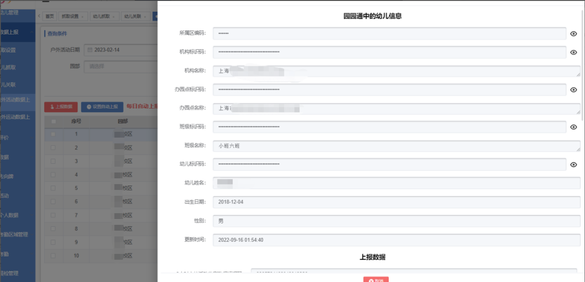

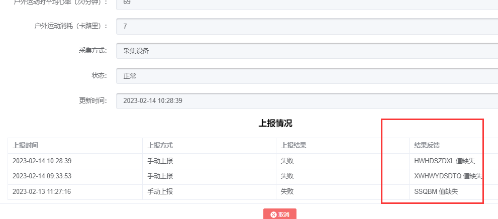

### 查询成功/失败幼儿数据

点击成功或失败按钮，可查询对应状态下的幼儿数据。

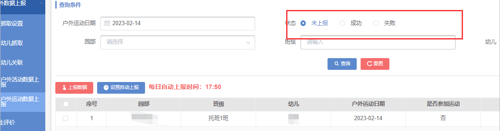

## 时段数据上报

### 上报活动数据、上报运动数据

选择需要上报的幼儿，点击上报活动/运动数据按钮，点击确定，即可进行手动上报。

注意事项：不选择幼儿时，点击上报活动/运动数据按钮，是直接上报全部幼儿数据。

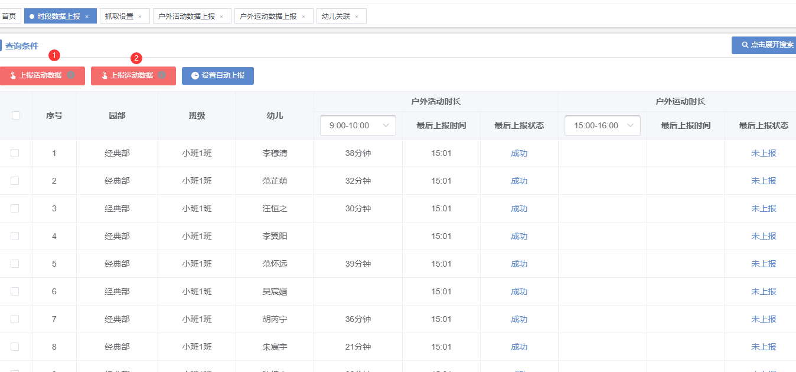

### 设置自动上报

点击设置自动上报按钮，选择是/否上报按钮，点击确定即可。

注意：

1. 天气：按小时取值的，取当前时间的天气，上午上报时下午天气同上午天气，18点后上报的天气取18的
2. 定时任务：每小时的10分触发（上报全部时段的数据）

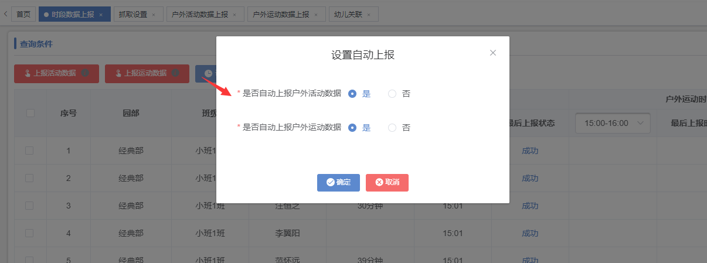

3、幼儿关联下的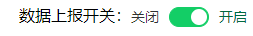开关关闭后，无法上报时段数据，也不会进行自动上报。

### 查看上报活动/运动数据

1. 点击最后上报状态，查看上报详情

注意事项：在上报情况处可查看该幼儿上报失败的原因。

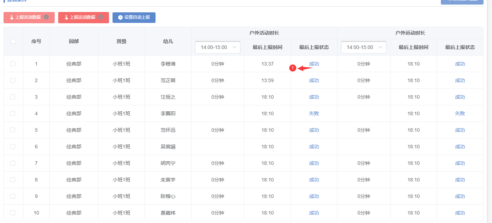

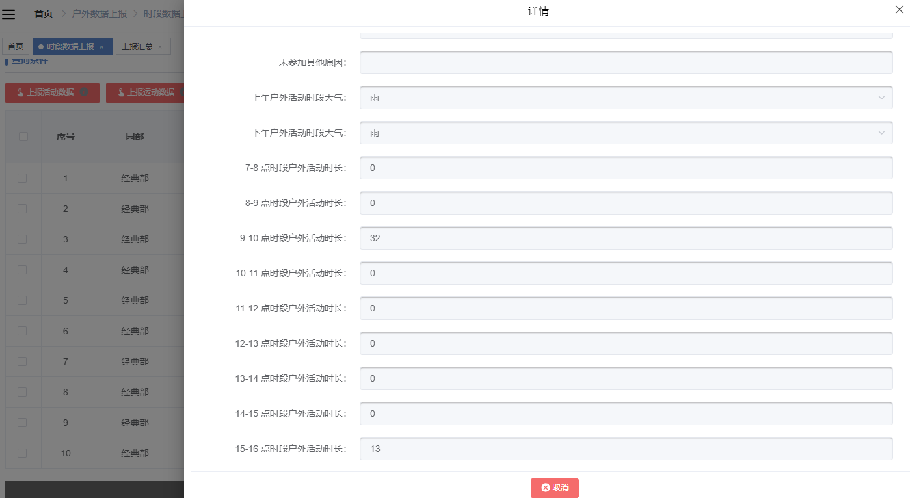

## 上报汇总

### 一键上报

1. 点击按钮
2. 选择上报数据的范围，选择上报幼儿园
3. 点击保存

注意：上报汇总一键上报，上报的为当前选中的一周的数据

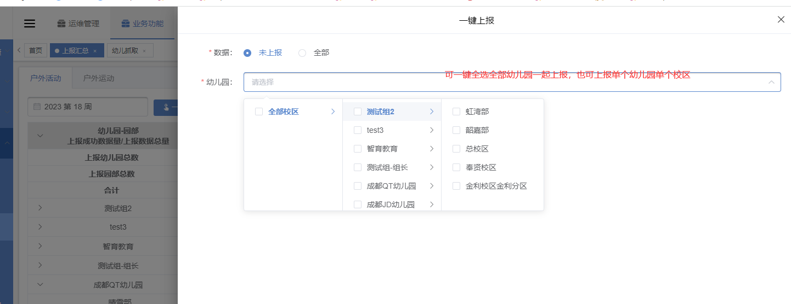

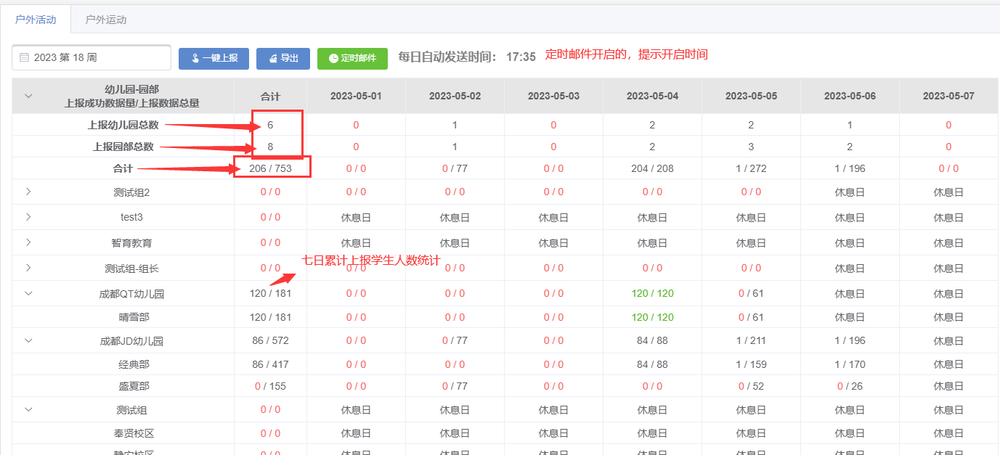

### 定时邮件

1. 点击按钮
2. 选择开启或关闭是否自动发送邮件按钮，若选择为是，则点击添加邮箱输入邮箱号
3. 点击保存即可

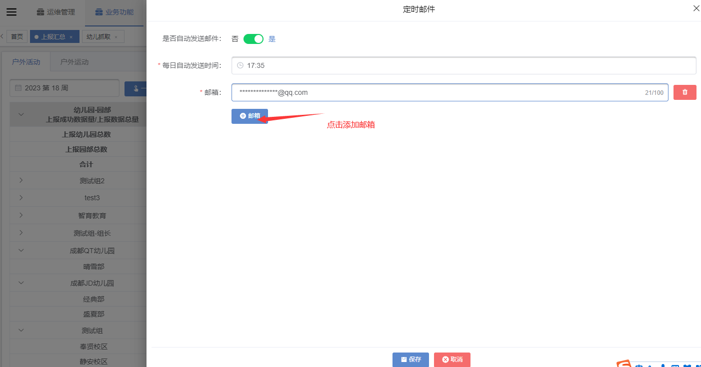