# 使用准备

## 操作系统要求

系统版本：OWW213\_11\_A.18

## 浏览器要求

**建议使用浏览器：Chrome**

兼容的浏览器：Microsoft Edge、Safari、360极速浏览器（等国内浏览器的极速模式）

版本要求：建议使用浏览器的最新版

## 系统访问信息

<http://192.168.0.173:89/cjvision4/#/qyyeydjk/sjfx>

及oppo手表

## 业务流程图

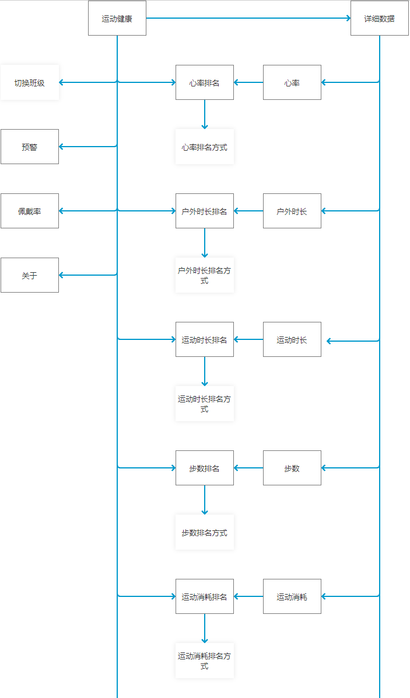

## 角色权限

|  |  |  |
| --- | --- | --- |
| **角色** | **菜单或应用** | **操作权限说明** |
| **运动健康总管理员** | **手表所有功能** | **所有权限除预警中的全部已处理** |
| **运动健康分管理员** | **手表所有功能** | **所有权限除只能选择自己所属校区下的班级和预警中的全部已处理** |
| **总园长** | **手表所有功能** | **所有权限除预警中的全部已处理** |
| **分园长** | **手表所有功能** | **所有权限除只能选择自己所属校区下的班级和预警中的全部已处理** |
| **班主任** | **手表所有功能** | **所有权限除只能选择自己所属班级** |

## 手表功能

### 手表首页

表盘正上方的蓝色图标是代表ucare的功能运行中，并且此时没有未处理的预警数据，如果有未处理的预警数据，表盘正中间的上方显示红色感叹号图标，如下图。

## 后台运行页面

点击表盘上的logo或者红色感叹号进入下图页面。

## 绑定页

绑定方法：可扫码绑定（通过ucare小程序/企业微信/钉钉里的绑定设备功能扫码）

可通过平台管理员在PC端教师手表功能绑定

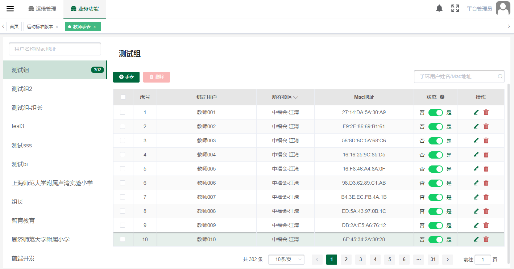

## 运动健康

### 切换班级

点击切换班级，默认会选中第一个校区和第一个班级，运动健康总管理员、总园长可以选择所有校区和所有班级，运动健康分管理员、分园长可以选择自己所属校区下的班级，班主任可选择自己所属班级。

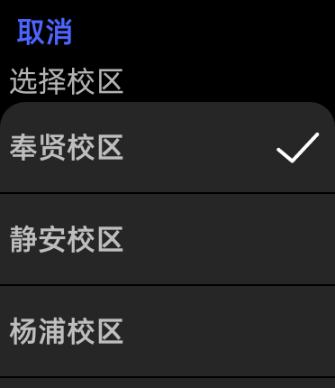

### 预警

点击首页的预警数据进入预警列表页面，页面数据按时间倒叙排列，并且同一个人同一个预警类型只显示最新的一条数据。页面有一键到底按钮，点击一下直接滑动到最后一条数据。运动健康总管理员、总园长、运动健康分管理员、分园长没有全部已处理功能，班主任有全部已处理功能。点击全部已处理弹出是否确认处理对话框。

### 手环佩戴率

点击首页的人数进入手环佩戴页，比如2/6，其中2代表（当天有手环数据的幼儿人数-当前脱队的幼儿人数），6代表当天有手环数据的幼儿人数。点击后进入手环佩戴页面，页面显示当前脱队、今日佩戴、今日未佩戴、未绑定手环数据（前提是有这些数据就会对应的显示）

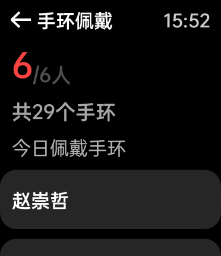

## 心率排名

点击首页的心率趋势柱状图进入心率排行页面，排名顺序可以按心率升序、降序或者按班内序号排名，默认按心率降序排名。

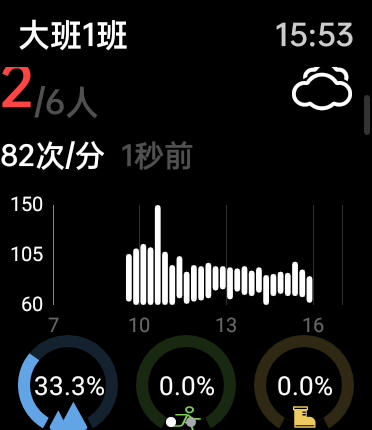

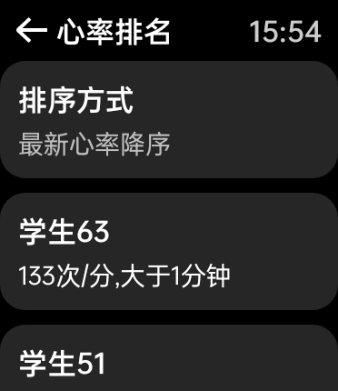

## 户外时长排名

点击下图的户外时长百分比图标或者户外时长人数行可以进入户外时长排名页，页面默认按户外时长倒叙排列，也可以手动修改排序规格，还可按户外时长升序或者班内序号排名。

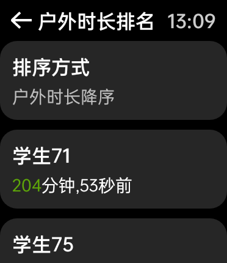

## 运动时长排名

点击下图的运动时长百分比图标或者运动时长人数行可以进入运动时长排名页，页面默认按运动时长倒叙排列，也可以手动修改排序规格，还可按运动时长升序或者班内序号排名。

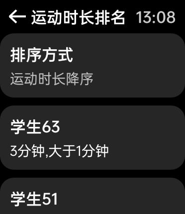

## 步数排名

点击下图的步数百分比图标或者步数人数行可以进入步数排名页，页面默认按步数倒叙排列，也可以手动修改排序规格，还可按步数升序或者班内序号排名。

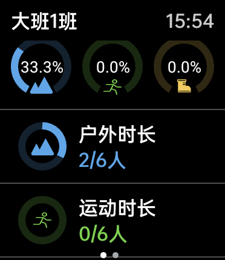

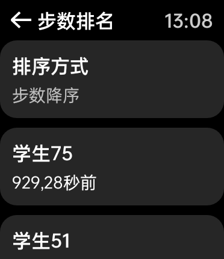

## 关于

滑动手表第一页到底部，然后点击关于，关于页面介绍了一部分数据后，最下面显示更新版本和解绑手表按钮。

## 更新版本

更新版本会在每天第一次打开手表自动检查更新一次，如果有更新会提示有新的版本,请及时更新，也可在【关于】页中手动更新，然后选择立即更新或者暂不更新。如果是最新的版本点击更新版本提示当前已经是最新的版本。

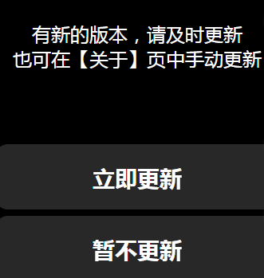

## 解绑手表

解绑手表点击后会弹出是否确定解绑手表对话框，不解绑就取消解绑，确定就确认解绑。

## 心率

向左滑动进入第二页，第二页面如下图，点击心率进入心率页面，页面包括心率每15分钟的趋势图，图上标注平均值，并且超过最大或最小心率有预警线显示。趋势图下显示平均心率及当天心率的最小最大范围，平均运动心率及当天平均心率的最小最大范围，页面最底部显示心率排名按钮，点击进入心率排行页面。

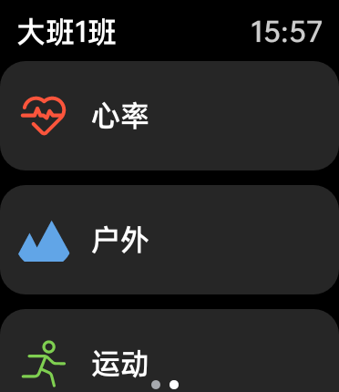

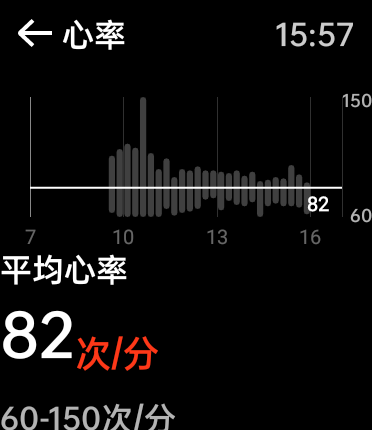

## 户外时长

点击户外进入户外时长页面，页面包括户外时长每15分钟的趋势图，趋势图下显示人均户外时长及当天户外时长的最小最大范围，更多下显示户外时长排名，点击进入户外时长排名页。

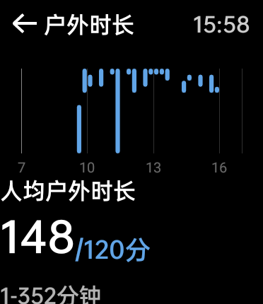

## 运动时长

点击运动进入运动时长页面，页面包括运动时长每15分钟的趋势图，趋势图下显示人均运动时长及当天运动时长的最小最大范围，更多下显示运动时长排名，点击进入运动时长排名页。

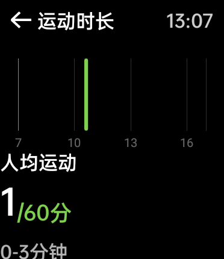

## 步数

点击步数进入步数页面，页面包括步数每15分钟的趋势图，趋势图下显示人均步数及当天步数的最小最大范围，更多下显示步数排名，点击进入步数排名页。

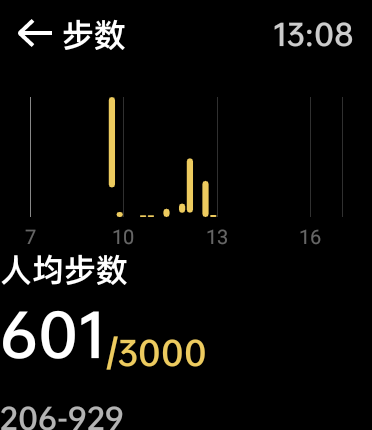

## 运动消耗

点击运动消耗进入运动消耗页面，页面包括运动消耗每15分钟的趋势图，趋势图下显示人均运动消耗及当天运动消耗的最小最大范围，更多下显示运动消耗排名，点击进入运动消耗排名页。

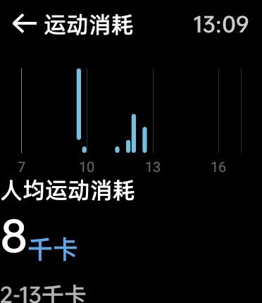