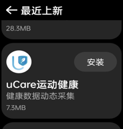
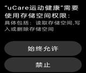
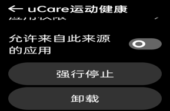
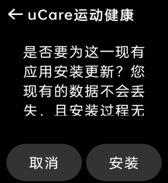
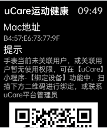
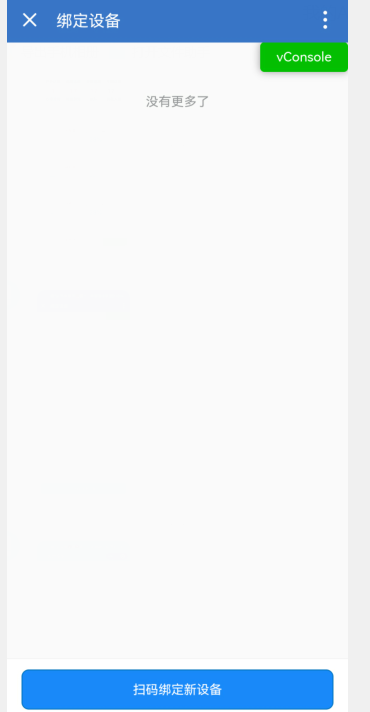
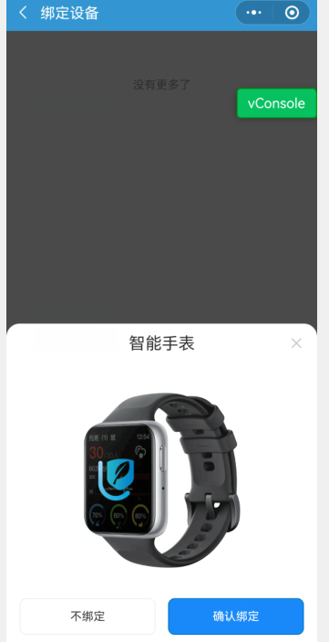
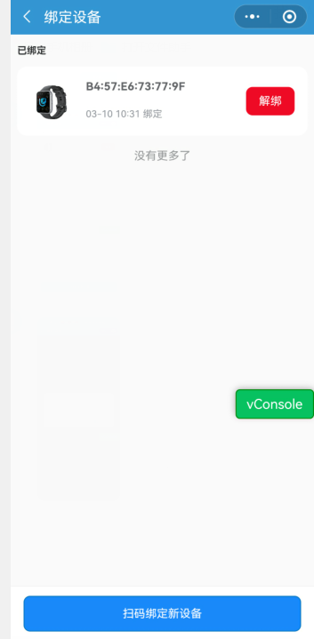
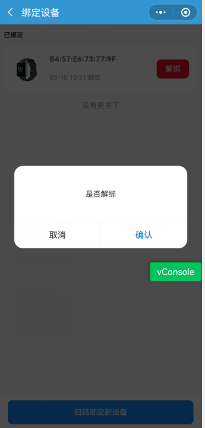

# 长江唯诚uCare运动健康 教师手表（手环）安装指南

## 初次激活手表的方法

1. 手机扫描下方二维码，下载并安装OPPO的“欢太健康App” ，图标为

，

1. 打开手机上的“欢太健康 App”，登录或注册账号；
2. 手表充电开机或长按功能键（右侧的下键）开机后，选择系统语言，并按界面指引打开配对二维码;
3. 在“欢太健康 App”中点击 设备 ＞ 添加设备，扫描手表上显示的配对二维码，按照屏幕提示完成连接
4. 到此手表初次激活成功，手表可以直接连接网络，以后的操作不再依赖手机，可以断开手机与手表的蓝牙连接。

## 手表连接网络的三种方式

1. 通过手表的**wifi**连接局域网（必须）

注：如果学校有多个不同的Wifi信号，为保证网络通畅，请将各个wifi信号都连接一遍。

1. 通过已配对的手机**蓝牙**进行网络数据传输（安卓手机支持，IOS不支持）。但限制于蓝牙的传输性能，蓝牙网络的速度与稳定性也受到限制，速度只能维持在80~120K左右。

注：uCare运动健康APP不使用蓝牙，如果多位老师共用1块手表，建议手机上蓝牙设置为“忽略此设备”，手机不和手表建立蓝牙连接，断开蓝牙后也可以在手机上解绑手表。

1. 通过**eSIM**卡独立连接网络：需要联系运营商（如：电信）开通eSIM卡；开通后在手机“健康”App「设备 > eSIM管理」中操作即可；启用eSIM功能后，开启手表移动数据即可访问网络。

## 从手表软件商店安装uCare运动健康APP并升级到最新版本

1. 按下手表右侧按钮，进入手表应用列表页面，找到软件商店应用
2. 进入软件商店后，往下滑动找到“uCare运动健康”应用，并点击安装

1. 进入uCare运动健康应用后，在首页下滑到底部，点击关于按钮进入关于页面；

注：此时应用中显示的数据均为模拟的演示数据，无需关注

1. 在关于页面长按3次uCare运动健康下方的图标后（长按后会有震动效果），会弹出的自动更新的提示，然后选择立即更新

1. 应用会请求存储权限，点击始终允许

1. 等待下载完成后，会弹出权限提示框，选择设置

1. 在跳转的页面中滑动到底部打开【允许来自此源的应用】开关，然后点击左上角返回或左滑返回

1. 回到app更新页面点击安装，待安装完成后即可正常使用！

## 绑定班级

手表上安装好“uCare运动健康”app后，页面如下图

然后找到小程序/企业微信/钉钉里的uCare，如下图

账号密码登录后，点击“绑定设备”，出现下图页面。

 

 

## uCare运动健康应用的安装（adb安装方式）

**注：此方式仅限于我司服务工程师操作。**

1. 确认电脑安装了adb运行环境（校验方法：打开命令行输入adb version，如果显示：Android Debug Bridge version xxxxx 即有adb运行环境）。如果没有运行环境，请参考：<https://www.shuzhiduo.com/A/x9J23XPE56/#google_vignette>配置adb环境
2. 在手表->设置->其他设置->关于手表中找到版本号栏目，连续点击版本号直到手表显示处于开发者模式。退出到其他设置页面，进入开发者选项，找到usb调试并打开
3. 将手表置于手表底座，利用数据线连接电脑和手表（手表底座），（第一次连接手表会有一个连接确认提示，点击确定即可）
4. 在电脑中打开命令行窗口，输入adb devices验证adb是否识别到设备
5. 在命令行输入 adb install -g ucare运动健康app全路径，比如 adb install -g C:\Users\Admin\Downloads\a.apk。如果安装失败，检查下是否有中文路径（有些adb版本不支持中文路径，请将安装包移动到全英文路径下再执行安装），
6. 执行完成并查看手表中应用安装完毕后。进入手表设置中的开发者选项，关闭开发者模式（开发者功能对于设备属于高危功能，用户日常使用无需此功能）。