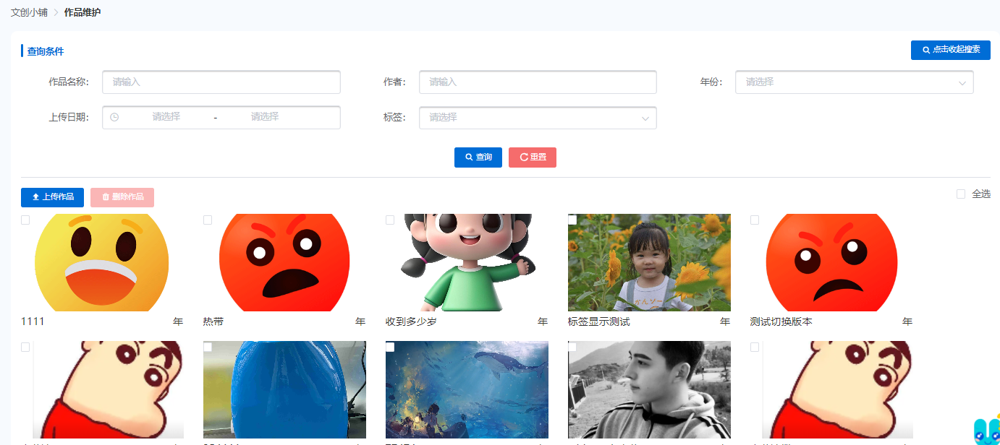
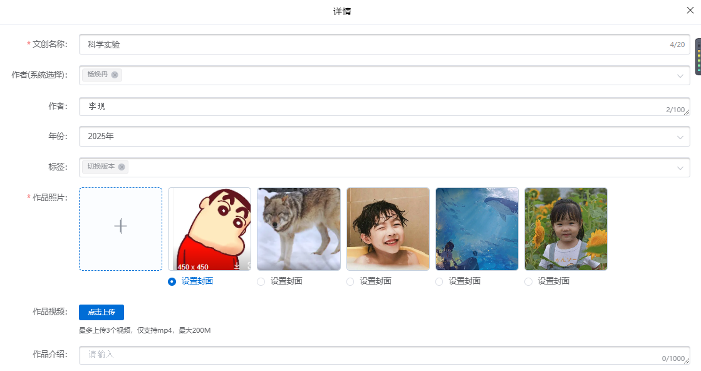
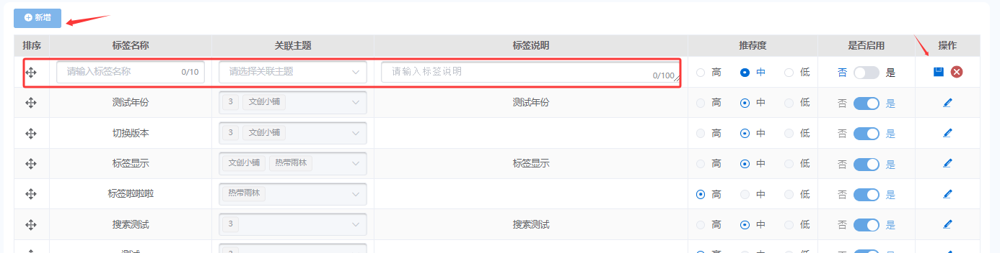
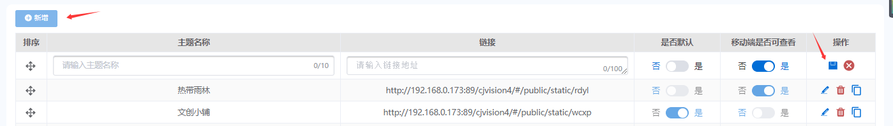
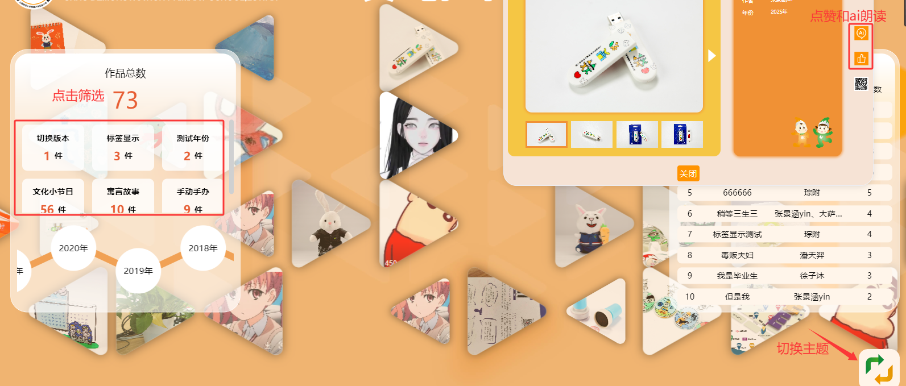
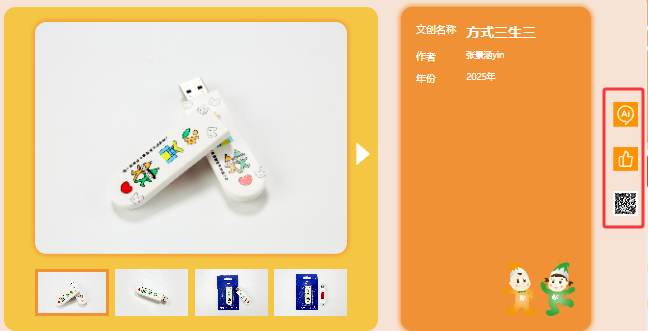
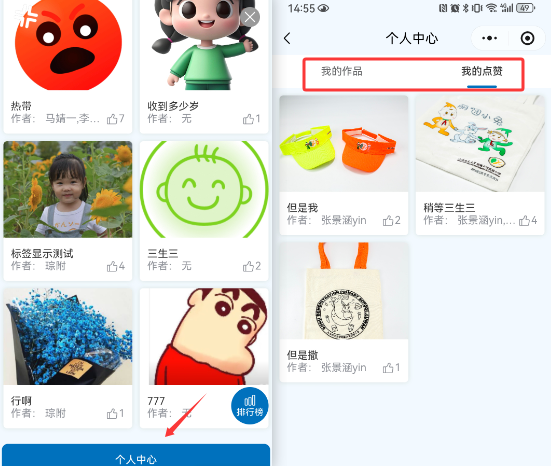
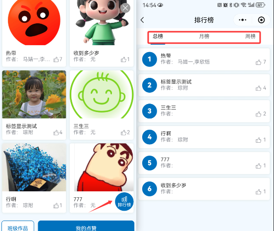
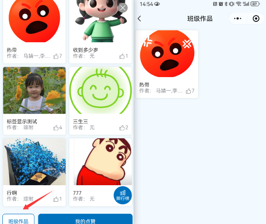

# 使用准备

## 操作系统要求

系统版本：Win7及以上；macOS10.0.4及以上

## 浏览器要求

**建议使用浏览器：Chrome**

兼容的浏览器：Microsoft Edge、Safari、360极速浏览器（等国内浏览器的极速模式）

版本要求：建议使用浏览器的最新版

## 系统访问信息

http://192.168.0.173:89/cjvision4/#/lwsx/wcxp/

## 业务流程图

## 角色权限

|  |  |  |
| --- | --- | --- |
| **角色** | **菜单或应用** | **操作权限说明** |
| **文创管理员** | **作品维护、标签维护、主题维护、大屏** | **新增、编辑、删除** |
| **老师** | **文创小铺（老师）** | **查看、操作** |
| **学生** | **文创小铺（学生）** | **查看、操作** |

# Pc端

## 作品维护

1、上传作品，点击弹出上传页面

2、删除作品，点击删除勾选作品

3、未全选时，显示全选按钮，点击全选，全选是显示取消全选按钮，点击取消全选

4、先按年份倒序排序，相同年份的按上传时间倒序排序

### 新增

1、名称：文本，20个字以内，必填，文创名称+作者+年份不可重复，必填

2、可选择标签维护中启用的标签，多选，非必填

3、签关联多个，则将多个标签的推荐度相加

4、未关联标签的需要默认的推荐度

5、单张照片20M以内，最多20张

6、作者字段分成两个，1能选系统现有名单，2可以支持文本填写。前端显示合并成一个字段。

## **标签维护**

1、文本，10个字以内，必填，不可重复

2、字典表维护推荐度名称及对应的频次参数

3、推荐度对应大屏上此标签关联作品的出现频次

4、控制大屏是否显示该标签及作品维护中是否可选用

5、调整排序，控制大屏及作品维护中标签的显示顺序

6、添加关联主题，可选主题维护中维护的主题

## **主题维护**

1、文本，10个字以内，必填，不可重复

2、控制大屏入库进入后，显示哪个主题，大屏切换主题后，自动设置对应主题为默认

3、设置一个主题为默认，同时关闭其他主题默认

4、使用的不可删除，不显示删除按钮

5、调整排序，控制大屏及作品维护中标签的显示顺序

6、添加移动端是否可查看

## **大屏**

1、可显示标签及年份

2、可选中，选中后显示标签或年份对应的作品，再次点击取消选中

3、先显示标签再显示年份，年份倒序，可上下滑动

4、作品池显示作品设置的封面的图片

5、可按标签设置的推荐度对应不同的出现频次

6、整体从左向右移动，小图明暗大小随机变化三角形图片实现放大缩小效果【闪烁效果】

### 详情

1、语音播报结束后，1分钟无操作（点赞及播报、图片切换），自动关闭

2、点赞时间间隔，10秒内不可重复点赞

3、语音播报在有其他音频播放时提示

4、视频有其他语音播报时提示并静音播放

5、轮播手动切换不自动轮播

# 移动端

## 作品列表（学生）

1、点击班级作品，查看学生当前所在班级的所有学生的作品

2、若该学生当前班级所有学生均无作品，则不显示班级作品入口

3、个人中心，点击进入我的作品，查看学生自己的作品

4、主题维护中，为开启移动端查看的主题的作品不显示，仅显示开启移动端查看的作品，没有标签的不显示

## 作品列表（老师）

### 排行榜

1、班级作品仅班主任显示，点击班级作品，查看当前负责班级的所有学生的作品

2、按点赞数倒序排序，仅显示前10

3、点击进入作品查看页面查看作品详情

### 班级作品

1、班级作品仅班主任显示，点击班级作品，查看当前负责班级的所有学生的作品

2、我的点赞，点击进入我点赞，查看自己点赞的作品

3、主题维护中，为开启移动端查看的主题的作品不显示，仅显示开启移动端查看的作品，没有标签的不显示

