# 使用准备

## 操作系统要求

系统版本：Win7及以上；macOS10.0.4及以上

## 浏览器要求

**建议使用浏览器：Chrome**

兼容的浏览器：Microsoft Edge、Safari、360极速浏览器（等国内浏览器的极速模式）

版本要求：建议使用浏览器的最新版

## 系统访问信息

http://192.168.0.173:89/cjvision4/qywx/#/wjbj/index

## 业务流程图

无

## 角色权限

|  |  |  |
| --- | --- | --- |
| **角色** | **菜单或应用** | **操作权限说明** |
| **班主任** | **玩家笔记** | **自己所带班级** |
| **园内管理员** | **玩家笔记** | **所有班级** |

# 移动端

权限：

班主任：操作自己所带班级的数据

园内管理员：全部数据权限

## 玩家笔记-相册

### 班级、类型

班主任默认显示自己所带班级，列表数据显示当前班级下的所有图片视频。

园内管理员默认全部班级，班级下拉数据是全部班级和所有具体的班级，列表数据按选择的班级条件展示数据。

类型：默认查询显示全部类型，可点击切换查询图片/视频类型。

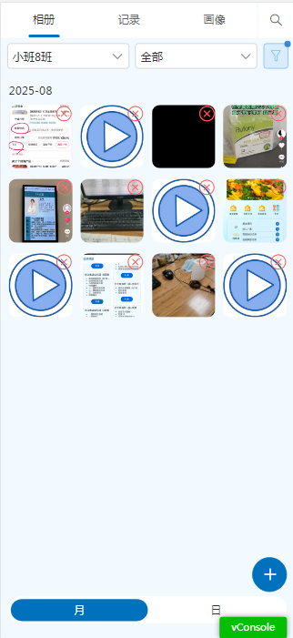

### 月、日

相册页面数据默认按月分类展示，点击日可切换到按天分类展示。

### 上传

点击+打开上传页面，可上传图片/视频，仅支持jpg,jpeg,png,mp4,mov格式的文件。每次上传最多9张。不够可多次上传。

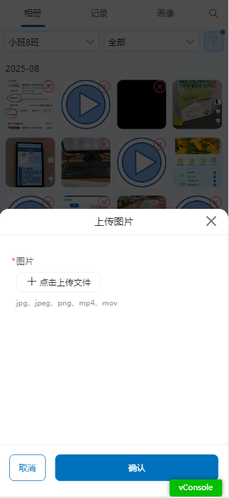

### 删除

点击图片/视频右上角的×，弹出删除提示，点击确认删除成功，点击取消取消删除。

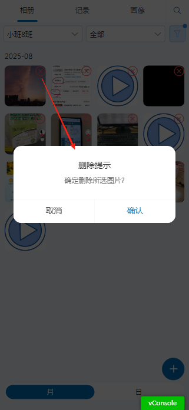

## 玩家笔记-记录

### 班级、幼儿

班主任：默认显示自己所带班班级，幼儿默认显示全部幼儿，可切换查询单个幼儿数据。

园内管理员：默认显示全部班级全部幼儿，选择全部班级时幼儿只能选择全部幼儿，切换班级为具体班级时，幼儿可选全部幼儿或者当前选择班级下的幼儿。

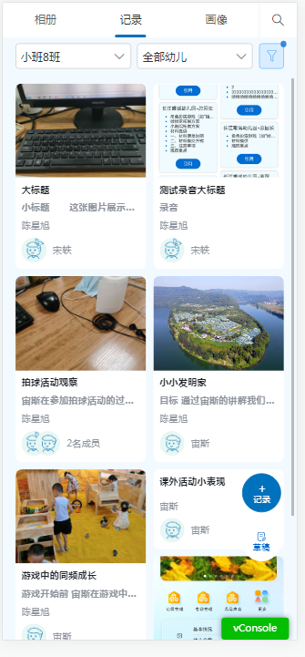

### +记录

点击+记录按钮，打开幼儿信息页面，班主任默认显示自己所带班级下的幼儿，园内管理员默认显示所有班级中的第一个班级及幼儿。

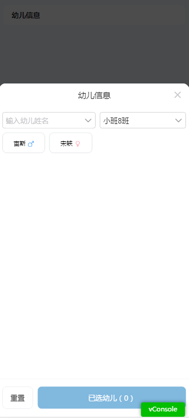

选择幼儿后进入填写页面，幼儿信息显示上一步选择的幼儿，可更改，关联幼儿默认显示幼儿信息中的幼儿，可修改。

按需求填写标题和内容，可点击添加标签，点击可选择上传幼儿相册的数据或者手机相册里的数据，点击可录音，点击可对输入的正文进行润色，用户可随自己意愿对润色的数据进行修改替换。

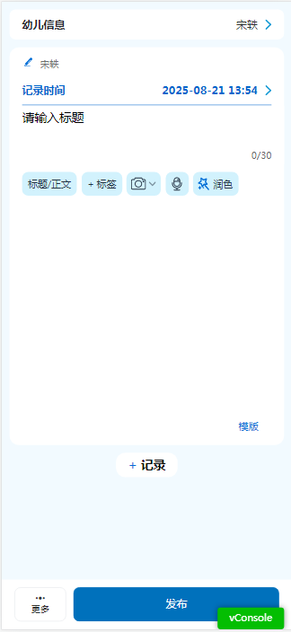

点击可选择记录模板，按默认填写数据。

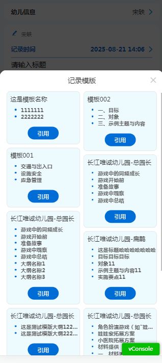

点击正文中上传的图片，可打开小U识图，然后生成一段白描，用户可复制白描插入到正文中。

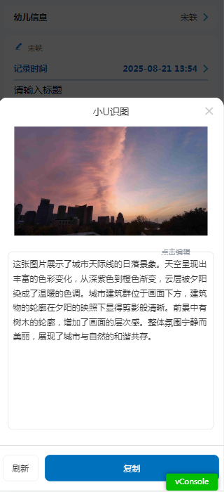

每个大记录里可添加多个小记录。点击可再次添加小记录。

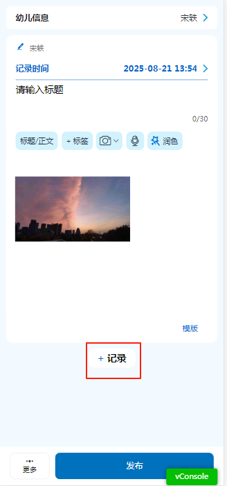

填写好后可点击按钮发布记录，也可点击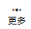暂存草稿或者删除记录。

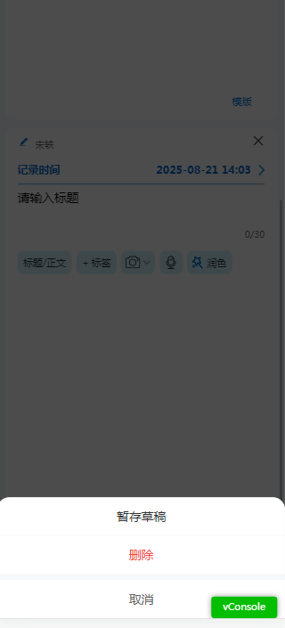

### 草稿

点击进入草稿页面，草稿页面的数据是当前登录人自己存的数据，只能查看自己暂存的数据。

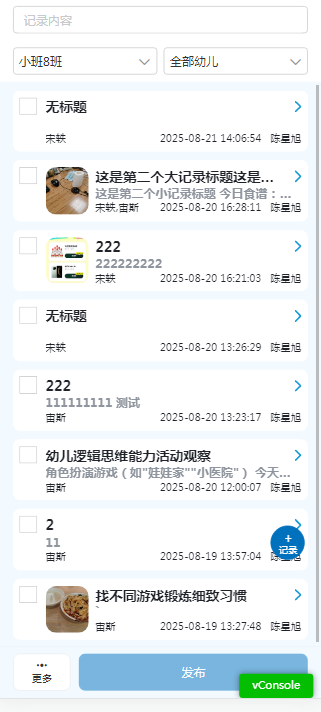

可勾选草稿里的数据然后点击发布进行发布记录。

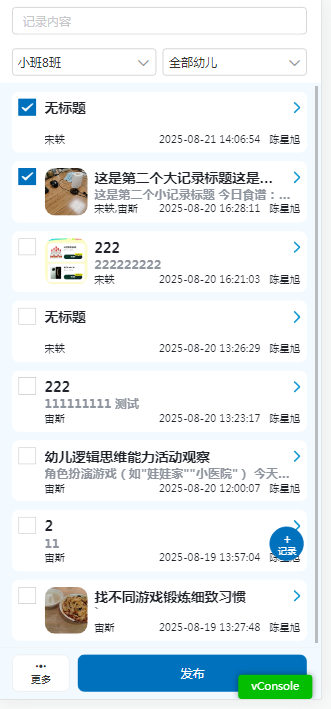

点击草稿页面的更多，点击全部全部勾选数据，点击清空全部取消勾选，点击取消关闭更多页面。

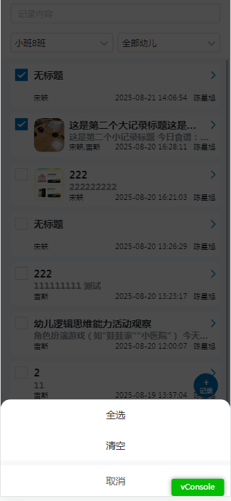

## 玩家笔记-画像

### 校区、班级

校区、班级：班主任默认显示自己所在校区和班级。

园内管理员：默认所有校区中的第一个校区，班级默认当前选中校区下的第一个班级。

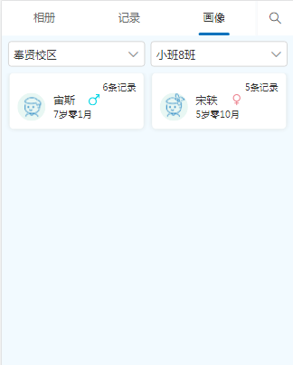

### 幼儿画像

点击幼儿，进入幼儿画像页面，画像页面记录统计数据是统计小记录的数据，柱状图按月统计记录数量。点击记录统计按钮，跳转到记录页面，记录页面默认查询当前幼儿的所有记录。

常用标签默认展示常用的10个标签。关键词云AI根据记录内容生成。

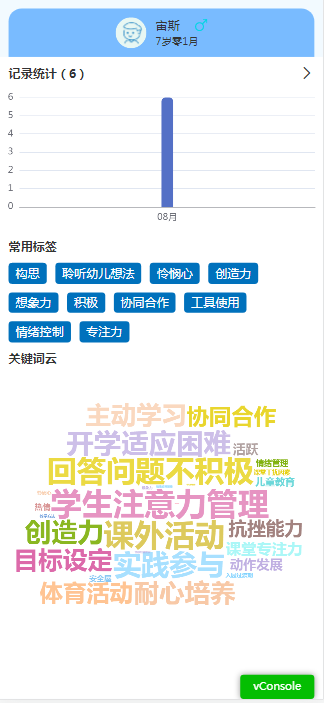

# PC端

## 玩家看板

权限：园内管理员

学年学期、校区：默认当前学年学期及校区下排序第一的校区

记录情况、记录明细、记录教师、记录标签都是更加所选学年学期和校区来统计的。

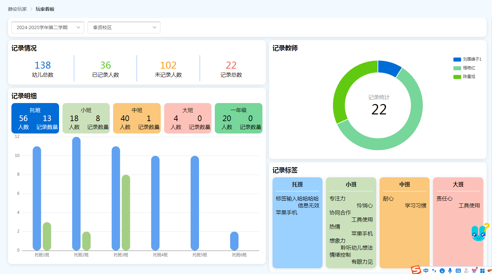