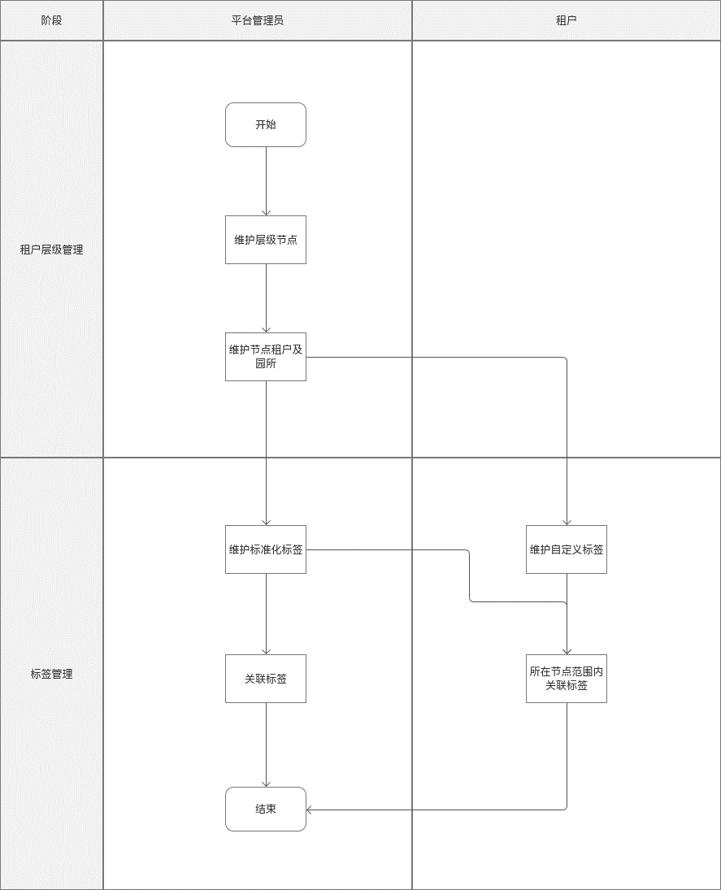
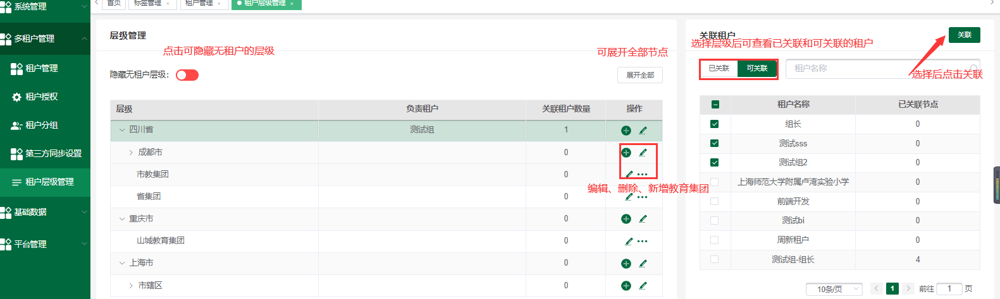
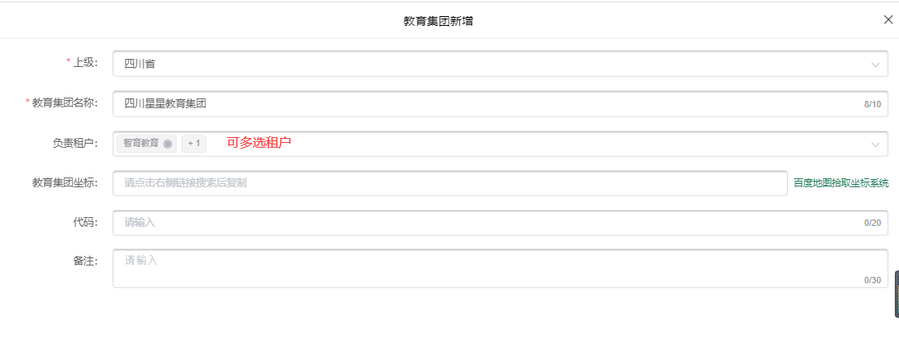
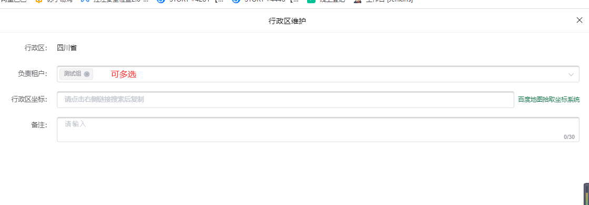
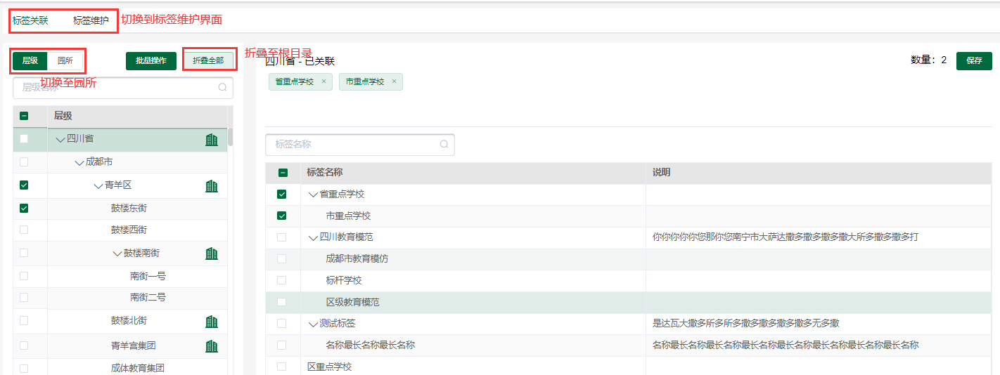
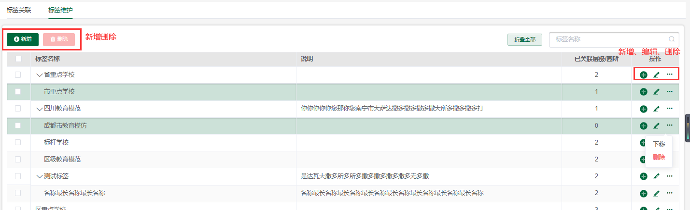
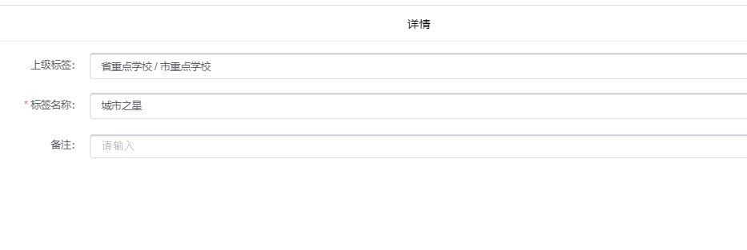
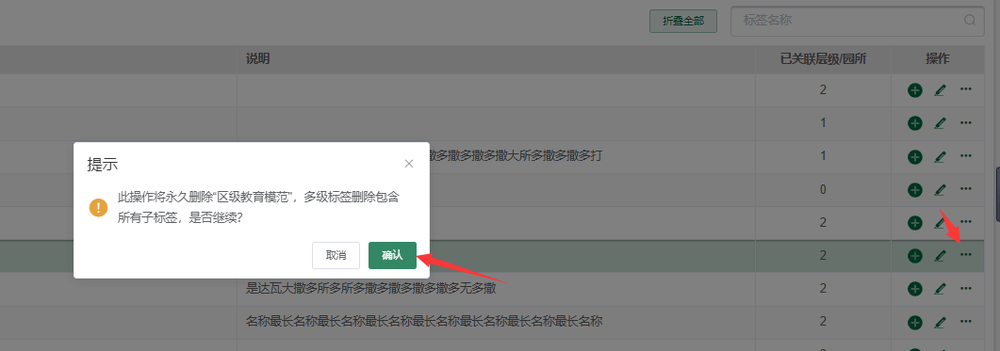
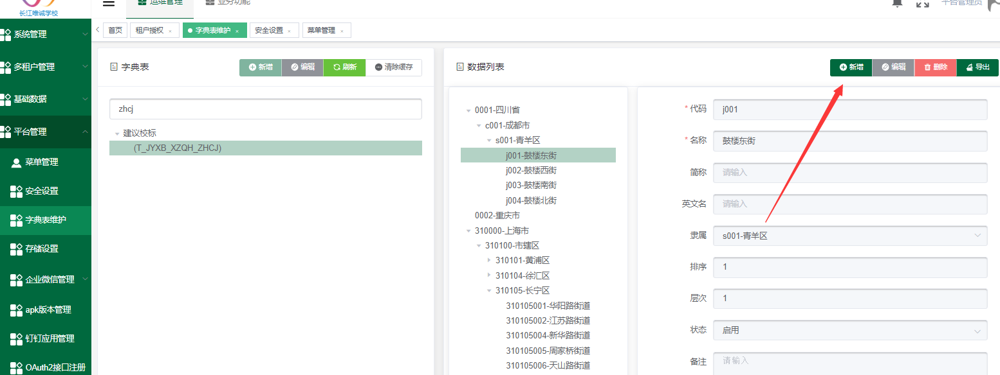

## 使用准备

### 操作系统要求

系统版本：Win7及以上；macOS10.0.4及以上

### 浏览器要求

**建议使用浏览器：Chrome**

兼容的浏览器：Microsoft Edge、Safari、360极速浏览器（等国内浏览器的极速模式）

版本要求：建议使用浏览器的最新版

### 系统访问信息

测试环境地址：http://192.168.10.196/cjvision4

## 业务流程图

## 角色权限

|  |  |  |
| --- | --- | --- |
| **角色** | **菜单或应用** | **操作权限说明** |
| **平台管理员** | **租户层级管理** | **新增教育集团/维护行政区** |
| **平台管理员** | **标签管理** | **新增/维护（规范化标签）** |
| **平台管理员/租户** | **标签管理** | **添加/删除标签** |
| **租户** | **标签管理** | **新增/删除自定义标签** |

## 租户层级管理

1. 默认层级展开至第二级
2. 负责租户，显示该节点的负责租户，若无则为空，若有多个显示不下则显示省略号，鼠标悬停气泡显示。

3、可模糊搜索租户名称

### 新增/维护教育集团

1. 点击列表中添加图标，上级默认为图标对应的层级
2. 上级只可以选择行政区

### **维护行政区**

1. 行政区不可编辑
2. 复制租户可多选

## **标签管理**

### 6.1标签关联

1. 平台管理员显示所有层级和层级关联的所有园所 关联标签时只可使用自己的规范化标签
2. 租户授权角色可使用规范化标签，自定义标签 自己关联的自定义标签仅自己和自己授权成员可见
3. 租户关联的规范化标签仅自己和平台管理员可见
4. 可对层级、园所名称模糊搜索
5. 平台管理员显示所有层级和园所、负责租户显示负责层级下的节点和各节点的关联园所、学钮、仅显示自己的园所

### 6.2标签维护

1. 平台管理员只能维护规范化标签
2. 租户只能查看规范化标签和取消自己有管理的规范化标签
3. 租户可新增自定义标签

#### 6.2.1新增

1、所有标签不可重复

6.2.2删除

## 层级维护（平台管理字典表）

1、在平台管理-字典表维护

