# **积点评价系统过程管理与数据看板操作指南**

**目录**

**[过程管理（教职工）](#igen_export_s_D6ws)** 3

**[过程管理（他评组）](#igen_export_1qzF4)** 7

**[过程管理（发展中心）](#igen_export_aTtlL5)** 8

**[数据看板（发展中心）](#igen_export_iomguO)** 9

**[过程管理（园内）](#igen_export_3jMoMZ)** 11

# **2、业务流程**

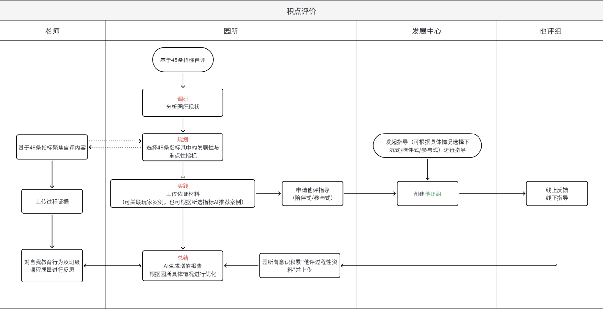

# **3、角色权限**

|  |  |  |
| --- | --- | --- |
| **角色** | **菜单或应用** | **操作权限说明** |
| **教职工** | **过程管理（教职工）/移动** | **新增、查看（移动仅查看）** |
| **他评成员** | **过程管理（他评组）/移动** | **查看（移动仅查看）** |
| **他评组长** | **过程管理（他评组）/移动** | **编辑、查看（移动仅查看）** |
| **区域负责人** | **过程管理（发展中心）/移动**  **数据看板（发展中心）** | **编辑、新增、查看（移动仅查看）** |
| **园内管理员** | **过程管理（园内）/移动** | **编辑、新增、查看（移动仅查看）** |

# **4、pc端**

## **1、过程管理（教职工）**

**1.** 1、在【过程管理】页面中，点击‘警示性’标签以筛选或查看对应条目

2、相互切换分类

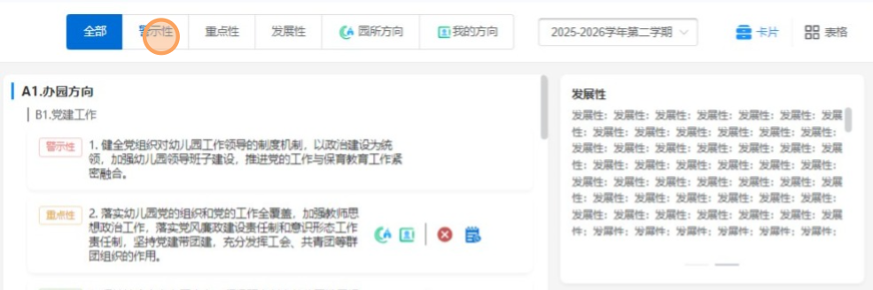

积点评价 > 过程管理（教职工）

**2.** 1、在【过程管理】页面右上角，点击【表格】视图切换按钮

2、查看显示格式布局

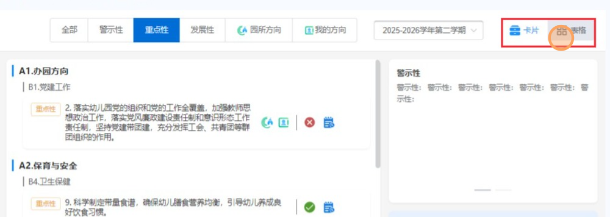

静安玩家 > 积点评价 > 过程管理

**3.** 1、在【过程管理】页面的筛选栏中，点击学年学期下拉框

2、在【学期选择】下拉菜单中，点击“2025-2026学年第一学期”选项

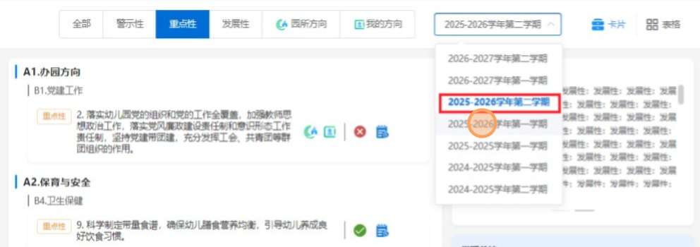

过程管理（教职工） > 积点评价

**4.** 1、在【A1.办园方向】列表中，点击“党建工作”条目右侧查看详情的图标按钮

2、进入详情界面

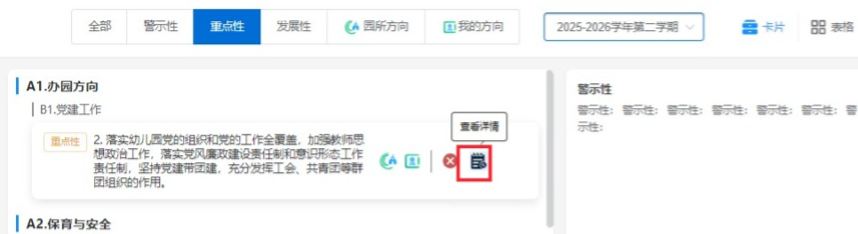

静安玩家 > 积点评价 > 过程管理

**5.** 在【教学反思】输入框内点击空白区域

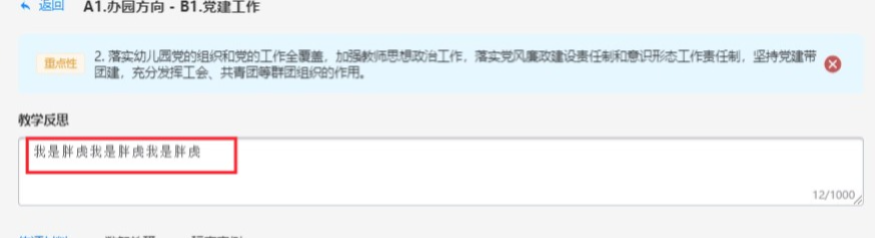

A1.办园方向 > B1.党建工作

**6.** 在【佐证材料】面板中，点击【+ 材料】按钮以添加新文件

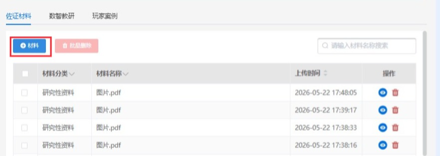

办园方向 > 党建工作 > 佐证材料

**7.** 1、在【佐证材料】弹窗中，点击【上传材料】区域的“点击上传”按钮

2、上传完成后点击保存

3、注意事项：文件大小、格式、数量不对都会影响上传结果

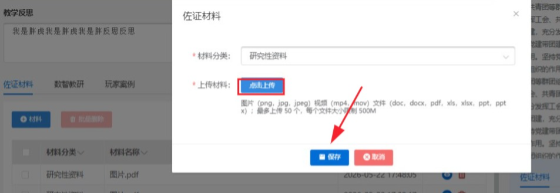

办园方向 > 党建工作 > 佐证材料

**8.** 1、删除和批量删除【佐证材料】列表中，点击【批量删除】按钮

2、提示删除弹框，确认后删除

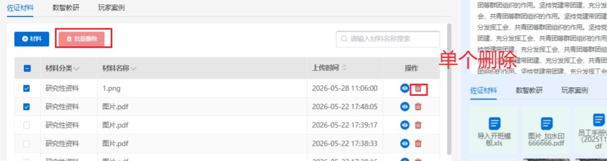

A1.办园方向 > B1.党建工作 > 佐证材料

**9**. 1、在【数智教研】弹窗中，点击【关联】按钮

2、显示关联数量可进行日期和案例的筛选

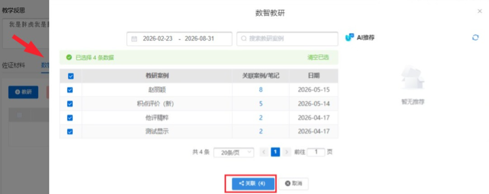

A1.办园方向 > B1.党建工作 > 数智教研

**10.** 1、【教研案例】列表中，点击‘关联案例/笔记’列下的数字链接

2、弹窗查看对应的案例/笔记详情

3、点击眼睛图标查看案例详情

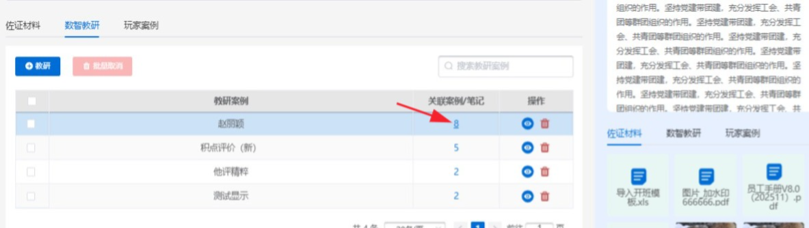

A1.办园方向 > B1.党建工作 > 数智教研

**11.** 1、在【佐证材料】区域中，点击【案例】按钮

2、进入新增界面

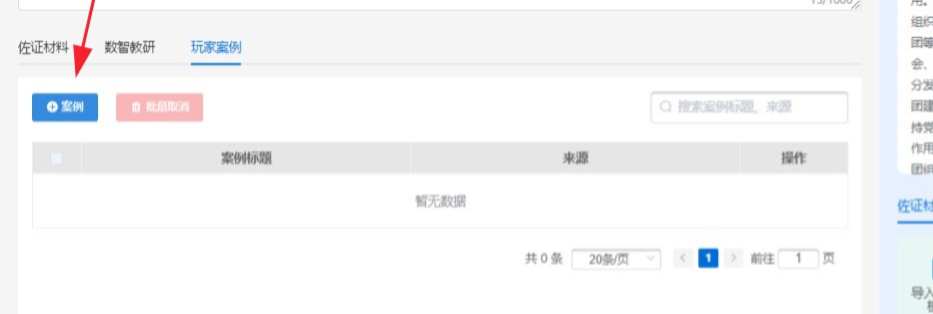

A1.办园方向 > B1.党建工作 > 佐证材料

**12.** 1、在【玩家案例】弹窗中，点击【关联 】按钮以确认操作

2、显示关联数量

3、可一根据日期、标题进行筛选

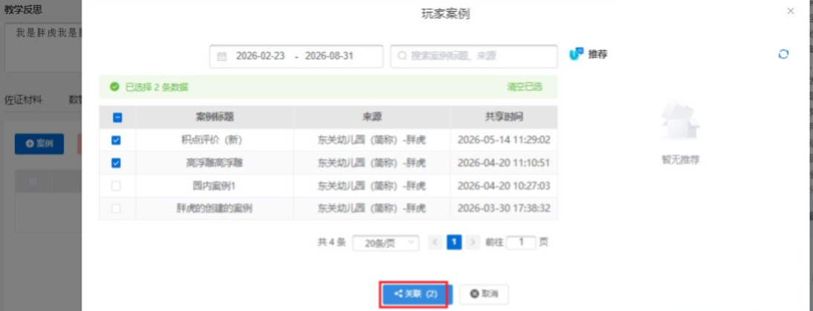

A1.办园方向 > B1.党建工作 > 玩家案例

## **2、过程管理（他评组）**

**1.** 1、点击分类可查看不同数据

2、切换幼儿园查看数据

3、点击指导申请进入操作界面

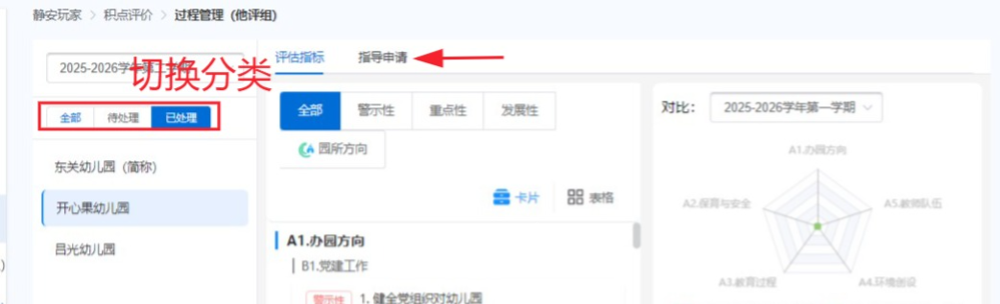

积点评价 > 过程管理（他评组）

**2.** 1、在【指导申请】列表中，点击‘他评组’列下的成员人数链接查看那人员情况

2、根据名称搜索

3、点击编辑按钮进入编辑

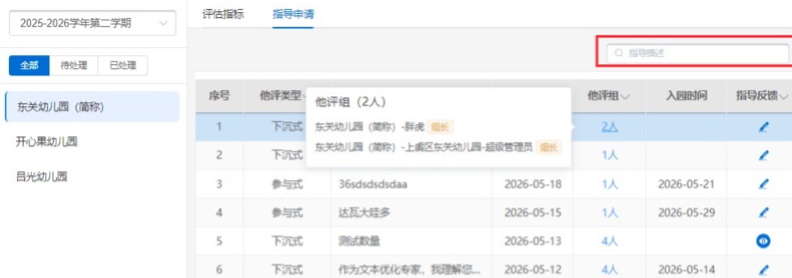

静安玩家 > 积点评价 > 过程管理 (他评组) > 指导申请

**3.** 在【指导反馈】弹窗中，点击【保存】按钮以提交信息

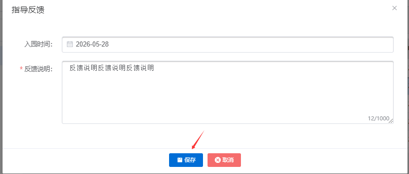

## **3、过程管理（发展中心）**

**1.** 1、在【指导申请】标签页中，点击【下发指令】按钮

2、可搜索和切换学年学期

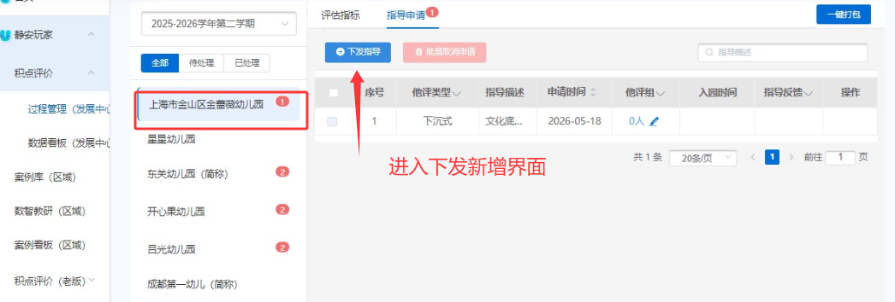

**2.** 1、正确填写数据

2、在【发起指导】弹窗中，点击【下发】按钮

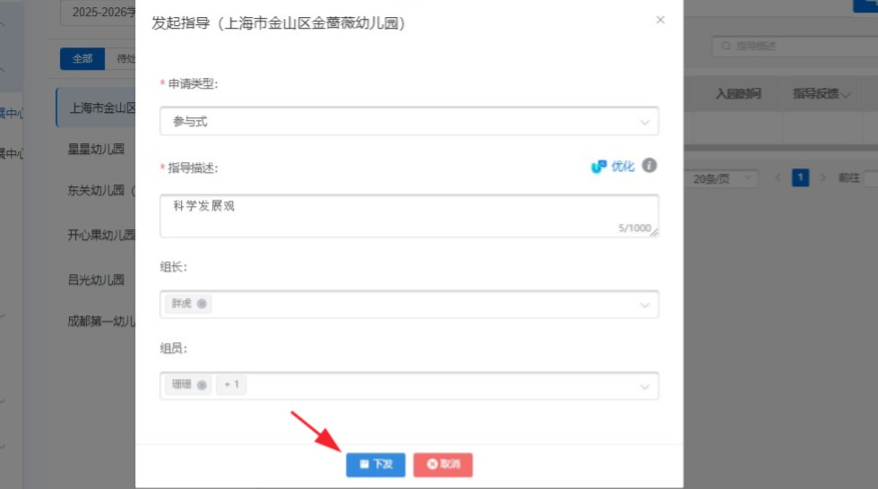

积点评价 > 过程管理 (发展中心) > 发起指导

## **4、数据看板（发展中心）**

**1.** 1、在【积点概况】面板中，点击“已选指标 / 未选指标”统计数值

2、可切换学年学期

3、可根据不同的学校进行对比查看

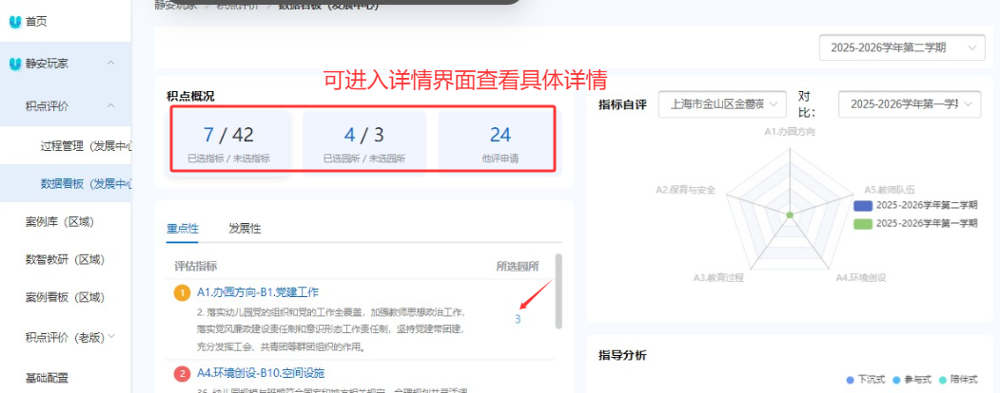

**2.** 在【指标自评】区域中，点击“上海市金山区金善幼儿园”下拉框以切换评估对象

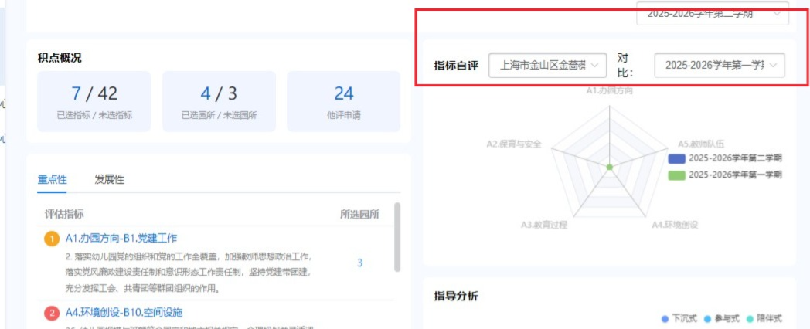

静安玩家 > 积点评价 > 数据看板（发展中心）

**3.** 在【指标自评】下拉列表中，点击“东关幼儿园（简称）”选项

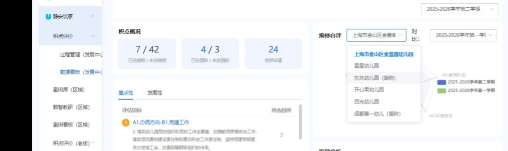

数据看板 (发展中心) > 积点评价

**4.** 点击【指导申请】标签页

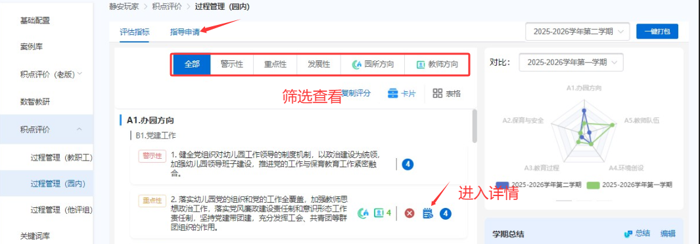

## **5、过程管理（园内）**

**1.** 点击【发起申请】按钮

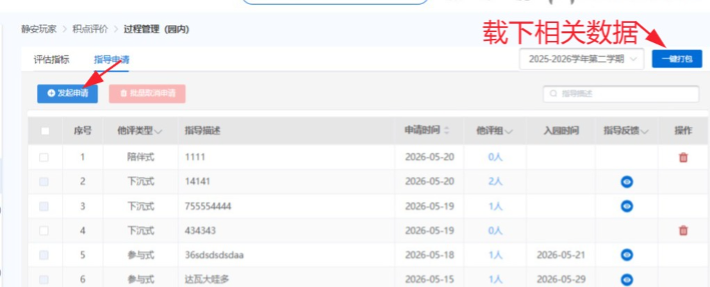

静安玩家 > 积点评价 > 过程管理 (园内)

**2.** 在【指导申请】弹窗中，点击【申请】按钮以提交表单

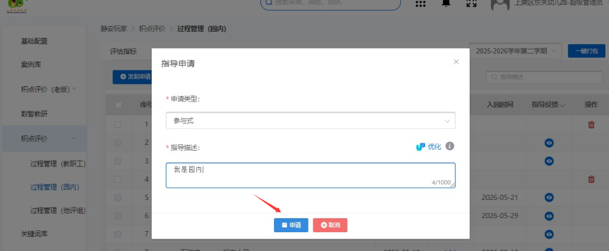

**3.** 在【过程管理】页面中，点击【撤回申请】按钮

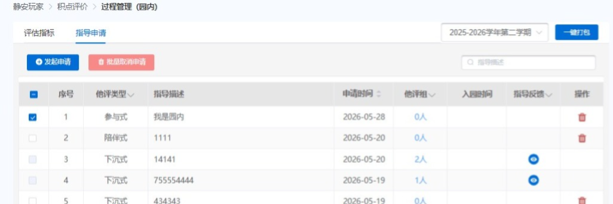

积点评价 > 过程管理 (园内)

**4.** 在【提示】弹窗中，点击【确定】按钮以确认批量取消申请

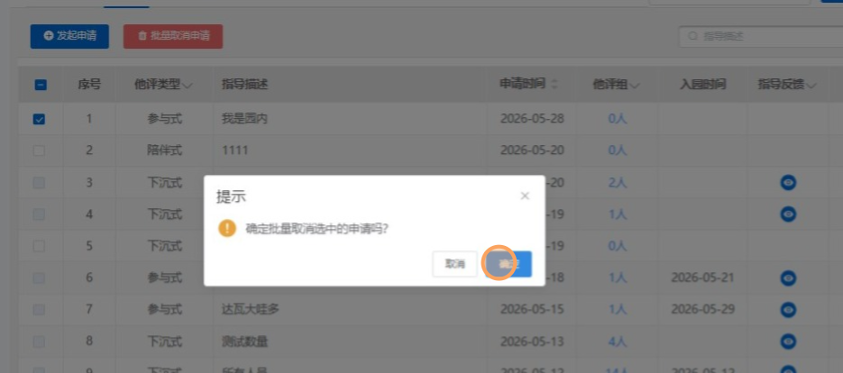

积点评价 > 过程管理 (园内) > 指导申请

# **5、移动端**

## **1、过程管理（园所）**

1、可切换学年学期

2、点击进入详情界面

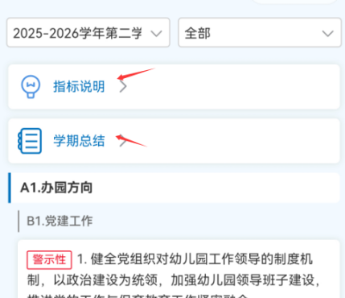

## **过程管理（他评组/区域负责人）**

1. 选择幼儿园
2. 红点发展中心：未分配他评组数量
3. 他评组组长：未反馈数量
4. 关键字搜索幼儿园名称
5. 默认选中当前学年学期

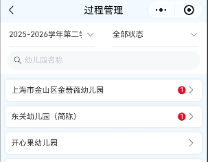

### 详情页

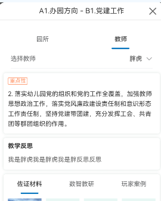

## **过程管理（教职工）**

1、有各个类型的指标说明就展示，没有就不展示跳转

2、只有设为园所方向/学期方向的指标才能查看详情

1. 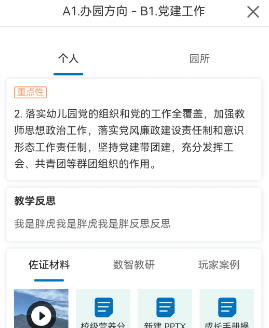

### 详情页

1、可切换材料才看详情

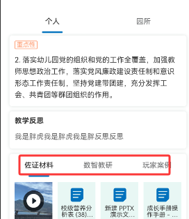