# 使用准备

## 操作系统要求

系统版本：Win7及以上；macOS10.0.4及以上

## 浏览器要求

**建议使用浏览器：Chrome**

兼容的浏览器：Microsoft Edge、Safari、360极速浏览器（等国内浏览器的极速模式）

版本要求：建议使用浏览器的最新版

## 系统访问信息

http://192.168.0.173:89/cjvision4/#/login

## 业务流程图

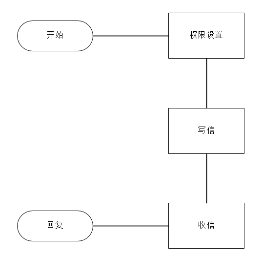

## 角色权限

|  |  |  |
| --- | --- | --- |
| **角色** | **菜单或应用** | **操作权限说明** |
| **教职工** | **站内信、权限设置** | **全部功能可用，但是发送范围受到站内信权限设置的限制** |
| **学生** | **站内信** | **收件，允许时可以回复，无发件功能** |

## 权限设置

1、在基础设置中设置禁用 在对应发件页面不显示发送、转发、回复功能

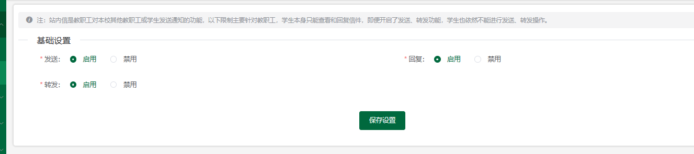

## **站内信PC端**

### 写信

1. 点击进入详情选择收件人（教师、学生、自定义分组）可单独选择学生、教师 或者选择一个校区、一个班级学生
2. 支持上传一下格式类型：rar、zip、doc、docx、xls、xlsx、pdf、jpg、png、mp3、mp4
3. 发件时需主要 回复、转发选择默认都是否
4. 标签最多输入三个，且输入完标签后需安enter 才能保存成功，否则发件时不会显示该标签
5. 点击，会自动存入草稿箱，可重复存入

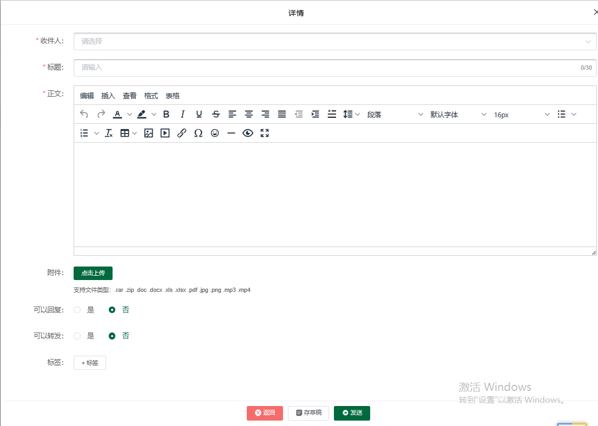

### 通讯录

学生

1. 第一行输入框可根据姓名、账号查找对应的学生
2. 第二行输入框可根据名称查询校区、班级

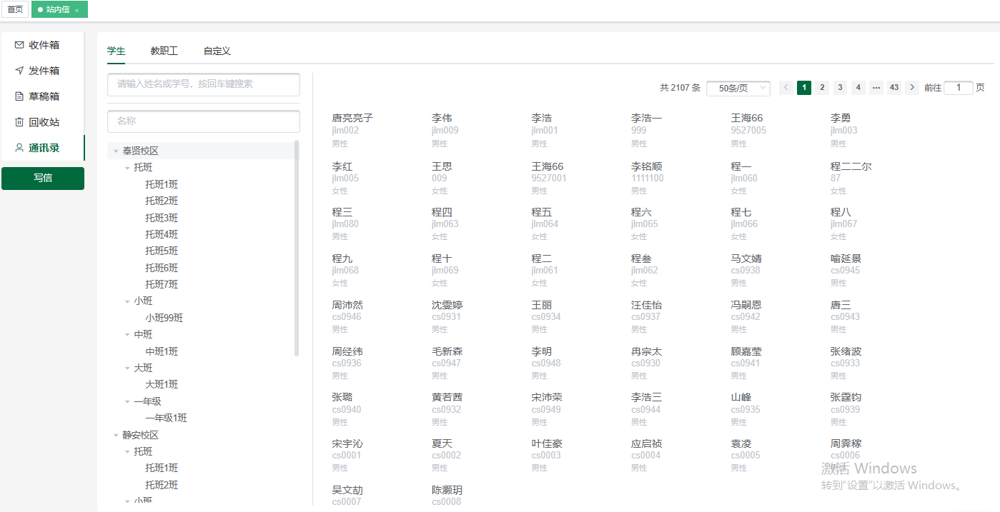

教职工

1、第一行输入框可根据姓名、账号查找对应的学生

2、第二行输入框可根据部门查询

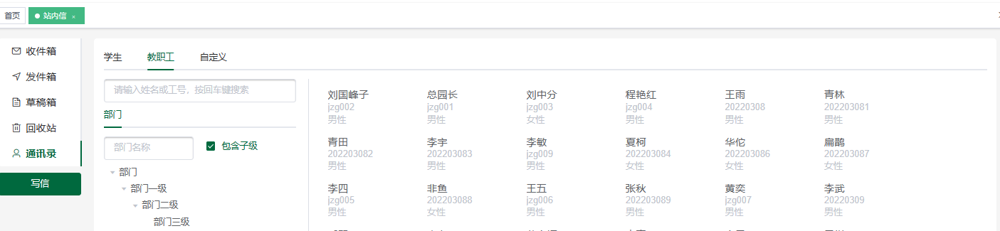

自定义

1. 第一行输入框可根据姓名、账号查找对应的学生
2. 第二行输入自定义分组名称查询
3. 点击可新增分组，新增的分组所有教职工均可查看

注：选择时可选择教师、学生

1. 点击修改可编辑已存在的分组
2. 点击可删除所选分组

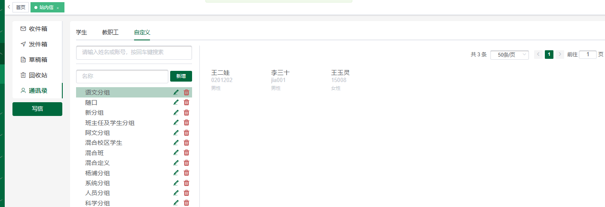

注：学生 不显示通讯录

### 收件箱

1. 点击（教师、学生）收件箱可查看所有已收到的信件

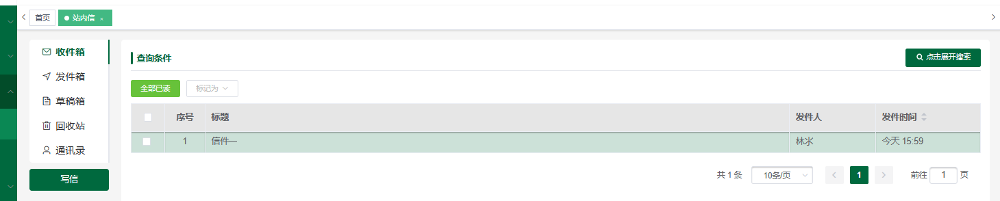

1. 查看信息时根据配置的权限 查看是否可回复、转发
2. 复选框勾选信件可标记已读或 未读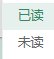

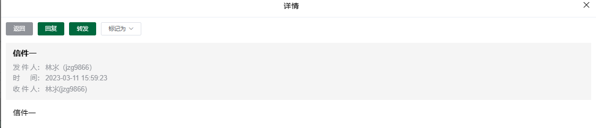

4、根据关键字、日期进行查询相关信息

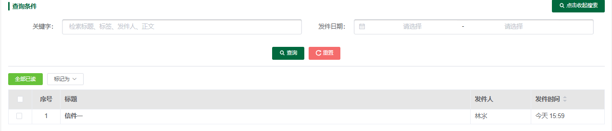

### 发件箱

1. 根据关键字、日期进行查询相关信息
2. 点击发件箱可再次编辑信件，重新选择收件人、修改内容、标题、标签、 上传文件操作

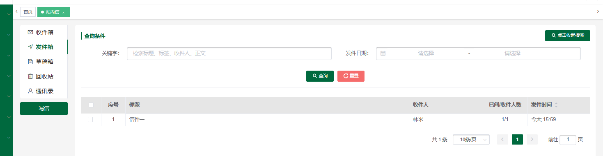

1. 点击可撤回已发送的信件且 收件人无法查看信件内容
2. 点击可删除已发送的信件，收件人无法查看
3. 点击可在钉钉、企业微信、微信上收到对应的信息 点击详 情可跳转至对应界面

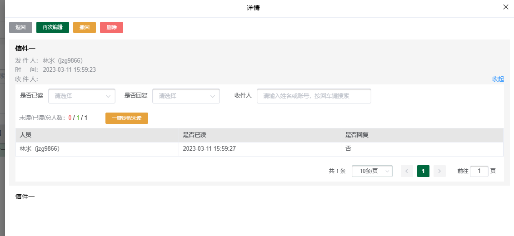6、可根据条件进行筛选是否已读、是否回复及收件人

### 草稿箱

1. 进入草稿箱复选框勾选可直接
2. 否选看勾选点击可删除草稿箱中的信件

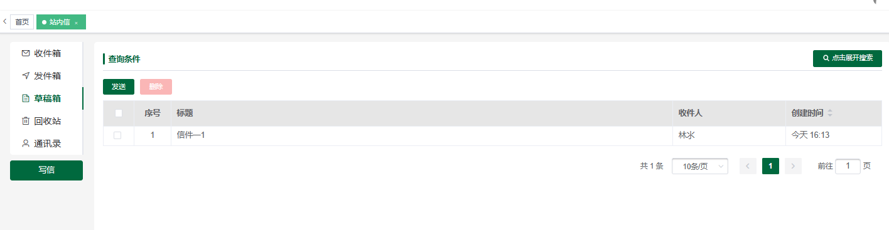

### 回收站

1. 复选框勾选回复可恢复到对应的目录中 如：从草稿箱中删除的恢复到草稿箱中
2. 进入信件详情可单独恢复信件

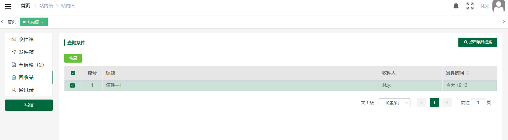

## 站内信移动端

### 写信

1、点击进入详情选择收件人（教师、学生、自定义分组）可单独选择学生、教师 或者选择一个校区、一个班级学生

2、支持上传一下格式类型：rar、zip、doc、docx、xls、xlsx、pdf、jpg、png、mp3、mp4

3、发件时需主要 回复、转发选择默认都是否

4、标签最多输入三个，且输入完标签后需安enter 才能保存成功，否则发件时不会显示该标签

5、点击，会自动存入草稿箱，可重复存入

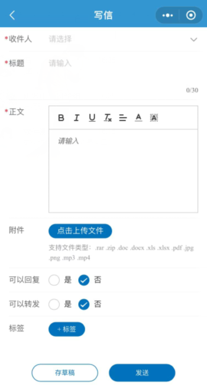

### 通讯录

学生

1、第一行输入框可根据姓名、账号查找对应的学生

2、第二行输入框可根据名称查询校区、班级

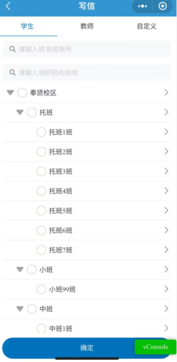

教职工

3、第一行输入框可根据姓名、账号查找对应的学生

4、第二行输入框可根据部门查询

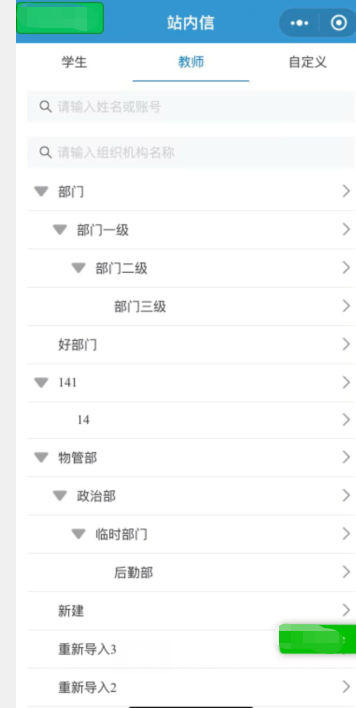

自定义

1. 第一行输入自定义分组名称查询

5、点击可新增分组，新增的分组所有教职工均可查看

注：选择时可选择教师、学生

6、点击修改可编辑已存在的分组

1. 点击可删除所选分组

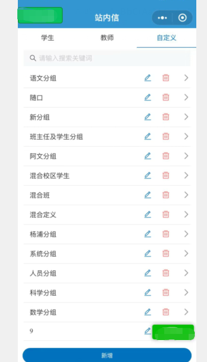

### 收件箱

1. 点击（教师、学生）收件箱可查看所有已收到的信件

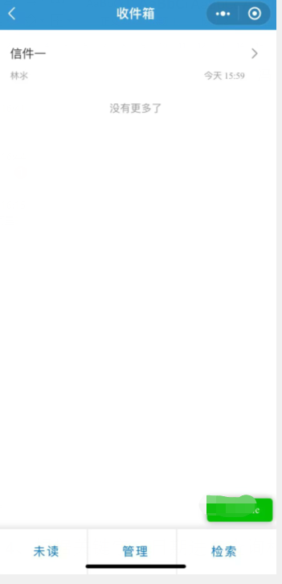

1. 查看信息时根据配置的权限 查看是否可回复、转发
2. 查看信件详情可标记已读或 未读

7、根据关键字、日期进行查询相关信息

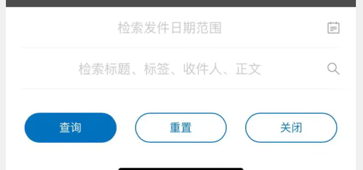

### 发件箱

1、根据关键字、日期进行查询相关信息

2、点击发件箱可再次编辑信件，重新选择收件人、修改内容、标题、标签、 上传文件操作

3、点击可撤回已发送的信件且 收件人无法查看信件内容

4、点击可删除已发送的信件，收件人无法查看

5、点击可在钉钉、企业微信、微信上收到对应的信息 点击详 情可跳转至对应界面

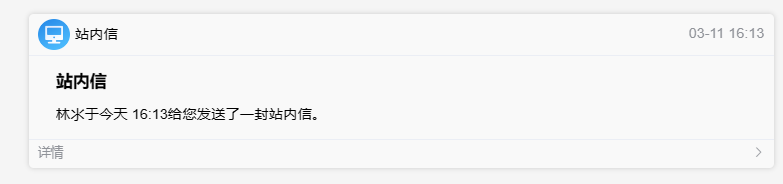

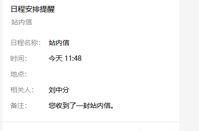

6、可根据条件进行筛选是否已读、是否回复及收件人

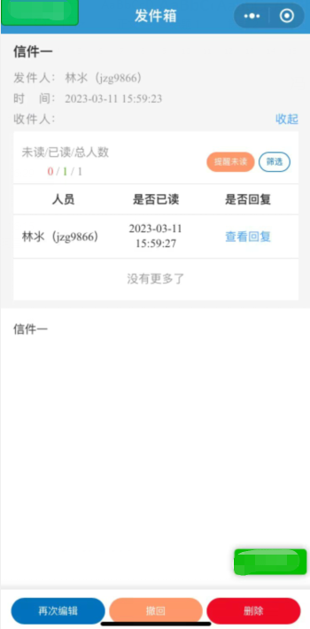

### 草稿箱

1、进入草稿箱点击管理复选框勾选后可直接信件

2、进入草稿箱点击管理复选框勾选后可直接信件

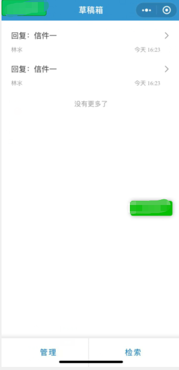

### 回收站

1、复选框勾选回复可恢复到对应的目录中 如：从草稿箱中删除的恢复到草稿箱中

2、进入信件详情可单独信件

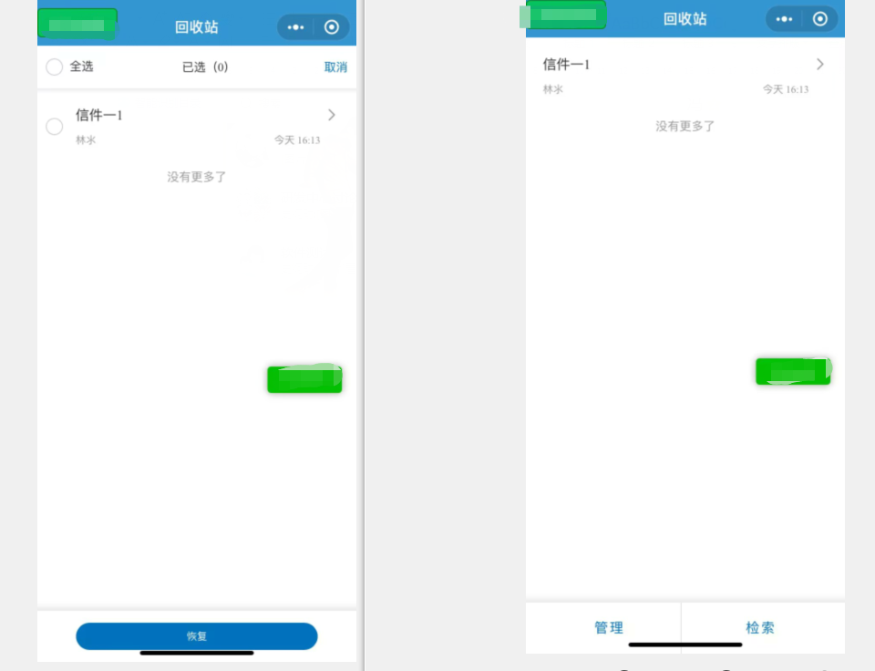