# 业务流程图

# 模块关系图

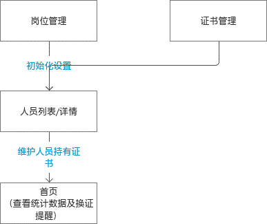

# 功能权限图

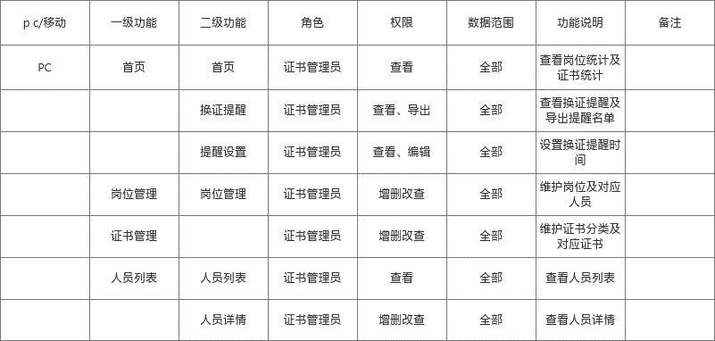

# 功能名称

## 首页

### 首页页面

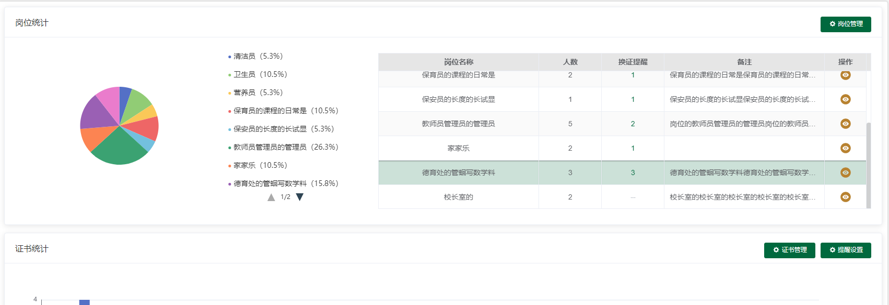

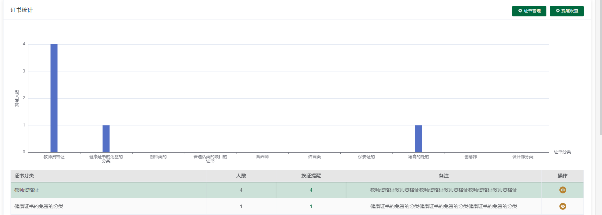

**显示说明：**

1. 岗位统计显示各个岗位情况统计，其中扇形图显示各个岗位人数占比
2. 证书统计显示各个证书分类的统计数据，其中柱状图显示各个证书分类持有人数
3. 换证提醒，点击弹窗显示该岗位换证提醒人员，若无换证提醒，则显示为空，且不可点击
4. 岗位统计查看按钮，点击进入人员列表，并将筛选条件中的岗位设置为本行对应岗位
5. 证书统计查看按钮，点击进入人员列表，并将筛选条件中的证书分类设置为本行对应证书分类
6. 岗位管理，点击进入岗位管理页面
7. 证书管理，点击进入证书管理页面
8. 提醒设置，点击弹出提醒设置弹窗
9. 持有人数，若一个人有多张某类证书，也按1计算

换证提醒不考虑停用岗位的人员，不考虑停用的证书

### 换证提醒

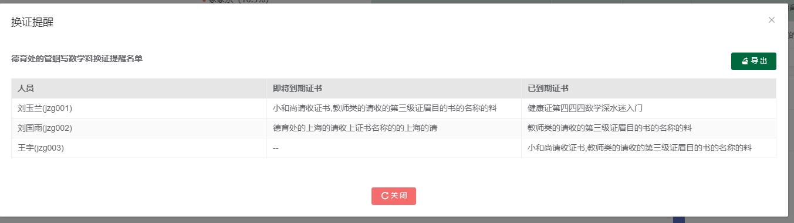

1. 标题显示显示对应的岗位名称或证书分类
2. 点击导出，导出对应的提醒名单
3. 人员显示有即将到期证书或已到期证书的人员，（证书名称相同的多张证书，按到期时间最晚的判定）
4. 证书名称，重复的仅显示一条，有多个需提醒证书的，用顿号隔开

### 提醒设置

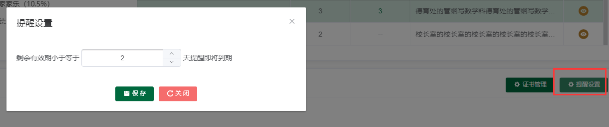

1. 可填写大于0的整数
2. 计算规则，例子：15号到期，则15号剩余天数为0。14号剩余天数为1。剩余天数为0时，状态更新为即将到期

### 岗位管理

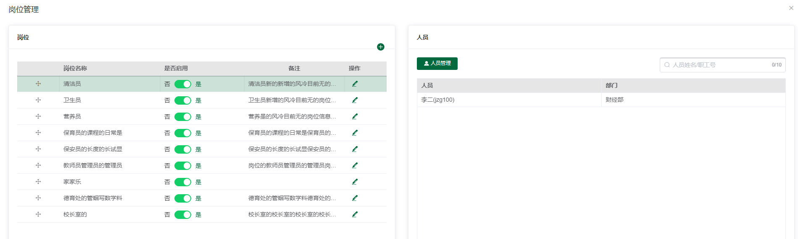

1. 添加按钮，点击添加，弹出新增弹窗
2. 是否启用，不启用的岗位，首页及筛选条件中不显示，并且该岗位人员不尽兴统计及证书提醒
3. 点击编辑，弹出编辑弹窗
4. 该岗位人员若不为空，则不显示删除按钮
5. 岗位拖动按钮，可拖动调整排序
6. 人员管理，点击弹出人员管理弹窗

#### 岗位新增/编辑

1. 岗位名称必填，10个字以内
2. 默认启用
3. 备注非必填，30字以内

#### **人员管理**

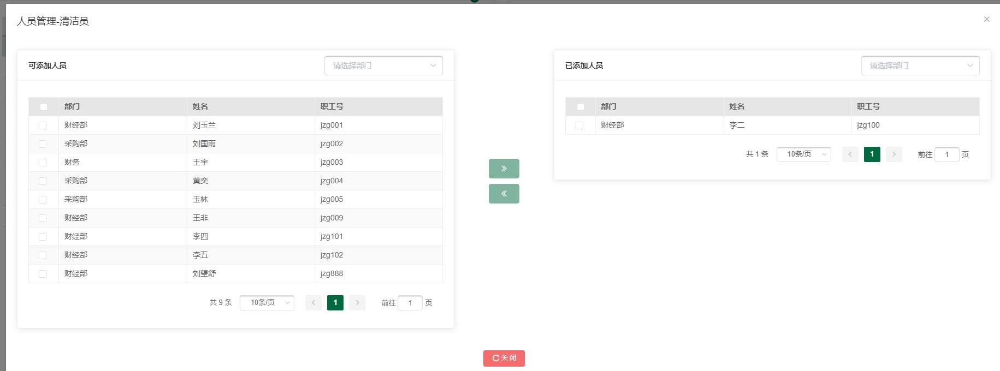

1. 一个人员仅可对应多个岗位
2. 可按部门筛选人员

### 证书管理

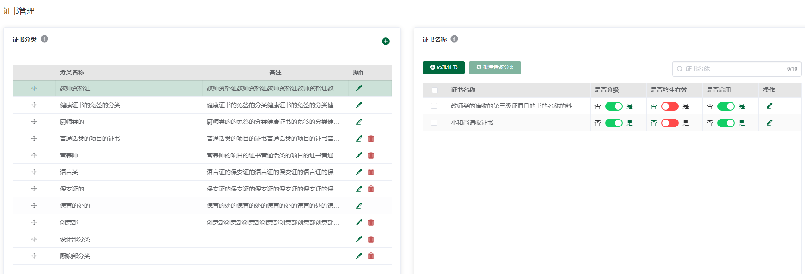

1. 证书分类提示，鼠标悬停或点击气泡显示提示，提示内容：可根据需求设置证书分类，如：健康证类、厨师证类、语言类等
2. 证书名称提示，鼠标悬停或点击气泡显示提示，提示内容：职业资格证可填写职业（工种），健康证可填写普通健康证/食品健康证
3. 证书分类添加按钮，点击弹出分类新增弹窗
4. 证书分类可拖动调整排序
5. 点击分类编辑，弹出分类编辑弹窗
6. 分类下证书不为空的不显示删除按钮
7. 添加证书，点击弹出证书新增弹窗
8. 批量修改分类，点击弹出啊批量修改分类弹窗，对勾选的证书批量修改分类
9. 是否分级，分级的显示等级字段，文本输入，不分级的不显示等级字段
10. 是否终身有效，终身有效的显示发证时间，非终身有效的显示有效期限
11. 是否启用，未启用的证书首页及筛选条件不显示，不参与换证提醒的判定
12. 证书名称编辑，点击编辑，弹出编辑弹窗

证书有人员持有的不显示删除按钮

#### 分类新增/编辑

1. 分类名称必填，10个字以内
2. 备注非必填，30字一捏

#### 证书新增/编辑

1. 证书名称，20个字以内
2. 是否终身有效，默认为是
3. 是否启用，默认启用
4. 是否分级，默认为是

#### 批量修改分类

1. 显示勾选的证书名称，可换行显示
2. 下拉选择证书分类

### 人员列表

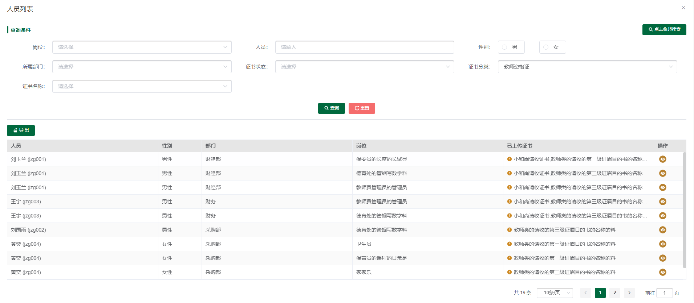

搜索部分

1. 岗位，默认为空，显示全部，可选启用的岗位
2. 人员，可对人员姓名/职工号搜索
3. 性别，默认为空，显示全部，可选男性/女性
4. 所属部门，默认为空，显示全部
5. 证书状态，默认为空，显示全部。可选正常/需换证/未上传，正常：当前筛选条件下已上传证书不为空，且无即将到期无已过期证书；需换证，当前筛选条件下有即将到期无已过期证书；未上传，当前筛选条件已上传证书为空（注意当前筛选条件下）
6. 证书分类，默认为空，显示全部
7. 证书名称，默认为空，显示全部，与证书分类联动，可选证书分类对应的证书名称
8. 前五个筛选条件筛选人员，后三个筛选条件筛选当前人员的证书

列表部分

1. 导出，点击导出搜索结果
2. 已上传证书，显示当前筛选条件限制范围内，该人员上传的证书名称，过长的显示省略号
3. 未持有证书的置底显示，其余按职工号排序
4. 点击详情，弹出该人员详情页面

#### 人员详情

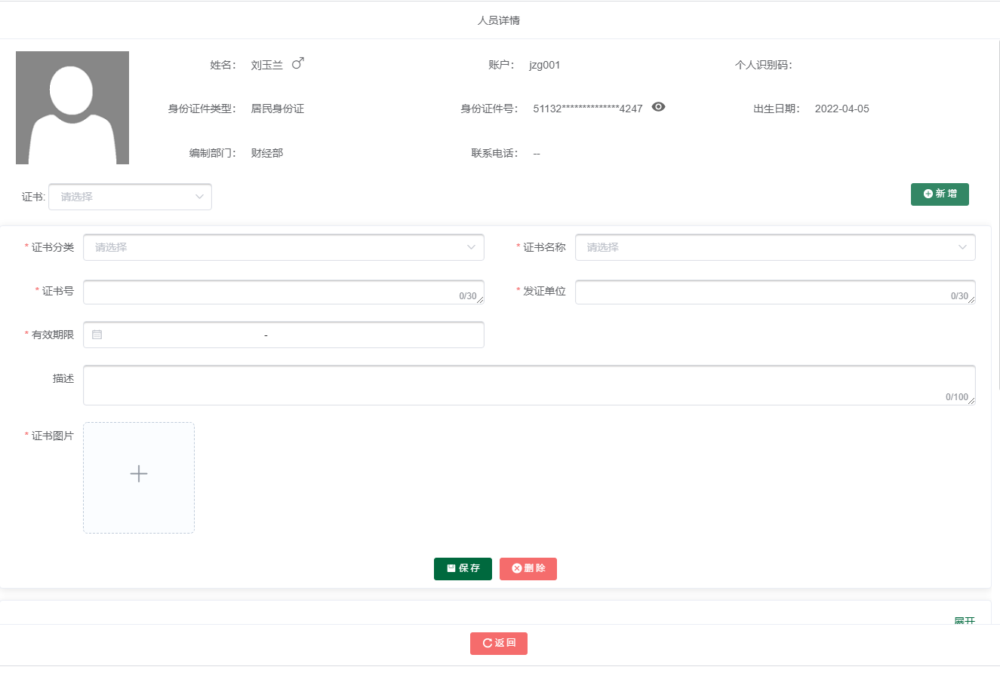

1. 身份证号及联系电话脱敏处理，点击查看按钮查看
2. 证书分类，默认全部，可选该人员持有证书的分类，未持有的不显示
3. 新增按钮，点击在第一条新增一张健康证卡片
4. 证书卡片，默认收起，收起状态下仅显示整数名称与发证时间，仅查看，展开后可编辑，默认收起，按发证时间或有效期的失效时间倒序排序
5. 即将到期的显示橙色感叹号，鼠标悬停或点击气泡提示即将到期（根据失效时间以及提醒设置中的提醒天数判断）
6. 若已过期，则显示红色图标，鼠标悬停或点击气泡提示已过期
7. 非终身有效证书显示有效期，终身有效的显示发证日期

卡片展开状态

1. 证书分类，下拉选择，必填
2. 证书名称，与证书分类联动，可选分类对应的启用的证书名称，必填
3. 证书等级，分级的证书显示，不分级的证书不显示，证书管理中设置。20字以内，必填
4. 证书号，30字以内，必填
5. 发证单位，30字以内，必填
6. 发证日期，日期，年月日，终身有效的显示发证时间，必填
7. 有效期限，日期范围，非终身有效证书显示此字段，不显示发证日期，必填
8. 描述，非必填，100字以内
9. 证书图片，最多九张图片