## 使用准备

### 操作系统要求

系统版本：Win7及以上；macOS10.0.4及以上

### 浏览器要求

**建议使用浏览器：Chrome**

兼容的浏览器：Microsoft Edge、Safari、360极速浏览器（等国内浏览器的极速模式）

版本要求：建议使用浏览器的最新版

### 系统访问信息

http://192.168.0.173:89/cjvision4/#/login

## 业务流程图

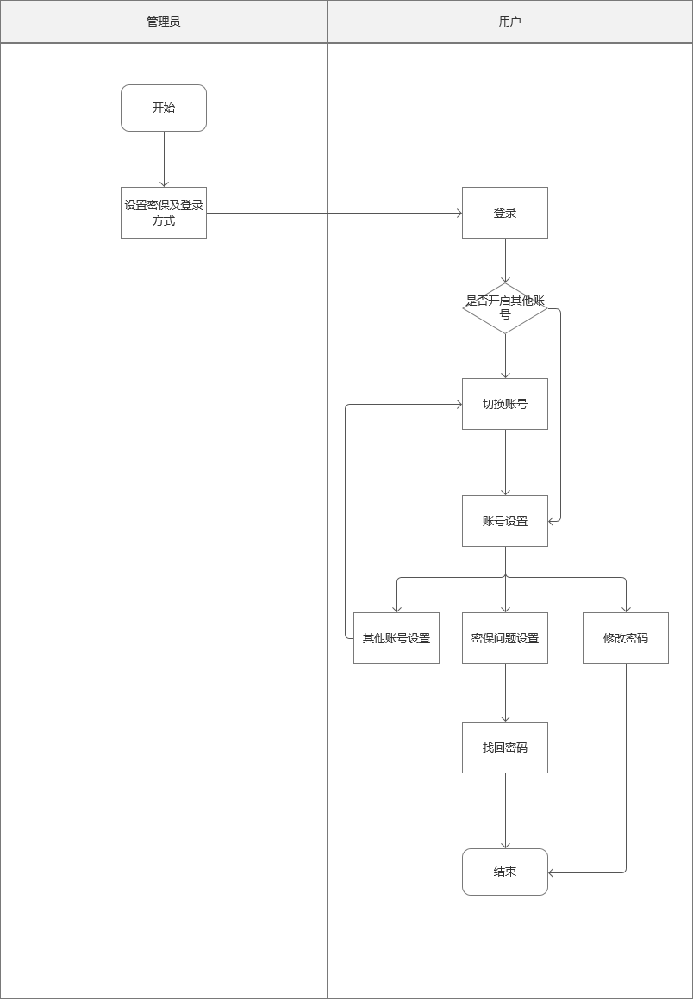

## 角色权限

|  |  |  |
| --- | --- | --- |
| **角色** | **菜单或应用** | **操作权限说明** |
| **平台管理员** | **安全设置、账号安全** | **维护安全设置、查看、新增、解绑自己账号下的所有账号** |
| **所有用户** | **账号安全** | **查看、新增、解绑自己账号下的所有账号** |

## 账号安全pc

### 安全设置（管理员）

1. 设置登录页登录方式和密保验证的方式
2. 切换其他账号可开启关闭（关闭后不显示其他账号管理入口以及账号切换）
3. 可以设置验证码的有效时间（默认5分钟最少5分钟）

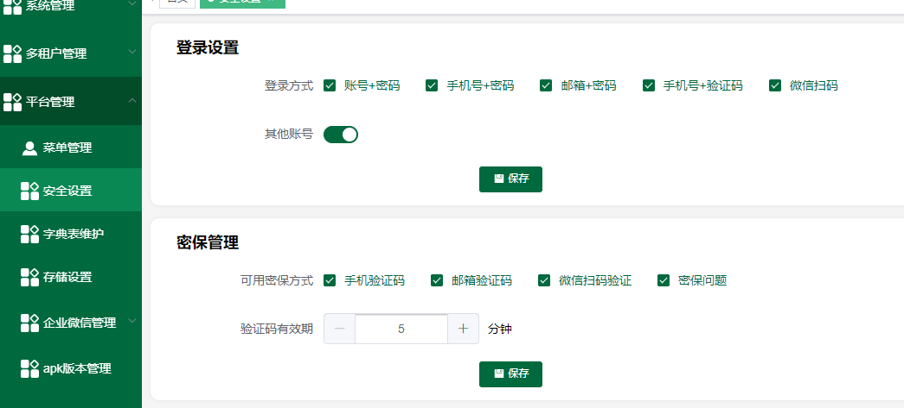

### **登录页面pc**

1、登录的方式由管理员在【平台管理】-【安全设置】开启和关闭

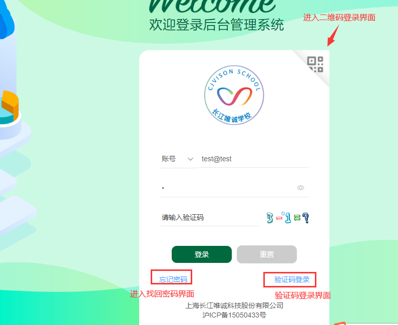

#### 5.2.1忘记密码

1、找回的方式和验证的方式都和安全设置有关

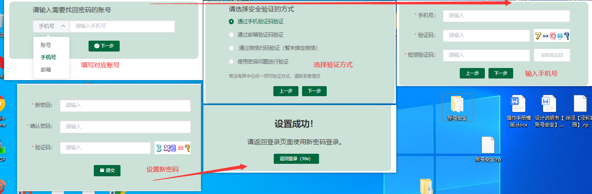

#### **5.2.2验证码登录**

1、输入手机号获取验证码即可

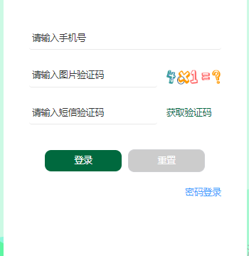

#### **5.2.3二维码登录**

1. 微信扫描登录可在平台管理-安全设置-登录设置开启（关闭）
2. 已绑定账号的微信扫码后登录成功没有则提示：“扫码微信（微信名称）未绑定账号”

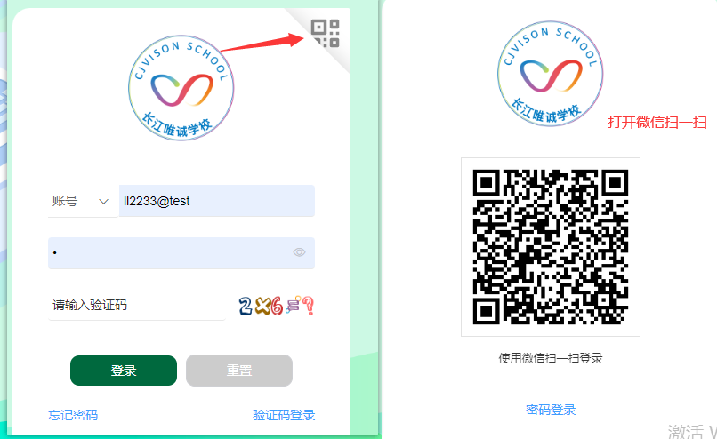

### **账号管理pc**

1. 绑定方式在安全设置中，若登录方式及密保管理均为启用该项，则不显示
2. 若安全设置关闭了其他【账号按钮】这里就不显示其他账号和切换账号
3. 基本信息显示名字账号
4. 同一个账号可以被多个绑定方式的不同账号绑定

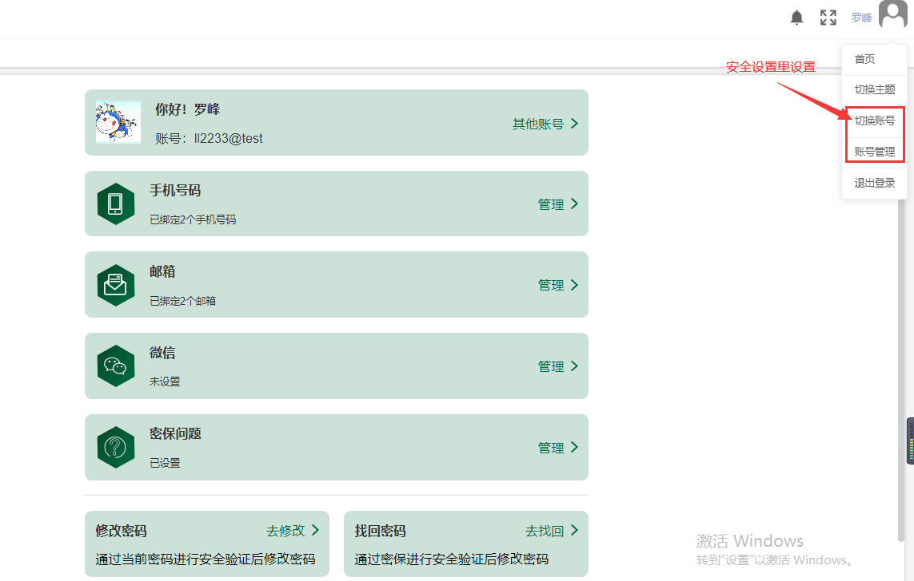

#### 5.3.1其它账号

1. 账号数量若未绑定则列表显示暂无数据
2. 列表显示序号、账号、角色、绑定时间、操作、解绑字段

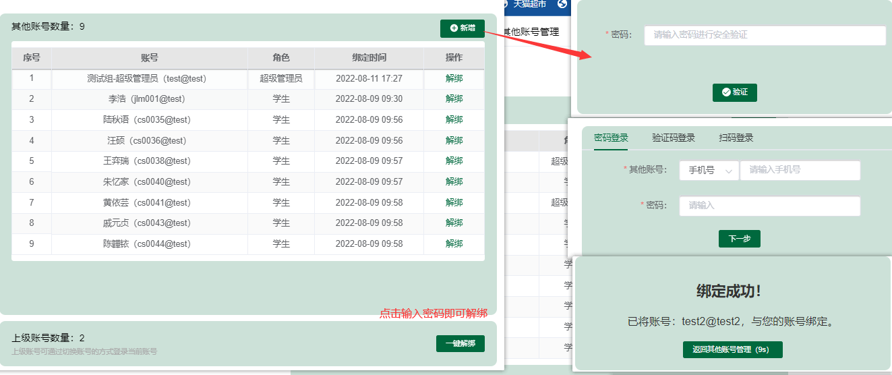

#### 5.3.2手机号码管理

1、一个手机号码只可绑定一个账号，一个账号可以绑定多个手机号

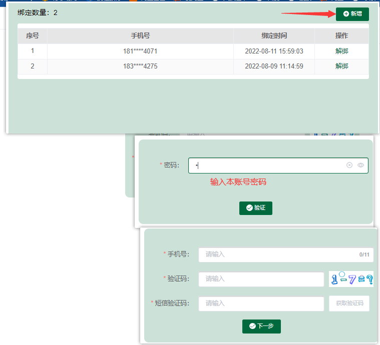

#### 5.3.3邮箱管理

1. 和手机绑定一致
2. 一个邮箱只可绑定一个账号，一个账号可以绑定多个邮箱

#### **5.3.4微信管理**

**1、**一个微信号只可绑定一个账号，一个账号可以绑定多个微信号

#### **5.3.5密保问题**

1、问题由字典表维护

2、答案最多20字

3、不可选择同一个问题

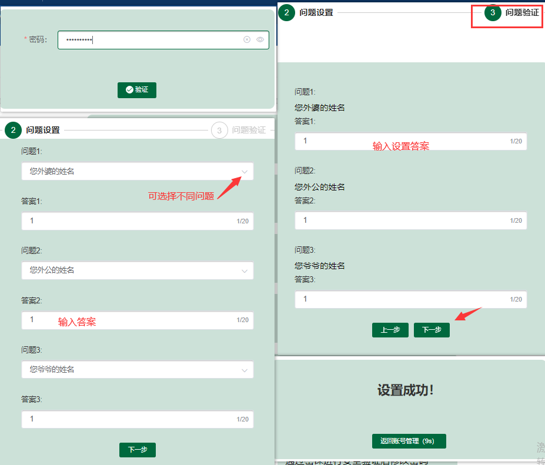

#### **5.3.6修改密码**

1、输入原密码-输入新密码（一致）输入验证码即可提交-成功后退出重新登录

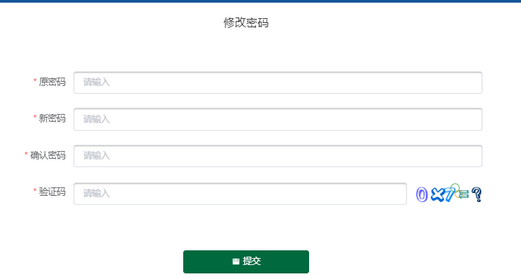

#### **5.3.7找回密码**

1、找回方式也可以在安全设置开启和关闭

2、没有绑定的不可选择

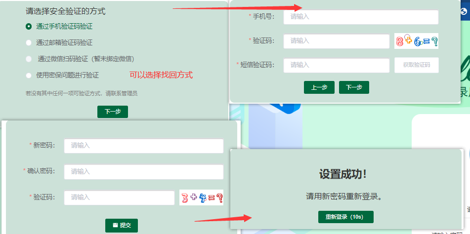

## **账号安全（移动端）**

### 6.1登录页面

1. 登录的方式由管理员在【平台管理】-【安全设置】开启和关闭
2. 登录：输入账号/已绑定账号的手机号或邮箱--输入密码、验证码--点击登录即可

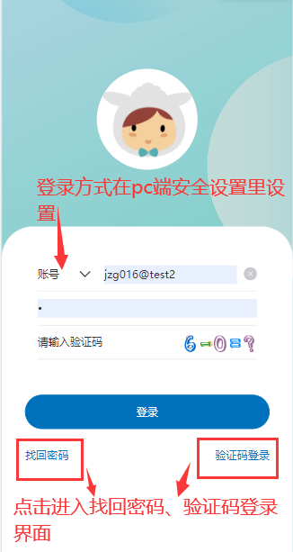

#### 6.1.1找回密码

1. 点击【找回密码】进入找回密码页（登录方式默认手机号，可选安全设置中开启的登录项）
2. 根据当前选中的登录方式输入账号/已绑定账号的手机号或邮箱
3. 点击下一步进入验证方式页
4. 选择验证方式（没有绑定或者未开启的验证方式不可选择）
5. 点击下一步进入安全验证页
6. 输入手机号码、验证码、手机验证码；邮箱号、验证码、邮箱验证码；微信进行扫码或者输入密保问题的答案
7. 点击下一步，进入设置密码页
8. 输入新密码、确认密码、验证码
9. 点击确定即可设置成功，点击返回登录，重新输入账号密码即可登录成功

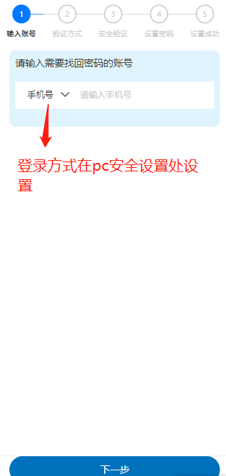

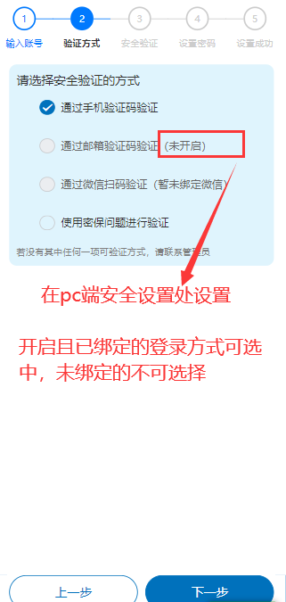

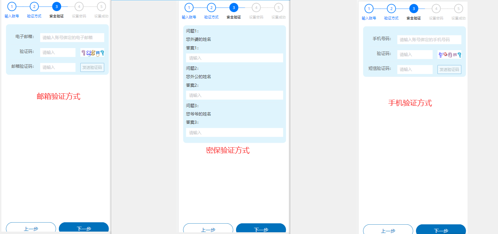

#### **6.1.2验证码登录**

1. 点击【验证码登录】按钮进入验证码登录页-输入手机号、验证码--点击登录即可

注意事项：若安全设置处手机号+验证码的登录方式关闭，则不显示验证码登录

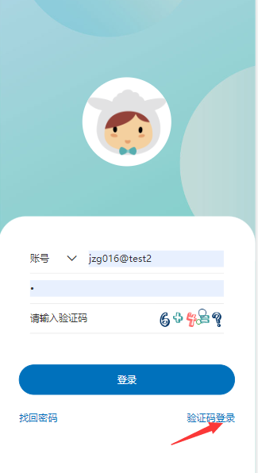

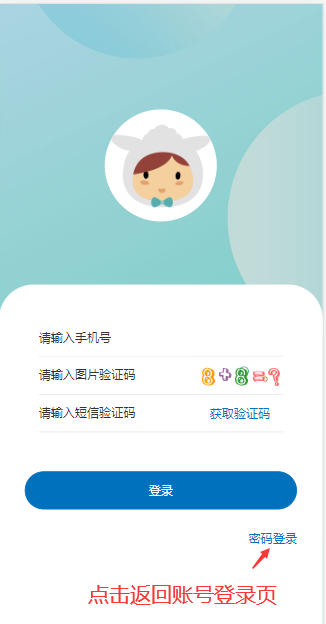

### **6.2账号管理**

1、点击右上角用户名进入账号安全--点击要切换的账号，即可成功切换账号--点击账号管理，进入账号管理页

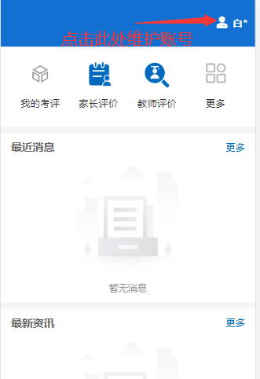

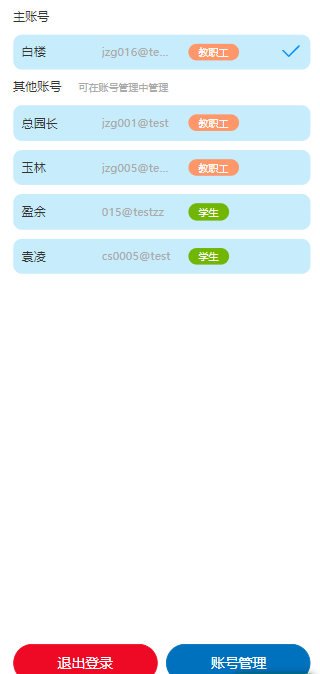

#### **6.2.1其他账号**

1、新增其他账号：

密码登录：点击【其他账号新增】按钮--根据登录方式，输入账号、密码--点击登录即可

验证码登录：输入手机号、验证码、短信验证码--点击确定即可

2、解绑上级账号：点击【一键解绑】-输入账号登录密码--即可解绑所有上级账号

注意事项：

1. 若当前切换到的账号不是主账号则不能进行一键解绑。
2. 安全设置里关闭其他账号的，不显示【其他账号】按钮

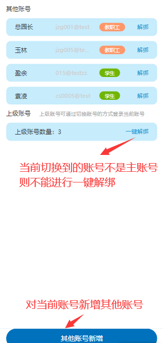

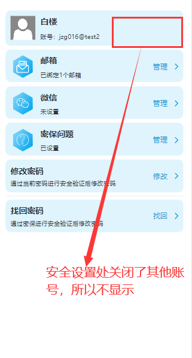

3、解绑其他账号：点击【其他账号】进入其他账号管理页--点击解绑--输入密码即可解绑成功

注意事项：若安全设置处手机号+验证码的登录方式关闭，则不显示验证码登录

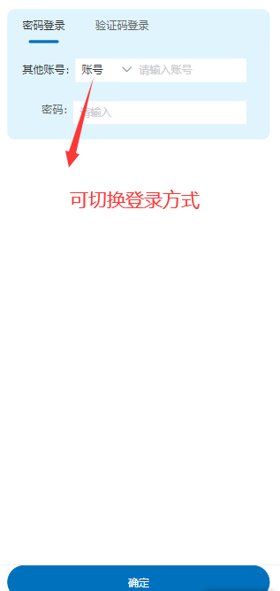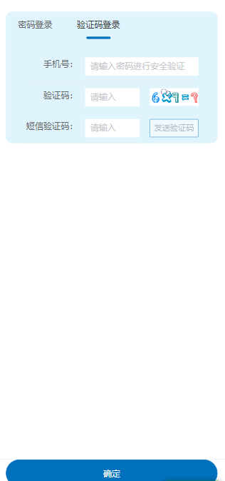

#### **6.2.2手机号码管理**

1、绑定手机号码：点击手机号码 【管理】，进入手机号码管理页--点击【新增】按钮--输入登录密码，点击验证--输入手机号、验证码、短信验证码，点击下一步即可绑定成功

2、解绑手机号码：点击手机号码 【管理】，进入手机号码管理页--点击解绑--输入登录密码，点击验证即可解绑成功

注意事项：一个手机号码只可绑定一个账号，一个账号可以绑定多个手机号

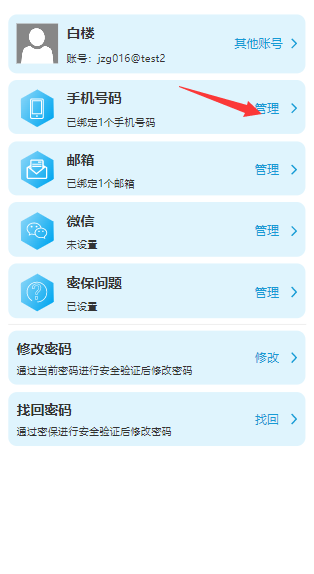

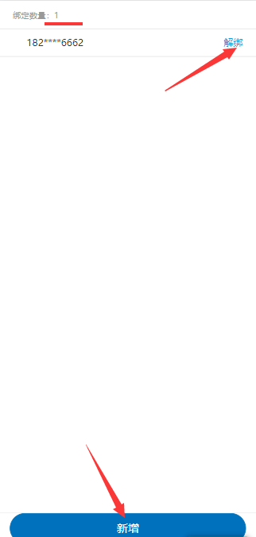

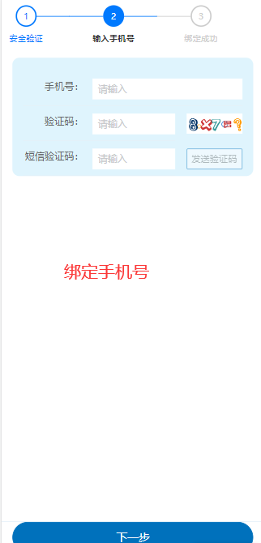

#### **6.2.3邮箱管理**

1、操作步骤和上述手机绑定一致

注意事项：一个邮箱只可绑定一个账号，一个账号可以绑定多个邮箱

#### **6.2.4微信管理**

1、移动端只可以进行解绑操作

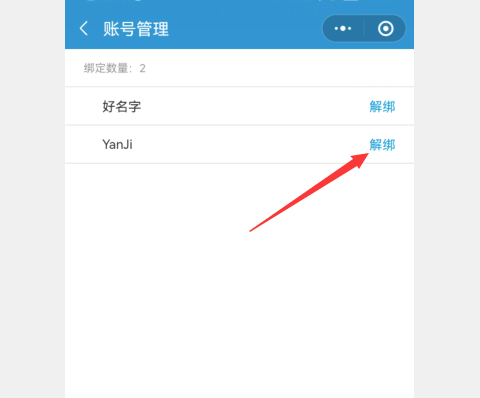

#### **6.2.5密保问题**

设置密保问题：

1. 点击密保问题【管理】按钮
2. 输入登录密码，点击验证
3. 选择密保问题（问题由字典表维护、问题设置不能选择同一个问题）、输入答案，点击下一步
4. 输入上一步设置的答案，点击绑定即可

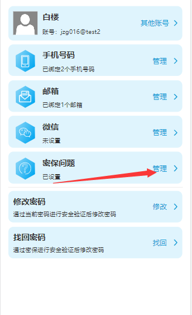

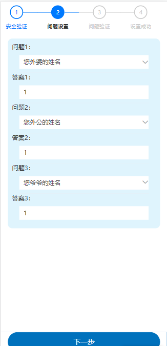

#### **6.2.6修改密码**

1. 输入原密码、新密码（一致）、验证码，点击确定-修改成功后退出重新登录

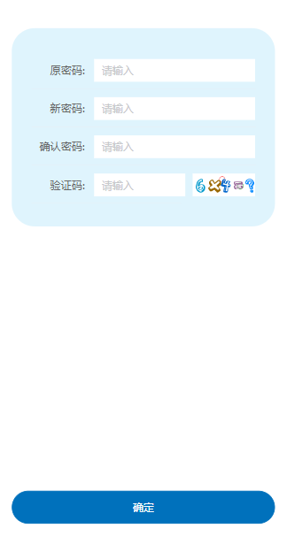

#### **6.2.7找回密码**

1. 选择验证方式
2. 点击下一步进入安全验证页
3. 输入手机号码、验证码、手机验证码；邮箱号、验证码、邮箱验证码；微信进行扫码或者输入密保问题的答案
4. 点击下一步，进入设置密码页
5. 输入新密码、确认密码、验证码
6. 点击确定即可设置成功，点击返回登录，重新输入账号密码即可登录成功

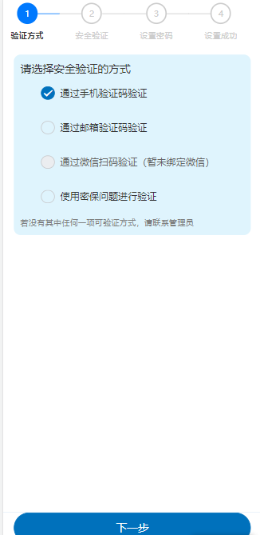

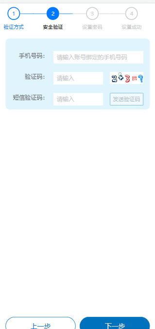

注意事项：在安全设置中，若登录方式及密保管理均未启用该项，则不显示

如：登录和密保都未启用手机号，则手机号这一栏不显示，如下图：

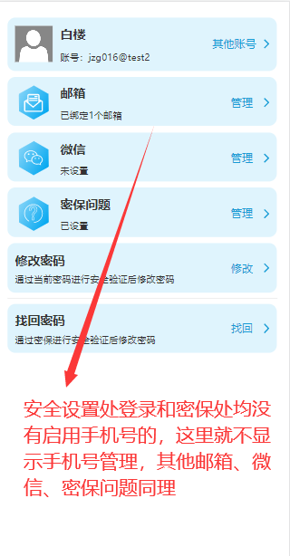