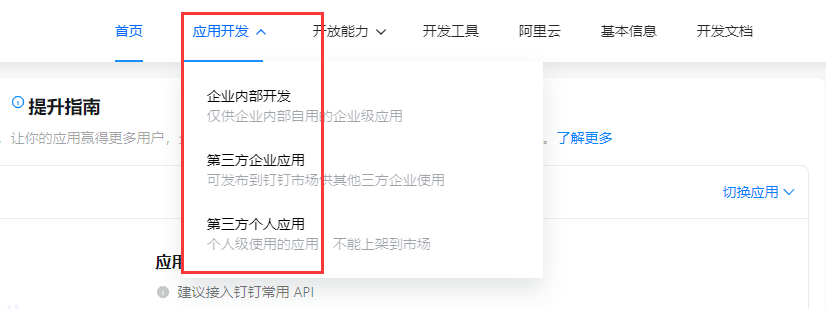
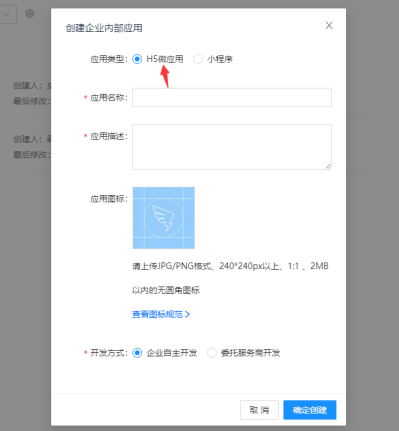
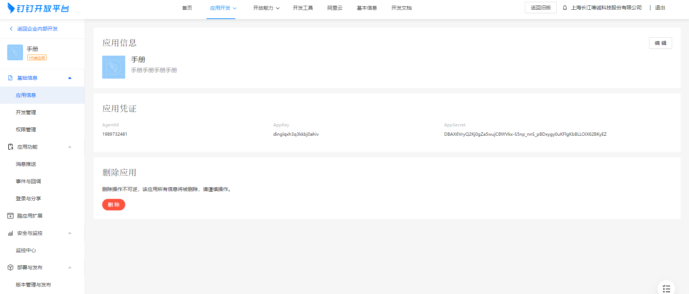
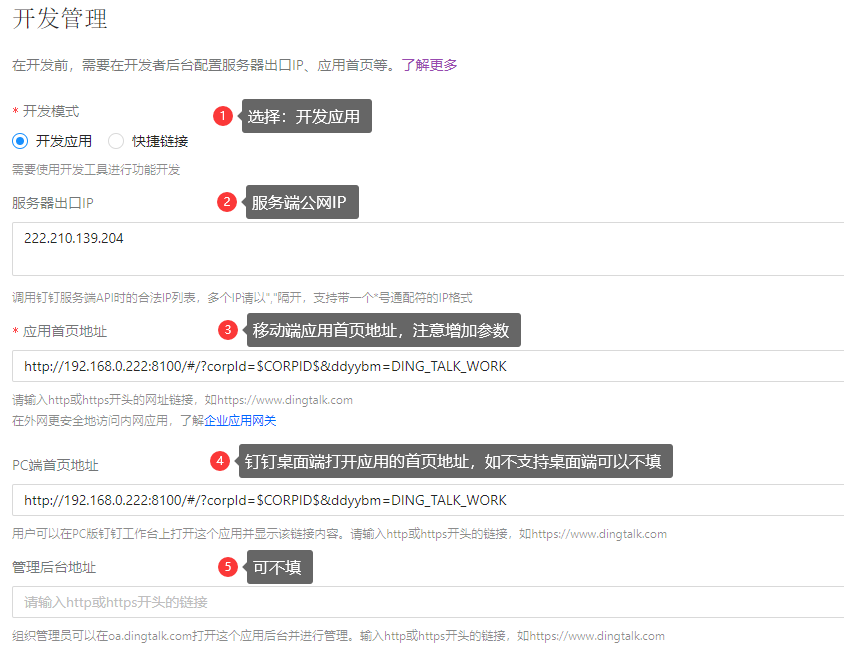
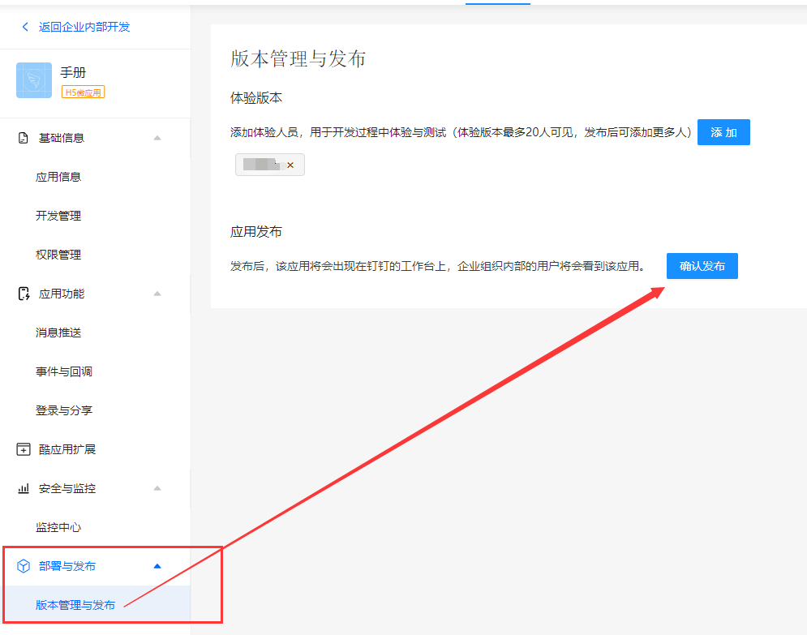
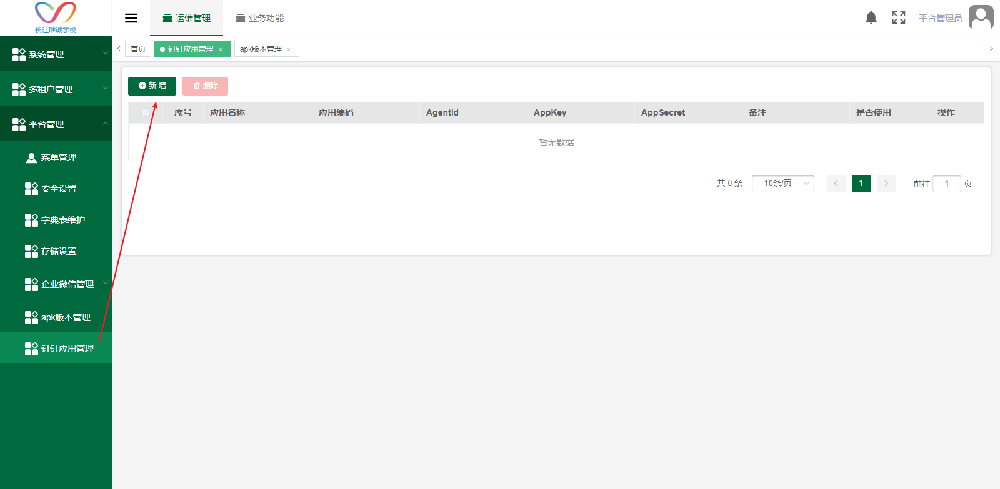
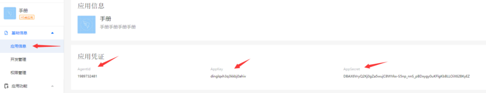
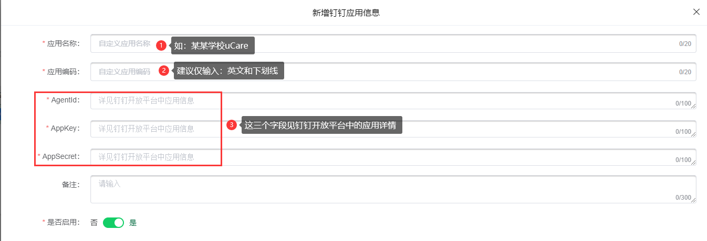
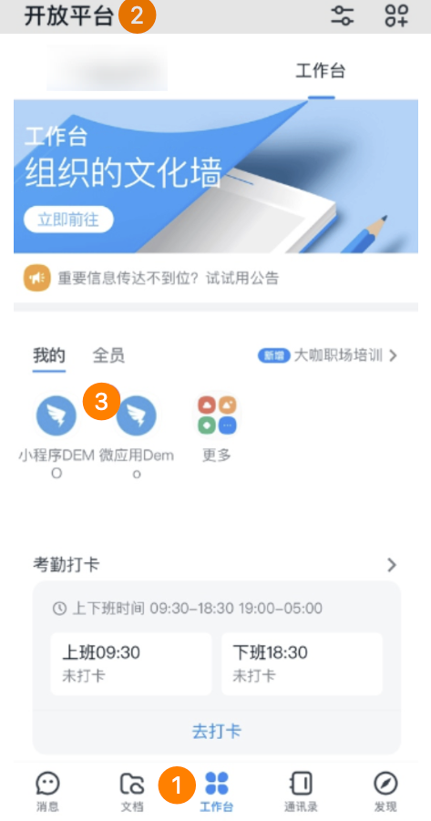

# 使用准备

## 操作系统要求

系统版本：Win7及以上；macOS10.0.4及以上

## 浏览器要求

**建议使用浏览器：Chrome**

兼容的浏览器：Microsoft Edge、Safari、360极速浏览器（等国内浏览器的极速模式）

版本要求：建议使用浏览器的最新版

## 系统访问信息

https://cd.oakedu.net.cn/cjvision4

# 钉钉应用操作流程

## 登录钉钉开放平台

登录地址：[https://open-dev.dingtalk.com](https://open-dev.dingtalk.com/)

登录后打开应用开发-**企业内部开发**：

## 创建应用

### 进入钉钉应用页面后，点击创建应用按钮：

### 选择H5微应用，并填写其他内容后，点击确定创建：

### 创建完成后，系统会自动进入应用详情页；

1. 点击左侧菜单**开发管理**；然后点击开右侧的**修改**按钮；完成填写后点击右上角**保存：**

**应用首页地址示例**：

<http://192.168.0.222:8100/#/?corpId=$CORPID$&ddyybm=DING_TALK_WORK&zhid=-1> （http://192.168.0.222:8100为nginx配置的移动端前端地址）

地址后面添加的参数：

**corpId**=$CORPID$ 用于钉钉授权识别

**ddyybm**=（对应uCare系统中的钉钉应用管理中数据的[应用编码](#_维护钉钉应用管理)）

**zhid**=（对应uCare系统中使用该微应用的租户的ID）

1. 开发管理填写完成后，即可发布应用（其余配置根据实际情况填写即可）：

## 维护钉钉应用管理

1. 进入uCare系统-钉钉应用管理功能中，点击**新增**按钮。

注意：**该功能仅平台管理员使用**

1. 依次填写完成后，点击保存即可：

* 应用编码：填入**DING\_TALK\_WORK**；与[钉钉应用首页地址](#_创建完成后，系统会自动进入应用详情页；)中参数ddyybm对应。如果有特殊情况需要自定义其他应用编码，请联系开发人员
* AgentId、AppKey、AppSecret，对应钉钉开放平台中所建的应用：

## 前往钉钉查看应用

