# 业务流程图

# 功能名称

## 角色权限

|  |  |  |
| --- | --- | --- |
| **角色** | **菜单或应用** | **数据权限说明** |
| **班主任** | **饮食禁忌** | **查看自己所带班级数据** |
| **学生（家长）** | **饮食禁忌** | **查看/提交自己的数据** |
| **饮食禁忌总管理员** | **今日饮食禁忌** | **控制班牌饮食禁忌内容** |
| **饮食禁忌分园管理员** | **今日饮食禁忌** | **控制班牌饮食禁忌内容** |

## 具体操作说明

### 班主任

1. 选择时间短期的显示时间范围，选择长期显示长期（不显示时间范围）
2. 对姓名/学号，按班级罗列显示搜索结果
3. 班级可折叠展开，默认展开第一个班级
4. 当天新增的学生显示New
5. 按学号正序排序，一个学生如果有多条的排在一起，先显示短期，后显示长期，如果有两条或者更多的短期，短期这个范围内按提交时间排序

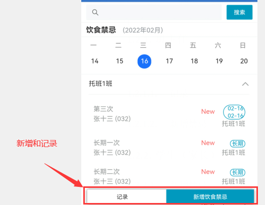

#### 记录

1、可对饮食禁忌模糊搜索

2、卡片显示提交日期、提交人、学生、时间周期、饮食禁忌

3、禁忌没有在时间范围内和状态为关闭的显示“已失效”（反之已生效）

4、默认显示所管理所有班级的饮食禁忌提交记录

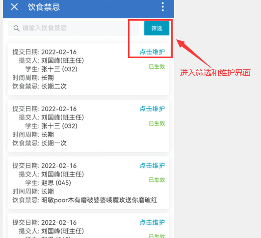

##### 筛选

1. 姓名默认为空
2. 可以在自己管理的班级中选择学生
3. 选择短期则显示下方时间周期（默认长期，不显示时间周期）
4. 筛选有时间周期的饮食禁忌记录
5. 提交人只可以单选

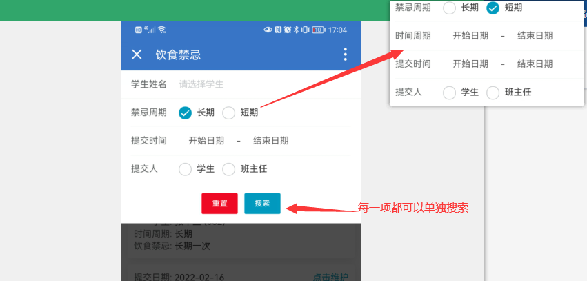

##### 修改

1、显示该记录对应学生

2、显示所选学生对应班级

3、选择短期则显示下方时间周期（默认长期，不显示时间周期）

4、饮食禁忌内容必填，30字以内

5、若该条饮食禁忌不再需要，则可修改为停用，若需再次启用，可修改为启用

#### 新增禁忌

1. 学生默认为空，可选所管理班级内所有学生
2. 选择短期则显示下方时间周期（默认长期，不显示时间周期）
3. 饮食禁忌内容必填，30字以内
4. 点击可添加多个饮食禁忌

##### 选择学生

1. 学生只可以选择一个

### 学生（家长）

1、可对饮食禁忌模糊搜索

2、卡片显示提交日期、提交人、学生、时间周期、饮食禁忌

3、禁忌没有在时间范围内和状态为关闭的显示“已失效”（反之“已生效”）

4、排序，已生效状态的置顶，同状态内按提交时间倒序排序

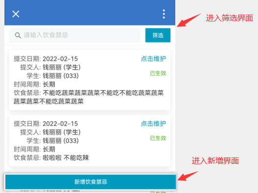

#### 新增禁忌

1. 学生姓名和班级为当前登录人的数据
2. 选择短期则显示下方时间周期（默认长期，不显示时间周期）

3、饮食禁忌内容必填，30字以内

#### 筛选

1. 选择短期则显示下方时间周期（默认长期，不显示时间周期）
2. 可根据调教时间搜索
3. 提交人只可单选

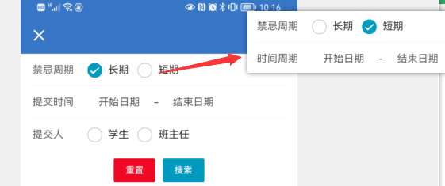

### 全区监控

1.登录不同角色查看的对应的饮食禁忌情况。

饮食禁忌总管理员/园长：可查看本学期所有校区所有年级班级的饮食禁忌概况

饮食禁忌分园管理员/分园长：可查看本学期负责校区所有年级班级的饮食禁忌概况

班主任：可查看当前学期自己负责班级的饮食禁忌概况

2.可通过下拉框进行筛选校区、年级、班级。

3.点击右下角的更多进入饮食禁忌数据页码。

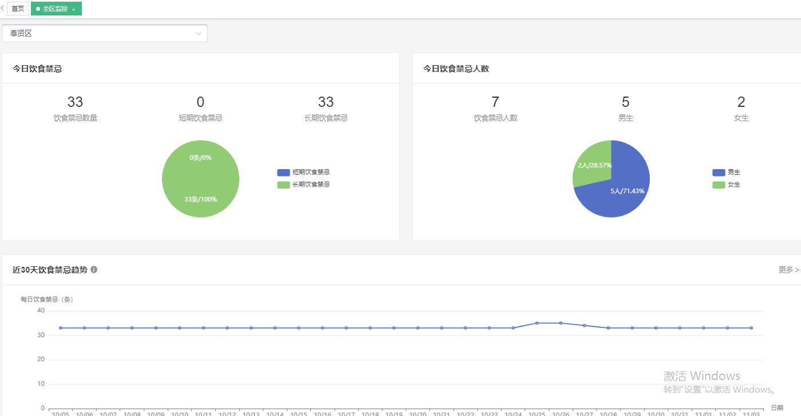

### 饮食禁忌数据

1. 饮食统计里面可通过条件进行筛选。
2. 点击查看按钮可查看所选校区的饮食禁忌上报详情。
3. 排序按钮可根据进行升序、降序排序。

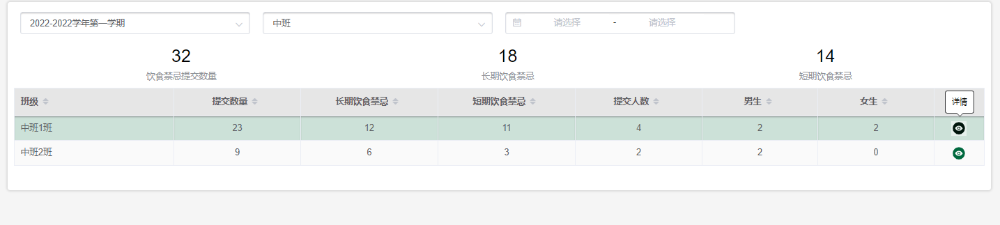

### 饮食禁忌统计（区级）

1. 树结构呈现，单选必选，可选择任一节点，默认选中根节点第一项。
2. 树结构：行政区>幼儿园>校区>年级>班级。默认选中第一个根节点

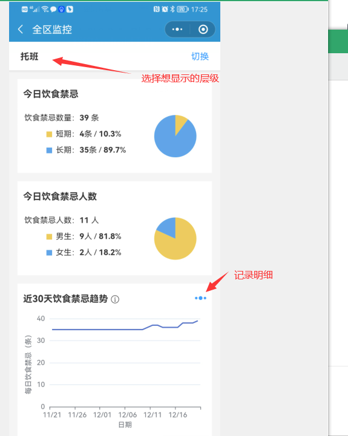

#### 1.2.5.1记录明细

1、树结构呈现，单选必选，可选择任一节点，默认选中根节点第一项。

2、行政区>幼儿园>校区>年级。默认选中第一个根节点。

3、可选任意时间范围，不受学期限制

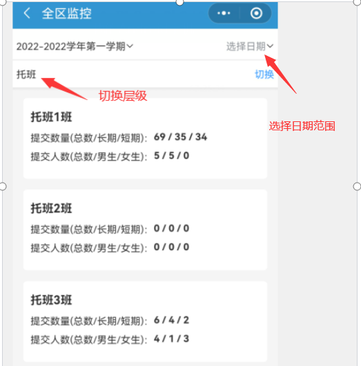

### 饮食禁忌管理

1. 点击新增进入页面选择学生、填写内容
2. 鸡蛋、牛奶、花生等一下选项只能选择一个选择
3. 用文本逗号隔开可输入多个
4. 点击可添加多个

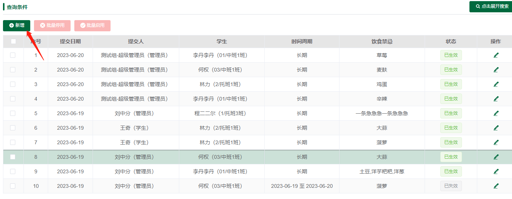

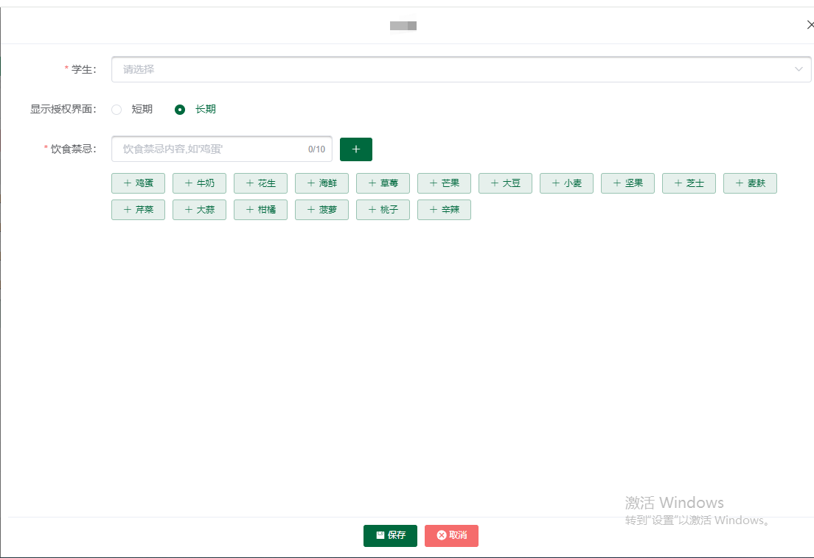

### 今日饮食禁忌

1. 饮食禁忌总管理员、分园管理员可见
2. 可根据下拉框筛选校区、班级
3. 开启饮食禁忌内容后班牌组件--今日饮食禁忌-教室/食堂 会显示当前已出勤幼儿

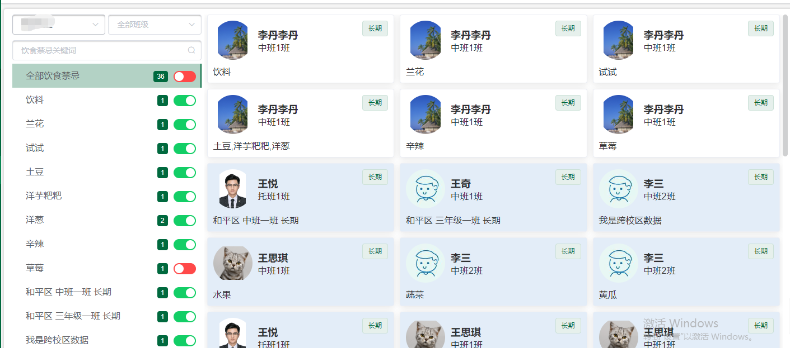

### Pc引导页

1、一个幼儿可能多条记录，要做去重处理，不受禁忌餐影响，只处理营养餐重复人员即可

2、禁忌餐与营养餐分开统计各个类型的百分比与数量

3、环形图展示各个类型的占比，展示图例与占比，因类型可能较多是否可做鼠标滚动展示图例

4一键生效可弹窗表格展示所有待生效饮食禁忌记录

5、展示饮食类型：禁忌餐/营养餐，特殊饮食全部展示，特殊饮食较多时可换行展示

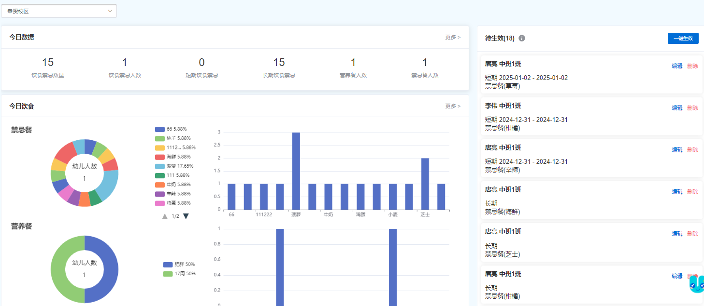

#### 一键生效

1、家长只能提交禁忌餐禁忌记录

2、点击一键生效后以上所有记录状态都都变为“已生效”

3、班级可多选筛选，筛选框展示全部班级

4、特殊饮食可多选筛选，筛选框展示禁忌餐所有的特殊饮食

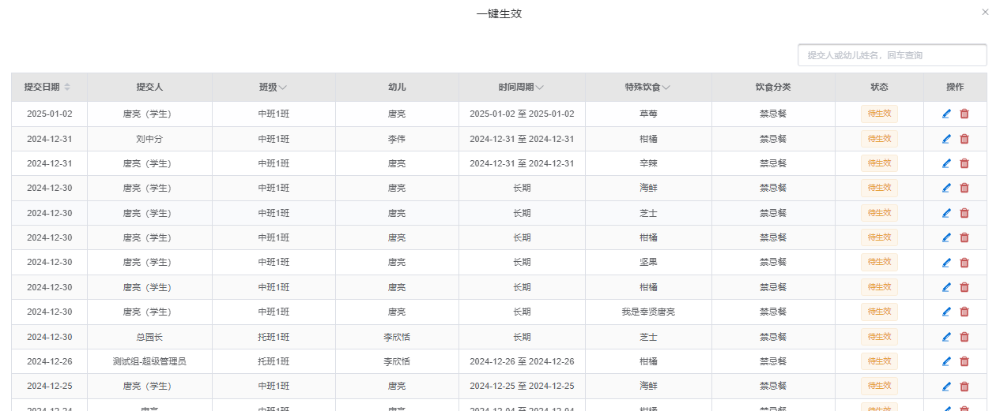

### 饮食管理-新增

1、默认选择短期

2、选择幼儿自动带出班

3、选择营养餐显示当前幼儿校区当前周的特殊膳食

4、时间周期选择不用限制

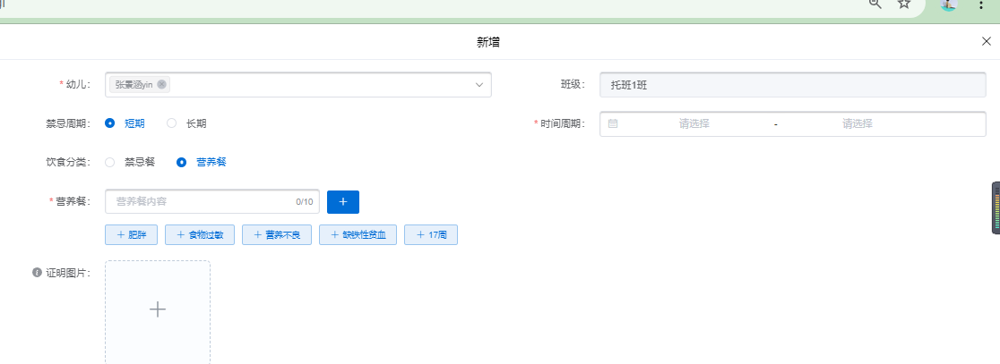

### 今日饮食

1、饮食分类选择，默认选中“禁忌餐”

2、禁忌餐与营养餐只展示当前日期状态为“已生效”的幼儿信息与数据统计

3、两种模式：卡片模式与表格模式，默认展示卡片模式，点击表格模式后展示表格模式，按钮文字变成“卡片模式”

4、入园人数统计，一个小朋友若有多天记录需要做去重

5、只展示当前日期有已生效饮食禁忌的班级

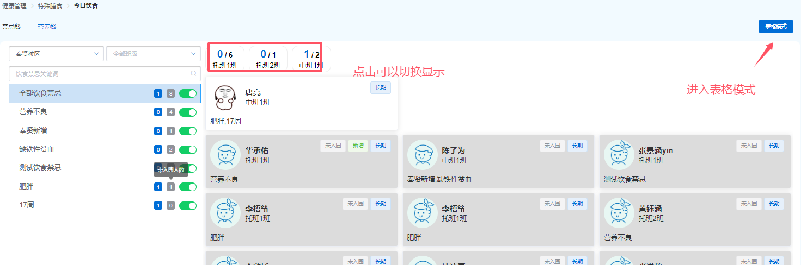

#### 表格模式

1、除表格第一列第二列外，其他所有数据统计表格鼠标经过展示幼儿饮食禁忌信息

2、班牌显示开关，关闭的禁忌内容将不在班牌上显示，鼠标经过开关也会有此提示

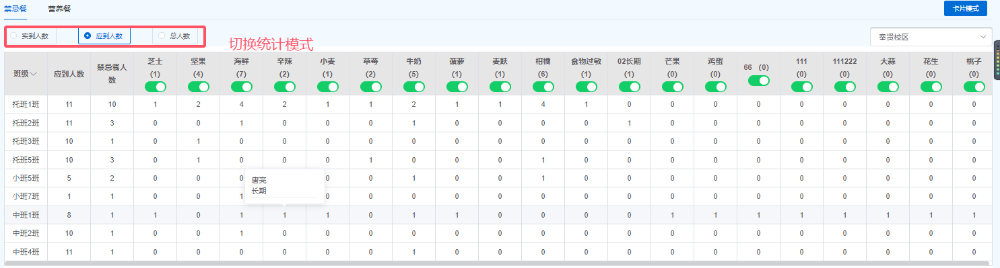

### 移动端（园长、管理员、班主任）

1、关键字搜索所选日期的幼儿姓名

2、只展示有已入园已生效幼儿的班级

3、展示饮食分类与相关特殊饮食，全部展示出即可，可换行展示

#### 管理页面

1提交人若是家长则展示：“幼儿姓名（学生）”，若是教职工，只展示教职工姓名

2、时间周期，若是长期展示“长期”，若是短期则展示时间段

3、点击卡片可查看记录详情弹窗

4、除家长外新增记录不用选择状态

### 班牌

1、统计该饮食禁忌类型下有饮食禁忌记录班级的饮食禁忌总人数与入园人数

2、饮食分类选择，默认选中“禁忌餐”

3、两种模式：卡片模式与表格模式，默认展示卡片模式，点击表格模式后展示表格模式，按钮文字变成“卡片模式”

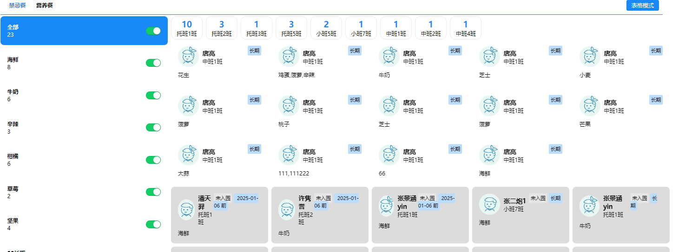

#### 表格模式

1、点击数字后，展示所选数字的对应幼儿

2、只展示当前日期有已生效饮食禁忌的班级

3、该数字所在行和列展示高亮效果

4、右侧幼儿信息根据所点内容进行展示

5、根据前面所选实到人数/应到人数/总人数统计个各个特殊饮食与数量

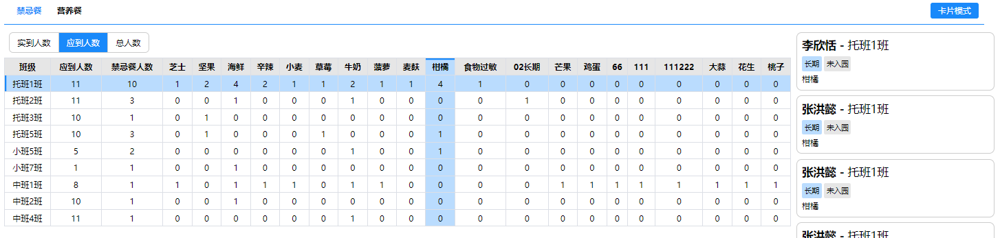