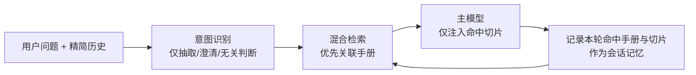

# 会话记忆

1. 我们认为一个会话一般对应某一个功能的操作手册，所以首次对话结束后，我们会将检索到的操作手册完整内容保存到会话记忆中，下次对话时，LLM会结合上下文和当前会话记忆的操作手册内容判断：如果还在当前文档范围内则直接进行回答，无需检索。否则再走检索流程。
2. 当然我们也允许用户在单个会话中触发多个操作手册文档，我们需要设置会话记忆中关联的文档上限，暂定一个会话最多关联3个文档，超过后不再关联。不超过这个上限是都可以保存到会话记忆中。这样可以提高问答效率，节省频繁检索相同文档。
3. 这里保存的会话关联操作手册应该是存操作手册的id，而不是存内容。避免文档内容变化或被删除失效后会话中还保留历史文档内容。所以存id，每次检索时再**通过文档id去找上传后保存的md文档获取内容**添加到上下文中。不过可以做个短期redis缓存，避免频繁读取文档内容。

## 涉及到的改动

1. 意图识别调用LLM时传入的历史会话上下文包含：
   1. 系统提示词
   2. 会话记忆中关联的操作手册完整内容，
   3. 会话消息中用户输入和LLM最终输出的内容，不需要包含：思考过程、检索到的切片
   4. 用户最新的问题
2. 然后意图识别时就要做两步：
   1. 原来的意图识别步骤，识别用户的意图是否明确
   2. 如果是明确的，那么LLM就要结合传入的`会话记忆中关联的操作手册完整内容`去判断能否直接回答用户的问题
   3. 如果可以，那么就直接作答并返回最终的答案
3. 所以意图识别这里改动就很大，意图识别阶段可以直接回答用户的问题，这个不知道是否合适？我想的是有了参考文档则不用再检索了，那就没必要再走生成回答的调用流程了。但这样意图识别阶段就很复杂了。你帮我从系统架构的角度判定下是否合理？或者有没有更合理的方式？
---
> 上述方式已实现，但经过测试后发现收益很低且可能负收益
最初目的是：
1. 节省没必要的检索
2. 加快响应速度
3. 避免因检索失败而导致本来应该直接基于原来的手册回答的，反而没找到正确的知识。不过这是不是个伪命题，检索成功率本来就应该很高，不能通过之前检索到的文档来弥补检索正确率
但是我测试发现：
1. 意图识别和生成回答时都重复传入完整的关联手册内容会增加token效果和响应时长，造成了负面影响
2. 我不确定应该在意图识别阶段传入还是生成回答时传入，所以这个架构本来就是错误的吗？
---

## 所以优化为：关联手册优先检索

当前“关联手册全文直答”方案的收益很可能被 token 与延迟反噬。它不是完全错误，但把“判断能否直答”放在意图识别阶段，并为此注入完整手册，职责和成本都不合适。

当前重复发生了两次全文注入：

1. 意图小模型：为判断 `memory_answer_docs`，注入最多 3 本关联手册全文。
2. 回答主模型：直答时再次注入这些全文。

而且意图识别当前还会注入完整历史消息，没有长度限制，叠加全文后上下文会持续膨胀。见 [recognizer.py](F:\工作备忘录\修炼\叶小钗\AI-10\操作手册RAG\code\backend\app\intent\recognizer.py:137)。

- 会话关联手册确实是有价值的上下文信号，能减少跨手册误召回；
- 但它不能替代检索正确率建设；
- “同一本手册”不代表“当前问题就在上一次命中的段落里”。整本手册越长，全文作答反而更容易漏看、误答或引用不精确。

我建议改为：**保留关联手册记忆，取消“基于完整手册跳过检索”的默认路径。**

具体改法：

- 意图识别阶段：不传关联手册内容，也不输出 `memory_answer_docs`。它只做你原先定义的三件事：无关判断、三要素补全、指代消解。
- 检索阶段：将 `sessions.memory_docs` 作为“优先范围”而非“唯一范围”。
  - 先在关联手册内检索；
  - 命中分数达到阈值，则采用结果；
  - 不足则自动扩展到全库检索。
- 回答阶段：始终只传最终命中的父/子切片，而非整本手册。
- 会话记忆：建议除 `doc_id` 外，再记住最近回答的 `chunk_id` 与 `path`。这比“关联整本手册”更有用，能帮助连续追问优先命中同一模块。

这既保留了会话上下文对检索准确率的帮助，也不会把用户锁死在旧手册中。

会话保存最近命中的 doc_id（可同时保存最近 chunk_id）
  → 当前问题照常意图识别
  → 先在关联 doc_id 内混合检索
  → 若结果分数/重排分数足够高，直接使用
  → 否则自动全库检索

| 能力 | 复杂度 | 预期收益 | 建议 |
|---|---:|---:|---|
| 关联手册作为检索偏好 | 低 | 中等且稳定 | 做 |
| 关联手册作为硬过滤 | 低 | 有准确率风险 | 不做 |
| 会话切片缓存直答 | 中高 | 依赖追问比例 | 暂缓 |
| 全文手册直答 | 高 | 通常负收益 | 移除 |

原因很直接：
- 检索范围缩小：如果用户刚问完会议室预约，再问“审批怎么操作”，优先搜索已关联手册能减少跨系统误召回。实现上只是一次“关联文档优先检索，低分再全库回退”，复杂度低。
- 检索成本：在你目前的规模下，Milvus 向量检索本身成本很低；真正可能较贵的是混合检索后的重排，以及后续主模型读取过多候选切片。因此，关联手册的主要价值是提升相关性、减少重排候选，而不是省掉那一次向量检索。
- 切片缓存：它只有在“同一会话内大量连续追问同一个小模块”时收益显著；但需要做命中判定、过期、回退、来源追踪与质量监控。缓存命中率不高时，维护成本会大于收益。

# 长期记忆【还没想明白，先不做】

1. 用户常问的角色，可能就是用户在业务中扮演的角色要保存下来
