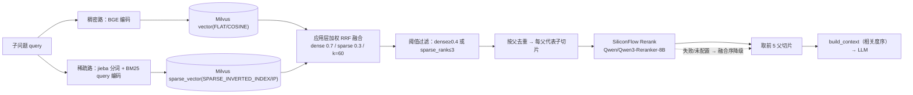

# 关键词检索（BM25）+ 混合检索 + 重排 技术方案

> 版本：v1.1　日期：2026-08-26（v1.1 实测服务端版本 v2.3.21，升级 Milvus 列为实施前置条件）
> 需求来源：`chat/增加关键词检索.md`
> 现状基线：纯语义检索（BGE 稠密 + Milvus COSINE，子切片 top_k=8 + 父切片回溯）
> 目标链路：**双路召回（稠密 + 稀疏 BM25）→ 加权 RRF 融合 → 阈值过滤 → 按父去重 → Rerank 重排 → 前 5 条 → 父子回溯上下文**

---

## 1. 背景与目标

### 1.1 为什么要加关键词检索

当前纯语义检索存在两类典型失败：

| 场景 | 语义检索表现 | 关键词检索表现 |
| --- | --- | --- |
| 精确术语/编号（"PC 端"、"实验会议室"、"K8 考勤机"） | BGE 泛化可能漂移到语义相近但术语不符的章节 | 精确 token 命中，稳 |
| 短 query、功能名词查询（"班牌端首页"） | 短文本向量表达不稳定 | 词项完全匹配 |

操作手册问答的 query 大量是「功能模块名 + 操作动词」结构，术语精确匹配价值高——语义为主、关键词为辅的混合检索是标准解法。

### 1.2 新旧链路对比

```
旧（当前）：
  子问题 → BGE 编码 → Milvus COSINE 检索(top_k=8) → 阈值过滤(≥0.4)
        → 跨子问题去重 → build_context(文档序) → LLM

新（本方案）：
  子问题 → ┬ 稠密路：BGE 编码 → Milvus COSINE(recall_top_k=20)
           └ 稀疏路：jieba 分词 → BM25 编码 → Milvus SPARSE/IP(recall_top_k=20)
        → 应用层加权 RRF 融合(dense 0.7 / sparse 0.3 / k=60)
        → 阈值过滤(dense ≥ 0.4 或 sparse_rank ≤ 3)
        → 跨子问题去重 → 按父去重取代表子切片
        → SiliconFlow Rerank(Qwen3-Reranker-8B) → 前 5 父切片
        → build_context(相关度序) → LLM
```

---

## 2. 总体架构



关键设计原则：

1. **检索编排收口在 retriever**：新增 `search_and_rerank()` 作为混合检索单一入口，chat_service 只换一行调用。
2. **reranker 独立单例**（与 recognizer/agent 同级挂 `app.state`），retriever 不持有 HTTP 客户端——能力边界干净，测试好 mock。
3. **BM25 编码器与父子映射同源同生命周期**：都由 `retriever.reload()` 从 MySQL chunks 表全量重建（不可变对象整体替换），不持久化统计。
4. **全链路降级**：稀疏路任一环节不可用（开关关闭/schema 无字段/统计未就绪/检索异常）→ 自动纯稠密 + 告警日志；rerank 未配置/超时/失败 → 融合序取前 5。任何情况下不抛出、不空结果（除非稠密路本身失败）。

---

## 3. 分词与 BM25 设计

### 3.1 分词器选型：jieba

| 候选 | 结论 |
| --- | --- |
| **jieba（选用）** | 中文事实标准；纯 Python 无重依赖；精确模式对"操作手册"领域文本切分质量足够；支持自定义词典扩展（本期不加，留作调优点）；首次加载词典约 1s，放入启动 `to_thread` 不阻塞事件循环 |
| pkuseg | 需要预训练模型文件（数 MB~数十 MB），部署重；领域增益对本场景不明显 |
| HanLP / LTP | 功能强但依赖重（深度学习框架），为一个分词引入不值得 |
| Milvus 内置 BM25 Function | **Milvus 2.4 不支持**（full-text/Function 是 2.5+ 能力），当前 pymilvus 锁 2.4.x，不可用 |

分词规则（`tokenize` 函数）：`jieba.cut(text, HMM=True)` 精确模式 → 小写化 → 去标点/空白/纯符号 → 停用词过滤。纯英文数字 token（如 `PC`、`H5`、`K8`）保留——这是关键词检索的核心价值点。

停用词表：**模块内 frozenset 常量**（内置精简中文停用表约 200 词，含"的/了/如何/哪些/进行/操作"等手册场景高频疑问虚词），不依赖外部文件，避免部署时文件缺失。

### 3.2 稀疏向量编码：应用层 BM25

Milvus 稀疏向量检索只做内积（IP），BM25 打分在应用层完成——**文档侧把 BM25 公式的 idf 与 tf 饱和项预先算进向量权重**，查询侧放词频，两者内积即 BM25 得分：

- 文档侧：`w(t, d) = idf(t) · tf(t,d)·(k1+1) / (tf(t,d) + k1·(1 − b + b·|d|/avgdl))`
  - `idf(t) = ln(1 + (N − df + 0.5)/(df + 0.5))`（Lucene 变体，恒正）
  - `|d|` 按 token 数计，`k1=1.5`、`b=0.75`（业界默认值）
- 查询侧：`w(t, q) = tf(t, q)`（标准 BM25 不做查询侧饱和）
- 内积 `Σ_t w(t,q)·w(t,d) ≈ BM25(q, d)`

**token id 映射**：`int.from_bytes(hashlib.blake2b(token.encode(), digest_size=4).digest(), "big")` → uint32。**禁用内置 `hash()`**（PYTHONHASHSEED 随机化，进程重启/多进程 id 不一致）。32 位空间下约 3 万词表碰撞期望 ≈ 0.1 次，且碰撞仅合并两个罕见词，可接受；此选择使新词入库不影响旧词 id，天然支持增量写入。

### 3.3 BM25 全局统计与重建时序

统计量 `N / df / avgdl` **不持久化**，随 `retriever.reload()` 从 MySQL chunks 表全量重算（子切片 `clean_for_embedding(content)` 后的文本）：

- 库规模小（4 本手册、数千子切片、单次全量分词秒级），全量重算成本可忽略；
- 与 `_parents` / `_child_to_parent` 映射同一次 reload 重建，**三者天然一致**，无独立一致性维护；
- 代价：单文档增删后，**旧文档已入库的稀疏向量不重算**，idf/avgdl 轻微过期——对检索排序影响极小，接受；需要彻底刷新时走管理端已有的「重新处理」。

**一致性红线**：文档侧编码输入必须是 `clean_for_embedding(content)` 后的文本（与 Milvus content 列一致）。MySQL chunks.content 是原文 markdown（含 `./media/x.png` 图片引用），编码前必须先过 clean，否则图片路径会被切出噪声 token。

### 3.4 新模块 `backend/app/rag/bm25.py` 接口

```python
def tokenize(text: str) -> list[str]: ...
def token_id(token: str) -> int: ...          # blake2b 稳定 hash → uint32

def weighted_rrf_fuse(
    dense: list[SearchResult], sparse: list[SearchResult],
    dense_weight: float, sparse_weight: float, k: int = 60,
) -> list[SearchResult]:
    """按 chunk_id 合并两路：fused_score = Σ w_i/(k+rank_i)（rank 从 1 起，
    仅计出现过的通道）。回填 dense/sparse 分数与排名；返回按 fused_score 降序。"""

class BM25Encoder:
    """不可变对象：构建完成后整体替换（retriever.reload 时换实例），线程安全。"""
    def __init__(self, k1: float, b: float) -> None: ...
    @classmethod
    def from_corpus(cls, texts: list[str], k1: float, b: float) -> BM25Encoder: ...
    @property
    def num_docs(self) -> int: ...                     # 0 表示统计未就绪
    def encode_document(self, text: str) -> dict[int, float]: ...
    def encode_query(self, text: str) -> dict[int, float]: ...
```

与 retriever 的关系：**组合**——`ManualRetriever` 持有 `self._bm25: BM25Encoder | None`，不挂 app.state。

---

## 4. Milvus collection 升级与数据迁移

### 4.1 为什么必须新建 collection

Milvus collection schema **不支持加字段**；现有 `manual_rag_child_chunks` 只有 6 字段（id/doc/path/parent_id/content/vector），无法追加稀疏向量。方案：**新建 collection `manual_rag_child_chunks_v2`**，通过既有配置项 `milvus_child_collection` 切换（`.env` 改名即切，旧库原样保留 = 天然回滚开关）。

> 备选（否决）：让用户在管理端重新上传 4 本手册——会重新生成 chunk_id（uuid4），MySQL 历史数据/检索日志关联断裂，且人工操作 4 次；backfill 脚本从 MySQL 读存量切片重灌，chunk_id 不变、零人工。

### 4.2 v2 schema（`_ensure_child_collection_sync` 改造）

> **前置条件**：SPARSE_FLOAT_VECTOR / 多向量索引 / 稀疏检索均要求 **Milvus 服务端 ≥2.4**；实测当前服务端为 v2.3.21，须先完成升级（步骤 0，详见 §11.1）。客户端 pymilvus 2.4.15 已满足。

```python
fields = [
    FieldSchema(name="id", dtype=DataType.VARCHAR, is_primary=True,
                auto_id=False, max_length=512),
    FieldSchema(name="doc", dtype=DataType.VARCHAR, max_length=256),
    FieldSchema(name="path", dtype=DataType.VARCHAR, max_length=1024),
    FieldSchema(name="parent_id", dtype=DataType.VARCHAR, max_length=512),
    FieldSchema(name="content", dtype=DataType.VARCHAR, max_length=65535),
    FieldSchema(name="vector", dtype=DataType.FLOAT_VECTOR, dim=768),        # 稠密路不变
    FieldSchema(name="sparse_vector", dtype=DataType.SPARSE_FLOAT_VECTOR),   # ★ 新增
]
# 稠密索引不变
collection.create_index("vector",
    {"index_type": "FLAT", "metric_type": "COSINE", "params": {}})
# 稀疏索引（每个向量字段一个索引，Milvus 支持多向量索引）
collection.create_index("sparse_vector",
    {"index_type": "SPARSE_INVERTED_INDEX", "metric_type": "IP",
     "params": {"drop_ratio_build": 0.0}})
```

collection 已存在时仍直接 return（指向旧 v1 库则由 `_has_sparse=False` 自动降级纯稠密）。

### 4.3 backfill 脚本 `backend/scripts/backfill_sparse_collection.py`

新建 `backend/scripts/` 目录。`asyncio.run(main())` 复用 app 模块（Settings/Database/ManualRetriever）：

1. 参数：`--collection`（默认取 `settings.milvus_child_collection` 即 v2 名）、`--dry-run`、`--batch-size 256`。
2. 连 DB → `retriever.startup()` → 查询全部 `chunk_type == "child" and vector_state == "success"` 行。
3. `--dry-run`：打印切片数/字符量/jieba 词表规模/预计批数；并在 Milvus 建临时小 collection 做**稀疏向量 upsert/search/expr 冒烟**（见 §11.2 风险 #2）后删除。
4. 正式：指向 `--collection` 建 v2 → `reload()`（BM25 统计就绪）→ 分批 `embed(clean texts)` + `encode_sparse(texts)` + `upsert_children` → flush → 打印 `num_entities` 与 MySQL 子切片数对账。
5. **不动 MySQL**（chunk_id / vector_state / vector_id 不变）；稠密向量用 BGE 重新编码（确定性模型，结果一致；不做旧库向量搬移，保持单一编码代码路径）。
6. 尾部提示：改 `.env` 的 `MILVUS_CHILD_COLLECTION=manual_rag_child_chunks_v2` 并重启。

---

## 5. 融合算法选型：应用层加权 RRF

### 5.1 候选对比

| 方案 | 说明 | 结论 |
| --- | --- | --- |
| **加权 RRF（选用）** | `fused = Σ w_i/(k+rank_i)`，只用排名不用原始分 | ✔ 两路分数尺度不可比时最稳健；权重可表达"语义优先"；实现 10 行 |
| 归一化加权分数 | `w_d·norm(dense) + w_s·norm(sparse)` | ✘ COSINE ∈ [0,1] 与 BM25 ∈ [0, +∞) 尺度本质不同，min-max/softmax 归一化对分布敏感、query 间不稳定，调参玄学 |
| Milvus 服务端 hybrid_search | pymilvus 2.4 的 RRFRanker **不可加权**；WeightedRanker 要求分数可比 | ✘ 且融合在服务端，两路原始分拿不回来（无法分别落库展示、无法做 keyword_pass_rank 放行） |

加权 RRF 公式（k=60 为论文标准值，抑制顶部排名微小差异的过度震荡）：

```
fused_score(chunk) = 0.7/(60 + rank_dense) + 0.3/(60 + rank_sparse)
                     （仅计该 chunk 出现过的通道；未出现通道不计 0 项）
```

- dense 权重 0.7 / sparse 0.3 落实「语义检索权重更高」：同一 chunk 双路都命中且排名相近时明显占优；纯稀疏强命中（如精确术语）仍能进榜。
- 单路为空时退化为该路排名序（自然兼容纯稠密降级）。
- 权重与 k 全部走配置（`fusion_dense_weight / fusion_sparse_weight / rrf_k`），上线后可调参对比。

### 5.2 阈值过滤语义（有意变更，需评审确认）

现语义：`score >= 0.4`（COSINE）。新语义（`filter_by_threshold` 改造）：

> 命中通过 = **`dense_score >= score_threshold(0.4)`** 或 **`sparse_rank <= keyword_pass_rank(3)`**

理由：RRF 分与 COSINE 分尺度不可比，阈值只能锚定 dense 原始分；纯关键词命中没有 dense 分，若一刀切按 dense 阈值过滤会把关键词路的收益全部滤掉——BM25 排名前 3 视为强命中放行，精度交给 rerank 把关（rerank 是统一量纲的 0~1 相关度分）。未配 rerank 的降级期，`keyword_pass_rank=3` 同时封顶了纯关键词命中的泄漏面。稀疏路关闭时该语义与旧实现完全一致。

### 5.3 "手册中未找到"判定

维持 `not all_hits`，语义定义为：每个子问题在融合+过滤后无任何幸存命中。rerank **不参与判定**（只重排幸存者，不复活被滤项；rerank 失败降级也不改变判定）。相比旧链路唯一放宽的方向是「BM25 前 3 的纯关键词命中」——这正是需求要的收益。

---

## 6. 重排设计（SiliconFlow Rerank）

### 6.1 rerank 对象：按父去重后的代表子切片

融合过滤后的 hits 是子切片，同一父模块可能命中多个子。**先按父去重、每父取融合分最高的代表子切片**，再送 rerank——否则同父多子会浪费 rerank 的 top_n 名额。rerank 文本用**子切片 clean 文本**（Milvus content 列，短、无图片路径噪声、省 token）；按 rerank 分排父，取前 5（`rerank_top_n=5`）作为最终来源。

> 注：不在 rerank 前截断 recall 结果（每父代表数 = 通过阈值的父数，通常 5~15 个父），全部送 rerank 由其排序——rerank 本身支持对较多候选排序，top_n 参数控制返回数。

### 6.2 新模块 `backend/app/rag/reranker.py` 接口

原生异步 httpx，独立单例挂 `app.state`（main.py lifespan 创建、ChatService 构造注入；retriever 不持有它）：

```python
class RerankError(Exception): ...

class SiliconFlowReranker:
    def __init__(self, settings: Settings,
                 transport: httpx.AsyncBaseTransport | None = None) -> None: ...
        # transport 参数仅供测试注入 httpx.MockTransport
    @property
    def configured(self) -> bool: ...        # settings.rerank_configured
    async def startup(self) -> None: ...     # AsyncClient(base_url, timeout=rerank_timeout)
    async def shutdown(self) -> None: ...
    async def rerank(self, query: str, documents: list[str],
                     top_n: int | None = None) -> list[tuple[int, float]]: ...
        # POST {base_url}/rerank
        # body = {"model", "query", "documents", "top_n", "return_documents": false}
        # 返回 [(原始索引, relevance_score)] 按 relevance_score 降序
        # 超时/非 2xx/解析失败统一抛 RerankError；不做内部降级（降级收口在 retriever）
```

API 契约（SiliconFlow `POST https://api.siliconflow.cn/v1/rerank`，Bearer 认证）：请求体 `model / query / documents / top_n / return_documents`；响应 `results[].index / results[].relevance_score`。**实施时以官网 API 文档复核字段名与 documents 数量上限**（本方案撰写时外部访问受限，契约基于公开资料，字段如有出入以实测为准）。

### 6.3 编排：`retriever.search_and_rerank()`

```python
async def search_and_rerank(
    self, query: str, doc: str | None = None,
    reranker=None, top_n: int | None = None,
) -> tuple[list[SearchResult], str]:
    """混合检索 + 重排编排，返回 (hits, mode)。mode ∈
    "hybrid-rerank" | "hybrid" | "dense"（供 step 事件展示与 /health 观测）。
    流程：search()（双路+融合）→ filter_by_threshold() → parent_representatives()
    → reranker 未配置/为 None → 融合序取前 rerank_top_n；
    → 已配置 → rerank(query, [h.content for h in reps])，按 relevance 回填
      rerank_score 并重写 score，取前 top_n；
    → RerankError → warning 日志 rerank_failed_fallback_fused + 融合序前 N。
    rerank 失败绝不抛出（降级红线）。"""
```

**agentic 模式（`RAG_MODE=agentic`）不做 rerank**：Agent 每轮多次 tool call，逐次加 HTTP 重排延迟不划算，相关性由 Agent 自判——`search_manual` 工具路径维持现状。

### 6.4 score 语义与前端影响

`SearchResult.score`（落库/前端展示/来源卡片的统一出口）语义变为「最终展示分」：

| 场景 | score 取值 | 量纲 |
| --- | --- | --- |
| 正常链路（有 rerank 分） | rerank_score | 0~1，与 COSINE 同量纲，前端按百分比展示兼容 |
| rerank 未配置/降级、有 dense 分 | dense_score | 0~1 |
| 纯稀疏命中（仅降级期出现） | sparse_score | 原始 BM25 分，可能 >1 |

新增可选字段（`rag/models.py` SearchResult 扩展，全部默认 None）：`dense_score / sparse_score / dense_rank / sparse_rank / fused_score / rerank_score`。SSE 事件类型不新增（契约最小扰动），retrieve step 的 detail 增量扩展；前端 `types.ts` 的 StepHit 加可选字段即可，向后兼容。

---

## 7. 文件级改动清单

### 7.1 `backend/app/rag/bm25.py`（新建）

§3.4 接口。纯 CPU 同步实现，全部在既有 `asyncio.to_thread` 上下文内调用，不持有 IO 资源。

### 7.2 `backend/app/rag/reranker.py`（新建）

§6.2 接口。

### 7.3 `backend/app/rag/retriever.py`

| 位置 | 改动 |
| --- | --- |
| `rag/models.py` SearchResult | 新增可选字段见 §6.4；`score` 语义变为最终展示分 |
| `__init__` | 新增 `self._bm25: BM25Encoder \| None = None`、`self._has_sparse = False` |
| `_load_child_collection_sync` | 加载后检测 `"sparse_vector" in {f.name for f in schema.fields}` 缓存 `_has_sparse`；`enable_keyword_search` 且无字段 → warning `sparse_field_missing_dense_only`；服务端版本 <2.4 同样置 False |
| `reload()` | 末尾 `await asyncio.to_thread(self._rebuild_bm25)`；`_load_from_db` 收集子切片 `clean_for_embedding(content)` 文本（现在只建映射丢内容，改为同时收集）供 `BM25Encoder.from_corpus`；chunks.json 兜底路径同样收集；空库 → `_bm25 = None` |
| `_search_sync` | 拆为 `_dense_search`（原逻辑，limit=recall 数）+ `_sparse_search`（条件 `enable_keyword_search and _has_sparse and _bm25`；`data=[bm25.encode_query(q)]`、`anns_field="sparse_vector"`、`param={"metric_type":"IP"}`、**expr doc 过滤同样传入**、output_fields 同稠密路；任何异常 → warning + 返回 []，不传播）+ `weighted_rrf_fuse`。两路在 worker thread 内顺序执行（单路毫秒级，不值得并行；换稀疏路异常零传播）。`top_k` 参数显式传入时作为每路 recall 数（agentic 工具 top_k=2 场景），否则用 `settings.recall_top_k` |
| `filter_by_threshold` | 新语义见 §5.2；稀疏未生效时与旧实现逐字节等价 |
| 新增 `parent_representatives(hits)` | 按父去重（无父映射=单层视为自身），每父保留 fused_score 最高子切片 |
| 新增 `search_and_rerank()` | §6.3 编排 |
| `_ensure_child_collection_sync` | v2 schema 见 §4.2 |
| `_upsert_children_sync` | rows 元素新增 `sparse_vector: dict[int, float]` 键；列式 upsert 追加该列（pymilvus 2.4 接受 dict 列表作稀疏列，backfill `--dry-run` 冒烟验证，失败则改行式 insert） |
| 新增 `encode_sparse(texts)` | 同步方法（调用方包 to_thread）；`_bm25` 未就绪（空库首灌）→ 返回空 dict 列表由调用方降级（配合 §7.5 reload 前置后正常路径不触发） |
| `build_context` | **排序从 `(doc, chunk_index)` 文档序改为 `(-最终分, doc, chunk_index)`**（最终分 = rerank_score 优先，否则 fused_score）——rerank 生效的前提，有意变更；同分再按文档序稳定排序。上下文标注按分数来源切换文案：rerank → `（相关度 x.xxx）`、dense → `（相似度 x.xxx）`、纯稀疏 → `（关键词命中，排名 n）` |
| `to_source_chunk` / `search_manual` | 不改逻辑，自动继承 score 新语义 |

### 7.4 `backend/app/services/chat_service.py`

1. `_answer_flow` L196-197 两行合并为一行：`hits, mode = await self.retriever.search_and_rerank(q, doc=doc_filter, reranker=self.reranker)`；构造函数新增 `reranker=None` 参数（main.py 注入）。
2. retrieve step：标题改 `f"混合检索+重排「{q}」"`，detail 扩展 `"mode": mode` 与 hits 的 `dense_score/sparse_score/fused_score/rerank_score/sparse_rank`（round 4 位，可 null）——SSE 契约增量，前端 types.ts 同步。
3. "未找到"判定与 sources/to_source_chunk 逻辑不变（见 §5.3 / §7.3）。

### 7.5 `backend/app/services/knowledge_service.py`（入库时序变更）

`_persist_chunks` 重排，核心是**先 reload 再编码**，消除写入期 idf 过期：

```
_save_chunks(specs)                                # MySQL 先落切片（不变）
→ ensure_child_collection()                        # v2 schema
→ await retriever.reload()                         # ★前移：父子映射 + BM25 统计已含新切片
→ texts = [clean_for_embedding(s.content)]
→ vectors = await retriever.embed(texts)           # 稠密（不变）
→ sparse = await asyncio.to_thread(retriever.encode_sparse, texts)  # ★新增，用新统计
→ rows 追加 "sparse_vector" → upsert_children → _update_vector_states
→ （finally 的 reload 保留，幂等兜底）
```

异常路径不变（vector_state=failure + raise）。`delete_children_by_doc` / reprocess / `_delete_by_name` 无需改动——删除后的 reload 自然重建不含已删文档的统计。

### 7.6 数据库三同步（V005）

`retrieval_logs` 拆分落库（同列三种量纲无法对比，管理端需要 dense/sparse/fused/rerank 分别可看）：

1. `sql/migrations/V005__retrieval_logs_add_hybrid_scores.sql`：ALTER TABLE 加可空列 `dense_score / sparse_score / fused_score / rerank_score: DOUBLE NULL`、`mode: VARCHAR(16) NOT NULL DEFAULT 'dense'`；
2. `sql/init.sql` 基线 CREATE TABLE 同步增列；
3. `backend/app/db/models.py` RetrievalLog 同步；`session_service.log_retrievals` 从 SearchResult 新字段读取（签名不变）；`admin_session.py` 序列化追加新字段（前端会话管理可选展示）。

### 7.7 `backend/app/main.py` + `/health` + 前端

- lifespan：创建 `SiliconFlowReranker`（startup/shutdown），注入 ChatService；retriever 初始化不变。
- `/health`（api/chat.py）追加：`"keyword_search": "on"|"off"|"no-sparse-field"`、`"rerank": "configured"|"missing-key"`，供灰度观测。
- 前端：`types.ts` StepHit/source 增可选字段；StepPanel/SourceCard 分数标签兼容（rerank 分继续按百分比展示；纯稀疏分 >1 时只展示不换算）。

---

## 8. 配置项清单

### 8.1 `backend/app/core/config.py` Settings 新增

| 字段 | 类型/默认 | 说明 |
| --- | --- | --- |
| `enable_keyword_search` | bool / True | 关键词检索总开关（False = 行为与现状完全一致） |
| `bm25_k1` | float / 1.5 | BM25 词频饱和 |
| `bm25_b` | float / 0.75 | BM25 长度归一 |
| `fusion_dense_weight` | float / 0.7 | RRF 语义路权重 |
| `fusion_sparse_weight` | float / 0.3 | RRF 关键词路权重 |
| `rrf_k` | int / 60 | RRF 平滑常数 |
| `recall_top_k` | int / 20 | 每路召回条数（融合候选池；显式传 top_k 的工具调用除外） |
| `keyword_pass_rank` | int / 3 | 稀疏路免语义阈值的排名上限 |
| `rerank_top_n` | int / 5 | 重排后返回条数 |
| `rerank_api_key` | str / "" | SiliconFlow Key（留空 = 不重排，降级融合序） |
| `rerank_base_url` | str / "https://api.siliconflow.cn/v1" | 重排 API 地址 |
| `rerank_model` | str / "Qwen/Qwen3-Reranker-8B" | 重排模型 |
| `rerank_timeout` | float / 10.0 | 重排超时秒 |

- 属性 `rerank_configured: bool`（仿 `intent_llm_configured`）。
- `milvus_child_collection` **默认值**改为 `manual_rag_child_chunks_v2`（`.env.example` 同步；存量部署 `.env` 手工切换，见灰度）。
- `.env.example` 逐项同步上述字段（密钥留空 + 注释说明）。
- `pyproject.toml` 新增依赖 `jieba>=0.42,<0.43`（区间锁定设上界；httpx 已有）。

### 8.2 与既有配置的关系

`retrieve_top_k`（默认 8）保留为 agentic 工具与外部显式调用的 top_k 语义；generic 主链路的每路召回改用 `recall_top_k`，最终条数由 `rerank_top_n` 决定。

---

## 9. 实施步骤与灰度计划

| # | 步骤 | 内容 | 验收 |
| --- | --- | --- | --- |
| 0 | **Milvus 升级（前置）** | 服务端 2.3.21 → 2.4.x（§11.1：备份 volumes → 替换镜像滚动重启 → 版本确认 → dense-only 回归） | `get_server_version()` ≥2.4，旧 collection 检索回归通过 |
| 1 | 配置与依赖 | config.py / .env.example / pyproject（jieba）/ /health 扩展 | 无行为变化，ruff+pyright+pytest 绿 |
| 2 | rag/bm25.py | tokenize / BM25Encoder / weighted_rrf_fuse + 单测 | 纯函数单测全绿 |
| 3 | rag/reranker.py | SiliconFlowReranker + MockTransport 单测 | 单测全绿 |
| 4 | retriever 改造 | §7.3 全部 + models.py 扩展 + fake 基建单测（含降级分支） | **合入后默认行为不变**（v1 collection 无 sparse 字段 → 自动纯稠密） |
| 5 | 接线 | V005 三同步 / knowledge_service 时序 / main.py 装配 reranker / chat_service 接线 / 前端 types 增量 | 全量测试绿，SSE 契约前后端同步 |
| 6 | backfill | 脚本 → `--dry-run` 冒烟（含 §11.3 验证）→ 正式灌 v2 → num_entities 对账 | v2 实体数 = MySQL 子切片数 |
| 7 | 灰度一 | `.env` 切 v2 collection，ENABLE_KEYWORD_SEARCH=true、RERANK_API_KEY 留空 →「混合检索无重排」上线 | eval_questions.json 10/10 不降 + retrieval_logs 分数分布观察 |
| 8 | 灰度二 | 补 RERANK_API_KEY → 全链路（hybrid+rerank）上线 | eval 复跑 + 人工问答回归 + rerank 降级日志监控 |
| 9 | 收尾 | 回滚预案演练（切回 v1 / 关开关各一次）后，旧 collection 观察一至两周再清理 | — |

回滚双保险：`.env` 切回旧 collection 名（数据零丢失）或 `ENABLE_KEYWORD_SEARCH=false`（v2 库上纯稠密，行为等于旧链路）。

---

## 10. 测试计划

- **tests/test_bm25.py**（纯单测，无基础设施）：tokenize 停用词/中英混合/大小写；token_id 进程内稳定 + 已知值断言；from_corpus 手算 3 文档小语料验证 idf/avgdl/权重精确值；encode_query 词频；weighted_rrf_fuse 双路合并/单路为空/权重作用/rank 赋值/降序。
- **tests/test_reranker.py**：httpx.MockTransport——200 解析排序、非 2xx/超时/畸形响应抛 RerankError、configured 属性、top_n 透传。
- **test_retriever.py 增补**（fake Collection/模型）：`_has_sparse` 检测；无 sparse 字段 → 纯稠密不抛异常 + 告警；filter 新语义三分支；parent_representatives 同父取最高分；search_and_rerank 三态（未配置/成功回填/失败降级）。
- **test_chat.py 增补**（mock retriever+reranker+sessions）：step detail 新字段与 mode；log_retrievals 收到拆分分；rerank 失败时 SSE 不产生 error 事件且正常出答案；"未找到"用例。
- **集成**（现有模式，打真实 Milvus）：backfill 后跑 `eval_questions.json` 断言 10/10 不降；新增对照输出（同问题 dense-only vs hybrid top5 排名 diff，人工审）。
- **降级专项**：rerank key 空 → 无重排；开关关 → 与主干回归一致；稀疏路异常注入 → 仅稠密 + 告警。

---

## 11. 风险清单与前置检查

### 11.1 前置条件：Milvus 服务端升级 2.3.21 → 2.4.x

**实测确认**（2026-08-26）：`utility.get_server_version()` 返回 `v2.3.21`；客户端 pymilvus 2.4.15；现有 `manual_rag_child_chunks` schema/FLAT/COSINE 索引正常。**服务端 2.3 不支持** SPARSE_FLOAT_VECTOR 字段、每 collection 多向量索引与稀疏检索——稀疏路的前提是服务端 ≥2.4。

升级要点（需协调服务器 192.168.0.215 运维）：

1. Milvus 2.3 → 2.4 为**原地兼容升级**（元数据格式兼容）：按现有部署方式（standalone docker / cluster）逐镜像替换为 `milvusdb/milvus:v2.4.x` 并滚动重启；helm 部署则改 image tag 后 `helm upgrade`。
2. **升级前备份** `volumes/milvus`（etcd + minio + data 目录）；etalon/releases 说明见官方 docs `Upgrade from v2.3 to v2.4`（云托管或 K8s Operator 部署有官方迁移通道，裸 docker compose 原地升级即可）。
3. 客户端 pymilvus 已是 2.4.15，无需改动；现有稠密 collection（FLAT/COSINE）在 2.4 下只读/读写均兼容。
4. 升级后验证：版本号 ≥2.4；旧 collection 检索回归（`eval_questions.json` 跑一遍 dense-only 不降）；再进入步骤 6 backfill。
5. 升级失败回滚：恢复 volumes 备份 + 回退旧镜像；应用层不受影响（一直兼容 2.3 稠密链路）。

> 若运维侧明确无法升级，备选路线为「纯内存 BM25」（BM25 编码器内直接倒排检索，不依赖 Milvus 稀疏能力）——本方案不展开，需要时另评。

### 11.2 风险清单

| # | 风险/检查 | 应对 |
| --- | --- | --- |
| 0 | **【实测已确认】Milvus 服务端为 v2.3.21**（客户端 pymilvus 2.4.15）：SPARSE_FLOAT_VECTOR、多向量索引、稀疏检索均需**服务端 ≥2.4**，当前版本不可用 | **用户已决策：升级 Milvus ≥2.4 为实施前置条件**（步骤 0）。升级方案见 §11.1；升级完成前若代码先行合入，靠启动版本检测自动纯稠密降级，系统行为不变 |
| 1 | Milvus 服务端版本检测（代码层兜底） | 启动时 `utility.get_server_version()` <2.4 → 稀疏路禁用 + 告警；上线后也可随时用 `python -c "from pymilvus import connections, utility; connections.connect(host='192.168.0.215', port='19530'); print(utility.get_server_version())"` 复核 |
| 2 | **pymilvus 2.4 稀疏 API 细节**（列式 upsert 传 dict 列表、search data=[dict]、稀疏路上 expr/output_fields） | backfill `--dry-run` 建临时 collection 冒烟验证；失败则改行式 insert |
| 3 | jieba 首次加载词典 ~1s | startup reload 的 to_thread 内 `jieba.initialize()`，不阻塞事件循环 |
| 4 | token hash 32 位碰撞 | ~3 万词表期望 <0.1 次，仅合并罕见词，可接受（量级推导记录于 §3.2） |
| 5 | idf/avgdl 过期（单文档增删后旧向量不重算） | 影响极小接受；彻底刷新走管理端「重新处理」 |
| 6 | rerank 延迟 ~200-500ms/子问题 + SiliconFlow QPS 限制 | 超时 10s + 失败降级融合序；监控 `rerank_failed_fallback_fused` 日志频率 |
| 7 | score 语义变化波及前端（相似度标签/分数条） | rerank 分 0~1 按百分比展示兼容；纯稀疏分 >1 只展示不换算；types.ts 增量字段同步 |
| 8 | build_context 排序从文档序改相关度序 | LLM 上下文组织变化，靠 eval_questions + 人工问答回归观察 |
| 9 | SiliconFlow API 契约字段名/数量上限 | §6.2 已标注，实施时以官网文档复核 |

---

## 12. 实施阶段同步事项（本次不动）

- `docs/01_技术架构.md`：新增 ADR-010（混合检索 + 重排）、目录树补 `backend/scripts/`、检索链路描述更新。
- AGENTS.md 关键契约第 6 条（父子切片检索链路）补充混合检索描述。

## 13. backend\app\rag\bm25.py 文件代码逻辑说明
这个文件是混合检索的「稀疏路」实现，全部是纯数学公式 + 统计规则，没有任何训练过的模型。下面按数据流向逐块讲。

先看整体：一条查询的完整路径

用户 query："学生卡怎么挂失"
  → tokenize()          分词 + 去停用词 → ["学生卡", "挂失"]
  → token_id()          每个词转成固定整数 → [3872..., 9165...]
  → encode_query()      查询侧稀疏向量 → {3872...: 1.0, 9165...: 1.0}
  → 送到 Milvus 做内积检索，与入库时 encode_document() 预算好的文档向量匹配

1. 分词 tokenize()（bm25.py:40）
中文没有天然的词边界（英文按空格切就行），所以第一步要把连续文字切成词：

tokens = jieba.lcut(text, HMM=True)
return [t.lower() for t in tokens if _TOKEN_RE.match(t) and t.lower() not in _STOPWORDS]
三步过滤：

步骤	作用	例子
jieba.lcut 精确模式	按词典把句子切成最合理的词序列	"学生卡怎么挂失" → ["学生卡", "怎么", "挂失"]
_TOKEN_RE（L37）	丢掉 jieba 可能切出的标点、空白、纯符号	"重置！" 里的 "！" 被丢掉
_STOPWORDS（L21）	丢掉「不携带检索信息」的高频虚词	"怎么"、"如何"、"操作"、"的" 都在表里
停用词表值得注意的一点：除了通用虚词，还专门加了手册问答场景的泛词——“操作”、“使用”、“问题”、“方法” 这些词几乎每篇手册都有，区分不了任何切片，留着只会稀释真正有区分度的词（如“挂失”、“班牌”）。英文停用词也一并处理了（the/how/what...）。

最终："学生卡怎么挂失" → ["学生卡", "挂失"]。

> **jieba 本身也不是模型**：内部是一本预置的词频词典 + 动态规划（找整体概率最高的切分路径），HMM 只用于识别词典外的生词。确定性的，无训练。

2. token id 是什么（bm25.py:48）
问题：Milvus 的稀疏向量格式是 {整数下标: 权重}，下标必须是数字，不接受 "学生卡" 这种字符串。

解法：把词哈希成一个固定的 32 位整数，当作它在“词表里的编号”：


token_id("学生卡")  # → 永远等于同一个数，比如 3872120655
关键约束是跨进程稳定——文档向量是上周入库的，查询向量是现在算的，两边必须对同一个词得到同一个数字。所以：

❌ 不能用 Python 内置 hash()：它受 PYTHONHASHSEED 影响，服务每次重启同一 个词的 hash 值都会变，重启后查询向量就对不上库里存的文档向量了；
✅ 用 blake2b 密码学哈希取前 4 字节：确定性算法，任何机器、任何时间、任何进程，token_id("学生卡") 恒等。
两个工程上的副作用（都是好处）：

无需维护词表：不用先扫一遍语料建“词→编号”映射表，新词出现直接 hash 就有编号；
代价是可能碰撞：32 位空间约 43 亿，项目词表约 3 万词，两个不同词撞出同一编号的期望约 0.1 次，且即使撞了也只是两个罕见词被当成同一个词，影响可忽略（bm25.py:4-6 的注释记录了这个推导）。
3. BM25 是什么原理？是模型吗？
> **不是模型**，是 1970-90 年代信息检索领域的一套统计排序公式（Okapi BM25）。没有神经网络、没有参数训练、没有 GPU，就是「数词频 + 算稀有度」的确定性数学。它至今仍是 Elasticsearch 的默认打分算法。

直觉由两个因子构成：

因子一：IDF —— 词越稀有越值钱

idf(词) = ln(1 + (N - df + 0.5) / (df + 0.5))     # bm25.py:135-138
N = 语料里的切片总数，df = 含这个词的切片数。
用你库里的场景举例（假设 3 个切片）：

词	df	idf	含义
"学生卡"	2	ln(1.6) ≈ 0.47	较常见，权重一般
"挂失"	1	ln(2.67) ≈ 0.98	稀有，权重高
查询「挂失」时，“挂失”这个罕见词比“学生卡”更能定位到正确切片——这就是 IDF 的全部思想：稀有词的区分度高。（公式里的 +1 和 +0.5 是防呆项：保证 idf 恒为正、df=N 时不出除零。）

因子二：TF 饱和 —— 词出现越多越相关，但边际递减

tf 权重 = tf·(k1+1) / (tf + k1·(1 - b + b·|d|/avgdl))     # bm25.py:152
直觉：某切片提到“挂失”5 次，确实比提到 1 次更相关；但提到 50 次不会比 5 次相关 10 倍。这个分式随 tf 增大会趋近上限 k1+1，就是“饱和”。
|d|/avgdl（当前切片长度 / 平均长度）+ 参数 b=0.75 是长度归一：长切片词天然更多，纯拼词频会偏向长文，b 控制这种偏向的压制力度。
k1=1.5、b=0.75 是全行业沿用几十年的默认值，不需要训练。
最巧妙的一步：把公式拆成两侧，让“内积 = BM25 分”
标准 BM25 是对查询里每个词求和。本实现把它预先拆进向量：

侧	向量内容	代码
文档侧（入库时算好存进 Milvus）	每个词 → idf × tf饱和项	encode_document
查询侧（每次查询现算）	每个词 → 词频 tf	encode_query
于是：


内积(query_vec, doc_vec) = Σ 词 tf(q) × idf × tf饱和(d) = BM25 得分
查询侧只放词频不带公式的原因：让 Milvus 只做一件事——内积（IP 度量），所有 BM25 复杂度都藏在文档向量里。这样不用改 Milvus 任何东西，它天然的 IP 检索就成了 BM25 引擎。

为什么叫「稀疏」向量？和 BGE「稠密」向量的本质区别

BGE 稠密向量（768 维，每维都是小数，装的是"语义"）：
  [0.021, -0.113, 0.087, ..., 0.045]   ← 768 个数全非零

BM25 稀疏向量（维度=词编号，绝大多数维度是 0，装的是"字面"）：
  {3872120655: 1.83, 916528410: 0.98}   ← 只有真实出现过的词有值
这也解释了为什么两路互补：

BGE 懂“注销卡片”≈“挂失”（语义近似），但可能被“语义相近但术语不符”的切片带偏；
BM25 完全不懂语义，但“挂失”二字必须字面出现才得分——精确术语（“K8 考勤机”、“PC 端”）它必胜。
4. 统计从哪来：from_corpus()（bm25.py:113）
idf、avgdl 是全语料统计量，所以编码器要先“扫一遍全部子切片”构建（由 retriever.reload() 触发，统计只存内存不落库——库小，全量重算秒级完成）。这也意味着文档向量里“冻结”了入库时刻的 idf；后续新增文档后旧向量不重算，idf 轻微过期，方案文档里已声明接受。

5. 顺带：weighted_rrf_fuse()（bm25.py:55）
两路检索各返回一个排行榜，但 COSINE 分（01）和 BM25 分（0无上限）量纲不同，直接加权相加是错的。所以融合只用排名不用分数：


fused = 0.7/(60 + dense排名) + 0.3/(60 + sparse排名)
例：某切片稠密第 1 名、稀疏第 2 名 → 0.7/61 + 0.3/62 ≈ 0.0163，高于纯稠密第 1 名的 0.0115——双路都认的切片胜出，且语义路权重 0.7 体现“语义优先”。代码里的两个 for rank, h in enumerate(...) 循环就是在给两路结果标注排名，最后一个循环算融合分并按它重排。

一句话总结：这个文件 = jieba 切词 → blake2b 给词编号 → 用一套 90 年代的统计公式（稀有度 × 词频饱和）给每个词打权重，存成稀疏向量，让 Milvus 的内积检索变身 BM25 全文检索；全程零模型、零训练、确定性。
