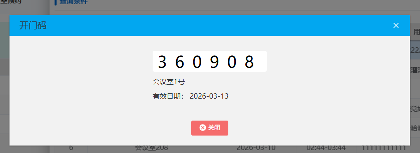
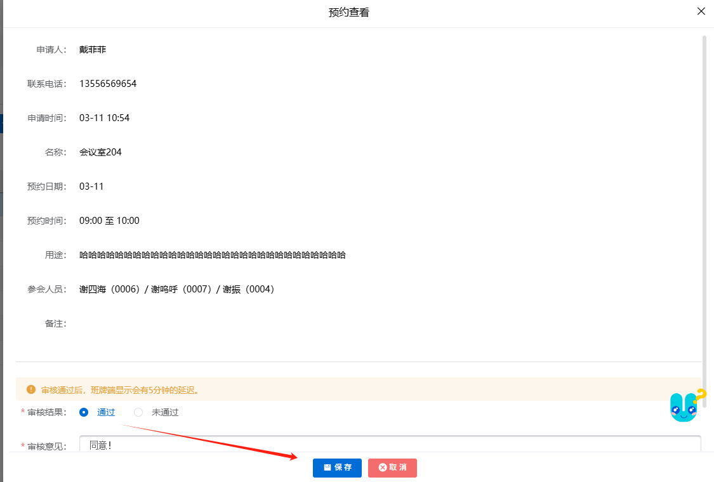
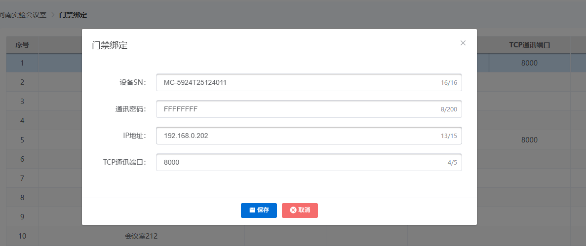
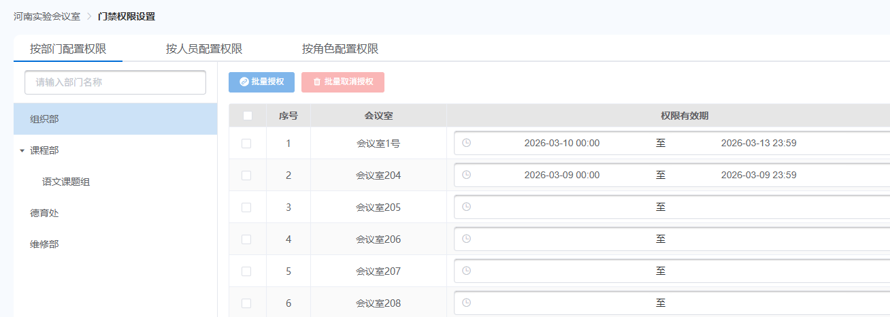
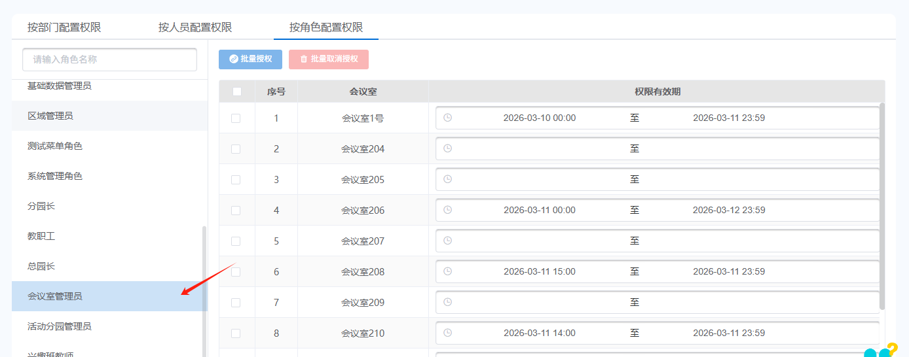

# 实验会议室预约操作手册

## 使用准备

### 操作系统要求

操作系统版本：Windows 7 及以上；macOS 10.0.4 及以上

### 浏览器要求

建议使用浏览器：Chrome

其他兼容浏览器：Microsoft Edge、Safari、360极速浏览器（以及国内浏览器的极速模式）

版本要求：建议使用浏览器的最新版

### 系统访问信息

系统访问地址：

`http://192.168.0.173:89/cjvision4/#/login`

### 业务流程图

### 角色权限

**角色权限表：**

| 角色 | 菜单或应用 | 操作权限说明 |
|------|-----------|-------------|
| 会议室管理员 | 全部权限 | 所有权限 |
| 教职工 | 我的参会、会议室预约、会议室门禁（移动端） | 参会数据权限 |

## 河南实验会议室

### 会议室预约

#### 新增预约申请

点击「新增」按钮

选择预约时间、用途、参会人员，点击「保存」

#### 我的预约

进入「我的预约」页面，可查看历史预约记录

可撤回审核中的预约

点击「开门码」按钮，可查看开门码

点击「取消」按钮，可将已通过的预约会议取消

点击「删除」按钮，可删除撤回后待提交的预约

### 会议室预约审核

#### 审核

在审核列表中，点击状态为「审核中」的预约记录，可选择「通过」或「不通过」进行操作

完成审核操作后，点击「保存」即可完成审核

#### 间隔设置

点击「间隔设置」按钮，设置间隔时间（范围 0~60 分钟），点击「保存」即可

### 我的参会

显示登录人作为参会人员的预约记录（已通过、已取消的预约记录）

### 门禁绑定

配置会议室对应班牌的设备SN、通讯密码、IP地址、TCP通讯端口

点击「远程开门」按钮，可远程开门

### 门禁权限设置

按部门配置权限，可批量授权，也可批量取消授权

按人员配置权限：点击左上角选择教职工，为选中的教职工授权

按角色配置权限：选中需要配置权限的角色，选择会议室权限有效期即可

### 会议室门禁（移动端）

显示门禁权限设置中，有权限的会议室

点击开门按钮，可远程开门

