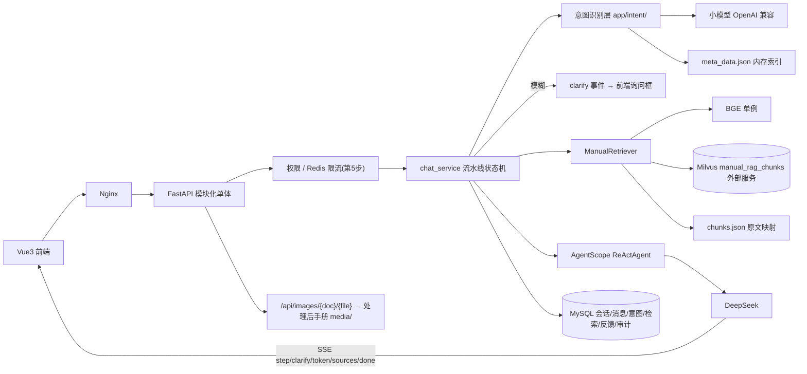

# 操作手册 RAG 智能体 · 开发规划

> 版本：v1.0　日期：2026-08-04
> 知识源：Milvus `manual_rag_chunks`（192.168.0.215:19530）+ `文档切片/chunks.json` + `文档切片/meta_data.json` + `处理后的md手册文档/{doc}/media/` 图片

---

## 1. 产品概述

面向企业内部员工的操作手册智能问答系统。用户在网页端以对话形式提问，系统按 **"意图识别 → 反问澄清 → 向量检索 → LLM 回答"** 流水线处理：

1. **意图识别（独立小模型）**：拆分多子问题、抽取"功能模块 / 用户角色 / 功能点"三要素、结合 `meta_data.json` 关键词索引匹配切片，逐子问题判定为 **不相关（拒答）/ 精确（直接检索）/ 模糊（反问澄清）**。
2. **反问澄清**：存在模糊意图时，后端下发 clarify 事件，前端展示询问对话框收集用户补充，合并后重新识别，直到全部精确（最大 3 轮防死循环）。
3. **向量检索**：逐子问题 BGE 编码 + Milvus COSINE 稠密检索，每个子问题 top_k=2，合并结果与对话历史交给 LLM。
4. **LLM 回答**：DeepSeek 流式生成，回答必须基于检索内容，检索不到明确回复"手册中未找到"，末尾附"来源：文档名 > 路径"。

前端全程过程可视化（意图识别、检索命中、工具调用、思考过程），来源卡片展示切片原文及其中操作截图。

### 质量目标（第一版）

- 回答必须基于检索内容；检索不到则明确说"手册中未找到"
- 每次回答展示来源路径与切片原文（含图片）
- 意图识别、检索等过程对用户可见、可审计（全部落库）

---

## 2. 核心功能清单

| 模块 | 功能 | 说明 |
| --- | --- | --- |
| 意图识别 | 输入优化 | 去除问候语/重复/无意义信息；多问题拆分为子问题分别识别 |
| | 三要素抽取 | `{"module","role","description"}`，缺字段为空 |
| | 切片匹配 | 小模型基于 `meta_data.json`（19 条关键词索引）匹配，返回 chunk_id_list |
| | 三分类判定 | irrelevant（无关/敏感/非法，固定话术拒答）/ precise（要素齐全）/ vague（缺要素或命中多手册，追问） |
| | 降级策略 | 小模型未配置时：跳过拆分，关键词重叠度规则匹配 + 保守澄清 |
| 反问澄清 | clarify 事件 | SSE 下发 `{question, missing_fields, intents}`，前端内嵌询问卡片 |
| | 轮次限制 | 默认 ≤3 轮，超限按最相关切片直接回答并提示 |
| 向量检索 | 稠密检索 | BGE `bge-base-zh-v1.5` 归一化向量，Milvus COSINE，top_k=2/子问题，可配阈值过滤 |
| | 原文映射 | 启动加载 chunks.json 建 id→原文映射，命中后取带图 markdown 用于展示 |
| 过程可视化 | step 事件 | 意图识别结果、检索命中（含相似度）、工具调用、思考过程实时推送 |
| 来源图片 | 图片服务 | `/api/images/{doc}/{filename}` 映射 `处理后的md手册文档/{doc}/media/`，路径穿越校验；`./media/x.png` 改写为可访问 URL |
| 会话 | 多轮对话 | session 维度历史存 MySQL，每轮重建 Agent 记忆（服务无状态） |
| 反馈审计 | 赞/踩 + 评语 | 关联 message_id；意图日志、检索日志、审计日志全量落 MySQL |
| 管理（第5步） | 权限、增量更新、Redis、Agentic | 接口鉴权、文档增量 upsert、答案缓存+滑动窗口限流、`RAG_MODE=agentic` 工具化检索 |

---

## 3. 技术栈

| 层级 | 选型 |
| --- | --- |
| Web API | FastAPI + Uvicorn（模块化单体，全异步） |
| Agent 编排 | AgentScope `>=2.0.5,<2.1`（ReActAgent + Toolkit + InMemoryMemory，不绑定其内置 RAG 存储） |
| 主 LLM | DeepSeek（`OpenAIChatModel` + `client_kwargs={"base_url": ...}`，OpenAI 兼容可切换） |
| 意图识别小模型 | 独立 OpenAI 兼容配置 `INTENT_LLM_BASE_URL / INTENT_LLM_API_KEY / INTENT_LLM_MODEL`（Key 待补充），低温度短输出 |
| 向量检索 | pymilvus + 现有 Milvus（FLAT/COSINE，dim=768） |
| Embedding | sentence-transformers + `BAAI/bge-base-zh-v1.5`（lifespan 单例，`asyncio.to_thread` 包装） |
| 切片/索引 | 启动只读加载 chunks.json、meta_data.json，路径入 .env |
| 配置 | Pydantic / pydantic-settings（.env，密钥不落代码） |
| 持久化 | MySQL（SQLAlchemy 2.0 async + aiomysql） |
| 缓存限流 | Redis（第 5 步） |
| 前端 | Vue 3 + TypeScript + Element Plus + Pinia + Vite 5 + Tailwind CSS 3.4.17 + lucide-vue-next |
| 日志 | structlog 结构化日志 + AgentScope Tracing 预留 |
| 测试 | pytest + httpx AsyncClient |
| 部署 | Docker Compose + Nginx（Milvus 走外部地址） |

---

## 4. 架构设计



服务内部分层：`api`（路由/SSE）→ `services`（编排）→ `intent` / `agent` / `rag`（能力）→ `db`（持久化），`core` 提供配置与日志，依赖单向向下。

### 对话流水线状态机

```
用户提问
  → 意图识别（step: intent）
  → 存在 irrelevant？→ 固定话术拒答（落库，结束）
  → 存在 vague？→ clarify 事件 → 前端询问框 → 用户补充 → 与原输入合并重新识别（≤3 轮）
  → 全部 precise → 逐子问题检索 top_k=2（step: retrieve）
  → 命中低于阈值 → "手册中未找到"
  → 合并切片 + 历史 → AgentScope/DeepSeek 流式生成（step: thinking / token）
  → sources 事件（切片原文 markdown + 图片 URL）→ done（message_id）
  → 意图/检索/消息异步落 MySQL
```

---

## 5. 目录结构

```
code/
├── docs/
│   └── 开发规划.md            # 本文档
├── app/
│   ├── main.py                # FastAPI 入口：lifespan 初始化 BGE/Milvus/MySQL/Redis/chunks/meta_data 单例，路由、CORS、异常处理
│   ├── core/
│   │   ├── config.py          # pydantic-settings：全部环境变量
│   │   └── logging.py         # structlog 配置，request_id 注入
│   ├── api/
│   │   ├── chat.py            # POST /chat（SSE）、POST /chat/clarify、GET /health、会话与历史接口
│   │   ├── images.py          # GET /api/images/{doc}/{filename}（路径穿越校验）
│   │   ├── feedback.py        # POST /feedback 赞/踩+评语
│   │   └── admin.py           # POST /admin/reingest 增量更新、GET /admin/stats（管理员）
│   ├── intent/
│   │   ├── recognizer.py      # 小模型调用、输入优化、子问题拆分、三要素抽取、meta_data 匹配、三分类；规则降级
│   │   └── models.py          # IntentResult、ClarifyState
│   ├── agent/
│   │   └── manual_agent.py    # ReActAgent 工厂：DeepSeek、Toolkit、按 RAG_MODE 注入上下文或注册 search_manual、历史重建 memory
│   ├── rag/
│   │   ├── retriever.py       # BGE+Milvus 检索(top_k=2)、阈值过滤、id→原文映射、图片 URL 改写；导出 search_manual 工具
│   │   └── models.py          # SearchResult、SourceRef、ChatRequest 等
│   ├── services/
│   │   ├── chat_service.py    # 流水线状态机：意图→澄清→检索→生成→SSE→异步落库
│   │   └── session_service.py # 会话/消息/澄清状态读写，历史转 AgentScope Msg
│   ├── db/
│   │   ├── models.py          # sessions/messages/feedbacks/intent_logs/retrieval_logs/audit_logs/users
│   │   └── session.py         # async engine/session 工厂
│   ├── prompts/
│   │   ├── intent.py          # 意图识别提示词（三要素、meta_data 注入、JSON 契约、三分类规则）
│   │   └── manual.py          # 回答提示词（基于检索、未找到话术、来源格式）
│   └── utils/
│       └── sse.py             # SSE 事件封装
├── tests/
│   ├── test_retriever.py      # 10 问召回验证
│   ├── test_chat.py           # SSE 序列、引用完整、未找到兜底、clarify 流程（mock LLM）
│   └── eval_questions.json    # 检索评测集
├── web/                       # Vue3+TS+Element Plus+Pinia 前端
│   ├── src/api/               # SSE fetch 流式客户端、会话/反馈/澄清 API
│   ├── src/stores/            # Pinia：会话、消息流、过程步骤、澄清状态
│   ├── src/views/ChatView.vue # 聊天主界面
│   ├── src/components/        # 消息气泡、过程步骤面板、来源卡片、澄清对话框、侧边栏、输入区
│   └── nginx.conf             # 静态托管 + /api 反代
├── vector_store/              # 现有入库/测试脚本，不改动
├── .env.example               # 全部配置模板（Key 留空）
├── requirements.txt           # 锁版本依赖
└── docker-compose.yml         # backend、web(Nginx)、mysql、redis
```

---

## 6. 关键契约

### 6.1 意图识别输出（每子问题）

```json
{
  "input": "角色权限有哪些？",
  "simple_input": "角色权限有哪些",
  "module": "上体附中系统-班牌端",
  "role": "管理员",
  "description": "查询角色权限列表",
  "chunk_id_list": ["上体附中系统操作手册-chunk-0005"],
  "intent_type": "precise",
  "intent_reason": "三要素齐全，唯一匹配切片"
}
```

### 6.2 SSE 事件协议

```
event: step    data: {"type":"intent|retrieve|thinking|tool_call","title":"...","detail":{...}}
event: clarify data: {"question":"...","missing_fields":["module"],"intents":[IntentResult]}
event: token   data: {"text":"..."}
event: sources data: {"sources":[{"doc","path","score","content","images":["/api/images/..."]}]}
event: done    data: {"message_id":"..."}
event: error   data: {"code":"...","message":"..."}
```

### 6.3 检索工具（AgentScope tool schema 来源）

```python
async def search_manual(query: str, doc: str | None = None, top_k: int = 2) -> list[SearchResult]:
    """从操作手册知识库检索与问题相关的切片。query 为用户问题，doc 可按手册名过滤，top_k 为返回条数。"""
```

---

## 7. 数据库设计（MySQL）

| 表 | 关键字段 | 说明 |
| --- | --- | --- |
| sessions | id、title、doc_filter、clarify_state(JSON)、created_at、updated_at | 会话，clarify_state 存澄清轮次与待补充意图 |
| messages | id、session_id、role、content、sources(JSON)、created_at | 对话消息，AI 消息附来源 |
| feedbacks | id、message_id、score(1/-1)、comment、created_at | 赞/踩与评语 |
| intent_logs | id、session_id、message_id、sub_question(JSON)、intent_type、intent_reason、created_at | 意图识别日志 |
| retrieval_logs | id、session_id、message_id、sub_question、chunk_id、doc、path、score、created_at | 检索日志 |
| audit_logs | id、user_id、action、detail(JSON)、ip、created_at | 审计日志（第5步权限后启用） |
| users | id、username、password_hash、role、created_at | 用户（第5步） |

---

## 8. 前端设计

现代极简 + 轻玻璃拟态，专业克制可信赖，类 ChatGPT 对话体验。
主色 `#3B5BFD`，背景 `#F5F7FB`，正文 `#1F2329`，功能色：成功 `#34A853` / 错误 `#F5222D` / 警告 `#FA8C16`；字体 PingFang SC，标题 20px/600，正文 14px/400。

**ChatView 单页**：

- **顶部导航**：Logo + "操作手册智能助手"，右侧文档筛选下拉（按手册名过滤检索）与用户信息，毛玻璃背景
- **左侧会话侧边栏**：新建会话（渐变按钮）、会话列表（悬停删除）、当前高亮、可折叠
- **消息区**：用户右对齐深色气泡；AI 左对齐白底气泡 + Markdown 渲染，流式呼吸光标
- **过程步骤面板**：AI 气泡顶部可折叠时间线：意图识别（三要素标签 + 意图类型徽标：精确绿/模糊橙/不相关红）、检索（命中切片 + 相似度条）、工具调用、思考过程，逐级展开
- **来源引用卡片**：chips（文档名 > 路径 + 相似度），点击展开切片原文 Markdown，操作截图 el-image 网格 + 点击放大
- **澄清对话框**：消息流内嵌非模态询问卡片：待补充字段提示 + 候选模块快捷 chips + 输入框，提交后续接对话
- **反馈条**：赞/踩图标按钮 + 微动画，踩弹评语输入
- **输入区**：圆角多行输入（Enter 发送 / Shift+Enter 换行），渐变发送按钮，生成中变停止按钮

动效克制：消息淡入上滑、卡片悬停浮起、按钮 hover 微缩放，200~300ms ease。

---

## 9. 关键决策（ADR）

- **ADR-001 采用 AgentScope 2.x**：管理 Agent、工具、会话与追踪，不绑定其内置 RAG 存储；锁定 `>=2.0.5,<2.1` 并写集成测试
- **ADR-002 保留自建 Milvus 检索层**：`manual_rag_chunks` 为唯一知识源，pymilvus 直接检索，保留 doc/path 元数据与来源引用，数据零迁移
- **ADR-003 意图识别独立小模型**：与主模型配置隔离，JSON 强约束输出 + 解析兜底；未配置时规则降级，保证链路可用
- **ADR-004 流水线状态机而非自由 Agent**：意图→澄清→检索→回答顺序显式可控、过程可观测；Agentic 模式（search_manual 工具化）作为第 5 步增强，配置开关切换
- **ADR-005 无状态服务 + 记忆重建**：每轮从 MySQL 重建 InMemoryMemory，支持水平扩展；澄清状态存会话 JSON 字段，断线可恢复
- **ADR-006 图片链路**：Milvus 存 clean 文本用于检索，展示原文取自 chunks.json 内存映射，`./media/` 改写为后端图片路由

---

## 10. 实施计划（对应开发任务）

| # | 任务 | 交付物 | 验收标准 |
| --- | --- | --- | --- |
| 1 | write-plan-doc | 本文档 | 落盘 code/docs/ |
| 2 | backend-foundation | FastAPI 骨架、配置/日志、检索层、chunks/meta_data 加载、tests/eval_questions.json | 10 问召回验证通过（命中预期 doc/path） |
| 3 | intent-pipeline | 意图识别层 + 提示词 + 规则降级 | 单元测试：三类意图判定、子问题拆分、JSON 解析兜底 |
| 4 | chat-pipeline-api | /chat SSE 流水线、clarify 状态机、图片服务 | SSE 事件序列正确、引用完整、未找到兜底、clarify 流程测试通过 |
| 5 | persistence-feedback | MySQL 落库、反馈接口、会话/历史接口 | 消息/意图/检索/反馈写入并可查询 |
| 6 | frontend-chat | Vue3 前端完整工程 | 流式渲染、过程面板、来源图片、澄清对话框、反馈交互可用 |
| 7 | advanced-deploy | 权限、增量更新、Redis、Agentic 开关、docker-compose、Nginx | docker compose up 一键启动，端到端提问-回答-来源-反馈闭环 |

---

## 11. 风险与注意事项

- **不改动** `vector_store/` 现有脚本；chunks.json / meta_data.json / 图片目录只读使用
- 图片路由校验 doc/filename，防路径穿越；不相关/敏感问题固定话术拒答
- AgentScope 全异步：pymilvus / sentence-transformers 同步调用一律 `asyncio.to_thread`
- SSE 前端用 fetch + ReadableStream（EventSource 不支持 POST/自定义头）；断连取消 LLM 流
- structlog 记录 session_id、各阶段耗时、命中数、token 用量；**不记录 API Key**
- 意图小模型 Key 待用户补充（.env 中 INTENT_LLM_*），补充前系统自动降级为规则匹配
- 数据库表全新创建，不影响现有 Milvus 数据；Agentic 默认关闭，先验证 Generic 稳定
